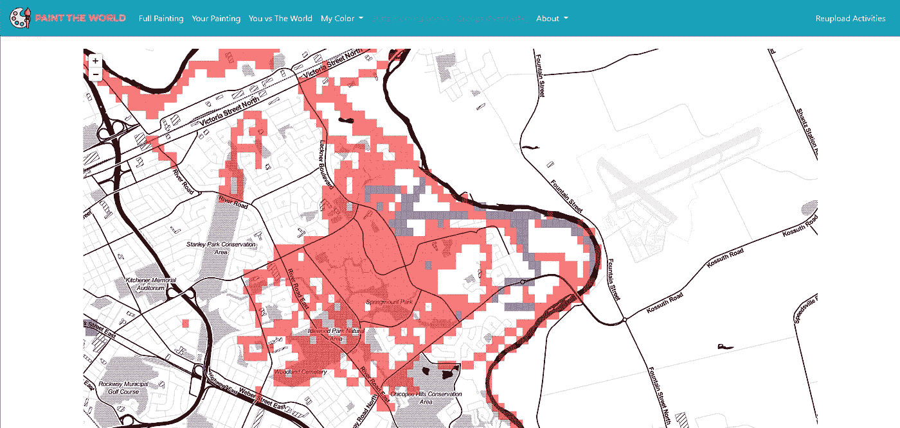
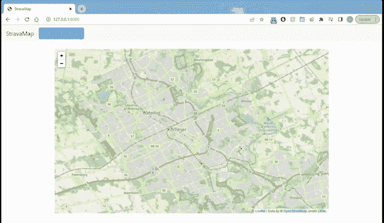
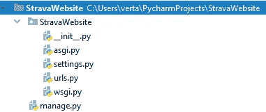
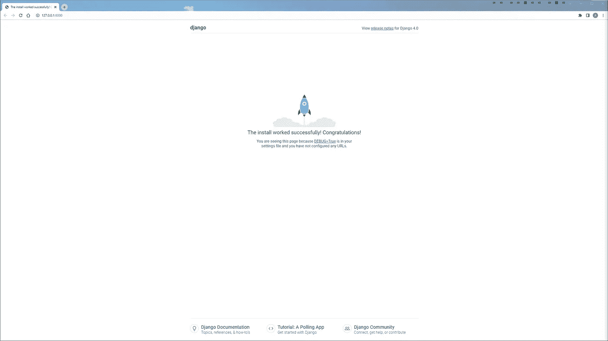
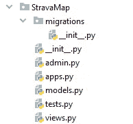
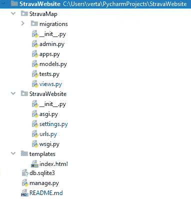
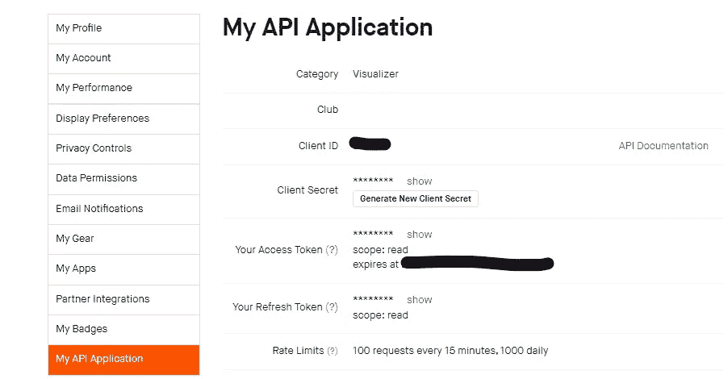
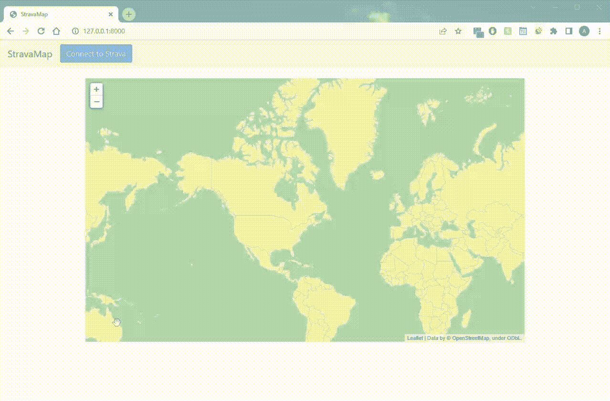
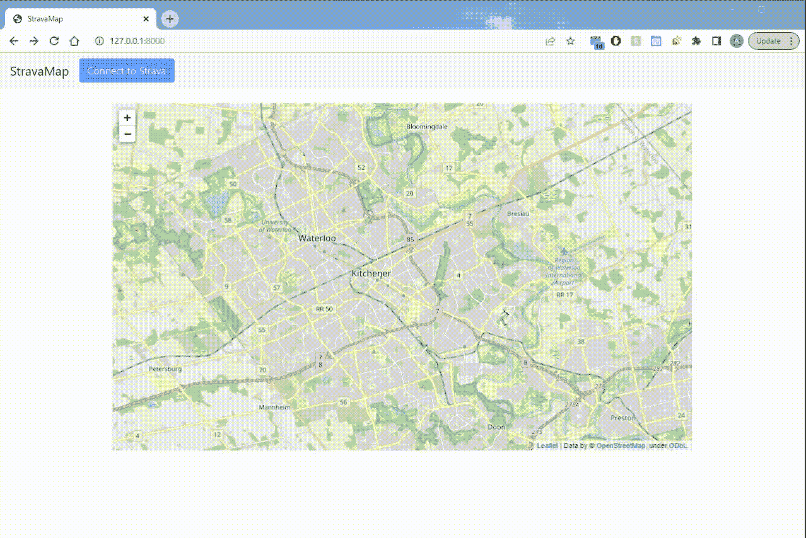

# 用 Python 和 Django 连接和映射 Strava 数据

> 原文：<https://betterprogramming.pub/connecting-and-mapping-strava-data-with-python-and-django-41456b874f3b>

## 构建一个奇妙的交互式应用程序



我创建的一个 Django 网络应用程序，它将我和我的朋友在世界各地进行的所有 Strava 活动绘制成地图

今年 5 月，Strava 达到了一个新的里程碑，注册用户达到了 1 亿。伴随着这些用户的是超过 70 亿的登录活动。如果你像我一样对探索地理数据感兴趣，你可以用这些数据做的不同分析会让你兴奋不已。

对我们来说幸运的是，Strava 是一家开发人员友好的公司，它在公共媒体博客上发布有趣的开发人员和数据科学文章，并创建易于访问的 T2 API。

显示可通过 Strava API 访问的数据的一种方法是使用 Django 用 Python 创建一个网站。尽管有一些很棒的资源帮助我将 Strava 与 Python 联系起来(比如马特·安布罗吉的 [this](https://towardsdatascience.com/using-the-strava-api-and-pandas-to-explore-your-activity-data-d94901d9bfde) one)，但我找不到任何好的资源来将 Strava 数据与 Python 和 Django 联系起来。这篇文章是我创造这种资源的尝试。

本教程将涵盖以下内容:

*   [设置 Django 网络应用](#7e9f)
*   [将 Web 应用程序连接到 Strava API](#7bf2)
*   [在交互式地图上映射用户的活动数据](#2335)

最后，你将能够创建一个 Django 网站，如下图所示:



本教程的最终产品。连接到 Strava 并在交互式地图上绘制所有活动数据。

# 密码

如果你像我一样，从教程中获得完整的代码库会让生活变得容易得多。因此，这里使用的所有代码都可以在 https://github.com/VertAdam/StravaWebsite 的 GitHub repo 上获得。

# 设置您的 Django Web 应用程序

Django 是一个基于 Python 的开源 web 框架。Django 被许多知名网站使用，包括 YouTube、Instagram 和 Spotify 以及无数其他网站。

如果你不熟悉 Django，我总是建议按照官方文档教程[中的步骤编写你的第一个 Django 应用](https://docs.djangoproject.com/en/4.1/intro/tutorial01/)。

然而，这篇文章将告诉你所有你需要的步骤，在没有任何先验知识的情况下设置你的 Django 应用程序。所以，如果你时间紧迫，又不想看官方教程，不用担心，我会帮你搞定的。

## 安装 Django

你要做的第一件事就是安装 Django。你可以在你的终端中使用`pip`很容易地做到这一点。

```
$ pip install django
```

## 创建您的 Django 项目

安装 Django 之后，您可以继续创建您的 Django 项目。要创建您想要的项目，请导航到您想要 Django 项目所在的目录，并运行以下命令:

```
$ django-admin startproject StravaWebsite
```

这将使用`startproject`命令将一个项目命名为`StravaWebsite` **。**

运行此程序后，将会创建一些文件，如下图所示:



由 startproject 命令创建的文件结构

在本教程中，我不会深入解释每个文件的作用，但是每个文件都有不同的用途。如果你还不熟悉每个文件的用途，上面链接的 Django 官方教程“编写你的第一个 Django 应用程序”有效地描述了每个文件。

## 运行开发服务器

现在我们已经开始了这个项目，我们可以继续运行开发服务器了。为此，我们在终端中运行以下命令:

```
$ python manage.py runserver
```

如果没有显示错误消息，您应该能够导航到`[http://127.0.0.1:8000/](http://127.0.0.1:8000/)` (或者控制台输出消息中给出的任何 URL)，并且应该看到以下页面:



恭喜你。您已经成功地为您的项目运行了开发服务器。

如果您看到这个页面，您的 Django 项目已经被正确设置，并且能够在本地服务器上运行。

# 设置地图应用程序

我们现在想在 Django 项目中创建一个应用程序。在 Django，一个应用程序被认为是在你的网站中做一些事情的任何东西。这可以包括创建数据库、显示信息、记录数据或网站做的无数其他事情。

## 正在初始化应用程序

对于这个项目，我们将只使用一个应用程序，称为`StravaMap`，虽然 Django 项目通常会有多个应用程序。

为了创建我们的`StravaMap`应用程序，我们使用终端输入命令:

```
$ python manage.py startapp StravaMap
```

这使用了`startapp`命令来创建一个名为`StravaMap`的应用。这个应用程序在`StravaMap`目录下会有一些文件。



Django 应用程序的文件结构。

## 创建应用程序的结构

现在我们已经创建了`StravaMap` 应用程序，我们需要添加一些额外的文件。

首先，我们创建一个名为`urls.py`的新 Python 文件。在这个文件中，应该有路径`StravaMap/urls.py`、**、**放下面的代码:

StravaMap/urls.py

这个`urls.py`文件将与您的服务器通信，以便告诉它要路由到什么 URL。

我们现在转到类似命名的`StravaWebsite/urls.py` 并添加一个额外的 URL 模式，以便将其连接到我们的`StravaMap` 应用程序。这个`urls.py` 文件应该是这样的:

StravaWebsite/urls.py

接下来，我们需要创建一个`templates`文件夹。这应该在项目的根目录中。在这个文件夹中，您想要创建一个名为`index.html`的 HTML 文件。如果你感到困惑，我已经附上了到目前为止你的整个项目结构应该是什么样子的图片:



项目的完整文件结构。

然后，您希望将以下代码添加到`index.html` 文件中:

模板/索引. html

这个 HTML 包含一个引导启动模板和导航栏。它还包括一些额外的代码，这些代码定义了连接到 Strava 的按钮以及地图将要到达的容器。

现在我们已经创建了`templates`文件夹，我们必须告诉我们的 Django 项目它在哪里。为此，我们进入`StravaWebsite/settings.py`，在这个文件中，将`TEMPLATES`中的更新`DIRS` 变量更改为 templates 文件夹的路径。在我们这里，`‘DIRS’: [BASE_DIR/’templates’]`。

StravaWebsite/settings.py

# 设置我们的 Strava 应用程序

要在我们的应用程序中使用 Strava，我们需要在他们的网站上注册一个 API 应用程序。你可以很简单地去 https://strava.com/settings/api 创建一个应用程序。如果你在这个过程中有任何问题，Strava 开发者指南有一个标题为[如何创建一个账户](https://developers.strava.com/docs/getting-started/#account)的章节可以帮助你完成这些步骤。



当你创建了你的 API 应用程序后，https://strava.com/settings/api 会是什么样子。

一旦你完成了应用程序的创建，你应该会看到一个类似上面图片的页面。在这个图像中，我们需要客户端 ID 和客户端密码来进行下一步操作。

# 用 Strava API 设置 Django 社会认证

现在我们有了 API 应用程序，我们想把它与 Django 项目连接起来。为此，我们使用`pip`安装包`social-auth-app-django`。

```
$ pip install social-auth-app-django
```

我们现在要回到`StravaWebsite/setting.py` 文件。

首先，我们想在 Django 的`INSTALLED_APPS` 变量中添加`social_django` app。

StravaWebsite/settings.py

接下来，我们需要再次更改`TEMPLATES` 变量，这次添加两个与`social_django` 应用程序相关的额外上下文处理器。添加后，您的`TEMPLATES`变量应该如下所示:

StravaWebsite/settings.py

我们还需要向`settings.py`文件添加各种新变量。这些变量可以放在文件中的任何地方。`SOCIAL_AUTH_STRAVA_KEY`是来自 Strava API 应用程序的客户端 ID，而`SOCIAL_AUTH_STRAVA_SECRET`是来自同一个地方的客户端秘密。`SOCIAL_AUTH_LOGIN_REDIRECT_URL`表示在成功连接 Strava 后，用户应该被重定向到哪个 URL。

StravaWebsite/settings.py

如果你打算把这个网站直播或者把你的代码放在 GitHub 上。我强烈建议您将您的密钥读入一个. env 文件，该文件已经添加到您的。git 忽略文件以保护它。

连接 Strava 和 Django Social Auth 的最后一步是在`StravaMap/urls.py` 文件中。在这个文件中，我们想要添加一个`urlpattern` 来告诉我们的 web 应用程序为了连接到 Strava 要重定向到什么 URL。您的文件应该如下所示:

StravaMap/urls.py

如果您遵循了所有这些步骤，那么您的 Django 项目现在就可以导入 Strava 数据并对其进行映射了。

## 创建底图

要在地图上绘制 Strava 数据，我们必须首先创建一个地图对象。为此，我们返回到我们的`StravaMap` 应用程序，并在`views.py`文件中创建一个视图。

`views.py`文件是我们创建用户将与之交互的应用程序的所有方面的地方。在这种情况下，我们希望创建一个视图来创建我们站点上使用的交互式地图。

对于地图，我们将使用叶包。如果不是最受欢迎的交互式制图软件包，Folium 也是其中之一。它还能够将其地图转换成 HTML 兼容格式，这对我们非常有用。要使用 leav，请安装带有`pip`的软件包。

```
$ pip install folium
```

首先，让我们通过在`views.py` 文件中创建视图`base_map`在地图上放置一个交互式地图。

StravaMap/views.py

这段代码将创建基本地图，使用`_repr_html_()`将其转换为 HTML，然后作为变量`main_map`输入到`index.html`模板中。

为了让服务器知道什么 URL 调用这个视图，我们必须返回到`StravaMap/urls.py`文件并添加这个视图。更新后，它应该是这样的:

StravaMap/urls.py

这将调用基本路径的`base_map`视图。

此时，您应该能够最终在您的服务器上看到一些东西。只需转到`[http://127.0.0.1:8000/](http://127.0.0.1:8000/)`(或者你的开发服务器 URL 是什么)，你应该会看到我下面看到的一样的东西:



哇，一张地图！

# 连接和映射您的 Strava 数据

因为我们已经设置好了一切，我们的蓝色按钮“连接到 Strava”应该已经开始工作了。但是，连接后会弹出一个错误，因为 Django 将尝试重定向到 URL /connected，而该 URL 当前没有任何与之关联的视图。

我们现在想要创建一个视图`connected_map`，它将读入 Strava 数据，将 Strava 数据放在一个地图上，并将地图显示到 URL `/connected`。

首先，让我们进入`StravaMap/views.py`并创建我们的`connected_map`视图。

这个地图和第一个地图的区别在于，对于这个地图，我们必须导入 Strava 数据。幸运的是，Django 为我们提供了方便。在这里，我不会详细介绍我是如何使用 Strava API 的，但是我强烈推荐阅读这篇伟大的文章，这篇文章讲述了 Strava API 与 Python 的不同用例[在这里](https://towardsdatascience.com/using-the-strava-api-and-pandas-to-explore-your-activity-data-d94901d9bfde)。

这个`connected_map`视图将从已连接的用户 Strava 帐户中获取我的所有活动数据，并将折线(构成活动的线条组合)绘制到一个 folium 地图上。我们通过检索用户数据，使用该用户数据检索活动数据，最后将折线解码为可用的坐标并绘制到地图上来实现这一点。所有这些的代码应该放入`StravaMap/views.py` 中，可以在这里看到:

StravaMap/views.py

然而，在运行这个之前，我们需要安装一些新的包。你可以使用`pip`来安装这些。

```
$ pip install pandas
$ pip install polyline
$ pip install requests
```

类似于我们的`base_map`视图，我们必须更新`StravaMap/urls.py` 来告诉我们的服务器何时使用这个视图。在这种情况下，当服务器将我们发送到`/connected` URL 时，我们希望使用`connected_map`视图。为此，我们将代码`path(‘connected/’, connected_map, name=’Connect Map View’)`添加到 urlpatterns 中，生成一个如下所示的文件:

StravaMap/urls.py

现在保存您的文件，返回到您的服务器，并享受您的地图！



我们的最终产品！

# 最后的想法

Strava API 拥有令人难以置信的数据量，我只是触及了它的皮毛。我希望本教程能够展示如何使用 Django 向更广泛的受众显示这些数据。

这是我写的第一篇文章，我很享受把我的知识转移到这种格式的过程。如果这能帮助哪怕一个人，我的期望就会被超越！

```
**Want to Connect?**You can find me on LinkedIn at [https://www.linkedin.com/in/adam-vert/](https://www.linkedin.com/in/adam-vert/). I’m always looking to meet more people involved in data science, so feel free to reach out!
```