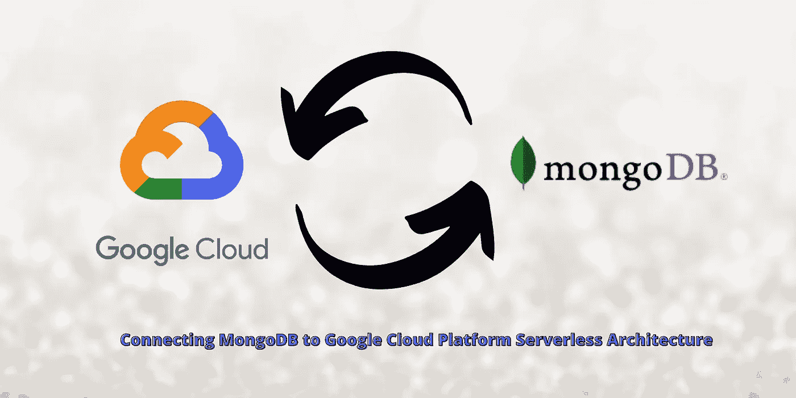
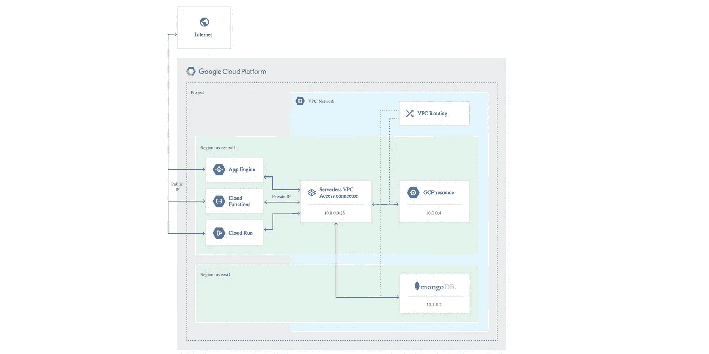
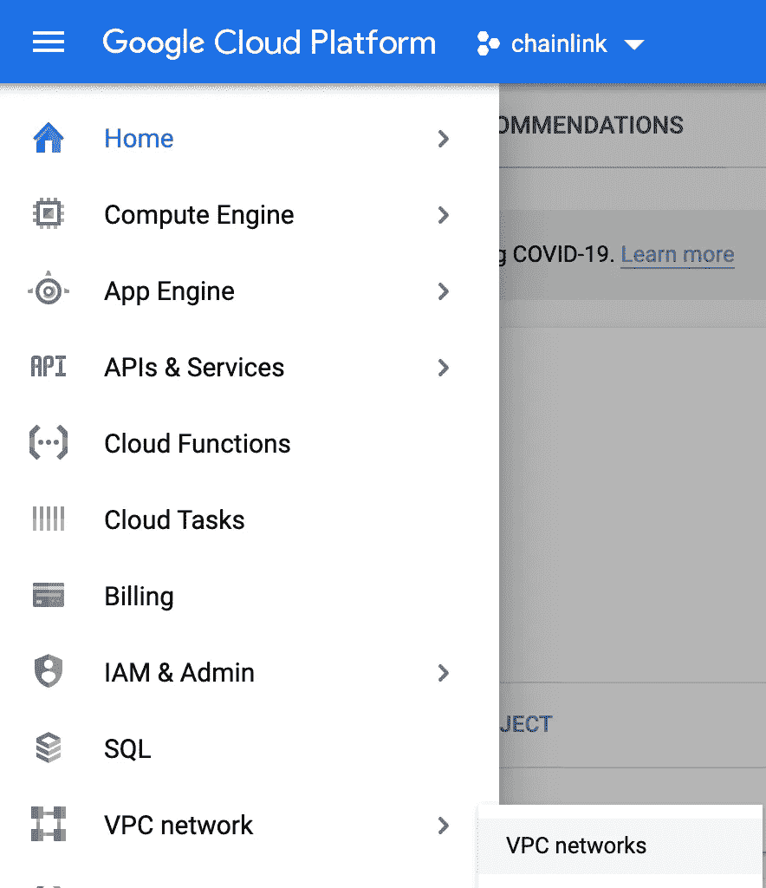
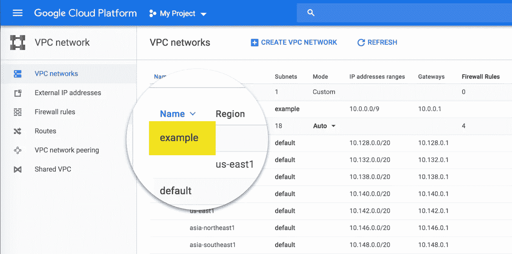
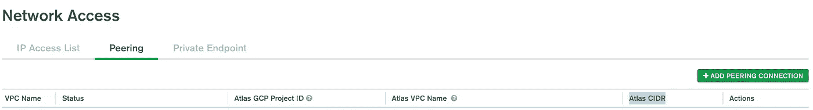
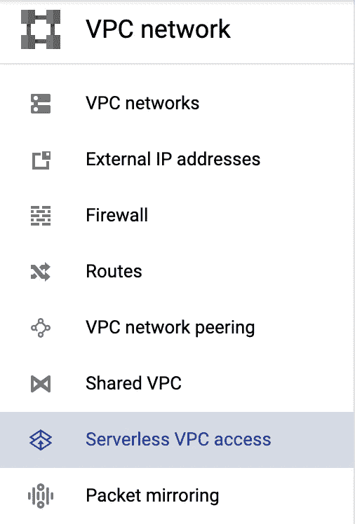
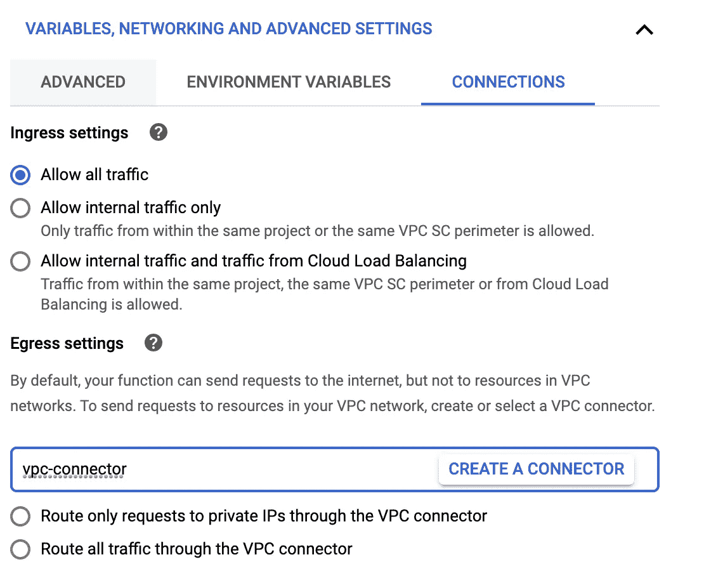

# 将 Google 云功能与 MongoDB Atlas 连接起来

> 原文：<https://betterprogramming.pub/connecting-google-cloud-functions-with-mongodb-atlas-499a0a82ccf3>

## 使用云功能将 GCP 上的无服务器架构连接到使用网络对等和私有云的 MongoDB Atlas 数据库



来自 Getty Images Pro 工作室 Doros 的原始图像。

[无服务器功能](https://www.twilio.com/docs/glossary/what-is-serverless-architecture)很棒，谷歌[云功能](https://cloud.google.com/functions)让它们真的很容易旋转起来。然而，考虑到它们是无服务器的，安全性可能会成为一个问题。如果我的云功能的 IP 总是在变化，我该如何将该 IP 列入我的 [MongoDB Atlas](https://www.mongodb.com/cloud) 账户中？我们可以只使用`0.0.0.0`，但是这样我们就向攻击我们服务器的攻击者敞开了大门！我们需要一种方法来保护自己免受这些攻击者的攻击，同时仍然能够让我们的函数相互通信。

在今天的文章中，我们将向您展示如何将您的无服务器云函数和 GCP 实例连接到您的 MongoDB Atlas 数据库。

# 它是如何工作的

在传统的非无服务器环境中，防御攻击者的简单方法是将您的 IP 地址列入白名单。您得到一个具有静态 IP 的服务器，并告诉您的数据库，IP 是您将接受的唯一请求。小菜一碟。

但是在无服务器架构中，请求总是来自不同的 IP。云功能(和其他无服务器功能提供商(或“功能即服务”又名 FaaS)的工作方式是，每当无服务器功能被触发时，它们本质上用您拥有的所有代码旋转一个新的虚拟机或实例并运行它。这意味着您不能将 IP 列入白名单，因为它总是不同的。

我们仍然安全的方法是使用[虚拟私有云](https://en.wikipedia.org/wiki/Virtual_private_cloud) (VPC)和[添加无服务器 VPC 访问](https://cloud.google.com/vpc/docs/configure-serverless-vpc-access?hl=en\)。这是一种虚拟的方式，假装我们需要的所有服务(GCP 和 MongoDB)都在同一个云/网络中。我们只需将这些服务一起添加到我们的 GCP 实例中，然后在 MongoDB 实例上启用[网络对等](https://blog.stackpath.com/peering/)。



原始图片来自 [GCP 文档](https://cloud.google.com/vpc/docs/configure-serverless-vpc-access?hl=en)。

上图*几乎*准确，唯一的区别是 MongoDB 实例实际上是*而不是*在与 GCP 实例相同的虚拟私有云网络中。这是可能的，因为我们可以在 GCP 上托管另一个 VPC，我们的 GCP 实例和我们的 MongoDB 实例都可以访问它。这是可能的，因为 MongoDB 和 Google Cloud 有一个很好的集成，允许这些额外的服务很容易地旋转起来！

然后，我们将第三个 VPC 中间人列入我们的 MongoDB 实例的白名单，很快！我们不再向世界公开 IP！让我们看看这实际上是如何做到的。

# 逐步地

你可以在 [MongoDB 文档](https://docs.atlas.mongodb.com/security-vpc-peering/)和 [Google Cloud 文档](https://cloud.google.com/vpc/docs/vpc-peering)中找到这些步骤的版本。请注意，这只有在您拥有 M10+版本的 MongoDB Atlas 集群时才有效。

## 在 GCP 上设置虚拟私有云



GCP 的 VPC 网络

1.  转到您的[谷歌云控制台主页](https://console.cloud.google.com/)。
2.  去 VPC 网络。
3.  您可以保留默认设置为`default`，也可以点击`Create VPC Network`在此处添加一个新网络。
4.  一定要带上你的`Project ID`。您可以点击下拉菜单(在本例中，您可以看到我的是`chainlink`)并查看项目 ID 来找到它。它将位于项目名称的旁边。

下一部分你将需要你的`Project ID`和`VPC Network Name`。在我这里，网络名是`default`。



原图来自 [MongoDB](https://docs.atlas.mongodb.com/security-vpc-peering/) —网络名此处为“例”。

## 设置您的 MongoDB 网络对等

1.  [导航到您想要访问的集群](https://cloud.mongodb.com/)。
2.  在左侧导航的安全部分，单击网络访问。
3.  在对等选项卡中，单击加号图标添加对等连接。
4.  在对等连接模式中，选择 Google Cloud Platform，然后单击 Next。
5.  在对等连接模式中输入所需信息。

```
**Project ID** GCP Project ID of the peer VPC. Refer to the dialog for instructions on finding your **VPC Network Name** 
Name of the peer VPC. Refer to the dialog for instructions on finding your **VPC Name**.**Atlas CIDR**CIDR block for your Atlas cluster. (You can ignore this)
```

6.然后打`Initiate Peering`。

## 在 GCP 上设置网络对等

既然已经设置好了，那么您的 MongoDB 实例就要开始与您的 GCP VPC(世界上有很多首字母缩略词)对等了。

1.  回到谷歌云控制台，点击 VPC 网络对等。
2.  单击创建连接。
3.  单击继续。
4.  在名称中，输入对等连接的名称。这可以是你喜欢的任何东西。
5.  在您的 VPC 网络中，输入您的 GCP VPC 网络的名称。对于我们的例子，我们坚持使用`default`。
6.  在对等的 VPC 网络中，选择另一个项目。
7.  在项目 ID 中，输入您的 Atlas GCP 项目 ID。

您可以在 VPC 对等视图中找到这个名称。在左侧导航的安全部分，单击网络访问，然后单击对等选项卡。


网络对等访问的 id

8.在 VPC 网络名称中，输入您的 Atlas VPC 名称，然后点击创建。

完成后，几分钟后，您会在 Atlas MongoDB 实例中看到它旁边有一个绿点。

9.然后，您需要将您的新 `VPC CIDR block address`加入白名单。您也可以在网络访问对等选项卡上找到它。



VPC CIDR 街区地址

我们现在终于可以回到云函数了。

## 设置对 VPC 的无服务器访问

在这一点上，如果您使用 VPC，像云引擎虚拟机(或任何具有静态 IP 的服务)将工作。这些将能够通过 VPC 连接到 MongoDB。不行的是我们的云功能，因为它们无法访问 VPC。请记住，它们是在我们不知道的 IP 上运行的，所以我们不能将它们列入白名单！

很简单，我们可以给他们:



1.  前往`Serverless VPC Access`。
2.  打`Create Connector`。
3.  输入名称和地区。我们将称它为`vpc-access`。
4.  选择我们刚刚用 MongoDB 设置的网络/VPC。
5.  在您的 VPC 网络中选择一个未使用的/28 CIDR 范围，例如`10.8.0.0/28`。这通常适用于大多数应用程序。否则会引发错误。
6.  点击创建。
7.  前往我们想要访问数据库的`Cloud Function`。
8.  点击编辑。
9.  在底部，我们可以转到`connections`选项卡，添加我们的新 vpc 连接器！



我们现在应该已经设置好让我们的无服务器 Google Cloud 功能连接到我们的 MongoDB Atlas 实例了！您可以通过尝试[本地连接到集群](https://docs.atlas.mongodb.com/connect-to-cluster/)，然后通过我们的云功能进行连接来测试。

# 摘要

云和无服务器基础设施非常棒，因为它们减轻了服务器维护的负担，但是没有 IP 地址也会带来一些棘手的问题。

希望本文向您展示了如何将无服务器架构连接到数据库，或者让您对虚拟私有云的工作原理有所了解。