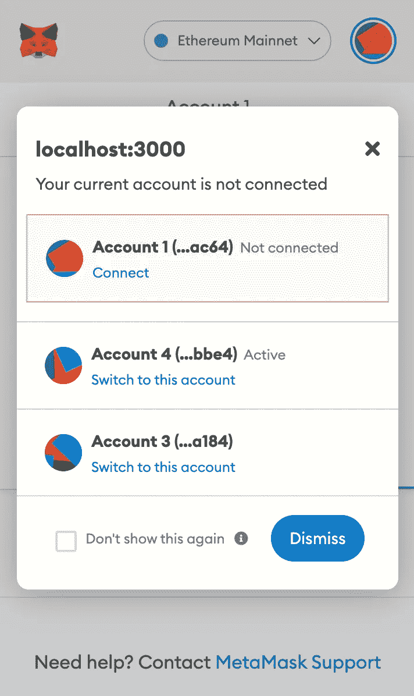

# 使用 React 连接到元掩码

> 原文：<https://betterprogramming.pub/connecting-to-metamask-with-react-efcc98e9b866>

## 将元蒙版引入 React 应用


元蒙版图像资源

我想分享你如何用 React 连接到你的元掩码账户。我将演示的例子显示了如何连接到一个元掩码帐户，改变帐户和改变你的链。所有这些都只需要很少的代码。

本文假设您已经有一个元掩码帐户。

要开始，你需要一个新的 React 项目，我用`create-react-app`让一切快速启动并运行。

有了应用程序后，继续安装这些软件包:

```
// npmnpm install ethers @mui/material @emotion/react @emotion/styled// yarnyarn add ethers @mui/material @emotion/react @emotion/styled
```

*只有醚是必需的，其他的只是为了让事情看起来更好*

在 src 中为将要建立连接的组件创建一个新文件。我把我的叫做`MetaConnect.js`。

下面是建立连接的完整代码示例。下面我将分别介绍每一部分。

## 状态变量

```
const [errorMessage, setErrorMessage] = useState(null);  
const [account, setAccount] = useState(null);  
const [balance, setBalance] = useState(null);
```

有三条信息需要跟踪。

## 事件监听器

```
useEffect(() => {    
  if (window.ethereum) {      
    window.ethereum.on("accountsChanged", accountsChanged);         
    window.ethereum.on("chainChanged", chainChanged);    
  }  
}, []);
```

当组件第一次呈现时，为`accountsChanged`和`chainChanged`设置事件监听器。自变量是将在下面进一步解释的函数。

## 连接处理程序

```
const connectHandler = async () => {    
  if (window.ethereum) {      
    try {        
      const res = await window.ethereum.request({          
        method: "eth_requestAccounts",        
      });              await accountChange(res[0]);      
    } catch (err) {       
      console.error(err);        
      setErrorMessage("There was a problem connecting to MetaMask");               
   }  
  } else {      
      setErrorMessage("Install MetaMask");    
  }  
};
```

这是创建初始连接元掩码的函数。

```
const res = await window.ethereum.request({          
  method: "eth_requestAccounts",        
});
```

这里的这一点是连接发生的地方，当元掩码被安装时，窗口对象有一个`ethereum`属性与之交互。当您调用这个函数时，您的元掩码扩展应该会打开，并询问您想要连接到哪个帐户。



## 账户变更

```
const accountsChanged = async (newAccount) =>  {
  setAccount(newAccount);    

  try {      
    const balance = await window.ethereum.request({        
      method: "eth_getBalance",        
      params: [newAccount.toString(), "latest"],      
    });      

    setBalance(ethers.utils.formatEther(balance));    
  } catch (err) {      
    console.error(err);      
    setErrorMessage("There was a problem connecting to MetaMask");      
  }  
};
```

这是一个处理新帐户的助手功能。它在状态中设置新的帐户值，然后获取并格式化帐户的余额。

使用`ethereum` JSON-RPC 方法请求余额。你可以在这里阅读更多关于它的

```
window.ethereum.request({        
    method: "eth_getBalance",        
    params: [newAccount.toString(), "latest"],      
});
```

一旦获得余额，就需要对其进行格式化

```
setBalance(ethers.utils.formatEther(balance));
```

`etheres`库具有[格式化余额](https://docs.ethers.io/v5/api/utils/display-logic/#utils-formatEther)的实用函数。

## 更换链条

```
const chainChanged = () => {    
  setErrorMessage(null);    
  setAccount(null);    
  setBalance(null);  
};
```

换链的时候做个连接重置是个好主意。比如从以太坊 Mainnet 转移到 Ganache。

## JSX

```
<Paper elevation={3} sx={{ p: 3 }}>      
  <Stack spacing={2}>        
    <Typography variant="h6"> Account: {account} </Typography>         
    <Typography variant="h6">          
      Balance: {balance} {balance ? "ETH" : null}         
    </Typography>        
    <Button onClick={connectHandler}>Connect Account</Button>          
    {errorMessage ? (          
      <Typography variant="body1" color="red">            
        Error: {errorMessage}          
      </Typography>        
    ) : null}      
  </Stack>    
</Paper>
```

最后，以一些基本的降价来显示值，并提供一个按钮来启动连接。

## 结论

我希望这个例子能够帮助那些希望在 React 应用程序中更多地使用 MetaMask 的人。