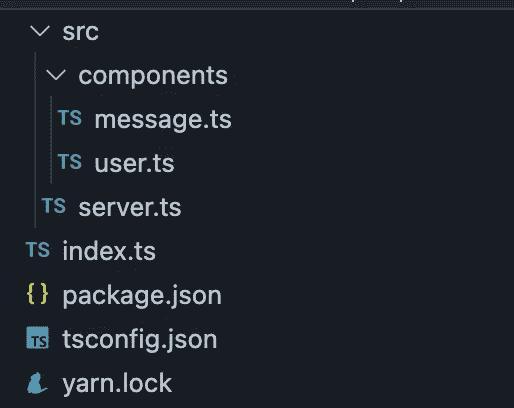
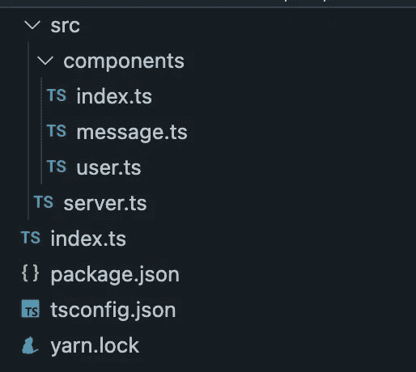
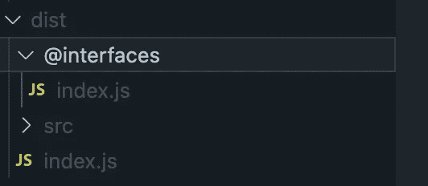

# 用 index.ts 文件合并您的 TypeScript 导入

> 原文：<https://betterprogramming.pub/consolidate-your-typescript-imports-with-index-ts-files-cee934c665a7>

## 这一有用功能的简要指南

由[纳特伍](https://stock.adobe.com/contributor/206854500/nuthawut?load_type=author&prev_url=detail)

我想分享我在 TypeScript 项目中使用的一种有用的技术，以合并导入并使我的代码库更容易阅读。它涉及到用`index.ts`文件重新导出目录中的模块。通过一个`index.ts`文件导出允许其他模块在一个单独的 import 语句中直接导入所有内容。

首先，我们来看一个简单的 app 例子。

`message.ts`和`user.ts`都导出了 server.ts 文件中使用的函数。

## user.ts

## message.ts

## server.ts

在`server.ts`内部，我需要两个导入行来获得两个功能。为了简化导入，向 components 文件夹添加一个`index.ts`文件，并重新导出其中包含的文件内容。

## index.ts

导入模块时，TypeScript 最初会查找一个`index.ts`文件。如果找不到，它将寻找一个具有指定 ie 名称的文件。消息或用户。

有了一个`index.ts`文件，就可以将`server.ts`文件中的导入合并到一个导入行中。

甚至一个简化的例子也显示了两个版本之间可读性的提高。

# 应用增长

这种技术的另一个好处是它可以自动处理新的导出。假设我向我的`user.ts`文件添加了另一个函数。

有了新函数，我不必对我的`index.ts`文件做任何修改。`users.ts`中的所有内容都已被导出。现在，我只需要在我的`server.ts`文件中指定导入。

## 申报文件

如果您有一个包含文件的文件夹，那么您可以利用相同的设计模式，只需做一处修改。使用`index.d.ts`文件代替`index.ts`文件。

可以将`index.ts`用于您的声明文件，但是当您将项目转换为 JavaScript 时，它们将被包含在内。理想情况下，你把没有目的的文件放在外面。

## 缺点

从经验上讲，在代码库已经存在一段时间之后，这是一个痛苦的设计模式。如果可以，我会在项目开始时采用这种技术。

此外，这种技术将增加项目中的文件数量。根据我的经验，简化导入路径的好处超过了额外文件的成本。

# 包扎

使用`index.ts`文件合并导入是提高代码库可读性的一个好方法。这是我在过去几年中开发的所有大中型代码库中的一个重要工具。