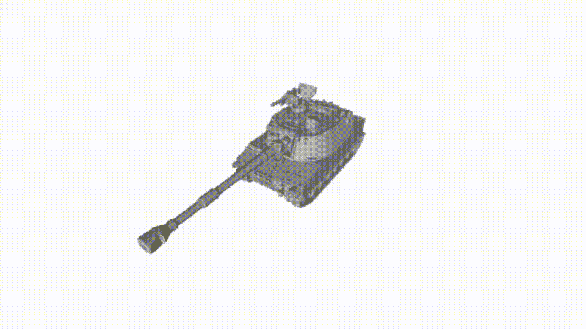
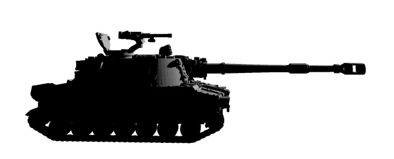
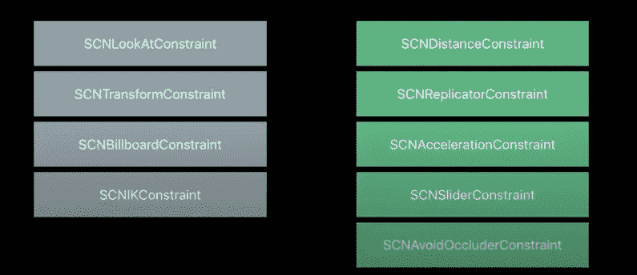
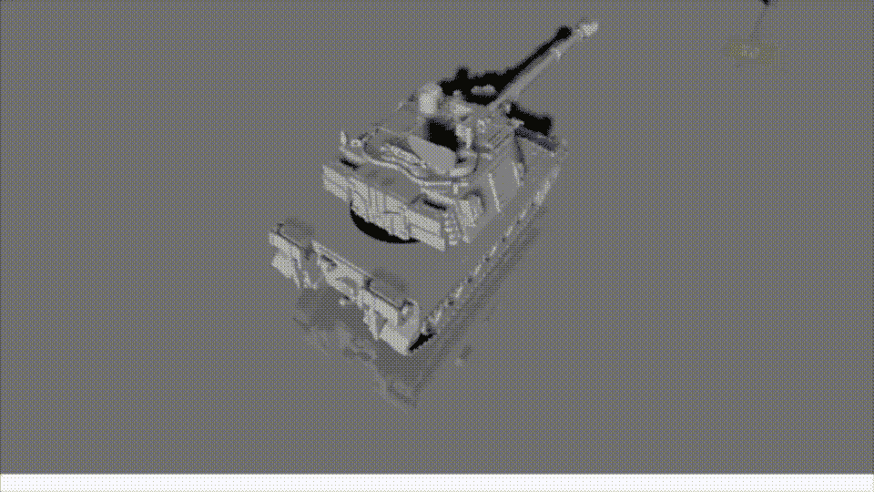
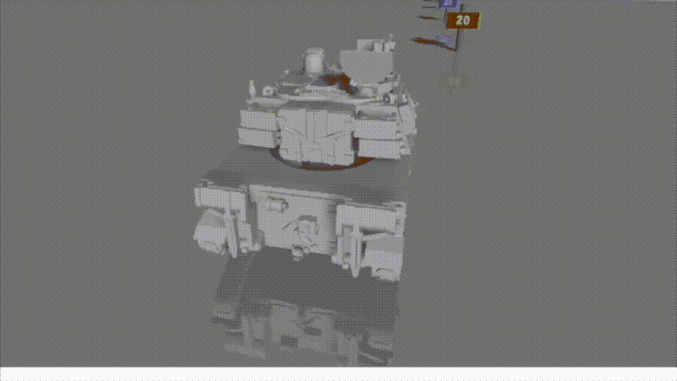
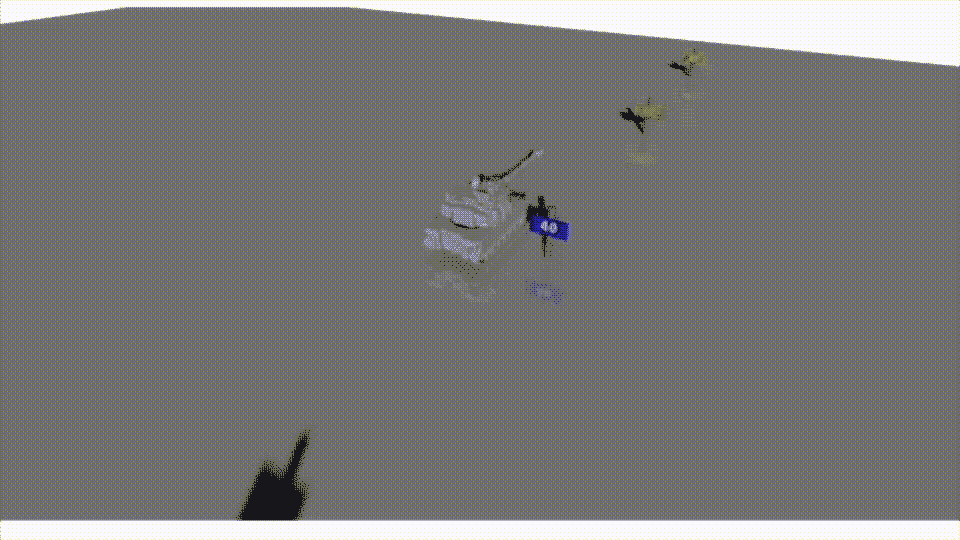
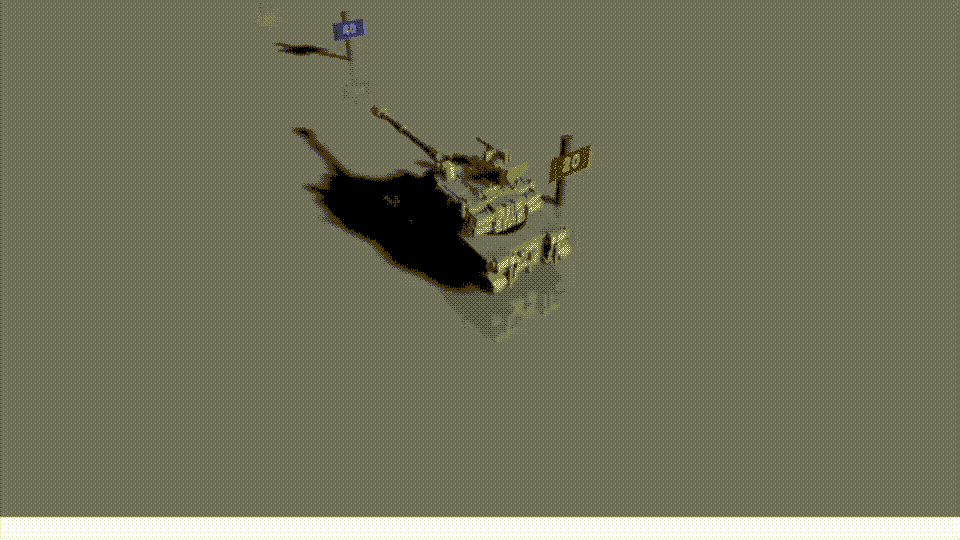
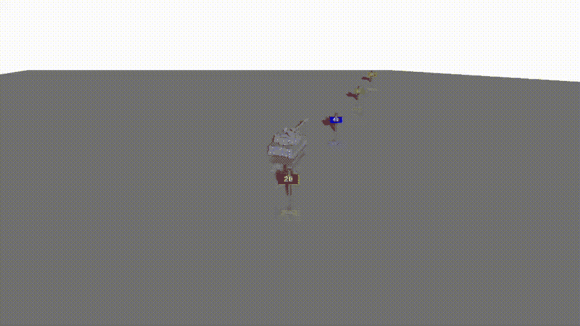

# SceneKit 中的约束—探索高级摄像机控制

> 原文：<https://betterprogramming.pub/constraints-in-scenekit-exploring-advanced-camera-controls-e93e6739978e>

## 探索各种类型的约束以及如何在 SwiftUI 支持的应用程序中使用它们



大多数人都会同意，增强现实尚未找到自己的位置，最常被引用的理由是:缺乏杀手级应用。众所周知，虽然我怀疑另一个原因是很难编写增强现实应用程序。这是一个挑战，因为计算相互作用节点的位置和角度背后的数学是以计算机科学为核心的。另外，图形加密。

令人欣慰的是，一些苹果工程师已经完成并编码到 SceneKit 框架中的科学，他们的最佳作品在 WWDC2017 的最终 SceneKit 演示中展示。请和我一起来看看他们把令人困惑的数学构建成他们称之为约束的结构背后的影响。

## 坦克

然而，在我开始之前，我想先表扬一下绘图员/艺术家伯格曼，他画了一组世界外的坦克，你可以在这里找到。我将在整篇文章中使用 Tanks 来说明这些约束。在这篇文章标题的动画 GIF 中，我将从解释坦克的建造开始。

在场景中，我使用了一个伯格曼坦克模型，它有六块，我用了其中的五块。主要的底盘包括履带、炮塔、主炮、舱门和机枪，以及可选的第六部分(在我看来)



我尽力把碎片拼在一起。除了 5 个`SCNReferenceNodes`，我还创建了两个基本节点。我将机箱添加到第一个基本节点，并将其他所有东西添加到第二个节点。我这样做是因为我需要炮塔+火炮与底盘分开移动。我还想更改几个模型组件上的轴点，以确保它们在正确的轴上旋转。我在这里的 SO [上找到了必要的枢纽代码。](https://stackoverflow.com/questions/48977282/how-to-center-the-pivot-point-of-a-model-in-scenekit-editor)

```
 minimum = SIMD3<Float>((T1100m109a5turret19ReferenceNode?.boundingBox.min)!)
  maximum = SIMD3<Float>((T1100m109a5turret19ReferenceNode?.boundingBox.max)!)

  translation = (maximum + minimum) * 0.5

  T1100m109a5turret19ReferenceNode?.pivot = SCNMatrix4MakeTranslation(translation.x, translation.y, translation.z)
```

我还需要给场景添加一个平行光，因为没有它模型不会出来。最后，我使用 Combine 框架中的订阅代码模式将 SwiftUI 接口链接到我为炮塔、主炮和机枪设置的几个旋转，只是为了好玩。

```
turretSub = turretPass.debounce(for: .seconds(0.01), scheduler: RunLoop.main)
      .sink(receiveValue: { [self] direct in
          SCNTransaction.begin()
          SCNTransaction.animationDuration = 2.0
          if direct {
              turretNode.simdEulerAngles = SIMD3(x: 0, y: Float(30).degrees2radians(), z: 0)
          } else {
              turretNode.simdEulerAngles = SIMD3(x: 0, y: Float(0).degrees2radians(), z: 0)
          }
          SCNTransaction.commit()
      })
```

我应该提到这个扩展来将角度转换为弧度，将弧度转换为角度，以便更好地测量。

```
internal extension Float {
    func radians2degrees() -> Float {
        return GLKMathRadiansToDegrees(self.rounded(FloatingPointRoundingRule.up))
    }
    func degrees2radians() -> Float {
        return GLKMathDegreesToRadians(self.rounded(FloatingPointRoundingRule.up))
    }
}
```

# 探索 SceneKit 中的约束

好了——现在，进入正题——*constraints*——你很高兴地了解到它与 UIKit 中同名的那些*痛苦的*东西没有联系，尽管我必须承认它们的使用也不是小菜一碟。

这是 WWDC2017 的一张幻灯片，展示了上述约束条件；灰色框在 SceneKit 的早期版本中已经可用，而绿色框是新的。苹果在相机的背景下谈到了其中的大部分。尽管既然你把它们添加到了 SCNNodes 中，就没有理由在相机中使用它们；理论上，您可以在任何节点上使用它们。

您可以在代码中的任何位置向节点添加约束，尽管设置是这样做的最佳位置。规则，你可以调高或调低，打开或关闭，使用一个变量称为[影响因素](https://developer.apple.com/documentation/scenekit/scnconstraint/1468692-influencefactor)。1 表示全开，0 表示关，值介于中间。正如 WWDC2017 中所解释的，您希望成对或更多地使用约束。

## 自动驾驶

这个上下文中的约束有点像自驱动节点。自动驾驶，因为他们将管理你的应用程序中节点的角度或位置。这些控件将您的设置作为提示，然后决定它们需要放在哪里。如果他们认为自己越界了，就会忽略这些微弱的暗示。

这是一件好事也是一件坏事；这是一件好事，因为它让思维将数学从问题中抽离出来，但不好的一面是，这可能会成为一个真正的挑战，来解决正在发生的事情。



# 约束的类型

## **SCNLookAtConstraint**

好吧，好吧——现在，虽然不是新的，但`SCNLookAtConstraint`很可能是你遇到的第一个，当然是从相机的角度来看。其目的是将链接到它的节点保持在视口内。

```
let lookAtConstraint = SCNLookAtConstraint(target: tankNode)
lookAtConstraint.influenceFactor = 0.5
lookAtConstraint.isGimbalLockEnabled = true

cameraNode.constraints = [lookAtConstraint]
```

在我们的坦克世界里是这样的代码。注意，坦克在这里移动，而摄像机是静止的。



仅 LookAtConstraint

如你所见，坦克消失在无限远处。

## 约束条件

现在很明显，让你的游戏玩家移动到无限远是没有用的。要解决这个问题，您可能想添加一个距离约束；我是。一个很好的解决方案——保持你编码的最小/最大距离。

```
let distanceConstraint = SCNDistanceConstraint(target: tankNode)
distanceConstraint.influenceFactor = 1.0
distanceConstraint.minimumDistance = 6.0
distanceConstraint.maximumDistance = 8.0

cameraNode.constraints = [lookAtConstraint, distanceConstraint]distanceConstraint.influenceFactor = 1.0distanceConstraint.maximumDistance = 8.
```

在我们的坦克世界里是这样的代码。注意坦克和摄像机在这里移动，虽然，在我的代码中，我只是移动坦克；相机处于自动驾驶模式。



注视约束和距离约束

虽然在这种情况下可能不太理想，但由于相机离坦克太近，直到它们几乎靠近你时，你才会看到标志出现。

## SCNReplicatorConstraint

假设这不是你想要的，复制者约束将是替代方案。使用它，通过正确的参数，您可以让您的相机跟随玩家，这次要注意保持节点移动前的准确位置和角度。你可以看到我正在用`cameraNode`的位置配置约束。

```
let replicatorConstraint = SCNReplicatorConstraint(target: tankNode)
replicatorConstraint.positionOffset = SCNVector3(cameraNode.position.x,cameraNode.position.y,cameraNode.position.z)
replicatorConstraint.replicatesOrientation = false

cameraNode.constraints = [replicatorConstraint, lookAtConstraint]
```

在我们的坦克世界里是这样的代码。注意，当你看的时候，我把摄像机移进移出。当我移动坦克时要考虑的动作。



look at constraint & SCN Replicator constraint

## SCNAccelerationConstraint

这个约束比我给你看的上一个更微妙。它给摄像机的移动带来了一个滞后，尽管我怀疑这个视频是否公正。

```
let accelerationConstraint = SCNAccelerationConstraint()
accelerationConstraint.maximumLinearAcceleration = 0.02

cameraNode.constraints = [replicatorConstraint, lookAtConstraint, accelerationConstraint]
```

在我们的坦克世界里是这样的代码。不那么容易看出来；但是感觉不一样。这里的加速度限制降低了相机跟随坦克时的响应速度。



## SCNTransformConstraint

但是等等——因为即使在自动驾驶模式下，你可能还是想给组合增加一些限制。不是作为提示的限制，而是明确的红线。在最后一个例子中，我允许玩家在任何角度向所有方向移动相机，这太好了，因为如果他们把相机移动得太低，它就会躲到地面下。为了防止这种情况发生，我可以设置一个变换约束来限制相机移动到 y 轴的正方向。

```
let transformConstraint = SCNTransformConstraint.positionConstraint(inWorldSpace: false, with: { (node, position) -> SCNVector3 in
    if node.position.y < 0 { node.position.y = 0 }
    return node.position
})
```

我没有必要包括这个 GIF，因为展示你如何阻止一些东西出现是没有意义的。

## SCNBillboardConstraint

最后，我想提一下这个约束，它是规则的例外，因为将它添加到相机没有意义，只能添加到节点。它的工作原理是改变节点的角度，使其始终面向摄像机。

```
let boardNodeConstraint = SCNBillboardConstraint()
boardNode.constraints = [boardNodeConstraint]
```

在我们的坦克世界里是这样的代码。请注意，我从移动摄像机开始，然后移动坦克。与此同时，彩色板会跟随相机，始终保持可读。



广告牌约束

所有这些使我想到了本文的结尾。没错，我没有接触`SCNIKConstraint`、`SCNSliderConstraint`和`SCNAvoidOccluderConstraints`，它们本身需要一篇文章，而且这篇文章越来越长。

我希望你能像我写这篇文章一样喜欢阅读。