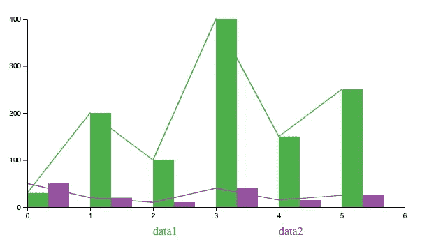
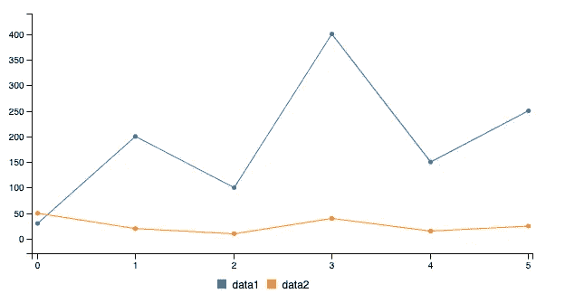
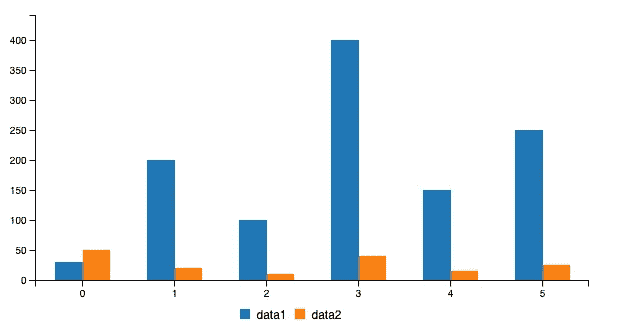
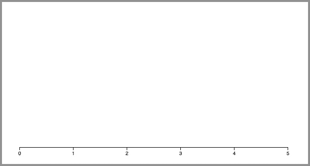
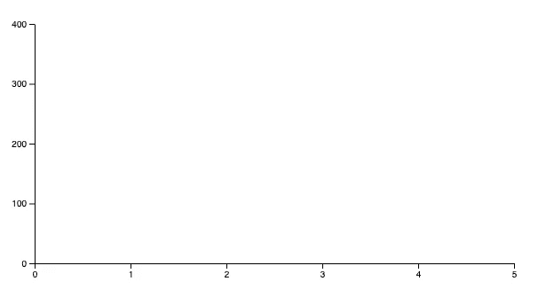
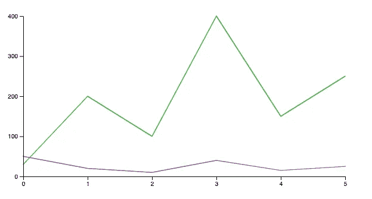
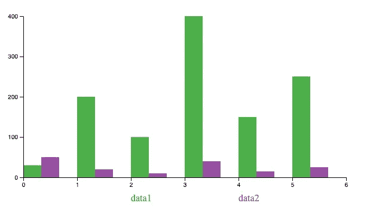
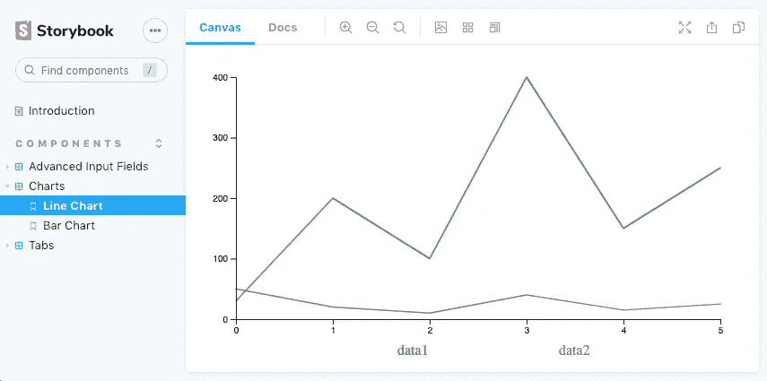
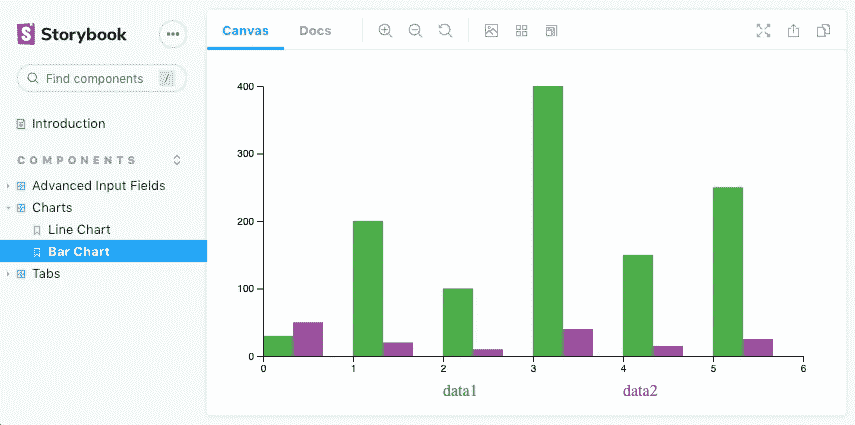

# 在 React 中构建 D3 图表

> 原文：<https://betterprogramming.pub/construct-d3-charts-in-react-cfecc2848ae2>

## 实现和定制 D3 线图和条形图



图片来源:作者

在之前的一篇文章中，“[更简单的 D3.js —使用 React 功能组件渲染 C3 图表](https://medium.com/better-programming/easier-d3-js-render-c3-charts-with-react-functional-components-372399497f98)”，我们提到 C3 允许我们快速构建图表，而无需了解 D3 的所有复杂性。使用 C3 创建一个图表只是几行代码。

在另一篇文章“用 React 功能组件呈现 D3.js 的 5 个步骤”中，我们提到 D3 提供了丰富的特性来构建图形表示。以图表为例——D3 可以定制轴、形状、工具提示、文本、颜色和动画的每一个细节。

在本文中，我们将深入研究 D3 的折线图和条形图，以获得 D3 的复杂性和功能的第一手经验。

# C3 图表

在前面的例子中，我们展示了如何用几行代码实现 C3 折线图。

它出现在 [Create React App](https://medium.com/better-programming/10-fun-facts-about-create-react-app-eb7124aa3785) 环境中:



要制作条形图，我们需要做的就是将第 13 行的类型改为`bar`。

然后 C3 折线图变成了 C3 条形图。



# D3 图表

我们已经为[高级 react 输入字段](https://medium.com/better-programming/build-advanced-react-input-fields-using-styled-components-and-storybook-js-a231b9b2438#e765-bf98276875df)和[选项卡](https://medium.com/better-programming/build-react-tabs-using-recoil-styled-components-and-storybook-js-4ad534cef007)创建了 [react 组件库](https://github.com/JenniferFuBook/react-components)。D3 图表将被添加到此存储库中。

```
git clone https://github.com/JenniferFuBook/react-components.git
```

将`d3`包安装到您的[依赖项](https://medium.com/better-programming/package-jsons-dependencies-in-depth-a1f0637a3129)中，同时安装现有的`recoil`包:

```
"dependencies": {
    "[@testing](http://twitter.com/testing)-library/jest-dom": "^5.11.6",
    "[@testing](http://twitter.com/testing)-library/react": "^11.1.2",
    "[@testing](http://twitter.com/testing)-library/user-event": "^12.2.2",
    "d3": "^6.3.1",
    "react": "^17.0.1",
    "react-dom": "^17.0.1",
    "react-scripts": "^4.0.1",
    "recoil": "^0.1.2",
    "styled-components": "^5.2.1",
    "web-vitals": "^0.2.4"
  }
```

在`src/components`中，`Charts`文件夹被创建来保存与图表相关的文件。

图表有三种类型的设置:

*   [SVG(可缩放矢量图形)](https://medium.com/better-programming/create-react-app-and-svgs-70970ac715f2)宽度、高度和边距的布局
*   图表数据系列和类型
*   有关数据系列名称、x 轴设置和 y 轴设置的图表派生信息

[反冲](https://medium.com/better-programming/recoil-a-new-state-management-library-moving-beyond-redux-and-the-context-api-63794c11b3a5)用于 SVG 布局状态管理。其他信息存储为 props 并传递给子组件。

我们定义 D3 图表界面类似于 C3 图表:

第 2 行指定`width`。

第 3 行指定`height`。

`data.columns`是数据系列值，只是每个数组的第一项是系列名称(第 6 行和第 7 行)。

第 9 行指定了图表类型。

我们将使用第 6 行和第 7 行定义的两个数据系列，一部分一部分地实现图表。

```
1\. [Chart State Management](#590f)
2\. [X-axis](#6faa)
3\. [Y-axis](#bff5)
4\. [Line Chart](#7c2f)
5\. [Legend](#74e3)
6\. [Bar Chart](#c0b2)
7\. [Animation](#753e)
8\. [General Chart](#fb5e)
9\. [Storybook](#7cf5)
```

# 图表状态管理

反冲利用原子来保持状态。SVG 布局的原子在`src/components/Charts/chartStates.js`中创建。

第 6-11 行定义了一个 margin 对象。

第 16-19 行定义了`widthAtom`，其默认值为`margin.left`和`margin.right`之和。

第 24-27 行定义了`heightAtom`，其默认值为`margin.top`和`margin.bottom`之和。

第 32-35 行定义了`marginAtom`，它的默认值被设置为默认的`margin`对象。

这些原子可用于图表的所有代码。

# x 轴

x 轴是坐标系统的主轴或水平轴。对于所有其他坐标，沿 x 轴的点的值为零。在 D3 中，可以通过函数`scaleLinear`方便地定义 x 轴。

`scaleLinear`构造连续缩放的函数，`domain`默认为`[0, 1]`，`range`默认为`[0, 1]`。很可能我们需要指定`domain`和`range`。

`scaleLinear`通常与`domain`连锁，设定秤的边界。对于`[30, 200, 100, 400, 150, 250]`的数据序列，`30`表示 x 值为 0，`200`表示 x 值为 1，以此类推。因此，我们将`domain`设为`[0, 5]`。

`scaleLinear.domain`通常与`range`链接，设置标尺的映射边界。比如 SVG 宽度是`120px`，左右边距是`10px`。图表的 x 位置将在`[10, 110]`的范围内。

如果我们定义`x = scaleLinear().domain([0, 5]).range([10, 110])`，下面的代码片段显示了函数`x`是如何工作的:

范围值可以是非数字。以下是范围在`red`和`blue`之间的颜色示例。

`domain`和`range`可以有两个以上的值来定义特定的刻度。

下面是`src/components/Charts/XAxis.js`中定义的`XAxis`组件:

线 7 从反冲`widthAtom`中得到`width`。

线 8 从反冲的`heightAtom`中得到`height`。

9 号线从反冲`marginAtom`得到`left`、`right`、`bottom`。

第 10 行创建一个`[ref](https://medium.com/better-programming/most-things-you-want-to-know-about-react-refs-29901ebf28c6)`来引用第 22 行的[非受控组件](https://medium.com/better-programming/to-be-or-not-to-be-2c372198a01c#ba5c-4b7662162c8e-reply)。

第 12-20 行使用`useLayoutEffect`调用变异 DOM 的 D3 代码。

第 13-15 行为 x 轴创建了一个线性刻度。

第 16 行使用`axisBottom`，创建一个底部水平轴。可以创建多个底部水平轴，也有可能这些轴在顶部，使用`axisTop`。

第 17 行将`ticks`数字设置为数据系列计数，并将`tickSizeOuter`设置为 0。事实上，可以对显示刻度的位置、刻度标签格式和轴的结束位置进行大量定制。

第 19 行实例化了不受控制的组件的 x 轴。

第 22 行为 x 轴定义了一个 SVG 组。它将 x 轴定位在 SVG 的底部，不包括边距底部。

`XAxis.js`显示下面的 x 轴:



# y 轴

y 轴是坐标系的第二轴或垂直轴。沿着它的点对于所有其他坐标的值为零。

下面是`src/components/Charts/YAxis.js`中定义的`YAxis`组件:

上面的代码与`src/components/Charts/XAxis.js`非常相似。这两个区别是:

*   `range`在第 14 行计算不同。
*   `transform`在第 21 行使用不同的维度。

创建了 x 轴和 y 轴后，我们看到以下坐标:



# 折线图

折线图显示了 y 值相对于 x 值的变化情况。它们非常适合显示变化的时间序列以及一段时间内的趋势和发展。

我们已经使用`scaleLinear`为 x 轴和 y 轴绘制了直线。线系列是连接每个点的路径。功能`line`用于连接这些点。`line`通常与`scaleLinear`函数产生的`x`和`y`函数链接。

```
const lineFn = line()
      .x((_, i) => x(i))
      .y((d) => y(d));
```

对于每个数据序列`i`，一个路径被附加到 SVG 组。路径采用`data.columns[i]`值，不包括系列名称。它配置一个非填充路径，具有特定的笔划设置，然后调用`lineFn`函数来连接这些点。

```
select(containerRef.current)
  .append('path')
  .datum(values)
  .attr('fill', 'none')
  .attr('stroke', () => 'blue')
  .attr('stroke-width', 1.5)
  .attr('stroke-linejoin', 'round')
  .attr('stroke-linecap', 'round')
  .attr('d', lineFn);
```

在上面的代码中，`blue`被用作线条颜色。但是对于不止一条路径，我们需要用不同的颜色来区分路径。`scaleOrdinal`可用于设置颜色。`scaleOrdinal`构造一个用于序数标度的函数，它以特定的顺序排列值，而不仅仅是命名它们。

`schemeSet1`是用 RGB 十六进制字符串表示的九种分类颜色的数组。如果我们定义`color = scaleOrdinal().range(schemeSet1)`，下面的代码片段显示了函数`color`是如何工作的:

第 2-10 行输出九种分类颜色。

之后，这九种颜色被重复使用。`color(0)`与`color(9)`相同，`color(1)`与`color(10)`相同，以此类推。

上面的`scaleOrdinal`直接链到`range`上。`domain`，这是一个颜色名称数组。它也可以被拴在中间。以下示例将前两个颜色名称定义为`data1`和`data2`。

第 2-10 行输出九种分类颜色。

之后，同样的颜色再次被使用。`color('data1')`与`color(7)`相同，`color('data2')`与`color(8)`相同，以此类推。

我们将`color`定义为`src/components/Charts/constants.js`中的常用函数:

在第 3 行，我们删除了`schemeSet1`中的前两种颜色。所以在我们的图表中，一共有七种分类颜色。这只是因为我们更喜欢两个数据系列的第三和第四种颜色。

下面是`src/components/Charts/LineChart.js`中定义的`LineChart`组件:

线 8 从反冲`widthAtom`中得到`width`。

9 号线从反冲`heightAtom`中得到`height`。

10 线从反冲`marginAtom`得到`left`、`right`、`top`、`bottom`。

第 11 行创建一个`ref`来引用第 40 行的非受控组件。

第 13-38 行使用`useLayoutEffect`调用变异 DOM 的 D3 代码。

第 14 行删除了第 29 行可能添加的路径。

第 16-18 行创建了 x 方向的线性刻度。

第 19-21 行创建了 y 方向的线性刻度。

第 23-25 行创建了一个线函数来连接每个数据系列的点。

第 27-37 行定制并绘制每个数据系列。

`LineChart`组件呈现如下图像:



# 神话；传奇

我们画了一个线图。但是，如果没有图例，就无法判断哪条线与哪一个数据系列对齐。

C3 图例显示彩色正方形和数据系列名称。我们将其简化以显示彩色数据系列名称。根据数据系列的编号，`scaleLinear`用于定位系列名称，用`text`标签显示。

以下是`src/components/Charts/Legend.js`中定义的`Legend`组件:

线 8 从反冲的`widthAtom`得到`width`。

9 号线从反冲的`heightAtom`得到`height`。

10 号线从反冲的`marginAtom`得到`left`和`right`。

第 11 行创建了一个`ref`来引用第 27 行的非受控组件。

第 13-25 行使用`useLayoutEffect`调用变异 DOM 的 D3 代码。

第 14-16 行创建了 x 方向的线性刻度。

第 18-24 行是 D3 代码。`keys`是系列名称的数组。该代码创建文本元素，并针对 x 位置(第 22 行)、颜色(第 23 行)和文本(第 24 行)对它们进行定制。

第 27 行定义了图例组，它位于 x 轴下方的`20px`。

以下是带图例的折线图。


# 条形图

条形图用于使用矩形条比较分类数据，矩形条的高度或长度与数值成比例。

条形图使用`scaleLinear`计算 y 值，而其 x 值由`scaleBand`计算，后者为序数或分类维度构造一个函数，其中`domain`默认为`[]`而`range`默认为`[0, 1]`。`scaleBand`通常先与`domain`连锁，再与`range`连锁。

`scaleBand`不会产生连续的规模。相反，它的规模是离散的。它还具有生成带宽的功能。

如果我们定义`x = scaleBand().domain([0, 5]).range([10, 110])`，下面的代码片段显示了函数`x`是如何工作的:

在上面的代码中，只有域数组`[0, 5]`中的值返回值(第 2 行和第 7 行)。由于域数组中有两个值，范围`[10, 110]`被分成两个带。每个带的宽度是`50`(第 9 行)。考虑到起始范围是`10`，第一个值变成`10` (第 2 行)，第二个值变成`60`(第 7 行)。

`range(stop)`是生成从 0 到`stop — 1`的数字序列的函数。

我们用`range(6)`生成范围内的值，也就是`[0, 1, 2, 3, 4, 5]`。通过用`range`函数的返回值创建`domain`，我们得到了`domain`中每一项的 x 值。

下面是`src/components/Charts/BarChart.js`中定义的`BarChart`组件:

以上代码与`src/components/Charts/LineChart.js`非常相似，除了以下不同之处:

*   第 16-18 行使用`scaleBand`。
*   `barWidth`来源于带宽(第 22 行)。
*   第 24-35 行定制并绘制每个数据系列。每个`rect`(矩形)元素定位在 x(第 31 行)和 y(第 32 行)，具有适当的填充颜色(第 30 行)、宽度(第 33 行)和高度(第 34 行)。在 SVG 中，`y(0)`大于`y(d)`。

下面是一个带图例的条形图。



# 动画

我们已经编写了相当多的代码来构建折线图和条形图。与 C3 图表相比，D3 轴和图例是原始的，数据系列图最终错过了工具提示、选择、响应性等等。

值得花力气去构建 D3 图表吗？

是的，确实如此。D3 提供了丰富的特性来构建图形表示。它为许多高级功能打开了大门。有了上面的基础工作，只需要几行代码就可以添加动画了。

`transition`是一个类似选择的界面，用于动画显示 DOM 的变化。`transition`不是即时应用更改，而是在给定的持续时间内将 DOM 的更改从其当前状态插入到所需的目标状态。

以下代码将背景色转换为`red`。

```
select(element)
  .transition()
  .style(‘background-color’, ‘red’)
```

`transition`通常先与`duration`连锁，再与`ease`连锁。`duration`以毫秒为单位将过渡持续时间设置为指定值。`ease`指定过渡缓动功能，如`easeLinear`，线性缓动。

```
select(element)
  .transition()
  .duration(1000)
  .ease(easeLinear)
  .style('background-color', 'red');
```

此外，转换可以延迟几毫秒。

```
select(element)
  .transition()
  .duration(1000)
  .ease(easeLinear)
  .delay(2000)
  .style('background-color', 'red');
```

`attrTween`为属性分配一个函数，该函数针对每个选定的元素进行评估。`stroke-dasharray`属性控制用于形成路径笔画形状的虚线和间隙的模式。通过插入`stroke-dasharray`属性，我们可以从长度 0 开始动画一个笔画，一直到全长。

```
const reveal = (path) =>
  path
    .transition()
    .duration(5000)
    .ease(easeLinear)
    .attrTween('stroke-dasharray', function () {
      const length = this.getTotalLength();
      return interpolate(`0, ${length}`, `${length}, ${length}`);             
  });
```

以下是`src/components/Charts/LineChart.js`带动画代码:

上述代码中有两处更改:

*   第 27-36 行定义了动画功能，`reveal`。
*   48 线呼叫`reveal`。

此视频剪辑显示了折线图的动画效果。

我们设计的条形图动画有点不同。所有条形的高度从 0 开始，一直增长到全高。

以下是`src/components/Charts/BarChart.js`的动画代码:

上述代码中有两处更改:

*   原始的`rect`尺寸已被修改。第 32 行将 y 值设置为`y(0)`而不是`y(d)`。第 34 行将高度设置为`0`，而不是`y(0) — y(d)`。
*   第 37-45 行执行动画。`rect`的目标 y 值为`y(d)`(第 42 行)，目标高度为`y(0) — y(d)`(第 43 行)。过渡的持续时间是`1000ms`(第 41 行)，并且对于每个小节(第 44 行)它被额外的`1000ms`延迟。

此视频剪辑展示了条形图的动画效果。

# 总图

现在我们有了`LineChart`和`BarChart`组件，我们需要创建一个通用的`Chart`组件来保存它们。该组件以`width`、`height`、`margin`、`data`为道具。根据图表类型，它会显示折线图或条形图，以及适当的 x 轴、y 轴和图例。

以下是`src/components/Charts/Chart.js`中定义的`Chart`组件:

第 3-8 行导入所有相关的代码。

第 15-21 行将 SVG 布局设置为反冲状态。`width`和`height`为必填项，`margin`为可选项。

它计算最长的数据列`longestColumn`(第 25 行)，为数据系列的名称构建`keys`(第 26 行)，并保存最大的 y 值(第 27 行)。我们假设最小的 y 值是`0`。

条形图的刻度计数是`longestColumn — 1`，而折线图的刻度计数是`longestColumn — 2`(第 30-33 行)。

第 34 行组成`xDomain`，第 35 行组成`yDomain`。

第 38-48 行将整个图表组装成一个 SVG 元素。`viewBox`是一个定义 SVG 维度的属性。有单独的属性`width`和`height`使图表维度固定。如果移除它们，图表将自动缩放。

# 故事书

我们用[故事书](/an-in-depth-look-at-storybook-6-8c44cd6895ee)来展示折线图和条形图。这两个故事写在`src/components/Charts/Charts.stories.js`:

第 6-9 行为`Charts`设置了故事，并将它们放入`RecoilRoot`中。

第 13-17 行组成了折线图。

第 29-42 行组成了条形图。

图表从索引文件的第 4 行导入。该文件为`src/components/Charts/index.js`，为外部使用而创建:

这是故事书上的线图:



这是故事书上的条形图:



# 结论

D3 代表数据驱动文档。代替完整的组件，它提供了数据驱动的助手函数，可以用来创建那些组件。构建一个 D3 库，比如 React 图表，可能需要更长的时间。但是一旦事情建立起来，它就为数据可视化打开了许多可能性。

对于图表，你有一个选择:C3 或 D3。

感谢阅读。我希望这有所帮助。你可以在这里看到我的其他媒体出版物[。](https://medium.com/@jenniferfubook/jennifer-fus-web-development-publications-1a887e4454af)