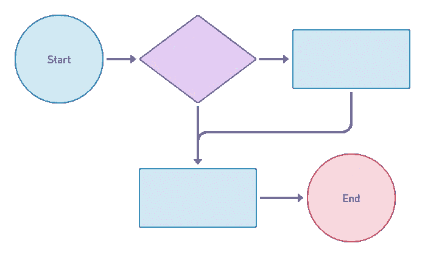

# 建设性代码冲突

> 原文：<https://betterprogramming.pub/constructive-code-conflict-a87eaf8d01c2>

## 向前一步，拥抱学习和变得更好的机会。

作为一名软件工程师，意见分歧是很自然的一部分。无论是代码审查还是设计新系统，都有不止一种方法来做事情，而且通常没有明确的“最佳”方法。

我们经常回避冲突，但建设性地接受不同意见，迎头而上，增加学习，帮助我们建立更好的系统。

这在理论上听起来很棒——但是我们如何在日常工作中做到这一点呢？

促进建设性冲突的一个方法是，当有分歧时，让每个人陈述他们对自己正确的确信程度，以及他们对决策的长期影响的估计。

为了确定起见，使用 1%到 100%的范围。对于影响，使用 0 到 10。

以这种方式化解分歧有两个好处。首先，它让每个人变得更有说服力。通过估计你承认的确定性，你的观点不是事实。这让你有机会被说服。不再是“我是对的，你是错的”，而是“我有 60%的把握我是对的，但有 40%的可能性我是错的。”

当你已经承认你可能是错的时候，改变你的观点会容易得多。当每个人都这样做时，它为接下来的讨论定下了一个非常不同的基调。

第二，你可能会发现有些分歧并不那么重要。如果你认为某样东西的影响力是 3，而其他人认为是 9，那么选择更看重它的人可能更有意义。通常你可以找到一些合理的交易方式，让双方都开心——我得到我最重视的东西，你得到你最重视的东西。

当团队在长期影响上存在巨大分歧时，这可能表明强烈的个人偏好，但也可能揭示出一些团队成员看到但其他人没有看到的更深层次的问题。这通常是提升团队水平和传播知识的好机会。

这种技术将帮助你对你的冲突进行分类，并以一种建立团队凝聚力而不是破坏它的方式快速消除大部分冲突。

仍然会有一些大家都认为影响很大并且无法达成一致的问题。这里没有灵丹妙药。但通常来说，解决较简单冲突的动力，以及承认不确定性所带来的开放性，将创造一种动力，让每个人都更致力于寻找更好的解决方案，而不是捍卫自己的想法。

所以下次你发现自己陷入编码冲突时——向前一步，抓住机会学习并变得更好。