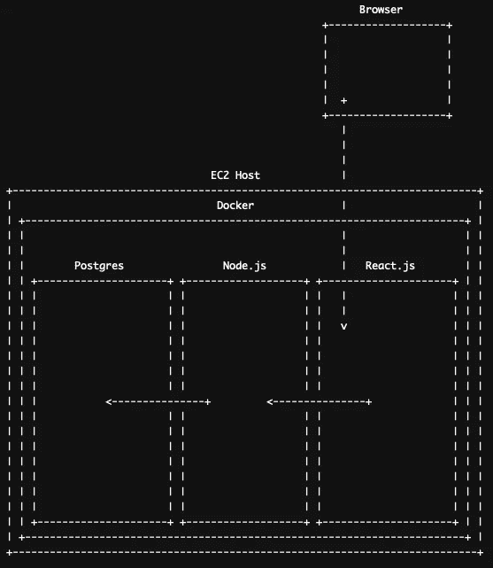
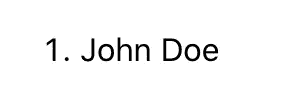

# 在 AWS 上用 Docker 容器化节点、反应和 Postgres

> 原文：<https://betterprogramming.pub/containerize-node-react-postgres-with-docker-on-aws-ca548595f01e>

## “如果你有容器问题，我为你感到难过，儿子，我有 99 个问题，它们都在容器中运行。"


查尔斯·伯德辛格在 [Unsplash](https://unsplash.com/s/photos/container?utm_source=unsplash&utm_medium=referral&utm_content=creditCopyText) 上的照片

你的 Node.js 应用程序为大联盟做好准备了吗？你希望有一个神奇、干净、清新的仙境，让你可以运行你的应用程序吗？

你对集装箱化感兴趣但不知道从哪里开始吗？

这是你吗？


你(可能)。

不要再看了…

# **集装箱化**

在本文中，我们将研究如何使用 Docker 封装 Node.js 应用程序。

更好的是，我们将在 AWS 上运行它，并使用 Docker Compose 编排它。我们还将添加一些额外的服务来模拟真实的生产部署。 [Postgres](https://www.postgresql.org/) 为数据库，一个基本的 React app 为前端。

我假设如果你已经到了这里，你已经对码头和集装箱化服务有了一些基本的了解，但如果你没有，没关系！在 Docker 上查看这个伟大的[初级读本。](https://docs.docker.com/engine/docker-overview/)

这是一个有趣的学术练习，旨在向您展示如何在 EC2 主机上为 Node.js 应用程序建立 Docker 容器。在本文结束时，您将对整个过程有更好的理解，并为您自己的现有应用程序的容器化打下基础。

对于那些更喜欢视觉学习的人，让我们来看看这些服务的结构是什么样子的:



人人都爱 ASCII 艺术！

除了了解这些服务如何交互并获得一些使用当前技术的实践经验之外，这里没有最终目标。

我们不做任务清单，不会有任何外部 API，只是纯粹的功能。让我们开始吧。

# 第一步。EC2 主机

你需要一个地方来运行这些。最容易的地方是在您自己的机器上，但是您也可以在 AWS 中轻松地构建一个 EC2 实例，这就是我所做的。

我将带您在 EC2 实例上设置这个项目，但是需要一些先决条件:

*   您拥有一个有效的亚马逊 AWS 账户。
*   您应该已经准备好了一个 [EC2 实例。操作系统为 Amazon Linux 的 t2-micro 型运行良好。](https://docs.aws.amazon.com/AWSEC2/latest/UserGuide/get-set-up-for-amazon-ec2.html)
*   您应该拥有对实例的 SSH 访问权限。

一旦连接到实例，让我们继续下一步。

# 第二步。Docker 安装

如果没有安装 Docker，就无法运行。[首先在 EC2 实例上安装 Docker](https://docs.aws.amazon.com/AmazonECS/latest/developerguide/docker-basics.html) 和 Docker-compose，使用以下命令:

```
sudo yum update -y
sudo amazon-linux-extras install docker
sudo service docker start
```

您需要将您的用户添加为 Docker 用户，这样您就不需要每次都运行`sudo`。(如果您已经更改了用户，请更新`ec2-user`名称:)

```
sudo usermod -a -G docker ec2-user
```

让您的实例重新启动，一旦它备份，通过运行以下命令检查一切工作正常:

```
docker info
```

您的输出应该如下所示:

```
 Client:
 Debug Mode: false

Server:
 Containers: 1
  Running: 1
  Paused: 0
  Stopped: 0
 Images: 1 
```

最后一件事，我们需要在实例上打开一些端口，这样我们就可以访问 web 服务并查看我们的结果。为了这个项目，我们可以开放`3000`港给你自己的公共 IP。

端口`3000`是 React 运行其服务器的默认开发端口，并且*不应用于生产*。

点击`[http://whatismyip.akamai.com](http://whatismyip.akamai.com)`查看你当前的公共 IP 地址。

接下来，访问 AWS 控制台，使用允许流量从您的 IP 到 TCP 端口上的实例的入站规则编辑实例安全组`3000`(关于如何做的更多信息[在这里](https://docs.aws.amazon.com/AWSEC2/latest/UserGuide/authorizing-access-to-an-instance.html))。

现在，让我们创建一些容器。

# 第三步。布局

由于我们已经做了很多工作，我将向您展示基本的目录结构应该是什么样子:

```
project_dir/
    |
    |-- react_frontend/
    |       |
    |       |-- (react.js app data)
    |
    |-- node_backend/
    |       |
    |       |-- (node.js app data)
    |
    |-- pg/
    |   |
    |   |-- pg_data/.. (created by postgres container)
    |
    |-- docker-compose.yml
```

随意创建父目录，一个空的`docker-compose.yml`、`node_backend`目录和`pg`目录，但是将`react_frontend`目录留到稍后我们自动生成它的时候。

# 第四步。Node.js 后端

我想在这里提出一个警告，虽然这对于生产工具来说是一个很好的实践，但是这段代码不应该在生产中使用！使用的 Docker 容器是非常基本的，没有任何额外的安全性，所以要小心操作。

在本文结束时，您不会得到一个生产就绪、经过实战检验的应用程序，但是您将得到一个构建自己的容器化应用程序的良好基础。

如果此时您想直接在 EC2 实例上工作，您可以，或者您可以在本地机器上工作，稍后再上传文件。选择权在你，但你需要确保你已经做好了基本的准备:

*   [在 Linux 上安装节点](https://docs.aws.amazon.com/sdk-for-javascript/v2/developer-guide/setting-up-node-on-ec2-instance.html)。
*   [在 Mac 上安装节点](https://nodejs.org/en/download/package-manager/#macos)。
*   [获取您的 EC2 实例的公共 IP](https://docs.aws.amazon.com/AWSEC2/latest/UserGuide/using-instance-addressing.html#using-instance-addressing-common)。

如果您选择在本地发展，您将可以访问:

```
http://localhost:<port>
```

如果您在 EC2 实例上开发，您将访问:

```
http://<ec2_public_ip>:<port>
```

就我个人而言，我选择在本地开发，然后再部署，这可以说是一种规范。如果您选择在主机上进行远程开发，请确保记下关于它的重要信息，比如 IP 地址。

启动并运行后，您可以运行以下命令来创建一个新项目:

```
mkdir node_backend
cd node_backend
npm init -y
npm install cors express pg
```

您可以在这个目录中创建一个名为`index.js`的新文件，并在其中放置以下代码用于测试后端:

这里发生了很多事情。让我们来分解一下我们在这段代码中所做的一些事情:

*   在端口`3001`上设置 [Express](https://expressjs.com/) 服务器，当你访问`[http://<host>:3001](http://localhost:3001)`时，你会在你的浏览器中看到。
*   启用 [CORS](https://developer.mozilla.org/en-US/docs/Web/HTTP/CORS) 向其他服务发出请求。
*   使用身份验证和主机参数设置新的 Postgres 池。
*   为我们的应用程序设置两条路由:根路由(`‘/’`)和返回 PG 查询结果的路由(`‘/test_query’`)。
*   最后，告诉服务器监听指定的端口并输出日志消息。

此时，您应该能够通过运行以下命令来测试基本功能:

```
node server.js
```

服务器应该会启动，您可以在浏览器中导航到`[http://<host>:3001](http://localhost:3001)`来查看原始的 JSON 响应。

酷！

我们需要的最后一个重要部分是为应用程序创建一个`Dockerfile`，然后在我们的`docker-compose.yml`文件中添加一个条目，告诉它在哪里构建。

在您的`node_backend`目录中创建一个新的`Dockerfile`。用以下内容填充它:

上面的`Dockerfile`指令改编自 Node.js 团队建议的基本配置。更多细节可在 Node.js 获得[。](https://nodejs.org/de/docs/guides/nodejs-docker-webapp/)

现在打开父目录中的`docker-compose.yml`,添加以下样板文件和后端服务的条目:

# 第五步。Postgres

我们将使用一个简单的 Postgres 数据库作为测试数据。让我们将它添加到我们的`docker-compose.yml`文件中，放在我们刚刚在上面创建的`node_backend`条目之后:

太好了！现在让我们通过运行:`docker-compose up`来旋转我们的服务对。

在构建容器时，您应该会看到一些输出，最终会看到标准的控制台日志记录，表明服务正在运行并接受连接。

您实际上还不能查询任何内容，因为:

*   数据库连接尚未建立。
*   没有可查询的数据！

我们来补充一些测试数据…

您会注意到 postgres 容器指定了名称“Postgres”。当您需要直接连接到一个容器并在里面运行一些命令时，这就容易多了。

让我们连接到`psql`并输入一些测试数据:

```
docker exec -it postgres psql -U postgres
```

上面的命令将把您连接到运行 Postgres 的容器的`psql`控制台。下一组命令将让我们在数据库中植入一些数据:

```
CREATE ROLE admin WITH LOGIN PASSWORD 'your_admin_password';
CREATE DATABASE testdata WITH OWNER admin;
\c testdata admin
CREATE TABLE data (ID SERIAL PRIMARY KEY, firstname TEXT, lastname TEXT);
INSERT INTO data (firstname, lastname) VALUES ('John', 'Doe');
```

唷！太多了。我们刚刚做了什么？

*   连接到 PG 容器并运行`psql`以获得 PG 控制台。
*   创建了一个新的数据库和一个新的管理员用户(使用您自己的密码)。
*   作为管理员用户切换到新数据库(`\c`)。
*   创建了一个名为`data`的新表，其中有两个名为`firstname`和`lastname`的字段。
*   向表中添加一条新记录。

需要记住的一件重要事情是，您正在使用我们刚刚创建的新的`admin`用户名和密码连接到这个数据库。如果您需要返回并调整 Node.js 服务器，现在是个好时机。

此时，您应该能够访问`[http://<host>:3001/test_query](http://localhost)`并看到我们的新表格数据！

如果遇到麻烦，可以从 Node.js 服务器中的连接参数开始。

按下`<ctrl-c>`关闭你的容器，让我们进入最后一块。

# 第六步。React.js 前端

有很多关于用 React 创建基本应用程序的教程，所以我在这里就不赘述了。如果你有兴趣更深入地了解 React，我强烈推荐 [Emi Katsuta](https://medium.com/u/b79712bf0f04?source=post_page-----ca548595f01e--------------------------------) 的[文章](https://medium.com/better-programming/creating-a-simple-app-with-react-js-f6aa88998952)。

让我们通过运行以下命令来创建一个新的 React 应用程序:

```
npx create-react-app react_frontend
cd react_frontend
```

这在`react_frontend`目录中为一个新的基本 React 应用程序创建了框架。进入目录后，让我们通过运行以下命令来尝试一下:

```
npm start
```

你应该看到应用程序启动了，在你的浏览器中你可以访问`[http://<host>:3000](http://localhost:3000)`来看看结果——一个旋转的 React 标志！

让我们稍微编辑一下应用程序，这样我们就可以连接到 Node.js 后端并查询一些数据。在你的`react_frontend`目录中，打开`src/App.js`，看起来像这样:

我们在这里所做的是创建一个名为`getTestQuery`的新函数，它将向后端发出请求，然后将查询结果返回给视图。

当组件用`componentDidMount`函数加载时，调用该函数。

我们用一个空数组填充`state`,一旦数据被加载，我们就可以将数据推入这个空数组。

完成所有这些工作后，我们返回一个包含 DB 表条目列表的模板，这些条目的 id 映射到每个列表项的 key 属性中(使每个条目都是惟一的)。

现在，让我们通过为前端创建另一个`Dockerfile`来结束:

您将希望把它放在`react_frontend`目录的根目录中，就像我们对后端所做的那样。

您可能已经注意到这与我们创建的上一个`Dockerfile`非常相似。实际上，您可以从后端重用这个文件，并为每个服务添加不同的构建参数，但是为了简单和分段，我为这个项目创建了两个单独的文件。

不要忘记将这个服务条目添加到我们一直在使用的主`docker-compose.yml`文件的末尾:

```
react_frontend:
    container_name: "react_frontend"
    build: ./react_frontend/
    ports:
      - "3000:3000"
```

厉害！现在，我们已经构建了所有三个服务，并准备好开始工作。

# 第七步。把所有的放在一起

你期待已久的时刻。是时候一次启动所有服务了，希望不会发生爆炸！

注意:如果您一直在 EC2 主机上进行开发，那么您需要做的就是使用下面的命令启动服务。

如果您一直在本地计算机上工作，还有其他步骤。您需要 SCP 将文件传输到 EC2 主机(或者提交到您的 GitHub 帐户，但这里不讨论)。

[西坎达尔·汗](https://medium.com/u/1effdbd182e3?source=post_page-----ca548595f01e--------------------------------)对如何做到这一点有很好的示范[在媒体](https://medium.com/@dearsikandarkhan/files-copying-between-aws-ec2-and-local-d07ed205eefa)上。

一旦一切就绪，运行以下命令使其全部联机:

```
docker-compose up --build
```

您应该会看到每个服务启动时的一些输出。一旦您确认每个服务都已启动并且没有错误，请尝试访问`[http://<host>:3000](http://localhost)`以查看 React 页面。您应该会看到类似这样的内容:



很简单，是吧？

就是这样！你已经做到了。虽然看的不多，但是底层配置你应该很自豪。

创建这些服务、启动它们并互连它们的过程体现了容器化和分段的一些最佳原则。

虽然我不会*真的*称这些为“微服务”，但它们是小型、轻量级和分段的。

我们在本文中使用的大部分方法都可以被应用到容器化你自己的应用程序中，并解决一些由单一服务产生的问题。

# 结论

哇！多好的旅程啊。我希望您喜欢构建我们的小服务包，并了解容器化过程如何为具有 React 前端的 Node.js 应用程序工作。