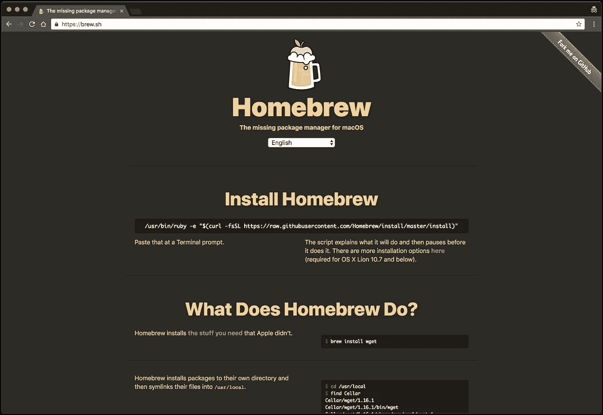
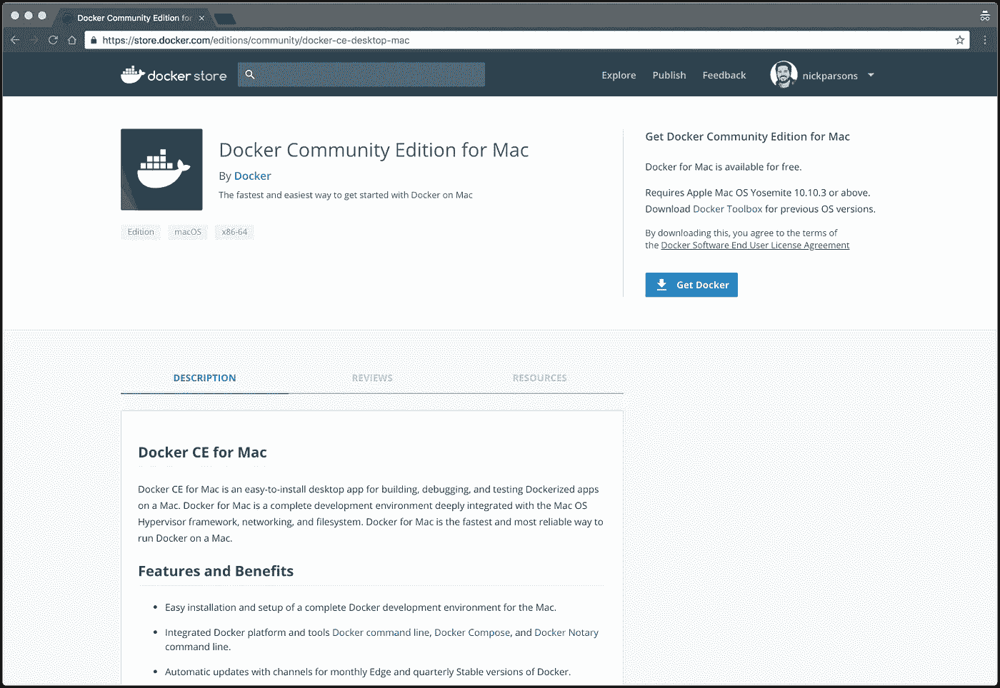
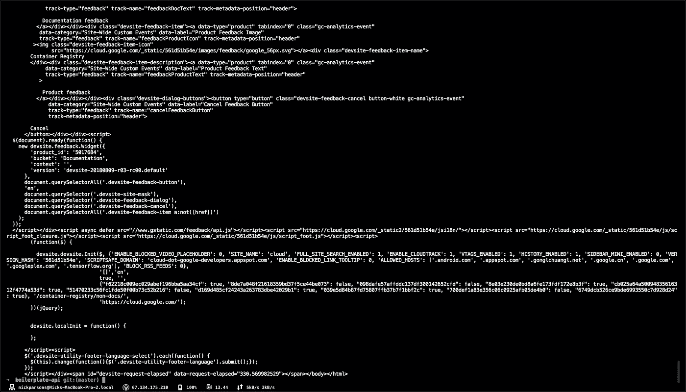
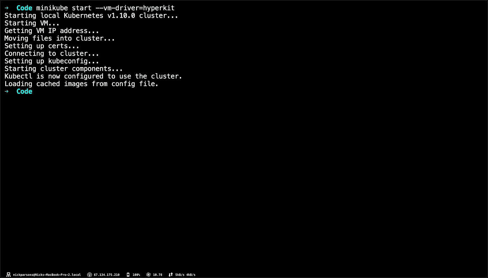
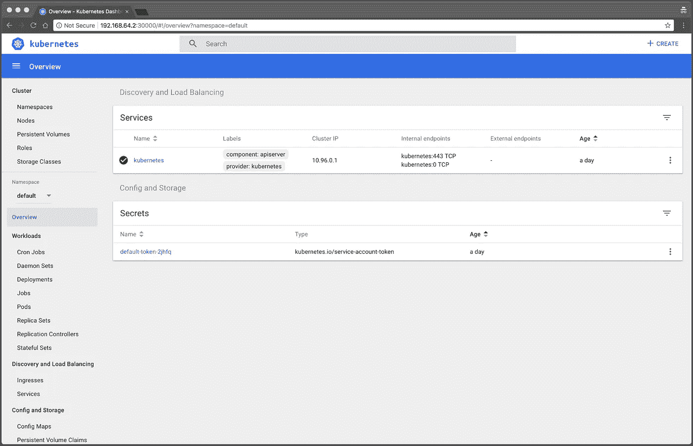
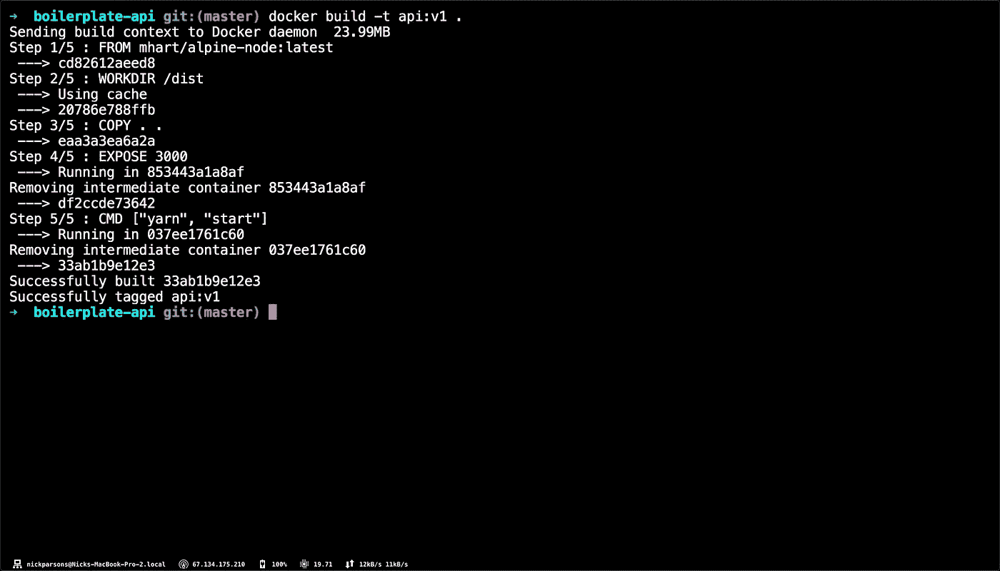
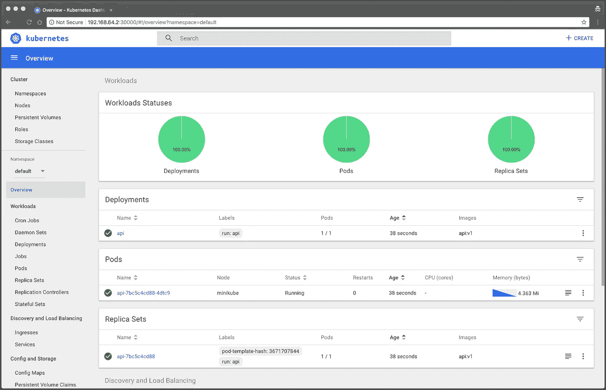

# 将 Node.js API 容器化&将 Docker 与 Kubernetes 和 Minikube 一起使用

> 原文：<https://betterprogramming.pub/containerizing-a-node-js-api-using-docker-with-kubernetes-and-minikube-30255fd33ef9>

## 如何使用 Docker 封装应用程序，并使用 Kubernetes 和 Minikube 在本地提供服务

作为 [Stream](https://getstream.io) 的开发者传道者，我有机会了解我们的工程团队和客户每天都在使用的大量令人敬畏的新技术。可以吸收的知识量绝对是惊人的，只要有机会，我就喜欢学习所有的新兴工具和玩具。

最近谈论最多的组合之一是[码头工人](https://www.docker.com/)和[库伯内特斯](https://kubernetes.io/)。Docker 和 Kubernetes 是一个发电站，它使得开发能够在多种操作系统上运行的快速、不可变的应用程序变得非常容易，而没有处理包管理的所有需求的所有麻烦。Docker 将任何给定操作系统的所有需求打包到您的 Docker 容器中，只需几个 Kubernetes 命令，您的应用程序就可以提供给用户，并且包括不可变的 pods，可以在任何时候用一个 Kubernetes 命令终止和启动这些 pods。

在这篇文章中，我将带你了解我如何用 Docker 封装一个应用程序，并使用 Kubernetes 和 [Minikube](https://kubernetes.io/docs/setup/minikube/) 在本地提供它。最终，你将获得足够的知识去做同样的事情，并有希望通过在 Kubernetes 的云中启动你自己的应用程序，将它带到一个新的高度。

# 要求✔️

和任何教程一样，有几个要求可以帮助你走向成功；我们想确保你，读者，能够跟上而不会迷路😉。

这篇文章最重要的一点是，它是面向 macOS 用户的。如果您使用的是 Windows 或 Linux，您仍然可以跟着做，但是，我的命令将与您想要使用的命令略有不同。

## 自制

如果你的电脑上没有安装家酿软件，你可以使用 https://brew.sh/网站上的安装命令来安装。

## 第二步:码头工人

要安装 Docker，请前往[入门](https://www.docker.com/get-started)页面，点击“Mac 下载”。您将被重定向到另一个页面，您可能需要先创建一个帐户。

## 第三步:迷你库贝

本教程使用 Minikube 创建一个本地集群。也就是说，让我们安装 Minikube:

## 第四步:超级工具包

按照 [Minikube 驱动程序安装指南](https://github.com/kubernetes/minikube/blob/master/docs/drivers.md#hyperkit-driver)所述安装 HyperKit 驱动程序。您也可以运行以下命令(如果您在 macOS 上)来安装 Hyperkit 驱动程序:

## 第五步:Kubernetes CLI

使用 Homebrew 下载 kubectl 命令行工具，您可以使用它与 Kubernetes 集群进行交互:

# 克隆样板 Express API💾

现在您已经完成了启动和运行 Docker 和 Kubernetes 的步骤，让我们继续下载我整理的样板 Express API。您可以使用自己的命令，但是，我建议您首先尝试一下，直到您掌握了我们将要使用的命令。

前往您想要存储代码的目录。然后继续运行以下命令，将存储库克隆到您的目录中:

*注:如果你想先看看回购，* [*点击这里*](https://github.com/nparsons08/boilerplate-express-api) *。*

接下来，进入目录，构建 API 并启动它进行测试:

API 会自动打开一个窗口，您应该会看到与此类似的内容:

# 用 Docker 容器化 API📦

我承认，当我第一次看到 Docker 的时候，我有点害怕。这个概念对我来说没什么意义，命令看起来完全陌生。然而，在阅读和研究了一些文档之后，我开始理解使用 Docker 的基本原理——你也会理解的。现在，我们要保持事情简单；在以后的文章中，我们将继续前进，让事情更上一层楼😀。

*注意:所有命令都应该在终端中运行。*

## 步骤 1:理解 Dockerfile 文件(目录中已经存在一个模板):

## 步骤 2:构建 Docker 映像:

## 第三步:列出所有 Docker 图片(验证你的图片是否存在):

## 步骤 4:运行 Docker 映像:

## 步骤 5:查看正在运行的 API:

繁荣💥！您刚刚使用 Docker 启动了 API！现在让我们把它拆了，因为几分钟后我们将使用 Kubernetes 和 Minikube 来启动 Docker 容器。

## 第六步:拆掉它:

# 走进 Minikube & Kubernetes 的土地👣

Minikube 是一个让本地运行 Kubernetes 变得容易的工具。Minikube 在笔记本电脑上的虚拟机中运行单节点 Kubernetes 集群。

## 设置 Minikube

通过打开一个新的终端并使用以下命令，确定您是否可以直接访问像[https://cloud.google.com/container-registry/](https://cloud.google.com/container-registry/)这样的网站，而无需代理:

*注意:如果这个 cURL 命令不起作用，请停止并尝试修复问题。如果不能访问外部互联网，Minikube 将无法正常启动(对于本教程)。*

cURL 命令应该会退回一堆 HTML，如下所示:

*注意:如果你不能访问谷歌容器注册表，你的连接有问题。在继续下一步之前，您需要对此进行调试。*

接下来，确保 Docker 守护进程已经启动。您可以使用以下命令来确定 docker 是否正在运行:

*注意:如果命令成功，您应该在终端中看到 Docker 图像列表。如果你没有，你需要调试为什么 Docker 没有在你的机器上运行。*

现在您已经验证了 Docker 正在运行，我们可以使用以下命令启动 Minikube 进程:

*注意:****—*** `*vm-driver=hyperkit*`*标志指定您正在使用 macOS 的 Docker。默认的 VM 驱动实际上是 VirtualBox，但在 macOS 上首选 HyperKit。*

如果成功，您的终端看起来将完全像这样:

现在设置 Minikube 上下文。上下文决定了与哪个集群`kubectl`进行交互。我们将使用以下命令来实现这一点:

验证`kubectl`是否配置为与您的集群通信:

## 启动 Minikube 仪表板

*注意:Minikube 附带了一个仪表盘，您可以直观地看到正在发生的一切！*

现在，让我们开始启动仪表板吧！

好吧，你已经走到这一步了。我们继续吧！

## 创建 Docker 图像

为了简单起见，让我们继续使用我们在本文前面使用的样板 API。

因为本教程使用 Minikube，而不是将 Docker 映像推送到注册表，所以您可以使用与 Minikube VM 相同的 Docker 主机来构建映像，这样映像就会自动出现。为此，请确保您使用的是 Minikube Docker 守护程序:

现在我们的守护进程已经为 Docker 设置好了，我们可以继续创建 Docker 映像。转到我们之前创建的`/api`目录，运行以下命令:

*注意:Minikube 虚拟机现在可以运行您构建的映像。*

该命令的输出应该如下所示:

# 创建 Kubernetes 部署💻

Minikube 正在运行，我们的 Docker 映像已经创建，一切进展顺利。让我们快速讨论一下 Kubernetes 部署的结构。

Kubernetes [Pod](https://kubernetes.io/docs/concepts/workloads/pods/pod/) 是一组一个或多个容器，为了管理和联网而连接在一起。本教程中的 Pod 只有一个容器。Kubernetes [部署](https://kubernetes.io/docs/concepts/workloads/controllers/deployment/)检查您的 Pod 的健康状况，并在它终止时重启 Pod 的容器。部署是管理 pod 的创建和扩展的推荐方式。

使用`kubectl run`命令创建一个管理 Pod 的部署。Pod 运行一个基于您的`api:v1` Docker 映像的容器。将 **—** `image-pull-policy`标志设置为`Never`以始终使用本地图像，而不是从 Docker 注册表中提取图像(因为您还没有将它推送到那里):

现在，我们可以使用以下命令查看部署:

并且，如果您访问您的仪表板(在您的终端中运行命令`minikube dashboard`**)**，您会看到绿色！****

********

****你甚至可以在 [http://localhost:8080](http://localhost:8080) 访问 API！****

*****注意:当您不想再使用 Minikube 主机时，您可以通过运行* `*eval $(minikube docker-env -u)*` *来撤销此更改。*****

# ****恭喜你！🎉****

****恭喜你！您刚刚用 Docker 封装了一个 API，启动了 Minikube，并在本地机器上将 Docker 映像部署到 Kubernetes。****

****干得好！在以后的文章中，我们将详细介绍如何封装和运行一个无状态但需要访问外部服务的应用程序，如 [Stream](https://getstream.io/try-the-api) 、 [MongoDB](https://cloud.mongodb.com) 、 [Redis](https://redis.io) 等。****

****在此之前，我推荐以下文章来提高你的技能:****

*   ****[Docker 入门](https://docs.docker.com/get-started/)****
*   ****[Kubernetes 基础知识](https://kubernetes.io/docs/tutorials/kubernetes-basics/)****
*   ****[Docker 最佳实践](https://docs.docker.com/develop/develop-images/dockerfile_best-practices/)****
*   ****[Kubernetes 最佳实践](https://kubernetes.io/docs/concepts/configuration/overview/)****

******编码快乐！**👏****