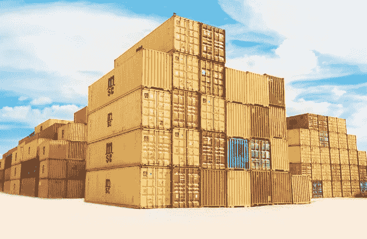
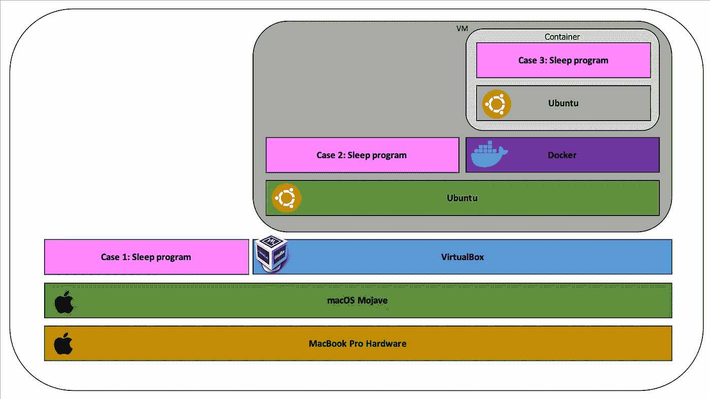
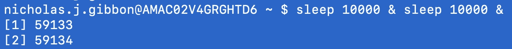
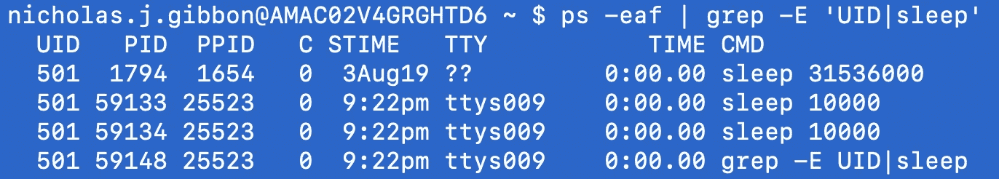
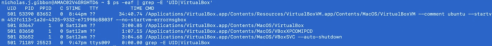
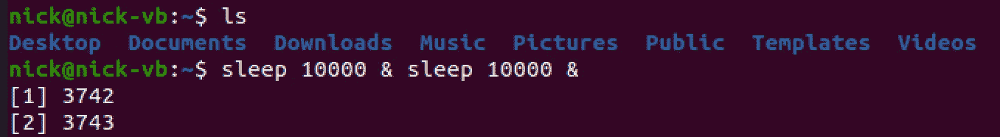
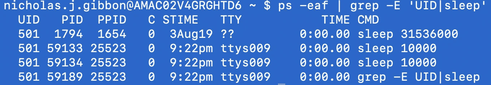
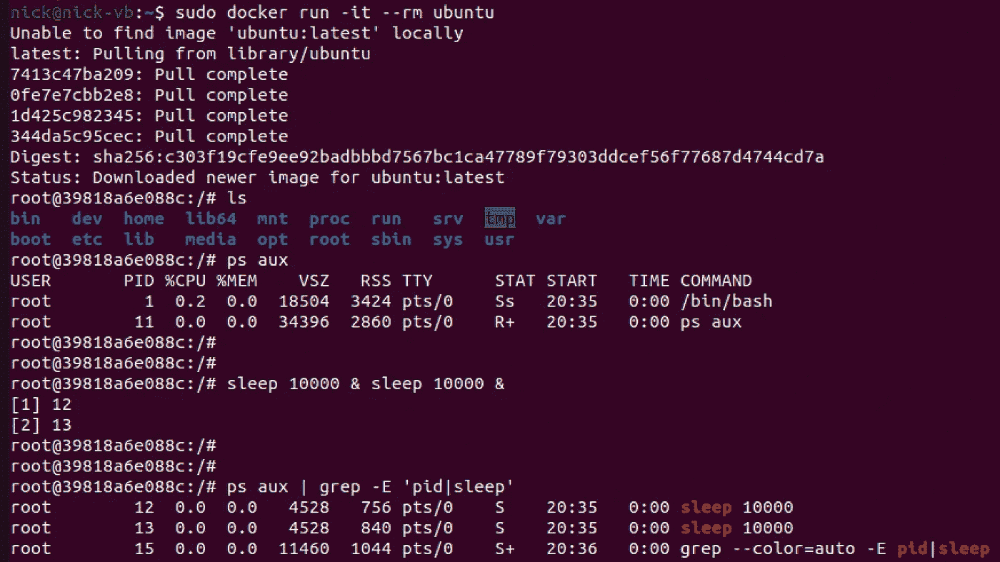
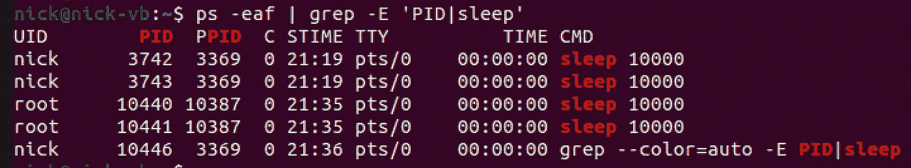
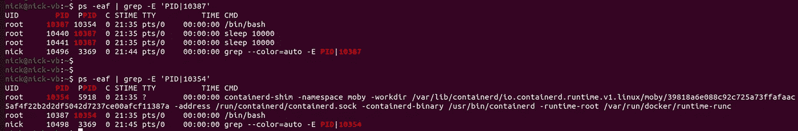

# 容器和虚拟机:流程视角

> 原文：<https://betterprogramming.pub/containers-and-virtual-machines-a-process-perspective-309c395d868c>

弗兰克·麦肯纳在 Unsplash[上的照片](https://unsplash.com?utm_source=medium&utm_medium=referral)

我在之前的一篇文章中概述了容器和虚拟机之间的区别。首先[阅读那篇文章](https://medium.com/better-programming/containers-and-virtual-machines-an-overview-94c558905b6)会有助于更好地理解我们将在这里做什么。

容器和虚拟机之间的关键区别在于，容器实际上与容器主机共享内核并在其上运行，而虚拟机是完整的操作系统安装。

说明这一点的最佳方式是在一些不同的场景中实际运行和监控进程，并查看机器上发生了什么。

我进行这个小实验的动机是因为我试图更好地理解容器和虚拟机是如何工作的，这时我在 Stack Exchange 上发现了一个帖子，它让我清楚地认识到:

 [## Docker 容器中的进程看起来像什么？

### Unix & Linux Stack Exchange 是一个问答网站，面向 Linux、FreeBSD 和其他类似 Un*x 的操作系统的用户

unix.stackexchange.com](https://unix.stackexchange.com/questions/216618/what-do-the-processes-inside-a-docker-container-look-like) 

我将经历一系列类似的步骤，并希望在这个普遍了解甚少的领域中发出更多的光芒。

# 锻炼

我想在不同的上下文中运行相同的过程，以说明这些环境隔离技术之间的确切区别。对于所有情况，我将执行`sleep & sleep &`，它在后台运行两个 sleep (delay)进程。

## 拓扑学

下图描述了我们将在笔记本电脑上检查的每个案例的架构逻辑层次。

## 案例 1:在我的笔记本电脑操作系统上执行

在我的笔记本电脑上，我运行了这个命令，并返回了两个进程 id。

我在进程中搜索“sleep ”,我可以看到两个刚刚产生的进程，它们正在我的 Mac OS 上运行并受其控制。

## 案例 2:在虚拟机中执行

我启动了一个 Ubuntu 虚拟机。现在，这是一个运行在 type-2 VirtualBox 虚拟机管理程序上的客户操作系统，而虚拟机管理程序又运行在主机(我的电脑)上。

现在，在 VM 中，我执行 sleep 命令，并再次返回两个进程 id。

我搜索正在运行的睡眠命令，并看到我刚刚生成的命令。

注意:在客户操作系统中，你看不到主机操作系统的进程。

当我们回到主机操作系统时，请注意我们现在看不到来宾操作系统进程。这是因为来宾操作系统是一个管理自己进程的完全操作系统。

## **案例 3:在容器内执行**

我需要在虚拟机内部运行 docker，因为它是 Linux 自带的。因此，虚拟机是 *c* 容器主机/停靠器主机*，即使它本身是一个客户操作系统。为了清楚起见，请参考拓扑图。*

我运行了一个 Ubuntu 容器，在容器内的*和其他情况一样，我执行睡眠命令。然后我搜索睡眠进程，我只能在容器中看到我刚刚生成的进程。*

**注意:**然而，现在当我返回 VM 并查看哪些睡眠进程正在运行时，我看到两个新进程:10440 和 10441。这些是在容器中运行的进程。

现在，我们可以做一些检测工作，沿着流程 ID 树向上搜索，直到到达顶级容器执行流程。这表明容器在逻辑上是隔离的，但实际上它是作为 Docker 主机上的一个进程运行的，而不是一个单独的操作系统。

这些案例对我个人理解这些工作负载隔离技术实际上是如何工作的以及为什么它们感觉如此不同非常有用。希望这对你也有同样的效果。

# 资源

 [## Linux 中的睡眠命令

### Sleep 命令用于在任何脚本执行期间延迟固定的时间。当编码者需要…

linuxhint.com](https://linuxhint.com/sleep_command_linux/)