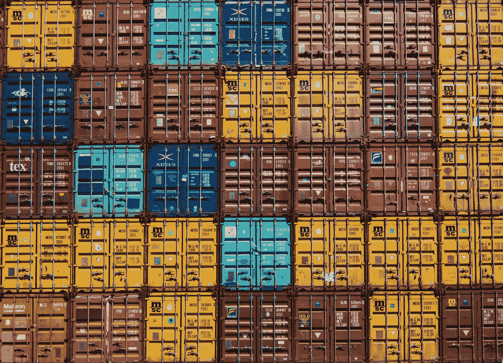
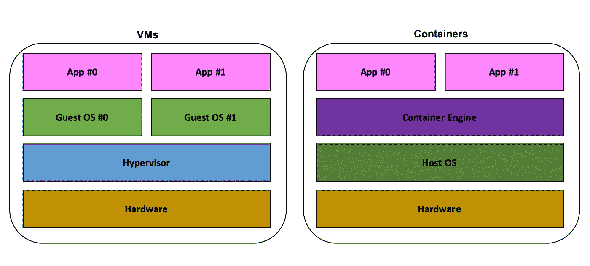
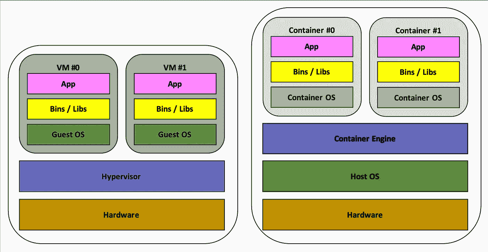
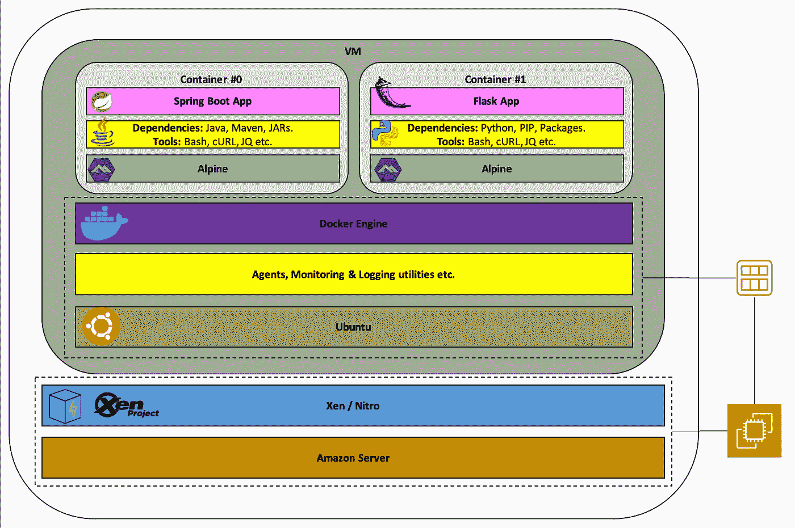
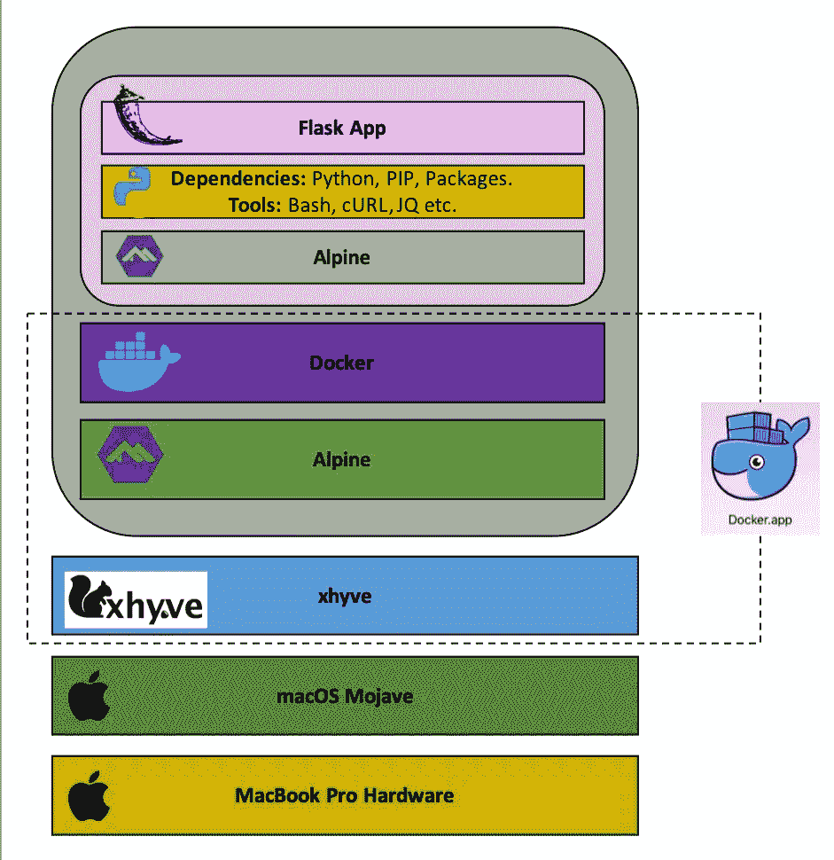

# 容器和虚拟机:概述

> 原文：<https://betterprogramming.pub/containers-and-virtual-machines-an-overview-94c558905b6>

## 与一些彩色图片的清晰对比

Guillaume Bolduc 在 [Unsplash](https://unsplash.com/?utm_source=unsplash&utm_medium=referral&utm_content=creditCopyText) 上拍摄的照片

最近，我意识到我对一些我广泛使用的技术没有非常深刻的理解，所以我决定获得一个更好的视角。

这篇文章对这些技术以及它们如何集成到现代 IT 中提供了一个清晰的、高层次的概述，并提供了一些与比较相关的中级细节。

和往常一样，如果你感兴趣(或需要)，你可以更深入地研究——这篇文章不会涉及这些技术的内部组成。

有很多关于这个主题的好资源，我鼓励你去阅读，以增强你的理解。有关链接，请参见最后的参考资料部分。

这篇文章通过澄清我在研究这个主题时出现的一些问题增加了价值，并试图通过更多的图表和例子真正阐明这些观点。

# 集装箱技术

首先，我们将讨论*容器*和*虚拟机(VM)*。

## 比较的理由——和警告

有人说容器就像一个迷你虚拟机。

从某种意义上说，这是正确的。但从另一个角度来看，这是非常不准确的，可能会导致混乱，不正确的假设，以及在这个问题上的沟通不畅。

需要理解的重要相似之处是，两者都是为部署和运行应用程序创建隔离环境的方式。

## 虚拟机

VM 是安装在主机上的虚拟机管理程序(VM manager)上的一个来宾机器。这意味着通过虚拟化，许多不同的机器可以在相同的底层基础设施上运行。

虚拟机管理程序可以是*类型 1* 或*类型 2* 。第 1 类虚拟机管理程序直接在硬件上运行，而不是在操作系统上运行。在这种情况下，虚拟机管理程序就像某种操作系统。类型 2 运行在主机操作系统之上。

应用程序可以在与客户操作系统兼容的虚拟机中运行，而与主机无关。这就是我们如何在 Windows 和 Mac 台式电脑上运行 Linux 的方法。安装了完整的操作系统，因此虚拟机只与主机共享底层硬件。

## 容器

容器完全在容器主机的应用层运行。在[用户区](https://play.google.com/store/apps/details?id=tech.ula&hl=en_US)、*、*操作系统有*内核空间*，操作系统的核心在那里运行。然后，还有*用户空间*，在那里运行与用户活动有关的一切。未安装来宾操作系统。容器共享内核空间，并以隔离的方式运行，类似于更改根操作。

[Docker](https://www.docker.com/) 通过利用一些 Linux 特性来实现这一点:*名称空间*和*控件组*。

容器实际上只是一个过程。从设计上来说，在一个容器里，它就像一台完全独立的机器。您可以启动新的进程，当您监视这些进程时，您将只能看到容器内部的进程。然而，如果您监视主机进程，您仍然能够看到容器内运行的一切。您将能够通过父 ID 将进程 ID 树映射到单个容器执行进程(我将在另一篇文章中对此进行说明)。

好的，容器共享宿主。那我怎么在一台机器上运行 Ubuntu 和 CentOS 呢？

澄清一下，容器实际上共享内核。特定的 Linux 发行版都构建在同一个内核之上(尽管版本不同)。所有的包管理器、UI 和其他各种软件都可以在用户空间中运行，这些软件使发行版变得独一无二，并创造了一种不同的 Linux 风格。具有不同发行版的不同容器可以在同一台机器上运行而不会发生冲突。

当涉及到平台设计时，这种内核共享的事实还有其他重要的含义。例如，Windows 容器将不能在 Linux 主机上运行。

# 不变

不可变对象是不可改变的对象。容器本质上是天生不可变的。这是他们的天性。容器操作系统、库、实用程序和应用程序在构建时都是冻结的，并且工件被版本化，之后它永远不会改变。你不能用传统的方式更新容器。你重新构建和重新部署。虽然有一些缺点，但在可重复性、部署的简化和可靠性方面有巨大的收益。

## 形象

映像是一个标准的文件包，表示容器运行时文件系统的状态。这可以发布到注册表或用作*父映像*。

大多数图像将构建在父图像之上(父图像通常也构建在另一个父图像之上)。*基础图像*没有父图像。

例如，以下是 Docker Ubuntu 基础映像的外观:

 [## tianon/docker-brew-ubuntu-core

### 此时您不能执行该操作。您已使用另一个标签页或窗口登录。您已在另一个选项卡中注销，或者…

github.com](https://github.com/tianon/docker-brew-ubuntu-core/blob/9db8c72dd02e8f9fd5dba82ff9266174b088e2e6/bionic/Dockerfile) 

# 摘要

简而言之，容器化提供了在单个操作系统上隔离工作负载的标准化方法，而虚拟化提供了在一台服务器上安装多个操作系统的标准化方法。它们在业界都很突出，并且在云中经常一起使用。

因为容器不安装完整的操作系统，所以它的重量更轻，因为它下载和运行更快，存储更小。

# 例子

下图以尽可能简单的方式说明了上述差异。请注意使用虚拟机和容器运行相同两种工作负载的堆栈构成。

基本虚拟机和容器比较

如果您理解了上面描述的容器和虚拟机之间的关键区别，那么第二张图提供了对正在发生的事情的更多洞察。您可以清楚地看到这两种技术如何提供工作负载隔离。

记住，栈代表一个逻辑层次。我们知道，容器都作为独特的进程在主机操作系统上运行，而虚拟机来宾操作系统是成熟的操作系统，可以管理自己的进程。

另一个有用的容器和 VM 比较

现在，让我们看看虚拟机和容器通常是如何一起使用的。假设我们想在云中运行一个 Python [Flask](https://palletsprojects.com/p/flask/) 应用程序和一个 Java [Spring](https://spring.io/) 应用程序。下图描述了 AWS 上的一种可行状态。

在云端运行容器

[亚马逊 EC2](https://aws.amazon.com/ec2/) 是亚马逊的托管计算服务。这意味着用户不需要担心服务器或虚拟机管理程序。您只需选择您的实例类型(不同工作负载的不同特征)并部署您的虚拟机。

有不同的[亚马逊机器映像](https://docs.aws.amazon.com/AWSEC2/latest/UserGuide/AMIs.html) (AMIs)可供选择，或者你可以创建自己的映像。虚拟机映像将不变性引入到您的基础架构中，其好处我们在前面已经强调过。

因为虚拟机比容器更重，所以在 AMI 中应该考虑多少。

创建一个 g *olden 映像是很常见的做法:一个可以在许多不同的服务中通用的 VM 映像。这将包括基本操作系统、软件包更新、一些脚本、监控代理的安装和配置，以及其他操作和安全工具。*

使用配置管理工具(如 [Ansible](https://www.ansible.com/) 或 [Chef](https://www.chef.io/) )来管理工作负载或服务是很常见的。对于容器，这非常好。您将您的不可变应用程序部署到您的不可变黄金映像上，问题的回旋余地就更小了。

# 容器编排

下一个例子提供了在云中运行容器的基础的基本观点。

容器编排工具用于在一个巨大的平面上管理容器，感觉就像你在处理一台机器。这是通过巧妙管理*集群*(云中的机器或虚拟机群)来实现的。他们可以通过自动化资源调度和扩展以及工作负载管理功能来扩展容器的优势。Kubernetes 是目前最流行的容器编排平台。

这些工具在架构上很复杂，很难设置和运行。但从用户的角度来看，它们很棒，而且随着知识的增长、反馈的实施以及托管服务的出现，它们越来越容易管理。

最后，我们希望获得 Python 容器并在本地机器上运行它。请注意可移植性和不变性的组合优势，这允许我们相对容易地在我们的机器上运行与生产中完全相同的工件。

本地运行容器

Docker 是一个本地 Linux 应用程序。然而，Docker 提供了易于使用的软件，该软件在后台处理虚拟机的运行，使其感觉就像 Docker 在您的桌面上本地运行一样。上面显示了在 Mac 上部署时堆栈的样子。

# 参考

[https://www . electronic design . com/dev-tools/what-s-difference-between-containers-and-virtual-machines](https://www.electronicdesign.com/dev-tools/what-s-difference-between-containers-and-virtual-machines)

[https://medium . com/@ jessgreb 01/a-process-a-container-a-VM-f 36 ba 0 f 8 A8 f 7](https://medium.com/@jessgreb01/what-is-the-difference-between-a-process-a-container-and-a-vm-f36ba0f8a8f7)

[https://www . freecodecamp . org/news/a-初学者友好-containers-VMs-and-docker-79 a9 E3 e 119 b/](https://www.freecodecamp.org/news/a-beginner-friendly-introduction-to-containers-vms-and-docker-79a9e3e119b/)

[https://en.wikipedia.org/wiki/Hypervisor](https://en.wikipedia.org/wiki/Hypervisor)

[http://www.linfo.org/kernel.html](http://www.linfo.org/kernel.html)

[https://en.wikipedia.org/wiki/Chroot](https://en.wikipedia.org/wiki/Chroot)

[https://docs.docker.com/engine/docker-overview/](https://docs.docker.com/engine/docker-overview/)

[https://aws.amazon.com/answers/configuration-management/aws-ami-design/](https://aws.amazon.com/answers/configuration-management/aws-ami-design/)

[https://docs.docker.com/docker-for-mac/](https://docs.docker.com/docker-for-mac/)