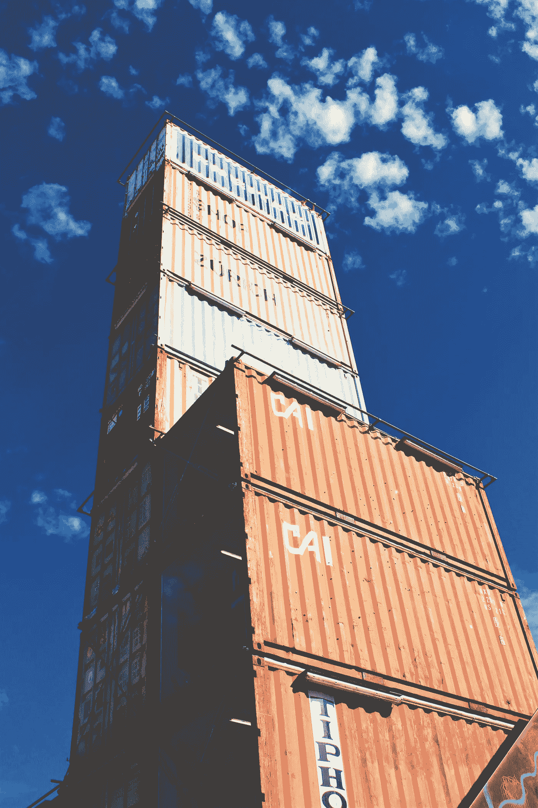
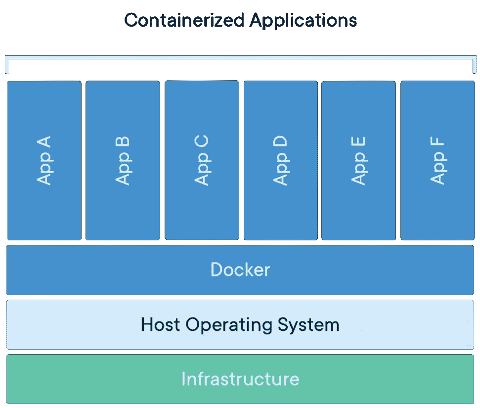
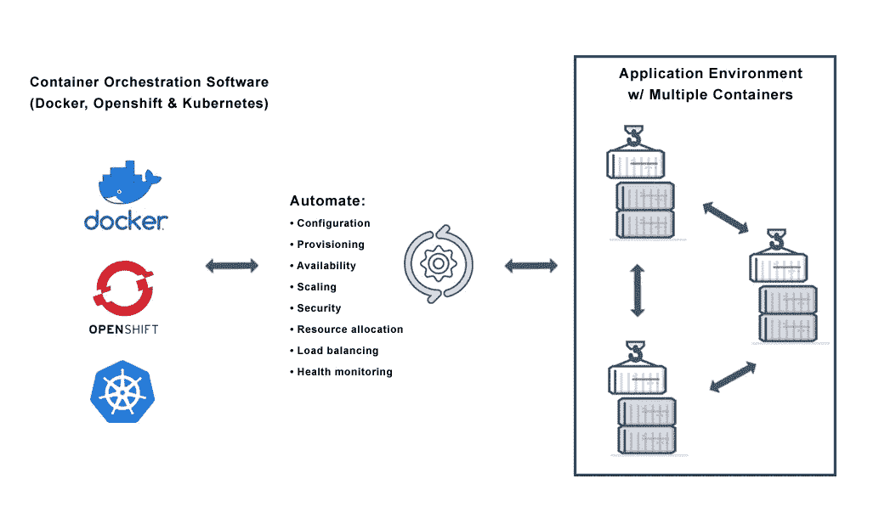
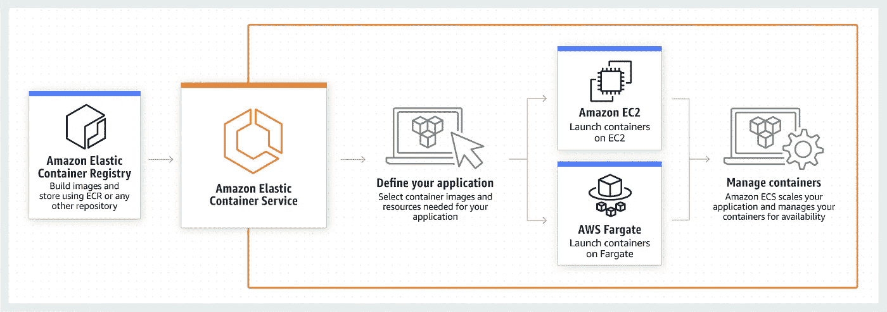
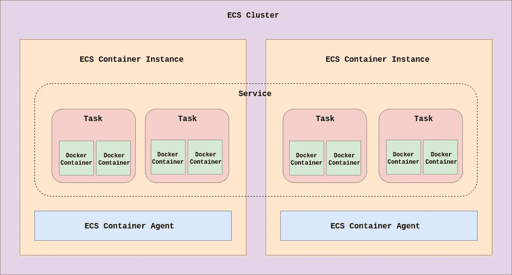

# 云中的容器

> 原文：<https://betterprogramming.pub/containers-in-the-cloud-2fa2910d3d4a>

## 集装箱化的概念，何时使用集装箱，以及最受欢迎的集装箱服务之一

照片由 [Teo Zac](https://unsplash.com/@teo?utm_source=unsplash&utm_medium=referral&utm_content=creditCopyText) 在 [Unsplash](https://unsplash.com/search/photos/container-cloud?utm_source=unsplash&utm_medium=referral&utm_content=creditCopyText) 上拍摄

TL；DR: Docker 容器将软件及其依赖项包装成一个标准化的软件开发单元，其中包含了运行所需的一切。

使用云平台的容器编排支持企业级容器化应用的运行和维护。

这个星期，我要去旅行，我妈妈想带一些她的药，拿出一个容器，只放假期需要的药片。

便携又方便，对吧？作为一名技术爱好者，我很快就能把这和一项有趣的同名成熟技术*容器*联系起来。

这个博客将简要介绍容器化的概念，何时使用容器，以及目前市场上最受个人开发者和企业欢迎的容器服务之一。

想象一下，这些软件容器与现实世界中的容器相似，它们是可移植的，作为一个单元用于运输或移动材料。

# 容器，汇总

我很确定，作为过去的软件开发人员，您曾经面临过这样的问题，比如需要安装一个虚拟机来运行某些类型的程序和依赖项。

在其他机器上运行您的应用程序之前，您需要安装不同类型版本的可传递依赖项，通过软件开发生命周期(SDCL)管道将应用程序投入生产，以及在我的计算机上运行的古老问题*，尽管*。

容器化是计算世界中的一个老概念，最近受到了关注，因为 Docker[引入了简化的工具来创建和管理容器。(此外，要注意的是，市场上有几个新的参与者，但本博客主要涉及 Docker)。](https://www.docker.com/get-started)

容器化的核心思想是从虚拟化发展而来的，就像一个同伴一样。它规定了打包或封装软件代码及其所有依赖项的思想，以便它能够在任何基础设施上平稳、一致和独立地运行。

这在过去的五年中不断发展，并证明了它的地位。

【来源:[https://www . docker . com/sites/default/files/D8/styles/large/public/2018-11/container-what-is-container . png](https://www.docker.com/sites/default/files/d8/styles/large/public/2018-11/container-what-is-container.png?itok=vle7kjDj)

集装箱化的一些显著优势可以总结为:

*   从应用程序代码中移除主机系统的依赖性。
*   构建易于扩展的程序。
*   简化的依赖关系管理和版本控制。
*   轻巧灵活。
*   隔离执行。
*   可预见性。

但是，作为个人开发人员或构建小规模应用程序的人，您将无法看到或体验 Docker 和 containers 带来的大量好处。

这就是 [*容器编排*](https://blog.newrelic.com/engineering/container-orchestration-explained/) 发挥作用的地方。容器编排就是管理容器的生命周期，主要是在大型动态环境中——企业系统。

让我们转而想象一下，我们实际上正在开发一个将被成千上万人使用的企业应用程序。

[来源:[https://avi networks . com/WP-content/uploads/2018/12/container-orchestration-diagram-1 . png](https://avinetworks.com/wp-content/uploads/2018/12/container-orchestration-diagram-1.png)]

Amazon Web Services 提供了自己的容器编排服务的实现，我们接下来将对此进行研究。

# AWS 弹性集装箱服务

对于企业级应用程序或系统，事实上是采用基于云的部署，即按使用量付费。

[作为行业领先的 XaaS 提供商，AWS](https://aws.amazon.com/) 了解容器对构建软件的影响，并提供自己的服务，称为 AWS [弹性容器服务](https://aws.amazon.com/ecs/) (ECS)。

AWS ECS 旨在成为支持 Docker 容器的高可伸缩、高性能的容器编排服务。这项服务使我们能够在云中轻松运行和扩展容器化的应用程序。

想象一下这样一个场景，您的应用程序是一个 Java 微服务，预期在 Linux 服务器上运行，拥有自己的微数据库，您决定在 AWS 上构建它。

在这种情况下，默认情况下使用 ECS 和使用[关系数据库服务](https://aws.amazon.com/rds/) (RDS)来部署您的微服务也为您提供了额外的容错优势，这意味着我们在设计时不必担心这一点。

此外，容器运行的特定主机及其维护都由平台本身管理。

【来源:[https://D1 . AWS static . com/diagrams/product-page-diagrams/product-page-diagrams _ ECS _ 1.86 EBD 8 c 223 EC 8 b 55 aa 1903 c 423 FBE 4 e 672 F3 daf 7 . png](https://d1.awsstatic.com/diagrams/product-page-diagrams/product-page-diagram_ECS_1.86ebd8c223ec8b55aa1903c423fbe4e672f3daf7.png)】

AWS 为其服务和模块提供了新的术语。让我们一路学下去。对此，我们来举一个类似于上面的小场景。

假设我们需要运行一个应用服务器(`app_1`)，它也需要一个小的缓存服务(`app_2`)与之并行运行。

## 任务内容

顾名思义，它是任务的*蓝图*。想起一个爪哇`Class`。它规定了要运行哪些容器。

在上面的例子中，它将在一个任务中声明两个应用程序在两个容器中运行。它还定义了细节，比如要使用的环境变量、CPU 和内存分配、公开的端口以及每个容器如何交互。

要运行的任务数量也在此声明。

## 工作

任务是上述蓝图的一个*实例*。想想 Java `Class`的一只`Object`。任务通过其任务定义按配置运行，允许从单个定义运行多个任务。

在我们的例子中，一个任务将同时运行`app_1`容器和`app_2`容器。

## 服务

服务允许您在一个集群中同时运行和维护任务定义中指定数量的实例。

这支持给定时间的最小和最大任务，并管理更多的事情，包括负载平衡和容器的自动伸缩。

例如，在我们的示例中，由于特定时间的高负载，如果 CPU 开始减速，服务将检查允许运行的最大任务数，并逐个增加任务数，直到达到给定的平均阈值。

## 容器实例

这些任务(和容器)需要在可以访问的地方运行—输入容器实例。容器实例是 EC2 实例，它们运行 Docker 和一个叫做 *ECS 代理* 的特殊软件，并注册到实例的`Cluster`中。

这些实例中的每一个都有能力运行一个或多个任务(即一个或多个容器)，只要它有可用的物理资源。另外，要注意的是，一个容器实例可以运行来自一个或多个`Services`的任务。

`Agent`通过提供正在运行的容器的状态和管理实例中生成的新容器，充当这些实例和 ECS 之间的桥梁。

## 串

一个集群是一组 *ECS 容器实例*。ECS 掩盖了维护、调度和扩展这些实例的所有复杂性。

此外，基于*放置策略*，它在最佳实例中放置新的容器，并消除痛苦。

当您有多个软件模块作为产品的一部分独立运行时，您可以将其中的几个模块放在一个集群中，这样可以实现资源的最佳利用，并实际上最大限度地减少设置时间。

AWS ECS 汇总

# 结论

我们已经看到，通过解决软件开发人员的多个痛点和体力劳动，容器化极大地帮助了软件开发过程。

同样，AWS 云平台如何解决 DevOps 工程师的多重挑战。

我们对 AWS 提供的容器编排服务有一个基本的了解，它可以简化在云中管理企业级容器化应用程序的过程。

我将在这方面尝试一些实际的应用程序，并在接下来的博客中讨论更多关于企业级容器化应用程序和内存管理的内容。