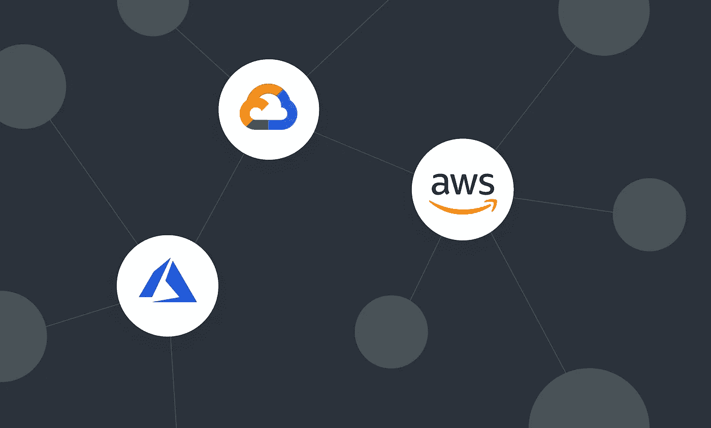

# 云中的容器——你有什么选择？

> 原文：<https://betterprogramming.pub/containers-in-the-cloud-what-are-your-options-df95e905fb1b>

## AWS、Azure 和谷歌云平台都提供服务来大规模安全地运行容器化的工作负载，但它们中最好的是什么？

图片由作者提供。

云为微服务架构的部署开辟了新的可能性。托管和非托管容器服务，以及无服务器托管选项，彻底改变了云中容器工作负载的部署。

虽然云环境中容器生态系统的非托管或自建方法使您能够更好地控制堆栈，但您需要拥有解决方案的端到端生命周期、安全性和运营。另一方面，托管容器服务由于与您当前的云生态系统、最佳实践、安全性和模块化进行了内置集成，因此更容易使用，也更受欢迎。

所有三个领先的云提供商— AWS、Azure 和 GCP —都拥有强大的产品和服务组合，可以支持云原生和混合部署的容器化工作负载。Kubernetes (K8s)仍然是云中最流行的容器编排解决方案。这种企业级解决方案也是生产部署的首选平台。每个主要的云服务提供商都提供本地托管的 Kubernetes 服务以及独立的容器解决方案。这两种解决方案都可以轻松地与您的云平台提供的强大支持服务生态系统集成，包括容器注册、身份和访问管理以及安全监控。

在本文中，我们将探索在云中部署容器的一些更流行的选项和用例。

# 云中容器工作负载的流行选项

每一个主要的云服务提供商都为容器工作负载托管提供了许多可用的选项，我们将在下面的小节中研究这些选项。

# 亚马逊网络服务

AWS 为容器工作负载提供了多种多样的服务，最受欢迎的是 EKS、ECS 和 Fargate。它还提供了一个扩展的服务和工具生态系统，如用于机器学习的 AWS 深度学习容器、亚马逊弹性容器注册表和用于混合部署的 EKS Anywhere(将于 2021 年推出)。

## 1.亚马逊弹性 Kubernetes 服务

Amazon Elastic Kubernetes Service(EKS)可用于在 AWS 中创建托管 Kubernetes 集群，其中部署、扩展和修补都由平台本身管理。这项服务是经过 Kubernetes 认证的，使用的是亚马逊 EKS 发行版，这是 Kubernetes 的一个开源版本。

由于控制平面由 AWS 管理，因此该解决方案可以在零停机时间内自动获得最新的安全更新，并确保容器的安全托管环境。该服务还保证了高可用性，通过跨多个 AWS 可用性区域部署 Kubernetes 的控制平面，实现了 99.95%正常运行时间的 SLA。

AWS 对 EKS 集群收取每小时 0.10 美元的固定费用，对工作节点使用的 EC2 实例或 EBS 卷收取额外费用。通过为开发和测试环境选择 EC2 Spot 实例，并为生产部署保留实例，可以降低成本。

如果您计划在 AWS 上进行基于微服务的应用程序的生产规模部署，轻松扩展的 web 应用程序，与机器学习模型的集成，批处理作业等，EKS 是最有益的。

## 2.AWS Fargate

[AWS Fargate](https://aws.amazon.com/fargate) 是一个面向容器的无服务器计算服务，可以与亚马逊 EKS 和亚马逊 ECS 集成。它降低了运营开销，因为您不必部署和配置托管容器的底层基础架构，并且您只需为运行工作负载所使用的计算容量付费。

这些容器在一个独立的环境中运行，有一个专用的内核运行时，从而确保提高工作负载的安全性。您还可以利用 Spot 实例(针对开发/测试环境)和计算节约计划来降低总成本。如果您希望以最少的开发和管理开销从整体架构转换到基于微服务的架构，AWS Fargate 提供了巨大的优势。

## 3.亚马逊弹性容器服务

[亚马逊弹性容器服务](https://docs.aws.amazon.com/AmazonECS/latest/developerguide/Welcome.html) (ECS)可用于在 EC2 实例的自我管理集群中或由 Fargate 管理的无服务器基础设施上托管容器服务。前一种方法对托管容器工作负载的端到端堆栈提供了更好的控制。

此外，它提供了服务的集中可见性以及通过 API 调用管理服务的能力。如果您对底层集群使用 EC2，同样的管理特性也可以用于 ECS。然而，集群管理、扩展和操作层都由平台处理，从而消除了这种开销。

ECS 是一项区域性服务，在 AWS 区域内跨可用性区域高度可用，确保您托管的容器工作负载的可用性。

# 微软 Azure

Azure 提供托管 Kubernetes 服务以及部署独立容器实例的选项。Azure 容器注册、与安全中心的集成以及容器图像扫描只是支持容器工作负载生态系统的其他一些 Azure 增值服务。

## 1.蓝色库伯内特服务

托管的 Kubernetes 服务，Azure Kubernetes 服务(AKS)，是当今公共云中最受欢迎的容器托管服务之一。它由一个承载主节点的控制平面组成，主节点由公开 Kubernetes APIs 的 Azure 平台管理。然后是客户管理的代理节点，在那里部署容器工作负载。

该平台处理所有集群管理活动，如健康监控和维护。它还提供了与 Azure RBAC 和 Azure AD 的轻松集成以进行集群管理，与 Azure Monitor 的内置集成，以及使用 Docker Registry 或 Azure Container Registry 检索容器图像的灵活性。

AKS 可以在不收取集群管理费的情况下使用，同时保持 99.5%的 SLA。在按秒计费模式下，您只需为用于 AKS 集群的虚拟机实例、存储和网络资源付费。还可以选择以每小时每集群 0.10 美元的价格购买正常运行时间 SLA。在集群部署期间，可以通过使用 Azure 可用性区域来配置高可用性。如果购买了可选的正常运行时间 SLA，此类群集将获得 99.95%的保证 SLA，而不使用可用性区域的群集将获得 99.9%的 SLA。在这两种情况下，客户都需要为托管工作负载的代理节点付费。

## 2.Azure 容器实例

Azure Container Instances 为在 Azure 中部署容器提供了一个易于使用的解决方案，无需部署编排平台。因为[容器实例](https://azure.microsoft.com/en-in/services/container-instances/)不需要供应任何虚拟机，实例在几秒钟内就可以启动。该服务还为您提供了配置工作负载所需的 CPU 内核和内存的灵活性，您只需为此付费。该服务可以与 Azure 文件集成以实现持久存储，连接到 Azure 虚拟网络，还可以与 Azure Monitor 集成以实现资源使用监控。

Azure Container Instances 最适合为不需要高级功能(如按需扩展或多容器服务发现)的简单应用程序部署隔离的容器实例。

## 3.用于容器的 Azure Web 应用

Azure Web App 允许你使用来自 Docker Hub 或 Azure Container Registry 的容器映像在服务上部署容器。服务的后端操作系统修补、容量管理和负载平衡由平台处理，该服务支持根据配置的扩展规则通过纵向扩展或横向扩展选项按需扩展。这也有助于成本管理，在非高峰时段成本会自动降低。该服务还确保了高可用性，因为容器服务可以跨多个 Azure 区域部署。

# 谷歌云平台

Kubernetes 最初是 Google 的一个内部项目，它提供了一套强大的产品，用于托管云中和内部的容器托管。

## 1.谷歌 Kubernetes 引擎

Google Kubernetes Engine (GKE)是来自 GCP 的托管 Kubernetes 服务，可用于托管高度可用和可扩展的容器工作负载。如果您需要在隔离环境中运行容易受到安全威胁的工作负载，它还提供了一个 [GKE 沙箱](https://cloud.google.com/kubernetes-engine/docs/concepts/sandbox-pods)选项。

[GKE 集群](https://cloud.google.com/kubernetes-engine)可以部署为多区域和区域性集群，以保护工作负载免受云中断的影响。GKE 还具有许多开箱即用的安全功能，例如通过与[容器分析服务](https://cloud.google.com/container-analysis/docs/ar-quickstart)的集成，对容器图像进行数据加密和漏洞扫描。

与其他云服务提供商提供的托管 Kubernetes 服务一样，GKE 提供故障节点的自动修复、升级和按需扩展。它还可以与 GCP 监控服务集成，以深入了解部署的应用程序的运行状况。

如果您计划托管图形密集型、HPC 和 ML 工作负载，您可以在部署期间通过 GPU 和 TPU 等专业硬件加速器来增强 GKE。最后，GKE 提供了按秒计费功能，对于可以容忍停机的开发环境，还提供了一个选项，可以为您的集群使用[可抢占的虚拟机](https://cloud.google.com/preemptible-vms)，以进一步降低成本。

## 2.云运行

如果你想在 GCP 运行容器化的应用，而没有管理底层基础设施的开销， [Cloud Run](https://cloud.google.com/run) 是一个选择。使用这种完全管理的无服务器容器托管服务，您只需为容器消耗的资源付费。

Cloud Run 还可以部署到 Anthos [GKE 集群](https://cloud.google.com/kuberun/docs/choosing-a-platform)或内部工作负载中。与云代码、云日志、监控、工件注册和云构建等其他 GCP 服务很好地集成，Cloud Run 可以满足您所有的容器化应用程序开发需求。

# 混合部署

对于许多组织来说，他们的云采用之旅的第一步是实施混合部署，其中他们的容器化应用程序的一些组件保留在本地，而其他组件则迁移到云中。有几种流行的工具和服务可用于帮助满足混合云和多云部署的需求，所有领先的云提供商都在这一领域进行了重点投资。

## 1.天蓝色电弧

[Azure Arc](https://azure.microsoft.com/en-in/services/azure-arc/) 为部署在本地以及跨多云环境的服务器、数据服务和 Kubernetes 集群提供统一的基于 Azure 的管理平台。

支持 Azure Arc 的 Kubernetes 集群支持多种受欢迎的 Kubernetes 发行版，这些发行版已经过云本地计算基金会(CNCF)的认证。该服务允许您在 Azure 中列出跨异构环境的 Kubernetes 集群，以获得统一的视图，并实现与 Azure 管理功能的集成，如 Azure Policy 和 Azure Monitor。

## 2.谷歌 Anthos

Google Cloud 的 [Anthos](https://cloud.google.com/anthos) 是一个全面的高级解决方案，可以用来在云和内部部署托管的 Kubernetes 集群。Anthos 提供了一个 [GKE 本地](https://cloud.google.com/anthos/gke/docs/on-prem/1.6)选项，您可以使用它将新的 GKE 集群部署到您的本地私有云。也可以[向 Anthos 注册](https://cloud.google.com/anthos/multicluster-management/connect/registering-a-cluster)现有的非 GKE 集群。[AWS 上的 GKE](https://cloud.google.com/anthos/gke/docs/aws)有助于多云场景，其中 AWS 中兼容的 GKE 环境可以使用 Anthos UI 中的[管理服务](https://cloud.google.com/anthos/gke/docs/aws/how-to/installation-overview)来创建、更新或删除。同时，Anthos 配置管理和服务网格解决方案有助于实现策略自动化、安全管理以及对跨多个集群部署的应用的可见性，从而提供统一的管理体验。

## 3.AWS 前哨站

[AWS outpost](https://aws.amazon.com/outposts/)是一种混合云服务，将 AWS 服务(包括像 EKS 这样的容器服务)带到您的内部数据中心。该服务目前以 42U 机架单元的形式提供，由 AWS 进行安装、更新和全面管理。该解决方案可以连接到本地 AWS 区域以获得混合体验，其中前哨站中的服务可以直接连接到云中的服务。

AWS Outposts 的目标客户是那些喜欢在本地部署容器化工作负载以进行数据驻留、本地处理等，同时能够灵活地为其应用程序使用 AWS Cloud 的支持服务的客户。

最近宣布的 EKS Anywhere 是另一个选项，旨在为混合部署提供与亚马逊 EKS 相同的体验。 [EKS 无处不在](https://aws.amazon.com/eks/eks-anywhere/)预计将于 2021 年上市。

# 选择正确的容器服务

由于云中可用于托管容器化工作负载的服务种类繁多，为您的需求选择正确服务的第一步是将您的特定应用程序需求与给定服务的功能对应起来。推荐主要云服务提供商提供的托管容器服务，因为它们可以更好地与自己的云平台服务集成。

在为您的应用程序选择最佳容器服务时，选择生产就绪服务，同时避免潜在的供应商锁定。您还应该考虑解决方案的未来路线图，以及监控、日志记录、可用性、可伸缩性、安全管理和自动化的便利性。

从托管的 Kubernetes 服务开始是一个很好的选择，因为 Kubernetes 最适合于可伸缩、安全和高度可用的生产部署。如果对混合集成有明确的要求，其中一些容器化的工作负载可能会保留在本地，请选择像 Azure Arc 或 Google Anthos 这样的混合解决方案。最后，如果您正在寻找简单的隔离容器部署，无服务器解决方案可能是最合适的。

*最初发表于*[*【https://codersociety.com】*](https://codersociety.com/blog/articles/introduction-graphql)*。*