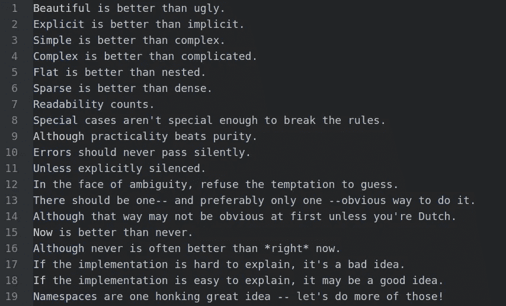
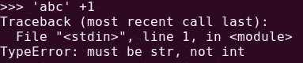
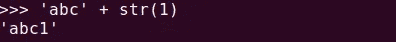
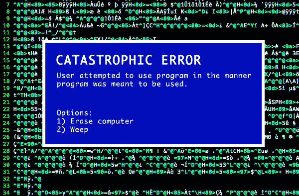

# 思考 Python 的禅

> 原文：<https://betterprogramming.pub/contemplating-the-zen-of-python-186722b833e5>

## 浅析 Python 设计的 19 条指导原则



蒂姆·彼得斯的《Python 之禅》

上周在阅读一篇关于 Python 的 [PEP8 风格指南的文章时，我再次遇到了 Python](https://www.python.org/dev/peps/pep-0008/) 的禅。对于那些以前没有见过它的人来说，通过在 Python 解释器中使用这个咒语，你可以很容易地想到它:

```
import this
```

长期的 Python 研究者 Tim Peters 将 BDFL(Python 创始人吉多·范·罗苏姆的昵称，仁慈的终身独裁者)的 Python 设计指导原则写成了 20 句格言。十多年来，这首诗一直是 Python 程序员的迷你风格指南。

不可思议的是，只有 19 条指导方针被写了下来。据报道，Guido van Rosum 说，丢失的第 20 句格言是“一些奇怪的蒂姆·彼得斯在开玩笑。”

这篇文章包含了我对这些格言的解释，包括例子和应用。

# 漂亮总比难看好。

作为一名数据科学家，我通常会编写简单有效的代码。我可能关心时间和空间效率，但很少关心可读性。每当我不得不回顾我以前写的剧本时，我确实经常后悔这个习惯。

六个月后读我的剧本(来源: [Cinema Blend](https://www.cinemablend.com/new/Disney-Frozen-Sing-Long-GIF-Review-41457.html) )

虽然代码“漂亮”并不是强制性的，但 Python 作为一种语言，其设计理念是保持**一致性**、**可读性、**和**简单性**。比如用`**or**`、`**and**` vs `**||**`、`**&&**`、 **:**

```
if (is_valid(a) && b == 0 || s == 'yes') {***vs***if is_valid(a) and b == 0 or s == 'yes':
```

Python 成功地做到了精确、简洁、明确和优雅。

# 显性比隐性好。

对于你的代码来说，冗长的 T21 和显式的 T23 是非常重要的。这里有一个例子:

问:这里犯了什么罪？

每次调用模块时，最好明确地命名它。例如，这样做会使 Karan(我公司的一个新成员，他正在处理我的代码)的生活变得容易得多。

现在，很明显犯了什么罪。



同样，像这样的隐式操作在 Python 中是不允许的。



您必须使用显式类型转换。

整个概念围绕着哲学:不要让我思考。

# 简单比复杂好。复杂总比复杂好。

简单的解决方案总是比复杂的好。一个很好的例子是[在 Python](https://medium.com/swlh/how-to-reverse-a-string-in-python-66fc4bbc7379) 中反转一个字符串。最快也是最优雅的方法是使用单行切片操作。

```
my_string = "ABCD"
reversed_string = my_string[::-1]
```

但是，如果我喜欢痛苦而无意义的解决方案，我可能会选择递归来解决同一个问题:

但是，必须指出的是，我们不应该通过寻找更简单的元素来使我们的解决方案变得复杂。例如，在不使用 [**numpy**](https://numpy.org/) 的情况下添加两个数组:

使用 numpy 添加两个数组:

喜欢简单胜过复杂，但要知道简单的局限。

# 扁平的比嵌套的好。

程序员通常喜欢将他们的代码组织成包含子模块的模块，子模块包含其他子子模块。这种层级结构往往会增加混乱而不是组织。

如果你需要将功能导入你的模块，比如`import foo.bar.i.am.function`，那么你需要停止。

喜欢浅而不是深的巢。

# 疏比密好。

我知道单行代码是给你的朋友留下深刻印象的好方法，但是它们会激怒你的同事，他们不得不花几个小时去理解它。想象一下，在周一早上上班，你看到的第一行代码是这样的。

```
print('\n'.join("%i  bytes = %i bits which has %i possible values." % (j, j*8, 256**j-1) for  j in (1 << i for i in range(8)))) 
```

分散在多行中的代码通常比密集的一行代码更容易阅读。

# 可读性很重要。

我们来对比一下 C 和 python 中的打印`hello world`。

用 C 语言打印 Hello World

和...相对

用 Python 打印 Hello World

代码被阅读的次数比它被编写的次数多。英雄不会写过于简洁的代码。它们明确给出了变量名，并记录了一切。

缩进良好的代码可读性更强。因此，在 Python 中它是强制的。

# 特例不足以特殊到打破规则。虽然实用性战胜了纯粹性。

虽然这两句格言可能看起来矛盾，但我觉得它们相辅相成。编程充满了“最佳实践”和样式指南。

虽然在软件开发中坚持这些指导方针是最好的，但是您可能会为了快速破解而试图回避这些指导方针，并且在您意识到之前，您已经被未记录的非常低效的遗留代码包围了。

但是，请记住实用性。在一个简单的脚本可以做到的地方，强加面向对象的原则是没有意义的。

# 错误永远不会无声无息地过去。除非明确沉默。



来源:[编程烂](https://www.stilldrinking.org/programming-sucks)

当函数返回`None`或错误代码而不是引发异常时，就会发生无声错误。这句格言说，程序崩溃比消除错误并继续运行要好。

避免错误最终会导致更难调试的错误，因为它们远离了最初的原因。最好将这些错误明确化。

如果您希望忽略代码可能导致的错误，最好将其显式化。

# 面对暧昧，拒绝猜测的诱惑。

这重申了让你的代码优雅、易读和清晰的想法。考虑以下代码:

屏幕上会打印什么？

你可能会说一个专业的程序员应该很清楚 Python 中操作符的优先级。但是，问题是，“这种模糊性可以避免吗？”

从长远来看，尝试堆栈溢出解决方案，直到一切正常，并没有什么帮助。

调试需要批判性思维。很有可能你只是在掩盖问题，而不是完全解决它。

# 应该有一种——最好只有一种——显而易见的方法来做这件事。

这种信念给 Perl 编程语言的格言“有不止一种方法可以实现它”蒙上了阴影。虽然同一问题有多个解决方案增加了灵活性，但这需要您付出额外的努力来熟悉所有的解决方案。

P.S .这里有一个大多数人都忽略的内部笑话:警句中 one 后面的后缀运算符和 obvious 前面的前缀运算符。

新程序员经常在特定情况下困惑于是使用后缀还是前缀运算符。Python 通过不完全支持它们来解决这个困惑。

# 尽管这种方式一开始可能并不明显，除非你是荷兰人。

这句格言指的是 Python 的创始人吉多·范·罗苏姆，他是荷兰人。一个用来表示他的天才的常见例子是 C 的备受争议的三元运算符。

```
a = condition?expression1:expression2;
```

在 Python 中，

```
a = expression1 if condition else expression2
```

然而，即使是这句格言也没有阻止 Python 整合三种不同的字符串格式化方式。

# 现在总比没有好。尽管从来没有比现在更好。

挂起或陷入无限循环的代码显然比没有挂起或陷入无限循环的代码更糟糕。然而，几乎可以肯定的是，等待您的程序完成要比过早完成而导致不正确的结果要好。

这些格言也适用于你的编程项目。最好今天就开始，而不是无休止地拖延。但是一个从未实施的项目可能仍然比一个匆忙执行的项目要好。

# 如果实现很难解释，这是一个坏主意。如果实现很容易解释，这可能是一个好主意。

Python 是一种程序员语言，为可读性和易维护性而设计。Python 因设计的简单和优雅而繁荣。如果你的“高性能”代码无法让你的同事理解，那就是糟糕的代码。

但是，拥有清晰的代码并不一定意味着它就不是糟糕的代码。编程很难。

# 名称空间是一个非常棒的想法——让我们多做一些吧！

名称空间是名称的集合。不同的名称空间可以在给定时间共存，但完全隔离。这些在 Python 中创建了一个系统，防止一个模块中的名称与另一个模块中的名称冲突。

但是也要记住*扁平比嵌套*要好:名称空间应该只用于防止命名冲突，而不是强制不必要的分类。

# 结论

Python 是一种简单的编程语言，旨在保持简单性和可读性。在编写代码时牢记这些准则是有好处的。

最后，这些指导方针是可以支持或反对的意见。正如我们在本文中看到的，许多原则似乎相互矛盾。除非你正在写一本充满编程最佳实践的书，否则争论应该如何编写代码很少会有成果。

潜在的哲学仍然是:“实用性胜过纯粹性。”

# 参考

1.  [PEP 20——Python 之禅](https://www.python.org/dev/peps/pep-0020/)
2.  [Python 的起源和 Python 的禅](https://medium.com/@rahul77349/the-origins-zen-of-python-b31a7296dbe0)
3.  [命名空间是一个令人叫绝的想法](https://www.geeksforgeeks.org/namespaces-and-scope-in-python/)