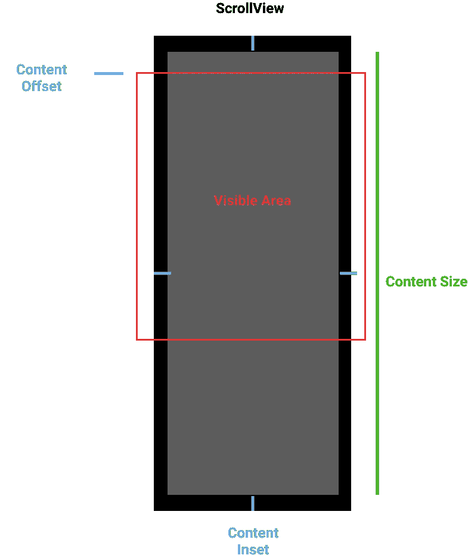

# UI ScrollView 的 ContentOffset、ContentInset 和 ContentSize

> 原文：<https://betterprogramming.pub/contentoffset-contentinset-and-contentsize-of-a-uiscrollview-5ae8beb0f1db>

## 掌握滚动视图最重要的属性


[萨克斯哥鲁达](https://unsplash.com/@sakethgaruda?utm_source=unsplash&utm_medium=referral&utm_content=creditCopyText)在 [Unsplash](https://unsplash.com/s/photos/view?utm_source=unsplash&utm_medium=referral&utm_content=creditCopyText) 上拍摄的照片

UIScrollView 有很多实例属性，但是`contentInset`、`contentOffset`和`contentSize`可能是最常用的。完全理解这些属性就可以创造奇迹——从一个可拉伸的工具栏开始，用手指捏出图像和许多其他有趣的东西。

*   `[contentOffset](https://developer.apple.com/documentation/uikit/uiscrollview/1619404-contentoffset)`是滚动区域后用户站立的位置。所以每次用户上下滚动时，这都会改变。有时，这可以通过编程以及在主线程中设置，如果位置存在，主线程将向上滚动到给定值。

```
scrollView.setContentOffset(CGPoint(x: 50, y: 50), animated: true)
```

*   `[contentInset](https://developer.apple.com/documentation/uikit/uiscrollview/1619406-contentinset)`是从 UIScrollView 到`innerView`的边距。给`childView`内部空间。这是在视图布局时给出的。这仅通过编程方式设置。顶部、底部、右侧和左侧的默认值为 0。

```
scrollView.contentInset = UIEdgeInsets(top: 7, left: 7, bottom: 7, right: 7)
```

*   `[contentSize](https://developer.apple.com/documentation/uikit/uiscrollview/1619399-contentsize)`是`UIScrollView`内内容的大小以及在`scrollView`内可以有多长。有时这是动态的，比如分页，或者是静态的，比如联系人列表。这也可能在运行时改变。这也可以通过编程来设置。

```
scrollView.contentSize = CGSize(width: self.view.frame.size.width, height: 500)
```



这就是属性放置在 scrollView 上的方式

`UITableView`和`UICollectionView`是从`UIScrollView`派生出来的，所以所有这些属性对于`tableView`和`collectionView`都存在，并且可以多次用作问题的解决方案或设计新功能。

感谢阅读！