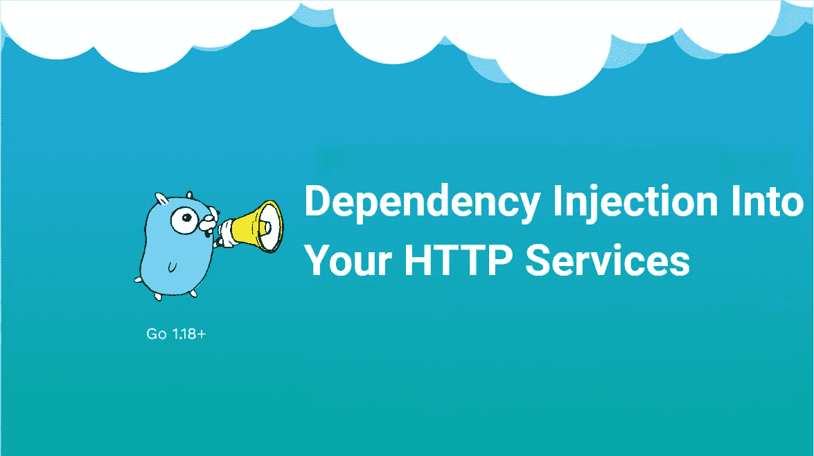

# 无上下文 Go——轻松编写 HTTP 服务

> 原文：<https://betterprogramming.pub/context-less-go-854db3e5510>

## 停止使用上下文作为 IoC，开始编写 HTTP 服务



许多 Go 开发人员，尤其是新手，发现不明显的一件事是:如何将我需要的所有东西传递给我的处理程序？

我们没有像 Java 或 C#中那样花哨的控制系统反转。是静态签名，所以我不能只传入我真正想要的。看来我们只有三个选择:

*   `use globals`
*   `wrap handlers in a function`
*   还是在`context.Context`里传东西下来！

让我们看看这三个选项。

# **一点上下文**

— *双关语肯定是有意的*

我们正在编写的处理程序是您在日常的普通电子商务商店中会看到的东西。

我们的任务是编写一个端点，给定某个类别 ID，返回该类别中的项目列表。

这个端点将需要访问我们的`items.Service`来进行实际的查找，`logging.Service` 以防出错，以及`metrics.Service` 来获取甜蜜的营销指标！

# **全局**

*——叫我全球先生*

我们第一次尝试把东西放进我们的处理程序是用全局变量。这是一种相当自然的方式，许多初学者都倾向于这样做。

我们都曾经写过这样的代码。然后我们很快了解到全局变量是不好的，因为它们产生不灵活的、不可测试的代码。

这自然会导致一个书籍、文章、视频等等的兔子洞，告诉你“注入你的依赖！”。这段代码不行，让我们尝试一下注入。

# **依赖注入**

*—得到你的助推器*

嗯，我们不想使用全局变量，但是`http.Handler`有一个固定的签名。那么我们如何做到这一点呢？我们当然包装它！

这是更好的，因为我们不再依赖全球政府，但仍有许多不足之处。主要是，它让每个处理程序都变成了一个又大又长又烦人的烂摊子。如果我们再增加一些服务，很容易想象这个签名会变长 2 到 3 倍。

所以我们四处阅读，发现我们的`*http.Request`里面有一个`context.Context`！我们可以创建一个中间件，注入我们所有的依赖项，然后处理程序就可以提取它需要的东西！这肯定会解决我们所有的问题！

# ***语境***

— *现已彩色！*

首先，让我们制作我们正在谈论的中间件。我们将在设置完所有依赖项后，以内联方式完成这项工作。

现在我们已经添加了所有内容，我们可以再次重做我们的处理程序:

很好很容易！这里不会出错。好吧，除非 3 个月后，有人在应用程序中的其他地方移动了一行代码，而其中一个服务在上下文中不再存在。

"好吧，聪明的媒体作家先生，我来确认一下！"你可能会说。

正如您所看到的，即使在小的、简单的、人为的例子中，以安全的方式做这件事也变得有点混乱。

我们使用 Go 的原因之一是为了避免所有这些类型的检查混乱！通过使用上下文作为我们依赖关系的某种抓取包，我们实际上放弃了类型安全。另外，直到运行时我们才知道事物是否存在。为了解决这个问题，我们到处都要进行长串的错误检查。

这不好。我们的三个选择各有各的糟糕之处。如果我们想注入我们的依赖项，似乎我们无法逃脱冗长的地狱。当然，你可以绕开这些问题，创建包装了很多这些东西的奇特函数，但这实际上并没有解决问题。

除非有第四条路…？

# **结构**

— *为你的管理人员增加结构……*

你们中的一些人可能已经对我大喊大叫了，但是我已经教过这个主题很多次了，先看看其他的解决方案真的很有帮助。

我们没有考虑的“第四条道路”实际上相当简单。

1.  我们创建一个结构来保存我们需要的依赖关系。
2.  我们将处理程序作为方法添加到该结构中

让我们看一个例子。

这个解决方案有几个很大的好处:

1.  我们所依赖的一切在构建时都是已知的，并且是类型安全的(不像上下文)
2.  我们有最少的额外样板文件(不像包装函数)
3.  保持可测试性(不同于全局)
4.  允许我们将相关的处理程序“分组”到单元中

4 是我们还没有接触过的一个，但是现在我们已经有了这个结构，我们可以创建处理程序的分组，这些处理程序共享共同的依赖关系或者只是逻辑上在一起。

例如，我们可以在这里添加一个处理程序来添加一个新的类别。我们可以创建一个`MetricsHandler`来将所有与指标相关的端点分组在一起。您可以根据自己的意愿选择粒度或范围(*粒度，在大多数情况下可能更好*)。

# **结论**

谁会读到这种程度？

我们终于有了目标。我们在完全人为的电子商务商店的老板会很高兴端点已经准备好了(暴露一些测试)。我们可以进入下一个任务。

这不是一个新的甚至是新奇的想法。如果你看看经典的 go 示例帖子，如[https://pace . dev/blog/2018/05/09/how-I-write-http-services-after-eight-years . html](https://pace.dev/blog/2018/05/09/how-I-write-http-services-after-eight-years.html)和[https://github.com/benbjohnson/wtf/](https://github.com/benbjohnson/wtf/)，你会看到这些想法在实践中。

这是一个伟大的，我认为，不明显的解决方案。

当然，我们可以使用接口之类的东西让它更容易测试，但那是另一篇文章了！

感谢阅读！

```
**Want to Connect?**Come join the Go Discord server at [https://discord.gg/golang](https://discord.gg/golang)!
```