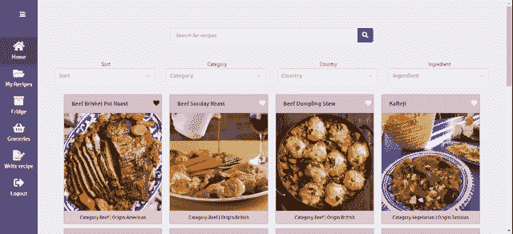
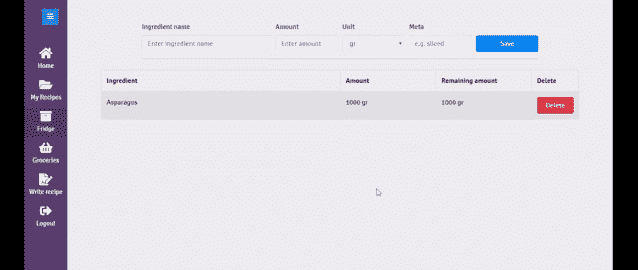
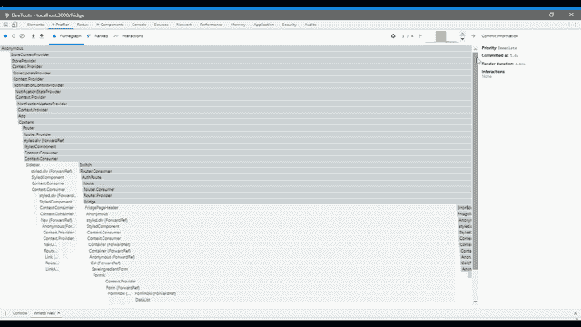

# 比较 React 上下文和 Redux

> 原文：<https://betterprogramming.pub/context-limitations-when-emulating-redux-in-a-small-to-medium-size-application-acd05ef882e4>

## 在中小型应用程序中模拟 Redux 时的上下文限制

图片来源:[https://unsplash.com/photos/1HCb2gPk3ik](https://unsplash.com/photos/1HCb2gPk3ik)

随着钩子(特别是`useReducer`和`useContext`)和稳定的 Context API 的引入，不可避免地要在 Context 和 Redux 之间进行比较，也许这是正确的，因为大多数技术前提都变得可能了。

本文试图深入研究 Context 的技术方面及其在使用 React hooks 模拟 Redux 架构时对应用程序性能、可维护性和可伸缩性的限制。在处理中小型 web 应用程序时，它会根据开发人员的经验来尝试这样做。

本文包含以下几个部分:

*   上下文 API 概述。
*   用于演示目的的应用程序摘要。
*   使用带挂钩的上下文创建应用程序存储。
*   上下文中的应用程序性能。
*   上下文中的应用程序可维护性。
*   结论。

# 1.上下文 API 概述

上下文试图解决将状态传递给需要它的组件的问题，而不是将它作为道具。因此，它使得对状态不感兴趣的中间组件忽略它，同时使得嵌套组件能够访问“全局”上下文状态。

要创建一个上下文，您可以使用`React.createContext`，在这里您将描述您想要保存的状态。然后，在需要访问上下文状态的最顶层组件上使用`MyContext.Provider`创建上下文提供者。

最后，作为提供者树的后代的所有组件都可以使用以下方式来使用状态:

*   `MyContext.Consumer`或`useContext`钩在功能部件内。
*   `this.context`或`static contextType = MyContext`内类组件。

在我们的应用程序中，我们将使用`useContext`钩子。

# 2.将用于演示目的的应用程序摘要

该应用程序名为 Prep & Groc(Prepare and 杂货的缩写)。这是一个网络应用程序，允许用户通过查找他当前存储在冰箱中的食谱中缺少的食谱配料来准备食谱。用户可以将缺少的配料保存到购物清单项目中，在购物时可以将它们标记为完成。该应用程序还根据用户的操作结果显示通知消息。

应用程序演示

应用程序的客户端是用 Context 和 Redux 实现的，这样我们可以更好地理解和比较这两者。以下是每个实现的存储库链接:

*   [*准备& Groc 客户端与上下文*](https://github.com/LumbardhAgaj/prep-and-groc/tree/master/client)
*   [*Prep & Groc 客户端带 Redux*](https://github.com/LumbardhAgaj/prep-and-groc-client-with-redux)

也可以看看 [Prep & Groc](https://prep-and-groc.herokuapp.com) 的直播版。

# 3.使用带挂钩的上下文创建应用程序商店

`useReducer`是一个 React 钩子，允许复杂的应用程序状态管理。它接受一个 reducer 函数和一个初始状态作为参数列表，同时返回当前状态和一个 dispatcher 函数。调度器用于发出改变 reducer 状态的动作。

按照单个应用程序全局存储的 redux 范例，我们可以用一个上下文和`useReducer`钩子类似地创建它。

使用上下文创建应用程序商店

我们对状态和分派使用不同的上下文，仅仅是因为分派函数从不改变，我们想尝试保存一些应用程序的渲染。然后，`StoreUpdateProvider`和`StoreProvider`都在`StoreContextProvider`中创建，后者现在提供应用程序的全局状态。

在应用的根组件，我们可以导入并使用`StoreContextProvider`，如下所示:

在根组件中使用 StoreContextProvider

`appReducer`通过使用 Redux 中类似于`combineReducers`的 reducer 函数来封装整个应用程序状态。它只是将应用程序状态分割成多个 reducers，使其更易于管理。

主要应用减速器

# 4.上下文性能

关于上下文，需要理解的最重要的一点是，它将重新呈现作为上下文提供者的后代的所有组件，无论它们在状态发生变化时是否使用上下文。这个规则的唯一例外是上下文提供者的子元素没有改变，只有使用上下文的组件才会重新呈现。这是我们将子道具传递给提供上下文的组件而不是在其中创建组件的主要原因(请阅读詹姆斯·纳尔逊的博文[关于避免不必要的上下文渲染)。](https://frontarm.com/james-k-nelson/react-context-performance/)

底线是，我们最终得到的是重新呈现的组件，即使它们可能没有发生变化，而我们理想的情况是只重新呈现那些发生了变化的组件。至少在按照图书馆的指导方针和实践使用 Redux 时是这样。

减少不必要的重新渲染的最佳策略是将上下文分割成其他上下文(或者从头开始创建新的上下文)。这样做的一个强有力的例子是:

*   状态的一部分经常改变，我们想要隔离它。
*   组件只对使用应用程序状态的一部分感兴趣。
*   状态的一部分很少改变，组件可能消耗部分和整个状态。

为了仔细演示我们可能想要拆分上下文的场景，让我们首先描述我们的应用程序的一个公共页面。我们有一个冰箱页面，在页面标题有一个保存配料的表格和一个作为页面主体的冰箱配料列表。此外，当用户成功删除一个冰箱成分时，它会显示一条通知消息，说“冰箱成分已被成功删除。”

删除冰箱配料

每当通知发生时，我们可以通过尝试减少不必要的重新呈现来获得稍好的性能。

目前，当用户完成显示通知的动作时，整个页面被重新呈现两次——一次是在屏幕上添加通知时，另一次是在删除通知时。将通知子状态从存储上下文状态中分离出来属于隔离频繁更改(大量用户操作发出通知)的场景，并且组件只对使用状态的一部分感兴趣。

正如我们对`StoreContextProvider`所做的那样，我们将实现`NotificationContextProvider`组件。

NotificationContextProvider 组件

我们的根组件将创建所有的上下文提供者。我们已经从`appReducer`中移除了通知缩减器，取而代之的是，我们将它作为一个属性值传递给新创建的`NotificationContextProvider`组件。

具有存储和通知上下文的根组件

最后，`NotificationToast`组件(负责管理通知)将单独使用通知上下文状态及其调度程序功能，我们称之为“通知”

创建通知状态和更新上下文后的 NotificatonToast 组件

现在，每当组件发送通知时，它将只重新呈现`NotificationToast`组件，而不是整个应用程序。

使用 React dev profiler 记录删除冰箱配料操作

使用 React dev profiler 记录我们的操作，我们可以看到，当通知发生时，只有`NotificationToast`组件受到影响(请查看 profiler 记录的会话中的第三和第四个渲染)。因此，我们不仅提高了应用程序的性能(这带来了可维护性的代价，我们将在下一节中看到)，更重要的是，我们只重新呈现了发生变化的组件(这仅适用于`NotificationToast`组件)。

我们将只讨论子状态变化不频繁且组件可能消耗部分和整个应用程序状态的情况。应用程序拥有一个主题，让用户选择自己的应用程序视图偏好，这种做法越来越普遍。国家的这一部分不应该经常改变。因此，我们可以将主题状态和它的分派功能拆分到单独的上下文中。组件会对使用主题上下文和存储上下文提供者感兴趣，但是因为主题状态很少改变，在这种情况下，我们不会被组件不必要的重新呈现所困扰(另一个类似的场景是用户认证)。

# **虚上下文分裂**

起初，分割上下文似乎是减少 React 中不必要的重新渲染的好策略。然而，它更微妙，并带有一个警告或一组限制。

在拆分或创建新的上下文之前，必须考虑如何从组件中使用上下文，这一点很重要。如果您创建的部分状态仍然与整个状态同时被大多数组件使用，并且经常发生更改，那么合并或根本不分割它们可能是一个更好的主意，因为您几乎不会从应用程序性能中获得任何好处。例如，在我们的应用程序中，如果某些页面组件也使用了通知状态上下文，就会出现这种情况。

# **记忆化的案例**

React 库提供了多种记忆机制，在不同的粒度级别上工作。

React.memo 可以用来记忆功能组件，因为它执行组件属性的浅层比较。

> "它类似于`[React.PureComponent](https://reactjs.org/docs/react-api.html#reactpurecomponent)`,但是是针对函数组件而不是类."官方 React 文档。

`React.useMemo`是一种挂钩，也可用于功能组件记忆目的。

> "`useMemo`只会在其中一个依赖关系改变时重新计算记忆值."官方 React 文档。

因此，人们可能会尝试使用它们来提高应用程序的性能，并保存重新呈现后没有发生变化的组件。除了当与上下文一起使用时，它们仍然会被重新呈现。话虽如此，使用上下文时组件记忆化背后的主要动机应该是由昂贵的计算或昂贵的组件呈现所驱动的。不要使用记忆技术来减少不必要的组件重新呈现。

# 5.上下文可维护性

虽然可以成功地拆分或创建一个新的上下文，并成功地提高应用程序的性能，但出现的问题是用户操作通常需要更改多个上下文的状态。这意味着一个特定的用户动作将不得不接受每个上下文的调度函数作为参数列表，它必须传递这个变化。这也意味着包含这些用户动作的组件将不得不使用多个上下文。例如，在我们删除冰箱配料的操作中，在创建了`NotificationContextProvider`之后，我们必须传递参数列表:

*   存储上下文的分派功能。
*   通知更新的调度函数(名为`notify`)。

使用上下文的 deleteFridgeIngredient 操作

尽管我们可能会提高应用程序的性能，但代码的可读性会受到影响。现在，我们必须考虑所有需要的参数，并将它们传递给动作，动作反过来将对它所依赖的所有动作做同样的事情(删除冰箱配料动作使用`removePageItem`、`addSuccessToast`和`handleFetchError`动作)。

最重要的是，我们的组件将充斥着消耗上下文的代码。尽管如此，人们总是可以通过在组件之间共享公共状态来使用定制钩子来缓解这个问题。例如，我们在`DeleteFridgeIngredientButton`中使用`useDispatchActionFromButton`定制钩子来收集所有必要的分派函数，这样我们就可以成功地调用`deleteFridgeIngredient`动作。

带上下文的 DeleteFridgeIngredientButton

虽然创建更多的上下文可能有利于您的性能，但就应用程序的可维护性而言，这被认为不是一个可持续的解决方案。用户操作必须改变多个上下文的状态。与上下文相反，Redux 有一个单一的分派函数，当动作是异步的时候，你就不需要在参数列表中传递分派器，因为它由 Redux 中间件负责。Redux 中间件(如 redux-thunk 或 sagas)通过延迟异步动作直到动作被解析为正确的动作对象来规范化异步动作。Redux 的相同`deleteFridgeIngredient`动作示例如下所示:

使用 Redux 删除 fridgement 操作

当使用 Redux 时，您只需要关心动作逻辑本身，同时您仍然可以创建自定义钩子或者使用 Redux 库中的现成钩子:

带 Redux 的 DeleteFridgeIngredientButton

# 廉价再现的情况

ReactJS 之所以速度很快，主要是因为它依赖于虚拟 DOM。随着即将到来的 React 并发模式，应用程序可能会工作得更快，因为它将能够根据优先级暂停任务，这将改善与用户的交互时间。即使使用 React 的当前版本，大多数应用程序的重新渲染也被认为是廉价的，因为它们通常达不到用户开始感觉到其动作延迟的时间。基于这种假设，有人可能会说不需要性能优化，因为从用户的角度来看，性能优化已经可以接受了。

假设性能是可接受的，并且我们使用单一的应用程序商店上下文，问题是用户异步和同步操作缺乏一致性。分派异步动作看起来不同于分派同步动作。在前一种情况下，这个动作看起来更像一个助手函数。

让我们看看当`FridgeIngredientButton`被点击时运行的删除冰箱配料异步动作，以及当通知消息在`NotificationToast`组件内关闭时运行的同步动作。当运行`deleteFridgeIngredient`异步动作时，我们必须将分派函数作为参数传递，而不是直接从组件中分派。

使用上下文时的异步操作调用

正如我之前提到的，Redux 用中间件解决了这个问题，它允许您编写异步代码并规范化所有操作。我们使用 redux-thunk 中间件来处理与商店的异步代码交互。

使用 Redux 时的异步操作调用

使用上下文时同步动作的调用仍然与 Redux 动作调用模式相同。

使用上下文时同步操作调用

# 6.结论

基于我在用上下文和钩子模仿 Redux 时的经验，我得出以下结论:

*   虽然在技术上可以用 Context 代替 Redux，但是随着应用程序规模的增长，应用程序性能和可维护性的限制仍然使它成为一个昂贵的选择。
*   如果您不确定 Context 是否能够满足您的应用程序需求，请开始使用它并模拟 Redux 架构。当您到达一个端点时，您可以很容易地切换到 Redux(无论如何，大部分基础设施都将就位)。
*   当使用上下文优化应用程序性能时，让组件先成熟起来。之后，您可以通过仔细观察组件和用户操作消耗了哪些信息来开始调整应用程序的性能。这将让您更好地了解可能的候选上下文。

语境和 Redux 不是相互替代的，也不是相互排斥的。我见过的大多数 Redux 抱怨都是关于需要构建的样板代码。事实上，这是任何定义良好的架构风格都会发生的事情，因为它有一套原则、约束或数据流，它强制自己成功地工作并满足需求。