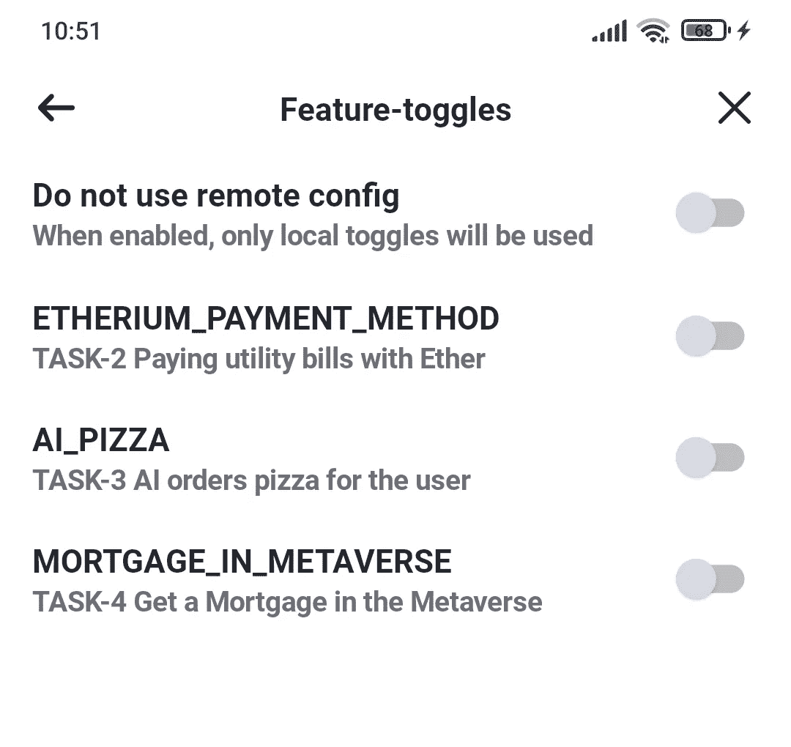
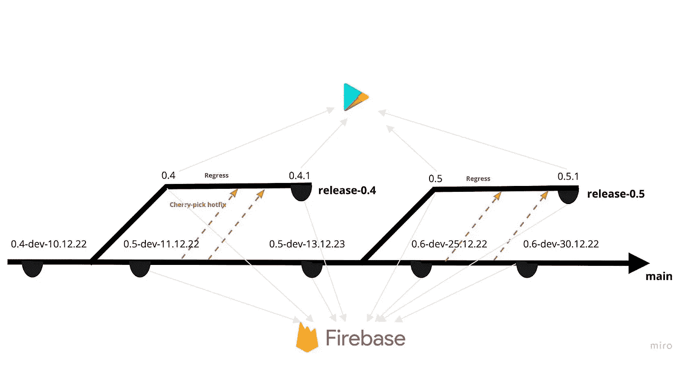

# 移动开发中的持续交付和发布

> 原文：<https://betterprogramming.pub/continuous-delivery-and-releases-in-mobile-development-7bfc8e8f6aa1>

## 这一有用功能的深入指南


图片由[马库斯·温克勒](https://unsplash.com/@markuswinkler)在 Unsplash 上拍摄

由于移动社区的努力，现在有许多关于如何编写代码或移动操作系统如何工作的信息来源。学习如何在团队中构建交付过程，以及如何将其与开发过程联系起来的来源要少得多。这本身也很重要。透明度和对发布和交付过程的共同理解积极地影响团队的效率，并且它帮助每个人更好地计划活动。

在移动开发人员的生活中，可能有一天，除了屏幕布局和网络之外，还有构建发布流程、基础设施和持续交付(CI / CD)的工作。当我第一次得到发布工程师的职位时，我不知道该怎么做。我不清楚如何使用应用程序版本控制，以及它与发布周期的关系。通常，交付问题由团队中的个人处理，而大多数人编写代码。

在本文中，我试图总结我在移动应用程序交付流程方面的知识，并分享一些实用的建议。

其中大部分与原生 Android 开发相关，但主要信息与开发任何语言和平台的移动应用程序相关。

这篇文章可能对那些第一次接触 CI/CD 项目的人有用；对于那些开始一个新项目并打算把它放到“发布列车”上的人来说也是如此

下面描述的一切都来自作者和他的同事的个人经历。本文中的任何示例和建议都不是参考，可能不适合您或您的团队。不过下面描述的都是在知名产品公司实践的。

大多数 Android 开发者都听说过 versionCode 和 versionName(对于 iOS —版本和内部版本)。他们中的一些人记得他们的不同之处，只有一部分人知道何时以及用什么规则来改变他们。让我们弄清楚。

如你所知，任何软件产品都有一个版本。今天实行的是所谓的[语义版本化](https://semver.org)。您一定见过格式为`Major.Minor.Patch`的版本名称。考虑一下经典描述中每个数字的含义(对于后端开发来说更是如此)。

*   `Major`。进行向后不兼容的 API 更改时递增。
*   `Minor`。当向后兼容的 API 发生变化时递增。
*   `Patch`。随着错误修复的涌入而增加。

一般来说，移动应用程序并不是为提供 API 而设计的，而是经常依赖于一些底层 API。在这种情况下，应用程序的发布周期可以与产品的整个发布周期联系在一起。

但是，应用程序可能不依赖于第三方 API。或者团队的产品可以是一个库。那么下面的方法是有效的:

*   `Major`。当应用程序在更新后对用户来说变得全新时(由于操作逻辑和界面的重大变化)，该值会增加。对于一个库，当进行向后不兼容的更改，强制重写使用该库的代码时，它会递增。
*   `Minor`。当添加有条件地不取消而是补充现有功能的更改时，它会增加。对于库来说，考虑到向后兼容性，它随着改进而增加。
*   `Patch`。随着错误修复的涌入而增加。

修补程序与主要版本和次要版本之间的一个重要区别是，修补程序版本的增加是没有计划的。它们在`Major.Minor.0`释放后被释放。换句话说，补丁是在发布分支中拾取的，而不是在主分支中(我们将在下面讨论分支)。

# Android 中的功能

Android Gradle 插件允许它通过`versionCode` (int)和`versionName` (string)进行版本控制。

需要`VersionName`以便用户/测试人员可以区分应用程序的版本；`versionCode` —以便操作系统和 Google Play 区分应用程序的构建版本。每个新版本都必须包含高于前一版本的 versionCode。这将允许 Google Play 提供更新的版本，并且系统将阻止(或警告)安装旧版本而不是新版本。

在一般情况下，这些参数之间没有关系—您可以根据需要增加第一个参数，并填充第二个参数。

我喜欢下面的公式，它允许我不去纠结参数和`versionCode`值之间的关系(当除了主 git 分支之外还有发布分支时，困难就开始了)。为避免`versionCode`碰撞而引入的允许值的限制:`minor`和`patch` — `[0, 99]`值。下面是来自 app-module 目录中`build.gradle.kts`的脚本片段:

```
/* Valid values are major - [0,21000); minor and patch - [0, 99) */val major = 3 
val minor = 7 
val patch = 0defaultConfig { 
    versionCode = major * 10000 + minor * 100 + patch 
    versionName = "${major}.${minor}.${patch}" 
}
```

# 发布周期和分支模型

为了理解将代码呈现给用户所需的动作序列，开发人员首先需要理解团队中使用的是哪种分支模型。分支模型回答了“做什么和什么时候做”的问题何时何地采取工作分支，何时创建合并请求，如何制作修补程序，以及为哪些分支配置 CD(连续交付)过程。

分支模型和团队中的发布过程之间有直接的关系。上面列出的行动通常不是在编码真空中完成的，而是在团队的合作下和已知的期限内完成的。

今天最著名的模型是 Gitflow、Feature Branch Workflow 和基于主干的开发。在一个简化的版本中考虑它们的差异(省略了使用发布分支的时刻)。

Gitflow —暗示一个主分支和开发分支+长期特性分支。主分支存储发布的历史，而开发分支集成了新的特性。发布分支从开发中分支出来，并在发布结束时合并到一个主版本中。

特性分支工作流——意味着一个稳定的分支+多个开发人员可以工作的长期特性分支。一旦特性分支准备好了，它就被合并到稳定分支中。测试人员处理来自特性分支的构建，允许特性分支被合并到稳定的。释放分枝从稳定的分枝上分出。
这种相同的方法通常被称为 GitHub 流，这导致了与上述 Gitflow 的混淆。

基于主干的开发——意味着存在一个稳定的分支(主干)+短命的特性分支，通常由一个开发人员开发，包含原子变更。测试人员不影响特性分支的流入，并且只与主干构建一起工作。

`Feature-toggle` —是隐藏未发布功能的应用程序配置的标志(以最简单的布尔形式)。它们可以被硬编码，存储在设备的内存中，或者从云端传入。通常，在内部调试版本中，会添加一个技术屏幕，您可以在其中启用功能切换。



功能-切换控制屏幕示例

一个团队可以在任何分支模型中使用特性切换，但是只有在后者中它才是强制性的，因为主干分支包含应该隐藏的未完成的特性代码。

我发现基于主干的开发是最适合移动开发的方法。这种方法与其他方法相比有两个显著的优点:它像凳子一样简单。在任何情况下，您只需要遵循一个规则——主干分支应该总是拥有最新的代码(所有的修复首先被合并到主干中)。由于特征分支的寿命很短，当特征分支被合并到主干中时，长的合并冲突几乎被遗忘。

但是所列出的优点也带来了缺点，比如对注入代码的质量和安全性的要求增加了，因为注入的“破坏性”变更会降低每个人的工作速度。您还需要为实现和使用特性切换分配资源，尤其是在旅程的开始。

# 发布周期的阶段和发布工程师的工作

正如我在开头所写的，开发人员第一次处理发布工程师的任务时，可能会感到困惑。

好消息是你不需要任何关于发布工程的特殊知识——能够使用 git 就足够了。坏消息是，当一个阶段过渡到另一个阶段时，您需要监视和管理(一般开发人员通常不会这样做)。

在不同的团队中，工程师的发布阶段和职责是不同的。它们可以在某些地方混在一起，并行进行，或者完全错过，但我试图概括一下。

*   规划
    这里一切都很清楚。在做之前，团队需要明白要做什么。我会在这个阶段写分析和研究文档，以及准备设计和下一阶段之前的一切。
*   开发+测试
    包含在一个阶段中，因为测试可以与开发并行进行。
*   功能冻结和启用功能切换
    停止开发新功能。发布工程师检查发布分支，包括已发布的条件就绪测试功能的特性切换。通过 CD(连续交付)工具，发布候选被组装并向测试人员展示。
*   回归和错误修复
    所有在发布中可能受到影响的功能都在测试中。如果发现错误，开发人员会修复错误，但不会添加新功能。带有错误修正的合并请求首先被合并到主干中，然后才被精选到发布分支中(规则是“主干中的代码是最新的”)。在每一次修复之后，更新的候选版本被组装起来，并通过 CD(连续交付)工具向测试人员推出。
*   代码冻结和发布部署
    根据回归结果，决定向用户发布哪些功能。对于其余的，发布工程师关闭触发器。面向 beta 测试人员或所有用户的发布版本的组装和部署将立即开始。

# 由开发人员进行发布和版本控制

在下面的图表中，我试图给出一个使用基于主干的开发模型来处理发布分支和版本的通用方案的例子。



基于主干开发中的版本控制选项。

这里我们看到了 Android 开发者熟知的标志——Google Play 和 Firebase。通常，您必须同时使用这两种服务或它们的类似物。首先，如你所知，向用户分发新版本的应用程序，允许你在有限的用户范围内进行 beta 测试。第二个版本(或者更确切地说是 Firebase 应用程序发行版)允许您发布内部测试的中间版本。

Firebase 应用程序发行版中的构建版本尽可能频繁地发布——每个人都希望尽早获得关于新功能的反馈。相反，Google Play 中的程序集，如果您必须紧急修复一个关键错误(热修复),理想情况下会一次或多次发布。

请注意示例中的版本变化。当发布分支被按下时，次要版本被拾取。在发布分支中的每个修复(或一组修复)之后，补丁版本被提取出来。这可能因公司而异，但是这种方法似乎是最符合逻辑的，并且与语义版本化一致。构建是通过构建变体来配置的，构建变体是构建风格和类型的组合。通过它们，您可以根据程序集的用途设置和组合各种常数、程序集规则和签名。你可以在[文档](https://developer.android.com/studio/build/build-variants)中读到更多关于它们的内容。

# 为什么要签署应用程序，需要记住什么？

任何 Android 版本、APK 或应用捆绑包都是数字签名的(即使你在 Android Studio 中点击绿色三角形)，然后使用在你的设备上生成的默认签名密钥。

签名—对于用户来说，这是操作系统安全性不可或缺的一部分。例如，使用它，设备将不允许安装具有相同包名但是具有不同签名的应用程序(没有来自用户的单独许可)。这里我们就不详细披露这个问题了。你也可以阅读[文档](https://developer.android.com/studio/publish/app-signing)。

但是每个人都必须理解安全存储产品构建的签名密钥和密码的重要性。它们不应该由任何人(是的，包括团队领导)在本地存储和生成。最好在云中生成它们，并以加密的形式存储它们；相应地，发布版本只能在云中收集和签名。

# 如何确保不必要的常量和库在汇编时不会进入应用程序？

您必须确保只有需要的东西才能进入程序集。例如，一个好奇的人检查您的生产应用程序的混乱代码，他不需要显示您公司开发站的地址。

因此，在构建过程中，将生成具有正确值的`BACKEND_URL`字符串常量(下面给出了启动构建的脚本)。

这同样适用于图书馆。例如，如果您的应用程序将分布在多个生态系统中，并且不同的构建类型需要不同的依赖项。该示例显示了如何将推送通知库的不同实现“插入”到 Google 和华为的构建中(我建议立即这样做，这样当上面决定发布到新商店时，您就不用重写了)。

那么在构建期间将会“建议”不同的实现。为此，您需要在 build 命令中指定维度:

```
// AAB artifact build starts with dimentions prod and google ./gradlew finuslugi-app:bundleProdGoogleRelease// AAB artifact build starts with dimentions prod and huawei 
./gradlew finuslugi-app:bundleProdHuaweiRelease
```

# 如何区分频繁来到 Firebase 进行内部测试的构建？

对于 Firebase 中的构建，你可以做一个合成`versionName`来区分频繁的构建。在示例中，添加了`-dev-`和构建日期。

您还可以在 Firebase 中为构建附加一个 changelog。通常，这是对最近合并的 MRs 的描述，并且它基于标签(git-tags)。下面我附上一个更简单的选项，用于收集过去一天输注 MRs 的列表(可定制)。在实践中，这对测试人员导航构建来说已经足够了。

```
git log --pretty=format:"%an : %s" --since="1 day ago" --no-merges >> release-notes.txt || true
```

# 从第一天开始不要太懒做什么比较好？

从一开始，我就建议在 Firebase 中为构建制作一个不同的`packageName`,这样以后就有可能在同一个设备上安装产品和开发构建。(参见[文档](https://developer.android.com/studio/build/build-variants)中的`applicationIdSuffix`)。

通过为不同的`buildTypes`添加具有不同凭证的不同配置文件，在 Firebase 中为生产和开发构建创建不同的项目也更好。这将允许您在 Firebase 远程配置中分离分析事件、崩溃(Firebase Crashlytics)和切换，而无需额外的拐杖。

对于开发构建，您可以将生成的签名密钥直接存储在项目中——这将确保无论构建源是什么(最初是开发人员的本地机器或 CI ),在测试人员的设备上重新安装应用程序都不会破坏先前安装的保存数据。

# 结论

我希望这篇文章对那些想有意识地参与应用程序交付的人有用——并减轻意识到他们的责任范围已经变得比 IDE 编辑器窗口更宽的尴尬，就像我曾经有过的那样。