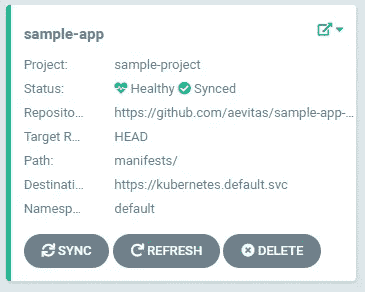
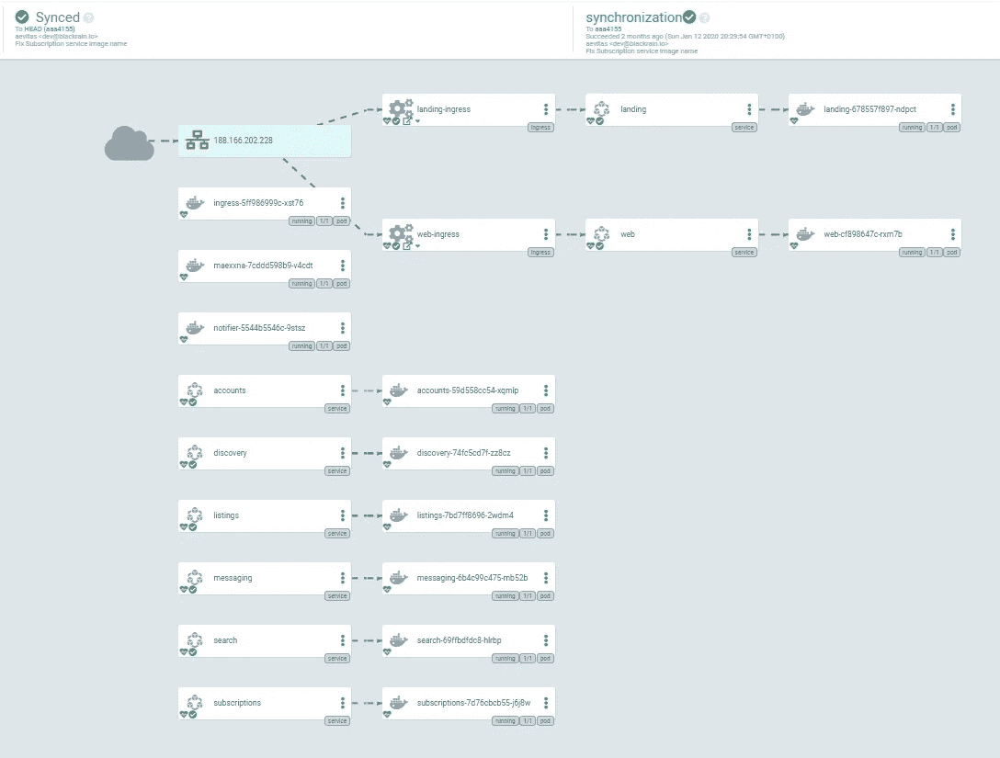
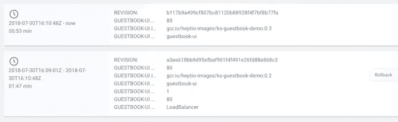

# 通过 GitOps 和 Argo CD 为 Kubernetes 提供持续交付

> 原文：<https://betterprogramming.pub/continuous-delivery-for-kubernetes-with-gitops-and-argocd-589bea494f44>

## 以声明的方式部署和更新您的应用程序，如果事情没有按计划进行，可以选择回滚

杰西·拉米雷斯在 [Unsplash](https://unsplash.com?utm_source=medium&utm_medium=referral) 上的照片

Kubernetes 作为在生产中运行大型容器化工作负载的事实上的标准，正在迅速获得关注。Kubernetes 采用了一种不同于我们习惯的方法来创建和维护应用程序组件。例如，Kubernetes 没有手动配置我们的服务器来处理网络和存储，而是在它的[概念](https://kubernetes.io/docs/concepts/)中抽象它们。

例如，如果我们想在互联网上公开一个应用程序，我们可以通过创建一个服务来实现。然后，该服务可以连接到一个云负载平衡器，它会将外部流量导向我们集群中的一个单元。

所有这些组件都被定义为名为*清单*的 YAML 文件。对于单个应用程序部署，您通常会得到一些清单文件，这些文件描述了您的应用程序应该如何在 Kubernetes 集群中运行。

当您运行一个只有少量部署的小型集群时，这并不是什么大问题。但是，随着集群的增长，描述其部署的清单数量可能会增长到无法控制的程度。我们需要一种好的方法来管理所有这些清单及其历史。

# 声明性 GitOps

这就是我们部署模型的第一个组件出现的地方。我们正在寻找一种模型，在这种模型中，我们可以管理清单并维护它们的历史，这样我们就可以创建一个自然的审计日志。我们可以从 Git 中得到所有这些，额外的好处是大多数开发人员已经熟悉了它作为他们源代码的版本控制系统。

GitOps 是 Kubernetes 应用程序管理和交付的一种方式。所有清单都存储在一个 Git 存储库中，该存储库被视为集群状态的唯一来源。如果更新了应用程序的组件，或者创建了一个新的组件，开发人员只需提交一个包含所需清单的 pull 请求，获得审查，一旦合并，它就可以在几分钟内自动部署到集群。

使用 GitOps 模型的好处之一是我们可以有效地在 Git 版本之间来回滚动。因为每一个版本本质上都代表了集群在那个时间点的状态，如果情况变得糟糕，简单地恢复到旧的提交就成为了一个可行的选择。众所周知，他们迟早都会这么做。

这种交付模式对于开发人员来说尤其适用，因为运行他们代码的基础设施就在存储库中。每一次部署、服务、数量等。就在那里。最重要的是，处理部署的实际系统是不可知的。你可以自由选择任何你喜欢的系统，从`kubectl`到更高级的 [Argo CD](https://argoproj.github.io/argo-cd/) 我们将在下一节中讨论。

# 使用 Argo CD 的连续传送

Argo CD 是 Argo 项目的一部分，该项目由 Intuit 发起，包含各种项目，使每个人都可以更容易地在 Kubernetes 上交付、运输和维护云原生应用程序。

在前一节中，我们描述了如何使用 Git 来定义我们的工作负载和应用程序。在本节中，我们将介绍如何使用 Argo CD 来获取这些定义并将其部署到 Kubernetes。

让我们从 Argo CD 的基本架构开始:

[Argo 光盘架构](https://argoproj.github.io/argo-cd/)

从开发人员的角度来看，每当他们想要部署或更新 Kubernetes 工作负载时，他们首先提交一个包含所有必要的基础设施变更的 pull 请求。这可以是简单的映像版本升级，也可以是全新应用程序及其所有必需组件的部署。

Argo CD 作为 Kubernetes 控制器存在，并持续监视集群上运行的应用程序。它将它们与 Git 存储库中定义的状态进行比较。如果它检测到一个偏差，它会将一个应用程序标记为`OutOfSync`——表明集群当前没有反映存储库的`master`分支。

## 同步

同步是部署应用程序的主要机制。每当应用程序通过 Argo CD 的 web 界面或命令行进行同步时，Git 存储库中最新版本的清单将被部署到集群，并且部署将被标记为`Synced`:

Argo 光盘中的同步应用程序

它还集成了 Kubernetes 的健康检查，并方便地显示应用程序所有组件的健康状况。

当您更深入地研究应用程序时，您可以看到该应用程序所有单个组件的运行状况和状态。这包括所有对象，如服务、窗格和入口。它们方便地显示在树状视图中:

Argo 光盘的应用现状及综述

每个部署都包括其各自的 Git 树、提交和作者。

## 历史和回滚

在部署导致意外副作用的情况下，使用 Argo CD 内置的历史和回滚功能回滚到以前的版本是很简单的:

这不仅大大提高了应用程序的稳定性，也提高了开发人员的工作效率。如果有任何错误设法通过测试，将整个部署回滚到以前的版本是微不足道的，任何人都可以完成，不仅仅是开发人员。这使得开发人员可以更快地完成工作，因为他们知道有一个安全网可以利用，如果他们需要的话。

虽然这个部署模型中的繁重工作主要是由 Git 完成的，但是 Argo CD 提供了一些非常强大的工具，可以使用 Git 存储库作为可部署工件的来源。

这消除了在给定时间点集群上实际运行的模糊性。由于 Argo CD 中的每个操作都是可追踪的，并且每个操作都可以追溯到 Git 提交，所以要弄清楚特定时间点上给定应用程序运行的是什么版本是相对简单的。

以上只是对 Argo CD 能做什么的简单介绍。一旦你深入到它对 Helm charts 和 Kubernetes 的其他包管理器的支持，可能性是巨大的。如果你感兴趣，我在结论中链接了一些资源。

# 结论

在本文中，我们介绍了使用 GitOps 和 Argo CD 作为一种可靠地将应用程序部署到 Kubernetes 的方法，并探讨了这种方法所提供的各种特性和好处。就个人而言，我认为 GitOps 为 Kubernetes 集群管理问题提供了一个非常强大的解决方案，它显式、可靠且易于审计。

虽然我们只探索了使用简单的 Kubernetes 清单来定义应用程序，但 Argo CD 支持许多其他方式来定义您的应用程序，包括:

*   [Kustomize](https://kustomize.io/) 应用程序
*   [舵图表](https://helm.sh/)
*   [Ksonnet](https://ksonnet.io/) 应用
*   Jsonnet 应用程序

如果您认为 Argo CD 可能适合您，请务必[查看文档页面](https://argoproj.github.io/argo-cd/)了解如何将其部署到您的集群的说明。它很容易上手，并且只需要最少的资源。

感谢您的阅读！