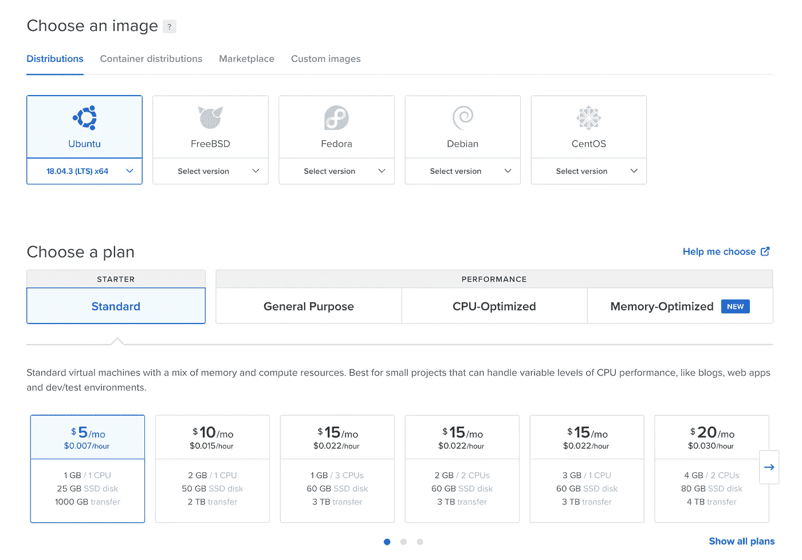

# 为 Node.js 应用程序设置连续交付

> 原文：<https://betterprogramming.pub/continuous-delivery-for-node-js-application-72dec43bf6bd>

## Node.js 应用程序自动部署初学者指南


照片由[克里斯蒂娜@ wocintechchat.com](https://unsplash.com/@wocintechchat?utm_source=unsplash&utm_medium=referral&utm_content=creditCopyText)在 [Unsplash](https://unsplash.com/s/photos/server?utm_source=unsplash&utm_medium=referral&utm_content=creditCopyText) 上拍摄

使用的技术:

*   GitLab CI
*   接收后 git 挂钩
*   pm2
*   数字海洋水滴

嘿大家好！

我正在和一个朋友一起做一个小型创业项目。这是一个德国的科技求职平台，名为 [clusterjobs.de](https://clusterjobs.de) 。最近我有一个想法，优化一些资源，找到比 Heroku 更便宜的东西。Heroku 非常昂贵——一个 web 应用程序的两台机器，每台 512mb RAM，每月 50 美元。

在最近的 [Hacktoberfest](http://hacktoberfest.digitalocean.com/) (我真的很喜欢，只能建议你明年参加)之后，我注意到了数字海洋，发现他们以每月 15 美元的价格提供 1 个 CPU 和 3gb RAM 服务器。

另外，我发现作为一名 Hacktoberfest 的参与者，我在那里得到了 100 美元的欢迎费！

警告是 Heroku 集成并启用了所有的工具，只需点击几下就可以完成一张 CD，一切都神奇地工作着。另一方面，在数字海洋营地，你需要自己设置所有的东西，但你支付的要少得多。

这听起来像是一个有趣且有益的挑战，所以，在几天无所事事的圣诞节后，我决定回去工作并做好准备。

# 逐步指南

这里是我的进展，一步一步，以及我使用的其他文章的参考和一些有用的快捷方式。

首先，去数字海洋创建一个新账户。谷歌`digital ocean promo registration`，获得一些推广链接和一些启动资金。

然后创建一个你想要的任何大小的新液滴。只是为了警告你:你不能将 60GB 固态硬盘的 droplet 大小调整到 25GB 它只能单向工作。让我们从最小的，5 美元的水滴开始:



最基本和最便宜的液滴

我从本教程中采取的所有第一步。

在这里，Justin 重点关注使用 Codeship 在数字海洋上的持续部署。我专注于在没有额外第三方服务的情况下使用 git lab CI——所以只有`gitlab`作为回购、`git hook`在服务器端、`pm2`让应用程序一直保持运行。

# 创建用户并设置 SSH 和 Sudo 权限

首先，我们需要创建一个单独的用户，这样就不会搞乱`root`。

只需以 root 用户身份登录并创建一个用户:

创建一个新用户，并赋予它 sudo 权限

让我们授予新用户通过 SSH 连接的权限，并在那里部署我们的 SSH 密钥。在服务器上打开 ssh 配置:

```
nano /etc/ssh/sshd_config
```

设置这些值:

在 sshd_config 中设置这些值

不要忘记重新启动 ssh 服务，这样更改就会生效:

```
sudo service ssh restart
```

在您的机器上创建 SSH 密钥:

```
ssh-keygen -t rsa -C “your_email@example.com”
```

[这里](https://docs.gitlab.com/ee/ssh/)是 GitLab 的一篇关于 ssh 密钥的好文章，如果你想更深入地了解这个主题，可以去看看。

在 droplet 上，您需要创建 SSH 目录:

```
cd ~ && mkdir .ssh && touch .ssh/authorized_keys
```

然后，从您创建了密钥的计算机上，运行以下命令来复制密钥:

```
cat ~/.ssh/id_rsa.pub | ssh deploy@DROPLET_IP_ADDRESS “cat > ~/.ssh/authorized_keys && chmod 600 ~/.ssh/authorized_keys”
```

现在最后一个提示(让连接更快)。您可以创建终端别名来避免记住 IP 地址。

对于 macOS，我使用了这个:

```
nano ~/.zshrcalias ssh_droplet=’ssh deploy@DEPLOY_IP_ADDRESS’
```

打开一个新的终端，alias 命令将在那里可用。

# 设置 Droplet

所以我们终于来到了水滴设置。首先，我们需要安装所需的节点版本。我的应用当时需要 13.6.0 版本，但你可以通过同样的步骤获得你想要的任何版本。

安装所需版本的节点

# pm2 配置

主要目标是能够在 droplet 上自动部署和更新应用程序。

为了实现这一点，我们使用 GitLab CI 并在一个单独的裸存储库中接收 git hook。

此外，我们将使用一个名为`[pm2](https://pm2.keymetrics.io/)`的包，以便能够在部署期间运行我们的应用程序而不停机。

这个神奇的应用程序让我们可以运行一个应用程序的几个实例，并在我们需要的时候切换它们，而不会停机。

在应用程序的根文件夹中创建`ecosystem.config.js`:

pm2 的配置文件

它包含一些选项:

*   `name` —只是一个显示在仪表板上的名称。
*   `exec_mode` —对 node.js 使用`cluster`，这里的是对此的解释。
*   `instances` —要运行的实例数量——您可以在这里放置`max`或任何整数。
*   `script` —您的应用程序启动文件。
*   `autorestart` —如果为 false `pm2`将不会重启崩溃的应用程序。
*   `max_memory_restart` —如果超出 RAM 限制，应用程序将重新启动。

# nuxt.js pm2 配置

正如在 [clusterjobs.de](https://clusterjobs.de) 中一样，我们使用 nuxt，并且对该配置进行了一些添加。以下是我使用的配置:

nuxt 应用程序的配置文件

如你所见，`script`指向的是 nuxt 可执行文件(2.10.1 版本)。
此外，值得一提的是，在之后的`git-hook`中，我使用了
`yarn build`，因此该应用程序建立在每个主推送之上。这里`args`被设置为`start`，所以我有点像在`pm2 start`上做`nuxt start`。

# 创建 git-hook

看起来我们已经完成了`pm2`配置——让我们开始创建一个接收后 git 挂钩。让我们创建裸回购:

创建一个裸回购和一些基本的设置

现在你可以只放入接收后钩子代码或者放入一个回购来跟踪它。

我创建了新的回购协议，并在那里放了一个文件，内容如下:

Git 接收后挂钩

让我们仔细看看这里发生了什么。我们使用以下代码检查主分支上何时发生推送:

检查我们是否只在主推上做事情

这里我们来看看新的分支:

```
git --work-tree=$TARGET --git-dir=$GIT_DIR checkout -f $BRANCH
```

然后我们转到带有`server`的文件夹:

```
cd /home/deploy/server
```

如果有新的东西，我们就安装`yarn`依赖项:

```
yarn install
```

从新的源重新启动`pm2`实例:

```
pm2 restart all
```

此外，我们希望使文件可执行—否则，在提交到我们的回购之后，它将无法工作:

```
chmod +x hooks/post-receive
```

最后，我克隆了 repo，并将文件从它链接到负责钩子处理的裸 repo。

```
ln -s ~/server-configurations/server-hook ~/git-hook/hooks/post-receive
```

要完成服务器，请转到您的应用程序所在的服务器文件夹，并安装所有依赖项。然后运行`pm2 start all`来启动我们的实例。

# 尝试第一次钩子执行

让我们试着从本地机器中推出一些更改。接下来的命令将添加我们的 bare `git-repo`作为远程存储库——然后您只需按下 commit:

```
git remote add production deploy@YOU_DIGITAL_OCEAN_IP:git-hook
git push -f production HEAD:master
```

您将看到类似这样的内容:

```
➜ node_server git:(dev) ✗ git push -f production HEAD:master
Enumerating objects: 5, done.
Counting objects: 100% (5/5), done.
Delta compression using up to 12 threads
Compressing objects: 100% (3/3), done.
Writing objects: 100% (3/3), 307 bytes | 307.00 KiB/s, done.
Total 3 (delta 2), reused 0 (delta 0)
remote: Ref refs/heads/master received. Deploying master branch to production…
remote: Already on ‘master’
remote: yarn install v1.21.1
remote: [1/5] Validating package.json…
remote: [2/5] Resolving packages…
remote: success Already up-to-date.
remote: Done in 0.84s.
remote: [PM2] Applying action restartProcessId on app [all](ids:[0])
remote: [PM2] [nodejs server](0) ✓
┌────┬───────────────┬──────────┬───┬────────┬─────┬────────┬
│ id │ name          │ mode     │ ↺ │ status │ cpu │ memory │
├────┼───────────────┼──────────┼───┼────────┼─────┼────────┼
│ 0  │nodejs server  │ cluster  │ 2 │ online │ 0%  │ 29.8mb │
└────┴───────────────┴──────────┴───┴────────┴─────┴────────┴
To YOU_DIGITAL_OCEAN_IP:git-hook
421f902..1a6218b HEAD -> master
```

这意味着你已经做到了！

您已经成功地创建了一个远程 git repo，它接收推送并使用新代码重新加载应用程序，没有任何停机时间！

我们就快到了，我们只需要设置 GitLab 来自动发送任何主更新的更改。

# 在 GitLab CI 上设置 CD

我们现在可以发布我们的更改，我们的应用程序会自动重新加载。到时候主分支更新的时候让 GitLab 帮我们做吧！

这里有一个我在 [clusterjobs.de](https://clusterjobs.de) 使用的`gitlab-ci.yml`:

gitlab-ci.yml 将部署在数字海洋水滴上

让我们从头开始。我使用 alpine docker 图像，因为它小得多，可以更快地运行管道(当我改用它时，我看到速度提高了 30–40%)。

关于 alpine 的唯一警告是，你需要记住使用`apk`和`apk add`而不是`apt-get`和`apt-get install`。

浏览我们正在安装的脚本`ssh-agent`——需要添加私钥，在本地机器上预先生成，然后从 CD 管道中使用。

然后，我们实际上从变量`DIGITAL_OCEAN_PRIVATE`设置私有 SSH 密钥，并创建`.ssh`文件夹，使其可读。

在 SSH 连接之前，需要此步骤来禁用主机检查:

```
‘[[ -f /.dockerenv ]] && echo -e “Host *\n\tStrictHostKeyChecking no\n\n” > ~/.ssh/config’
```

您可以避免使用它，尝试下面的方法，其中`$SSH_KNOWN_HOSTS`是您所请求的:

```
- echo “$SSH_KNOWN_HOSTS” > ~/.ssh/known_hosts
- chmod 644 ~/.ssh/known_hosts
```

在我的情况下，这不起作用，这就是为什么我禁用它。

之后，我们只需添加 repo、git 用户的配置并进行推送。

为了让它工作，我们需要为 GitLab 容器创建一个额外的 SSH 密钥，将公钥添加到服务器，并将私钥添加到 CD 过程中可用的 GitLab 变量。

在我们开始之前，这里有一个来自 GitLab 本身的关于如何在 GitLab CI 中使用 SSH 的非常好的教程。

## 为 GitLab CD 创建 SSH 密钥

在单独的文件夹中创建一个新密钥，这样就不会覆盖您自己的密钥。为此，您需要定义一个不同的密钥位置:

```
➜ .ssh ssh-keygen
Generating public/private rsa key pair.
Enter file in which to save the key (/Users/user/.ssh/id_rsa): /Users/user/.ssh/do_node/id_rsa
```

然后你需要复制一个公钥到你的数字海洋水滴。你可以这样做:

```
cat ~/.ssh/do_node/id_rsa.pub | ssh deploy@YOUR_DROPLET_IP “cat > ~/.ssh/authorized_keys && chmod 600 ~/.ssh/authorized_keys”
```

然后复制私钥，放入名为`DIGITAL_OCEAN_PRIVATE`的 GitLab 变量中。

您可以像这样获得密钥:

```
cat ~/.ssh/do_node/id_rsa
```

现在我们准备推送我们的`.gitlab-ci.yml`文件。

现在，如果您打开 GitLab 管道作业，您将看到与您在本地机器上看到的类似的响应。

# 最后的话

我希望一切都为你解决了，如果是这样，你只是用你的工程技能和笔记本电脑创建了一个自动部署管道！

如果您有任何改进、建议或问题，请随时在这里留下评论，感谢您的阅读！