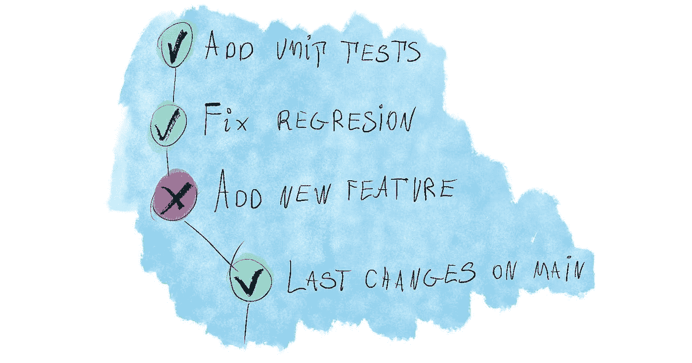
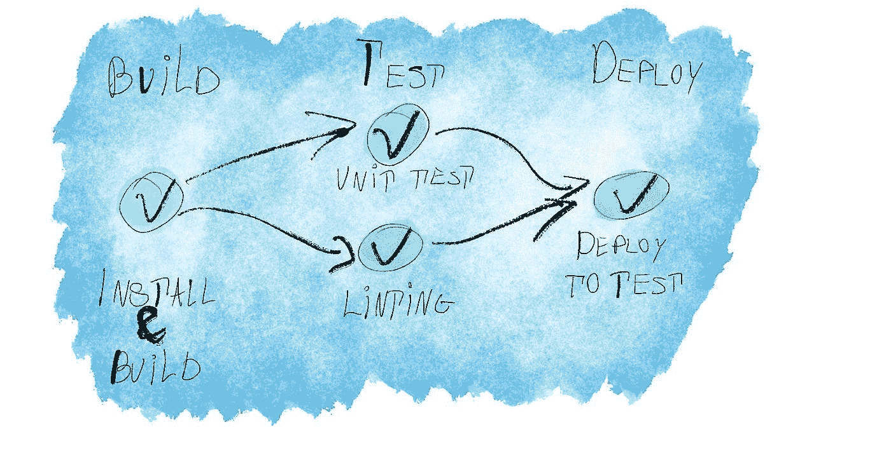
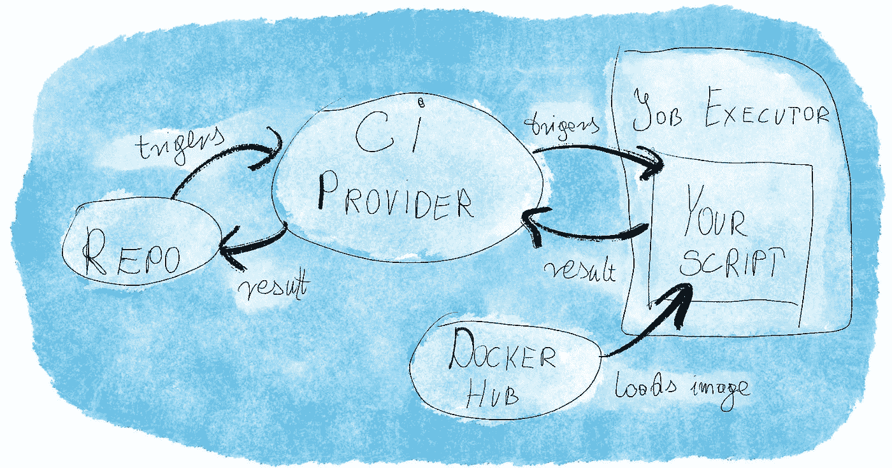

# 持续集成(CI)及其对您的帮助

> 原文：<https://betterprogramming.pub/continuous-integration-ci-and-how-it-can-help-you-ad53ce42618f>

## CI 到底是什么？

持续集成(CI)是一个过程，通过这个过程，我们在代码库中发生每一个变化时都验证我们的项目。整合到底是什么？这取决于您如何配置该过程:它可以像安装依赖项和编译项目一样简单，也可以像运行许多不同的脚本来确定代码库是否处于可接受的状态一样复杂。

# 勤奋的同事

你可以把 CI 想象成一个勤勤恳恳的同事，他总是在那里，等着在将你的变更合并到主分支之前仔细检查它们。当 CI 就位时，在您的工作流中包含合并请求是一个好主意，即使您单独处理项目。你的改变将由机器*审查*，将它们留在一个单独的分支上允许你在合并到主分支之前修复任何问题。

没有 CI，每个开发人员都要负责验证他们自己的所有变更。当然，有时有人会忘记——也许最初的提交是没问题的，但是如果在重定基础或合并之后出现了问题呢？没有 CI，你让你最不细心的同事推着推着，忘记了他们的改变，其他人被迫在他们之后收拾残局。

# 竞争情报是如何构建的

持续集成检查您的提交。对于每一次代码更改，CI 通常会按照定义的顺序运行一些不同的任务。您可以将一个作业的输出作为另一个作业的输入；例如，您可以一步构建一个应用程序，然后使用生成的包进行测试。通常，您使用存储库中的配置文件来管理 CI——因此，您的 CI 可以与您的代码库一起发展。

如果所有的任务都通过了，那么提交就是*通过*；如果其中任何一个失败，那么提交就是*失败*。在理想情况下，提交内容单独决定 CI 结果:它不依赖于外部服务，并且没有任何随机因素会导致它失败。

对于每个分支，CI 显示了最顶层提交的结果。主枝应该几乎总是通过；它的任何问题都会影响到团队中的每个人，所以如果出现一些倒退，修复它应该是优先考虑的事情。对于一个功能分支，您应该仅在它通过 CI 时合并它。

# 您可以委托给您的配置项的任务

您可以在 CI 上设置在本地环境中运行的任何脚本。在大型项目中，这个列表可能会很长，但是让我们来看看在任何规模的项目中，您可以预期的 CI 任务。

# 建筑物

你可以对你的代码库进行最基本的检查:它能编译吗？这一步将捕捉任何已安装但未保存的依赖项，任何潜入提交的 typescript 类型不匹配。当开发人员在执行任务时，这些都是简单的修复方法，但是如果与他人分享，这些错误会变得令人困惑或讨厌。

# 静态分析

静态分析包括在不运行代码的情况下检查代码。在前端项目中，您经常可以看到这样的工具:

这些程序在与代码编辑器集成时最有帮助。在配置项上运行它们是一种额外的检查，可以从两个方面帮助您:

*   它将识别任何忘记在本地运行它们的开发人员——这样他们就可以在弄乱大量代码之前被要求这么做
*   它将识别不同开发环境之间可能出现的任何版本或配置不匹配

# 运行测试

如果您非常重视应用程序中的自动化测试，那么拥有一个配置项并在其上运行测试是必不可少的。自动化测试的全部意义在于经常运行它们——当一些代码变更即将公开时，还有比这更好的时机吗？如果不这样做，就会导致以下情况:

*   一名开发人员将回归引入代码库
*   其他人在上面添加不相关的变化
*   有人最终运行了捕捉原始回归的测试
*   他们浪费时间来排除不是他们造成的问题，这些问题与他们可能没有意识到的变化有关

在这种情况下，主要问题是当您进行故障诊断时，您甚至不知道问题是何时出现的；可能是上一次作案，或者是一周前。您可以通过`git blame`或`git bisect`来摆脱它，但是简单地知道测试停止工作的点更容易。

让我强调另一件事:编写测试是对质量保证的投资。这是日复一日的努力。如果您正在投入这种日常工作，那么花时间设置 CI 以从您开发的测试中获得最大收益是有意义的，哪怕只有一次。

# 部署

您经常会将 CI 与连续部署(CD)放在一起，缩写为 CI/CD。这是因为当您编译和验证代码时，您已经为部署做好了一切准备——至少是部署到测试服务器上。一个真正的 CD 会要求你交付到产品中，但是这可能更具挑战性，特别是当它将项目的用户暴露在潜在的倒退中。

# 下降趋势

CI 的缺点是什么？

# 复杂的设置

设置可能很耗时，尤其是如果你以前从未做过。即使是最简单的配置更改也可能需要相当长的时间来验证，因为您需要在您无法直接访问的外部服务器上运行它。

# 对外部供应商的依赖

如果您将配置项集成到您的工作流中，您将依赖于您的配置项提供商。如果他们倒下了，你就不能融合——至少不能与你所习惯的所有安全网融合。这可能会令人沮丧，尤其是如果它经常发生。

# 费用

许多 CI 供应商有一个免费的计划，对于简单的练习或演示项目来说应该绰绰有余。对于一个人们全职工作的项目，几乎可以肯定的是，你需要一个付费的计划，外加额外的时间让 CI 机器运行你的脚本。即使您假设 CI 每天只为团队中的每个开发人员节省几分钟时间，成本也可能是值得的。

# 你呢？

您是否有兴趣了解有关设置 CI 的更多信息？我正在考虑写一些关于 CI 工具设置的更详细的帖子。通过了解您最感兴趣的工具，我可以创建符合您期望的内容。所以，请在下面的[投票中投票吧！你的意见对我很重要。谢谢！](https://strawpoll.com/co8pv72pr)

# 下一步是什么？

为了从您的 CI 中获得更多价值，您对它运行端到端测试(E2E)。在 CI 上设置 E2E 是一个挑战，我将在另一篇文章中介绍它。同时，你可以看看如何从 E2E 开始[。](https://how-to.dev/how-to-add-end-to-end-tests-to-a-project)

*最初发布于*[*https://how-to . dev*](https://how-to.dev/continuous-integration-ci-and-how-it-can-help-you)*。*