# 与 GitHub 动作的持续集成

> 原文：<https://betterprogramming.pub/continuous-integration-with-github-actions-fccc5a339b75>

## 实现三个不同的工作流来测试、修改版本和发布新版本

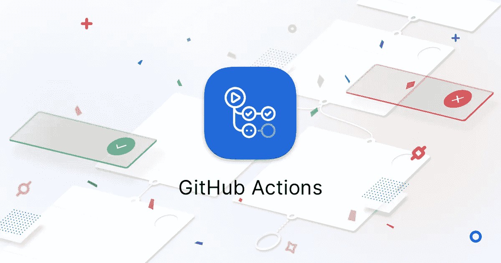

图片鸣谢: [GitHub 博客 2019 年 10 月 3 日](https://github.blog/2019-10-03-github-actions-adds-policy-controls-for-organization-and-repository-owners/)

# 介绍

如果您有一个 GitHub 存储库，您可能会看到一个名为 Actions:

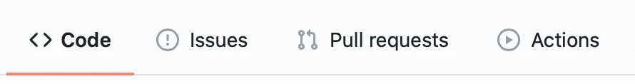

这个选项卡允许您将一个[工作流](https://docs.github.com/en/actions/configuring-and-managing-workflows/configuring-a-workflow)添加到您的存储库中，也就是说，一个在某些事件上运行的自动化过程，以在 GitHub 上构建、测试、打包、发布或部署任何项目。为了帮助你做到这一点，GitHub 引入了所谓的 [GitHub 动作](https://docs.github.com/en/actions/getting-started-with-github-actions/about-github-actions)。这些是存储在 GitHub 存储库中的任务或工具，它们执行一个动作。例如， [actions](https://github.com/actions) / [checkout](https://github.com/actions/checkout) 将为您执行一个 git checkout 命令。在 [GitHub Marketplace](https://github.com/marketplace) 中有很多动作。

在本教程中，我将解释我所采取的自动化开源框架开发生命周期的过程。尽管工作流中使用的一些操作可能与这个库的平台 iOS 相关，但我们将重点关注一般概念，以帮助您理解关键思想。

在接下来的部分中，我们将致力于三个不同的工作流程:

*   对包进行单元测试，并报告代码覆盖率
*   删除版本并创建标签
*   发布新版本并部署/分发它

# 单元测试和代码覆盖率

## 工作流程要点

首先，转到存储库中的标签操作，您应该会看到类似这样的内容:

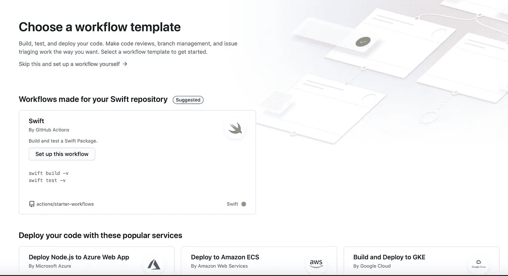

GitHub 会推荐一些模板给你使用。根据存储库的主要语言，建议可能会有所不同。如果你看到任何符合你的目的，继续点击它添加它。就我而言，我将点击“自己设置工作流”这产生了一些样板文件。让我们来看看:

让我们解释一下这里发生了什么:

1.  工作流标有名称。一旦我们设置了一对，这是很有用的，因为它将帮助我们识别哪个正在运行
2.  工作流由事件触发。这些事件可能是“推至主控”、“拉”请求、新标签、新版本的发布等等。参见[所有支持的事件](https://docs.github.com/en/actions/reference/events-that-trigger-workflows)。
3.  工作流由作业组成。这些是触发工作流后将发生的操作。作业被标记(在这种情况下，我们唯一的作业被标记为`build`)并定义运行的环境:Windows、macOS、Ubuntu，(参见[所有虚拟环境](https://docs.github.com/en/actions/reference/virtual-environments-for-github-hosted-runners))。这一点很重要，因为有些操作是为在特定环境中运行而设计的。最后，工作被分解成`steps`。这些步骤按顺序运行，与并行运行的作业相反，除非明确定义为按顺序运行。

## 创建您的第一个工作流程

既然我们理解了要点，让我们定义我们的第一个工作流程。我想在被合并到 master 并生成代码覆盖报告的分支上运行测试。因此，这个工作流将在对 master 的 pull 请求上被触发，并且需要检查分支并运行测试。幸运的是，有两个 GitHub 动作可以帮助我完成这个任务:actions/checkout 和 maxep/spm-lcov-action。这是我的工作流程的样子:

我的任务`run_tests`需要在`macos-latest`上运行，因为在接下来的步骤中它需要`swift`的命令。它将首先检查分支，运行测试，最后生成一个报告。对于这最后一步，我使用开源动作(没错，动作可以由个人开发和维护，与第三方库相同)。

**注意:**为了有效地应用工作流，您需要提交。工作流存储在存储库根目录下的`./github/workflows`中。

现在，当我创建一个新的拉式请求时，我的工作流被触发，并生成一个报告:

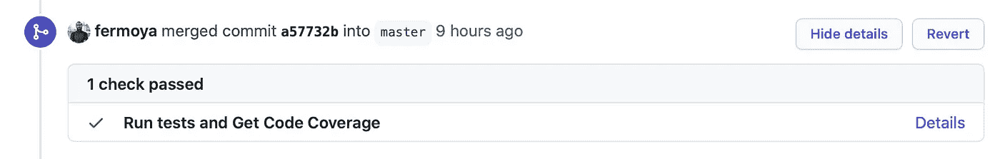

新的提取请求

如果您点击“详细信息”,将会转到“操作”选项卡:

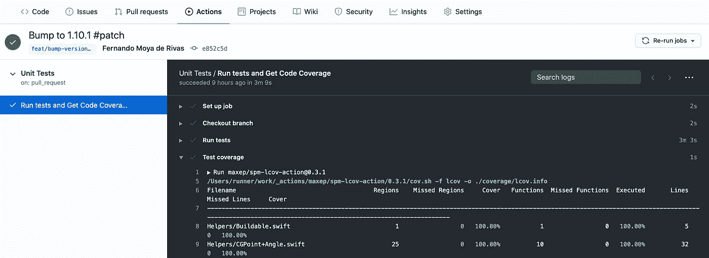

查看工作流详细信息中的代码覆盖率

厉害！现在我不需要一遍又一遍地运行我的测试，因为 GitHub 会替我做。让我们继续深入了解 GitHub 操作。

# 删除版本并创建标签

这个新的工作流将在对主服务器的新提交时触发。我们将检查该分支，并使用一个新的操作来生成标记:

注意这个作业是如何在另一个环境 Ubuntu 上运行的。这是 github-tag-action 所要求的。我们还添加了额外的参数来创建不带“v”前缀的标签(如`v1.0.0`、`v2.1.3`、……),默认为小突起(从`1.1.0`，我们会转到`1.2.0`)。和标签上下文。最后一个是检索正确的标签号所必需的。

[github-tag-action](https://github.com/anothrNick/github-tag-action)*使用 [Semver](http://Semantic Versioning 2.0.0 | Semantic Versioningsemver.org) 确定下一个版本。您可以通过将关键字`#patch`、`#minor`或`#major`添加到您的提交消息中来指定您想要的提升类型。该操作将从最后一个标签开始搜索这些关键字中的一个，并将获取排名最高的关键字(`#major` > `#minor` > `#patch`)。*

*此时，如果我们要合并到 master 中，我们会注意到触发了一个新的动作:*

*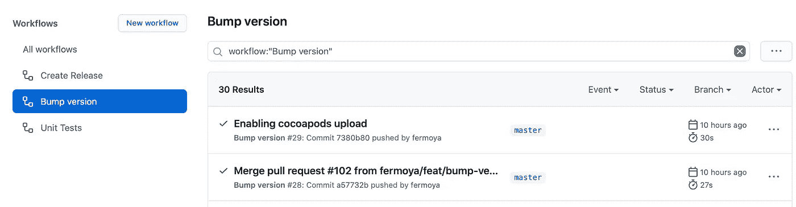**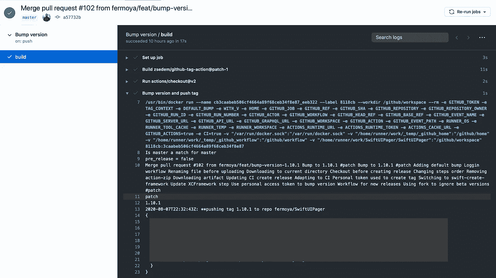*

*您还会注意到新标签是由 github-actions 创建的:*

*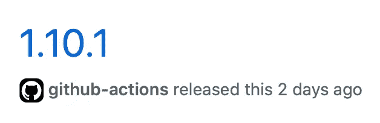*

# *发布和部署新版本*

## *链接工作流。秘密*

*最后，我想从每个新创建的标签中发布一个新版本。为此，我需要将以前的工作流与新的工作流“链接”起来。*

*乍一看，您可能认为只要定义新标签触发的新工作流就足够了:*

```
*on:
  push: 
    tags:
      - '*'*
```

*你不会错，但有一个问题。截至目前:*

> *"使用 *GITHUB_TOKEN* 从工作流引发的事件当前不会触发其他工作流。"— [GitHub 支持社区，2019 年 12 月](https://github.community/t/action-does-not-trigger-another-on-push-tag-action/17148/3)*

*在上面的链接里有一个完整的讨论。幸运的是，有一个变通办法:我们将创建自己的个人访问令牌，并在前面的工作流中使用它来创建标签，而不是使用`GITHUB_TOKEN`。*

*怎么做呢？如果你转到你的头像所在的屏幕左上方，你会看到选项设置:*

*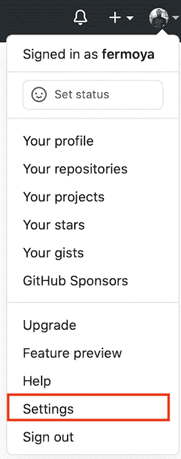*

*配置文件菜单中的设置选项*

*然后转到左侧面板上的开发者设置:*

**

*在那里你会发现一个选项来创建一个新的个人访问令牌 *:**

*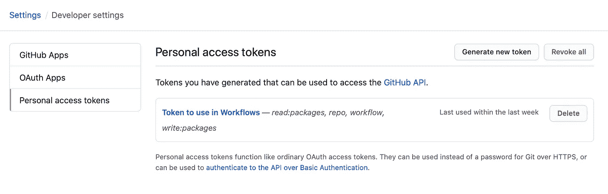*

*创建后，复制生成的值。现在，您将把它作为“秘密”添加到您的存储库中。要做到这一点，你只需要去你的仓库，点击设置，并在左侧面板寻找秘密。然后，创建一个新的密码，并将其命名为 PERSONAL_TOKEN:*

*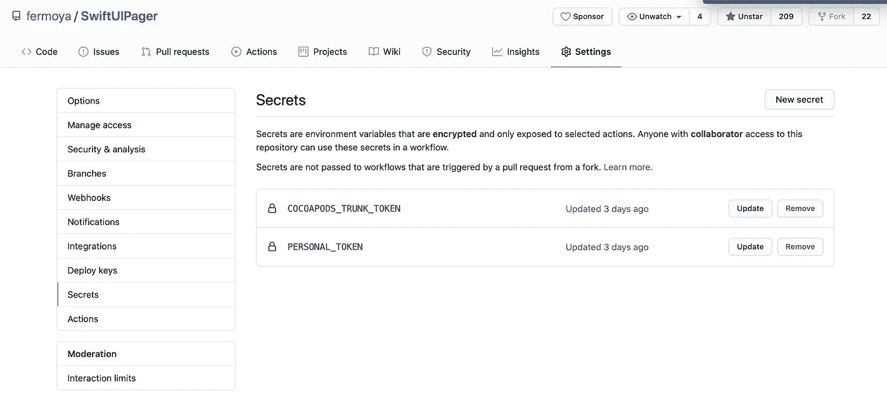*

*最后，在上一个作业中，将`GITHUB_TOKEN`替换为`PERSONAL_TOKEN`:*

## *发布您的新闻稿*

*此时，我们可以为我们的工作流生成一个新的 YML 文件了。我的工作流程将由三个不同的工作组成。首先，我将编译一个二进制工件来附加到我的版本中。我把这份工作叫做`create_xcframework`:*

*此作业的输出是将附加到作业的工件:*

*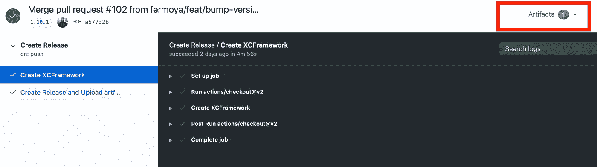*

*其次，我将运行第二个作业，它依赖于`create_xcframework`来发布发布版本，并将工件上传到发布版本。为此，我们需要使用`needs:`。此外，这个作业需要从 runner 环境下载工件，以便将它上传到发布的版本:*

*让我们复习一下步骤:*

1.  *像往常一样，我们需要检查标签来访问它的内容。我们将在第二步中用到这一步。*
2.  *创建并发布一个版本。主体取自位于标签中的文件。*
3.  *将工件下载到根文件夹。*
4.  *重命名 zip。*
5.  *上传资产。*

*作为将与其余作业并行运行的第三个也是最后一个作业，我将把标记的内容部署到 [CocoaPods](https://cocoapods.org/) ，这是 iOS 库的一个包存储库。请注意，此作业不需要按顺序运行，因为它没有任何依赖关系:*

*现在任何新标签都会触发此工作流:*

*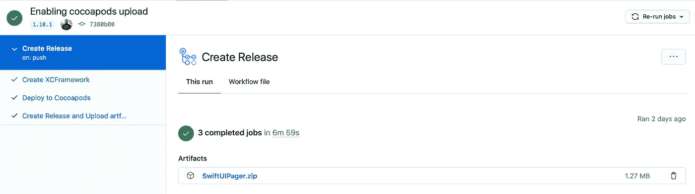*

*触发了创建发放活动*

*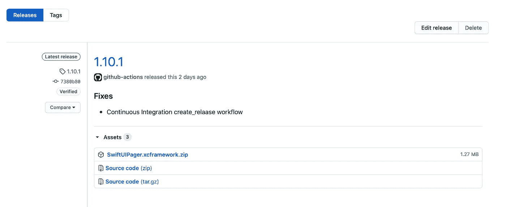*

*新版本的资产*

# *结论*

*在本教程中，我们已经介绍了三种最有可能实现自动化的常见场景。我们已经了解了工作流及其语法、操作(可以在市场上找到)，以及最终的秘密和如何链接两个工作流。*

*GitHub Actions 是在您的 GitHub 存储库中实现 CI/CD 的一个免费且易于使用的选择:*

*   *由于其他用户执行的操作，它们将您从复杂的操作中抽象出来。*
*   *作业可以顺序运行，也可以并行运行。*
*   *您可以安装在虚拟主机运行程序中运行作业、运行 shell 命令、产生输出等所需的任何东西。*
*   *不同的虚拟环境:Ubuntu，Windows，macOS 等。*