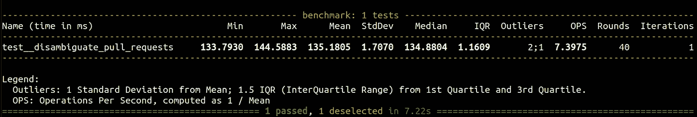
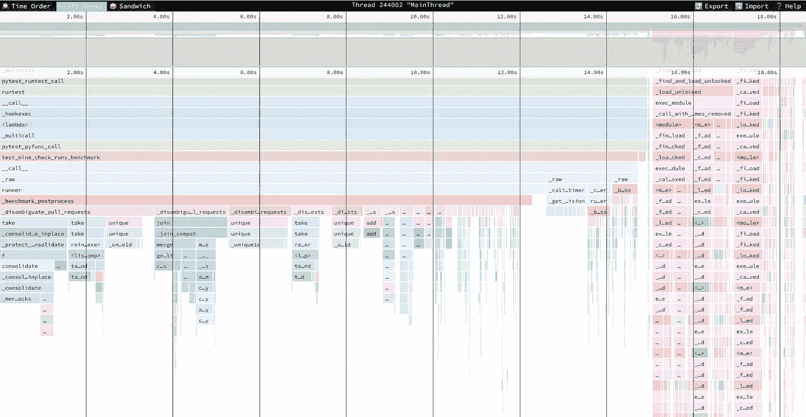
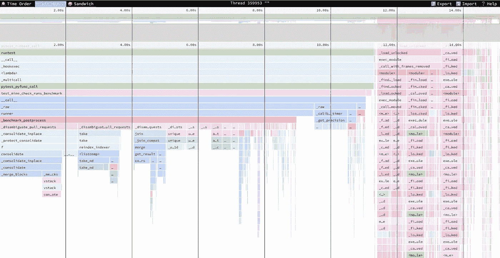
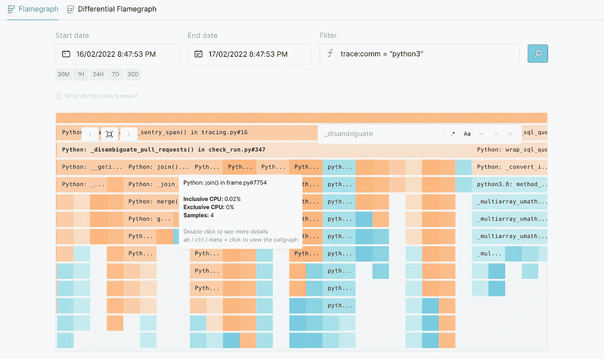

# HTTP API 的持续性能改进

> 原文：<https://betterprogramming.pub/continuous-performance-improvement-of-http-api-86290433aa54>

## 我们用 Python 开发了一个分析 HTTP API。这就是我们如何发现需要改进的地方，以便更快地满足请求


烧毁了。图像许可 CC0。

在我之前的文章中，我详细介绍了一些提高后端性能的代码技巧。但是，我怎么知道应该关注哪里，应该优化什么呢？事实上，将 Cython 和其他低级小发明加入该党应该有坚实的理由。

我在[雅典](https://athenian.com/)工作。雅典人提供了一个 SaaS，帮助工程领导者建立一个持续改进的软件开发文化。UX 规定了非常严格的绩效目标。如果没有合适的工具，很难实现很好的 P95 响应时间。因此，我们用高质量的应用和服务包装自己:

*   [Sentry 分布式跟踪](https://docs.sentry.io/product/sentry-basics/tracing/distributed-tracing/)允许我们调查为什么一个特定的 API 请求在生产中执行缓慢。该工具适用于 Python 领域。
*   Prodfiler 独立放大本机 CPU 性能，包括所有共享库。
*   [py-spy](https://github.com/benfred/py-spy) 是由[其中`@sentry_span`是一个函数装饰器，用于将调用包装到跟踪树中的 Sentry span-node 中。当然，我们不会修饰我们拥有的每一个方法。相反，我们凭直觉判断什么是有趣的，什么是噪音。](https://medium.com/u/de31421e853a# endpoint logic</span></pre><p id=)

    [`sentry_sdk.start_span()`测量内部经过的时间。`with sentry_sdk.Hub(sentry_sdk.Hub.current)`是哨兵 SDK 中](https://medium.com/u/de31421e853a# endpoint logic</span></pre><p id=) `[asyncio](https://github.com/getsentry/sentry-python/issues/772)` [支持不完整的](https://github.com/getsentry/sentry-python/issues/772)[解决方法。`__tracebackhide__`是一个神奇的局部变量，它隐藏了 pytest 和 Sentry 中调用堆栈的包装函数。](https://github.com/getsentry/sentry-python/issues/772)

    `/metrics/code_checks`返回[向 GitHub 报告的 CI 运行](https://api.athenian.co/v1/ui/#model-CodeCheckMetricID)的各种统计数据:GitHub Actions、CircleCI、Appveyor 等。一次提交可能会生成数十甚至数百次 CI 运行，根据 Sentry trace，仅在客户端 x 的两周内，我们就加载了 164，610 次 CI 运行。通常，这不是问题，查询在大约 500 毫秒内完成，但我们很不幸。第二个问题出现在`_disambiguate_pull_requests()`的 Python 函数中。向 GitHub map 报告的 CI 运行是提交请求，而不是拉请求。[GitHub 就是这么工作的](https://docs.github.com/en/rest/reference/checks#create-a-check-run)。因此，如果有几个 pr 具有相同的提交，我们必须确定哪个 pr 触发了 CI。`_disambiguate_pull_requests()`应用多种启发式方法解决难题。我们可以也将会预计算这个函数，但是由于一些特定领域的问题，我们还没有预计算。

    长话短说，在`_disambiguate_pull_requests()`呆一秒钟都不行，我们应该深入挖掘，优化。

    ## 剖析、重写、重复

    由于将请求体存储在 Sentry 跟踪元数据中，所以总是可以使用代理到本地主机的生产数据库进行本地重放。我们继续将函数的参数保存在磁盘上，并准备好*宏*基准。

    ```
    # curl --data '{...}' http://localhost:8080/v1/metrics/code_checksasync def _disambiguate_pull_requests(*args, **kwargs):
        with open("/tmp/args.pickle", "wb") as fout:
            pickle.dump((args, kwargs), fout)
        exit()
    ```

    我使用 pytest 插件`[pytest-benchmark](https://github.com/ionelmc/pytest-benchmark)`进行基准测试。

    ```
    def test__disambiguate_pull_requests(benchmark):
        with open("/tmp/args.pickle", "rb") as fin:
            args, kwargs = pickle.load(fin)
        benchmark(_disambiguate_pull_requests, *args, **kwargs)
    ```

    用`pytest --benchmark-min-rounds=N`执行基准测试，其中 N 是精度和基准测试时间之间的折衷。n 应该大到足以将波动限制在目标水平。我通常把目标定在平均值的 0.5%到 2%之间。

    

    示例基准运行。图片作者。

    我们已经设置了*宏*基准，现在进入配置文件优化周期:

    1.  收集当前代码的概要文件。
    2.  分析概要文件:瓶颈是什么？最后的改变有帮助吗？
    3.  如果您看到一个均匀平坦的轮廓或挣扎着进一步优化，请停止。
    4.  制定优化假设，并相应地重写代码。
    5.  转到步骤 1。

    我是收集[间谍](https://github.com/benfred/py-spy)个人资料的粉丝。这是 Python 的一个采样分析器:它以某种可配置的频率读取进程的内存转储，并识别和遍历线程堆栈。随着采样频率的增加，开销自然会增加，并且总会有一个折衷方案。我通常设置 500 赫兹的体面的结果。

    ```
    py-spy record -r 500 -o profile.ss -f speedscope -- pytest ...
    ```

    py-spy 可以输出类似于 [speedscope](https://github.com/jlfwong/speedscope) flamegraph 格式的文件。我喜欢 speedscope 的“左重”视图，它非常适合研究重复的基准迭代。

    

    由 py-spy 收集并在 Speedscope 中可视化的剖面，迭代 0。图片作者。

    

    由 py-spy 收集并在 Speedscope 中可视化的剖面，迭代 6。图片作者。

    通常需要十次左右的概要优化循环迭代才能达到极限并停止。上面两张图片是我开始优化和第六次迭代时的 speedscope 配置文件。我们看到右边不相关的粉红色火焰变得更宽了，而左边的一些火焰消失了——这很好。

    唉，*宏*基准继承了一些微基准的问题，特别是对上下文的依赖。当然，性能问题的最佳解决方案是改变算法，而不是绕过另一个 pandas 合并。我推荐大家观看费多尔·皮库斯的“为性能而设计”演讲。不要介意 C++，因为提出的概念是普遍适用的。

    ## 监控假设

    关于对上下文的依赖。我们为一个特定的客户优化了`_disambiguate_pull_requests()`。我们怎么能确定我们没有其他客户端的性能下降呢？降低 P95 反而有什么整体影响？Prodfiler 出现了。

    许多人都听说过[eBPF](https://ebpf.io/)——可以说是自 cgroups 以来最伟大的 Linux 内核技术。我们有一个 JIT 内核虚拟机，它可以在运行时执行轻量级程序。eBPF 可以像 py-spy 一样对 Python 调用栈进行采样，但是开销更小，并且可以推广到其他语言。Prodfiler 是一个 SaaS，它聚集了来自 eBPF 驱动的代理的跟踪。代理是一个影子 Kubernetes pod，可以完全访问节点。

    以下 Prodfiler 中的火焰图显示了`_disambiguate_pull_requests()`在一天的生产中的表现。聚集周期越长，探查器收集的样本越多，精度就越高。

    

    对 Prodfiler 中函数性能的精细洞察。图片作者。

    有一些注意事项:

    *   与标准操作系统包相比，我们用一些额外的优化来编译 CPython。因此，我们必须在 CI/CD 中将调试符号提交给 Prodfiler。
    *   不支持`asyncio`,因此没有协程堆栈跟踪。
    *   与类似哨兵的手动工具相比，测量函数的逻辑部分是不可能的。

    总的来说，Prodfiler 已经被证明是验证性能优化的一个很好的工具。作为奖励，它无缝地将火焰分解到特定的内核函数，这是 py-spy 做不到的。

    ## 摘要

    我已经描述了我们如何识别后端的慢速 CPU 点，分析它们，并监控优化。我们使用了:

    *   [哨兵分布式追踪](https://docs.sentry.io/product/sentry-basics/tracing/distributed-tracing/)。
    *   [间谍](https://github.com/benfred/py-spy)。
    *   [前过滤器](https://prodfiler.com/)。

    下一篇文章将会介绍我们如何应对 PostgreSQL 的性能，敬请关注，并请关注作者。哦，如果我们正在构建的产品听起来像是你的工程组织需要的东西，请查看我们的[网站](https://athenian.co)。