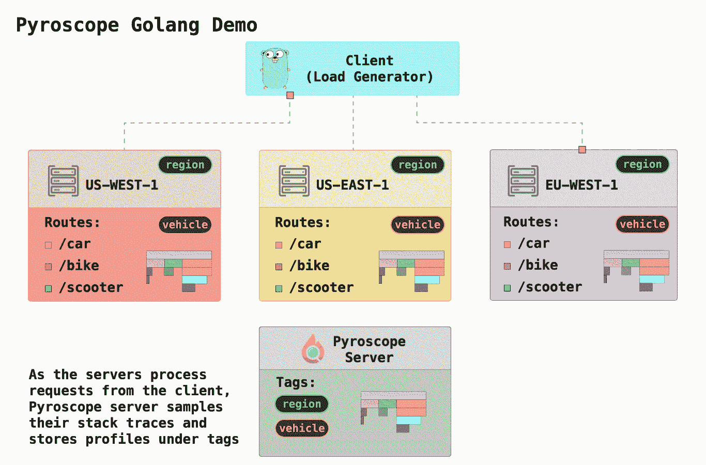
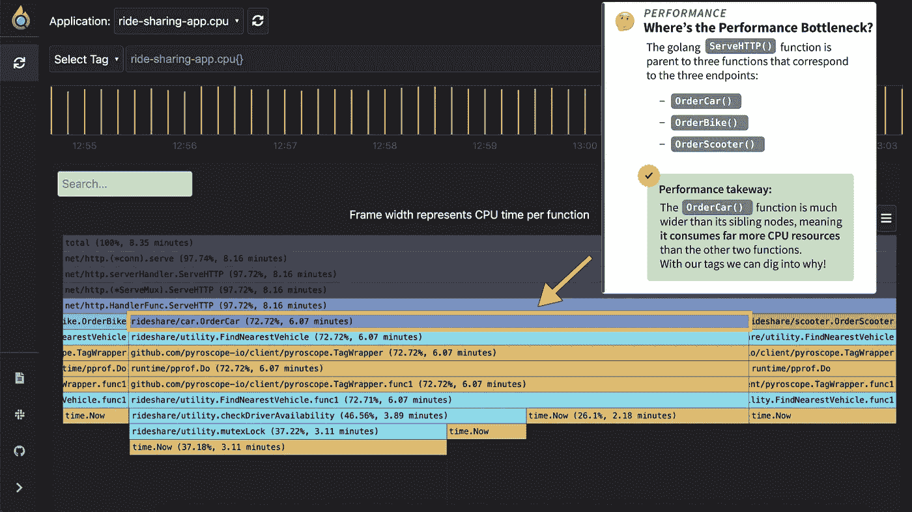
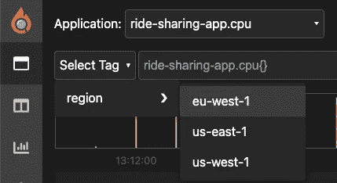
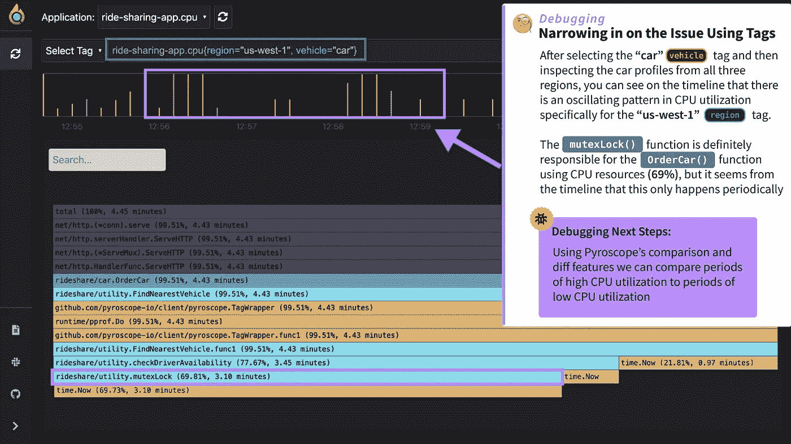
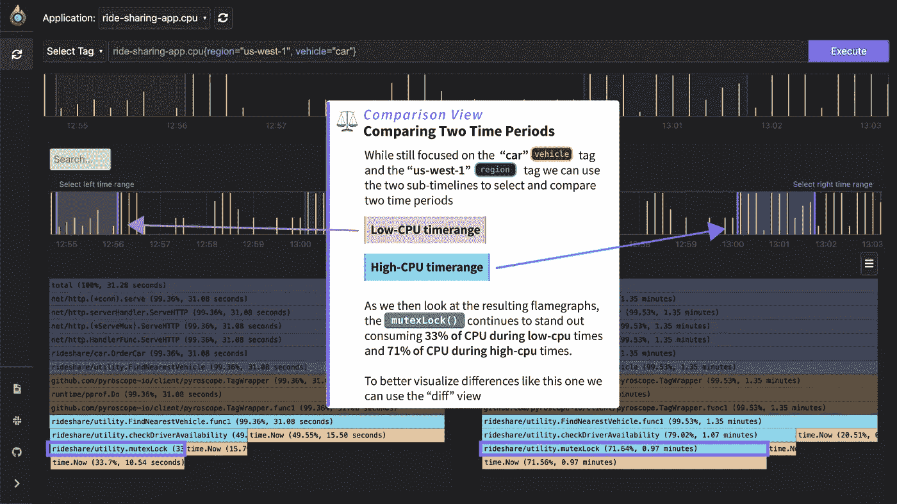
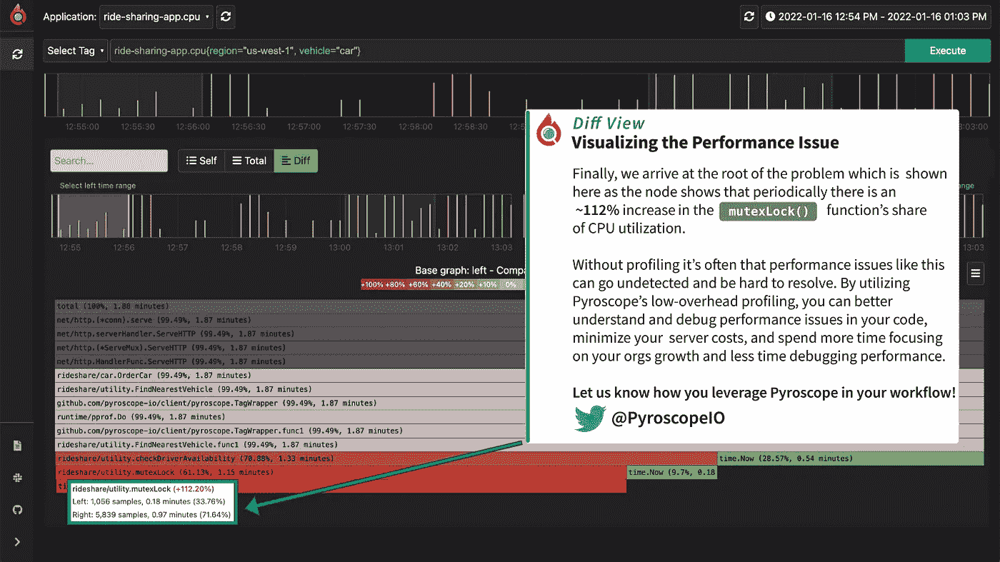

# Go 应用程序的连续分析

> 原文：<https://betterprogramming.pub/continuous-profiling-go-applications-8cdbdfdfc5ab>

## 使用 pyro scope——一个开源的连续分析平台



# 使用 Pyroscope 分析 Golang Rideshare 应用程序

在这个例子中，我展示了一个如何使用[pyro scope](https://github.com/pyroscope-io/pyroscope)——一个开源的分析库——使用连续分析来加速 Golang 应用程序的基本用例。

我们模拟一家“rideshare”公司，该公司在`main.go`中有三个端点:

*   `/bike`:调用`OrderBike(searchRadius)`函数订购一辆自行车
*   `/car`:调用`OrderCar(searchRadius)`函数订车
*   `/scooter`:调用`OrderScooter(searchRadius)`函数订购踏板车

我还模拟了在 3 个不同地区运行 3 个不同的服务器(通过 [docker-compose.yml](https://github.com/pyroscope-io/pyroscope/blob/main/examples/golang-push/rideshare/docker-compose.yml)

*   美国东部-1
*   美国西部 1 号公路
*   欧盟-西方-1

Pyroscope 最有用的功能之一是能够以对您有意义的方式标记您的数据。在这种情况下，我们有两个自然划分，因此我们对数据进行“标记”来表示它们:

*   `region`:静态标记运行代码的服务器区域
*   `vehicle`:动态标记端点(类似于如何标记控制器轨道)

# 用静态区域标记轮廓

标记静态的东西，比如`region`，可以在`main()`函数的初始化代码中完成:

```
 pyroscope.Start(pyroscope.Config{
  ApplicationName: "ride-sharing-app",
  ServerAddress:   serverAddress,
  Logger:          pyroscope.StandardLogger,
  Tags:            map[string]string{"region": os.Getenv("REGION")},
 })
```

# 在函数中动态标记配置文件

可以在我们的实用函数`FindNearestVehicle()`中使用`pyroscope.TagWrapper()`更动态地标记一些东西，就像我们对`vehicle`标记所做的那样:

```
func FindNearestVehicle(search_radius int64, vehicle string) {
 pyroscope.TagWrapper(context.Background(), pyroscope.Labels("vehicle", vehicle), func(ctx context.Context) {

        // Mock "doing work" to find a vehicle
        var i int64 = 0
        start_time := time.Now().Unix()
        for (time.Now().Unix() - start_time) < search_radius {
             i++
        }
     })
}
```

其功能是:

1.  它添加了标签`pyroscope.Labels("vehicle", vehicle)`
2.  它执行`FindNearestVehicle()`功能
3.  在程序块结束之前，它(在幕后)从应用程序中移除`pyroscope.Labels("vehicle", vehicle)`,因为该程序块已经完成

# 使用火焰图显示性能瓶颈



分析来自应用程序的概要文件输出的第一步是注意到*最大的节点*，这是应用程序花费最多资源的地方。在这种情况下，恰好是`OrderCar()`函数。

使用 Pyroscope 包的好处是，现在我们可以进一步调查为什么`OrderCar()`函数有问题。标记`region`和`vehicle`让我们可以测试两个好的假设:

*   `/car`端点代码有问题
*   我们的一个地区出了问题

要对此进行分析，我们可以从“选择标签”下拉列表中选择一个或多个标签:



# 使用标签缩小性能问题的范围

知道`OrderCar()`函数有问题，我们会自动选择那个标签。然后，在检查了多个`region`标签之后，通过查看时间线可以清楚地看到`us-west-1`区域存在问题，它在高 CPU 时间和低 CPU 时间之间交替。

我们还可以看到，`mutexLock()`函数在此期间几乎消耗了 70%的 CPU 资源。



# 比较两个时间段的配置文件

使用 Pyroscope 的“比较视图”,我们可以从时间线中选择两个不同的时间范围来比较生成的火焰图。左侧时间线上的粉色部分表示左侧火焰图，右侧的蓝色部分表示右侧火焰图。

当我们选择一个低 CPU 利用率的时间段和一个高 CPU 利用率的时间段时，我们可以看到在 `**mutexLock()**` **函数中有**不同的行为，它在低 CPU 时间占用 33%的 CPU，在高 CPU 时间占用 71%的 CPU。****



# 可视化两个火焰图之间约 112%的性能差异

虽然在这种情况下，差异在比较视图中非常明显，但有时两个火焰图之间的差异在彼此重叠的情况下会更明显。在不改变任何参数的情况下，我们只需选择“差异视图”选项卡，就可以看到以颜色编码的差异火焰图表示的差异。



# 剖析的更多用例

无论您是从事业余项目的开发人员，还是想知道“如何加快我的 go 应用程序”的 devops 工程师，Pyroscope 都有许多使用案例，可以让您轻松了解如何分析您的应用程序。一些例子是:

*   标记 Kubernetes 属性
*   标记控制器
*   标记区域
*   标记队列中的作业
*   标记提交
*   标记暂存或生产环境
*   标记他们测试套件的不同部分

# 未来路线图

如果你想试试这个例子，看看有什么方法可以让它适应你的 Go 应用，这里有一个 github 上这个[例子的链接。持续分析已经成为一种越来越流行的工具，用于监控和调试性能问题(可以说是可观察性的第四个支柱)。](https://github.com/pyroscope-io/pyroscope/blob/main/examples/golang-push/README.md)

如果你有关于[火镜](https://pyroscope.io)如何改进的想法，请随意在 GitHub 页面上写问题！感谢您的阅读。