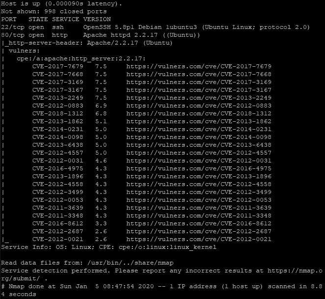
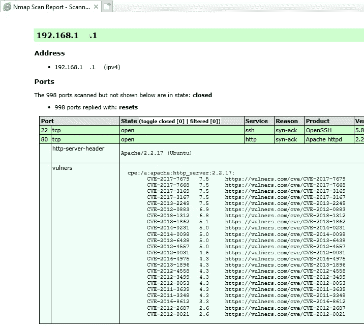

# 如何使用 Cloudflare Flan 进行持续漏洞扫描

> 原文：<https://betterprogramming.pub/continuous-vulnerability-scanning-with-cloudflare-flan-be924601cca8>

## 了解您的基础设施


由 [Safar Safarov](https://unsplash.com/@codestorm?utm_source=medium&utm_medium=referral) 在 [Unsplash](https://unsplash.com?utm_source=medium&utm_medium=referral) 上拍摄的照片。

“了解您的基础设施”是安全团队的主要原则之一。但是拥有持续的知识和理解基础设施的弱点对于 DevSecOps 过程来说尤其重要。

此外，尽快以正确的方式获得结果也很重要。Cloudflare 的 Flan 工具是我见过的针对这个问题的最棒的开源解决方案。

它有助于执行扫描，并将结果立即发送到 GCS 桶或 AWS S3 桶。

但是在使用了几次之后，我发现了一个小问题:它将报告保存在*。tex 和*。xml 格式。那些对我来说不方便。因此，在本文中，您将了解 cloud flare Flan 工具的基本用法，以及如何进行一些更改以在*中启用报告。html 格式。

# 执行漏洞扫描的基本 Cloudflare Flan 用法

在 GitHub 上克隆 cloudflare/flan 存储库:

```
$ git clone [https://github.com/cloudflare/flan.git](https://github.com/cloudflare/flan.git)
```

转到下载的目录:

```
$ cd flan
```

编辑`shared/ips.txt`文件，并将您的目标 IP 地址放在那里:

```
$ nano shared/ips.txt
```

保存文件并运行命令开始扫描:

```
$ make build && make start
```

您将在扫描过程中看到 Nmap 输出:



还有*。tex 报告将保存在`shared/reports`目录中，xml 输出将保存在`shared/xml_files`目录中。

你可以在官方的[自述文件](https://github.com/cloudflare/flan/blob/master/README.md)中了解更多关于将扫描结果推送到云端的信息。

# 将 Cloudflare Flan Nmap 输出保存到 HTML

快速搜索后，我决定使用 HTML 报告在 Nmap 官方网站上如何描述。

首先，我们需要将`xsltproc`可执行文件添加到 Cloudflare Flan 的映像中。要执行它，我们应该安装软件包`libxslt` (因为 Cloudflare Flan 使用 Alpine Linux 作为镜像)。打开存储库的 Dockerfile，更改如下所示的第二行(在行尾添加`libxslt`):

```
RUN apk add --no-cache nmap nmap-scripts git libxslt
```

下一步是修改`run.sh`脚本来执行 xml 报告到 HTML 报告的转换。打开`run.sh`进行编辑，找到工作循环，修改如下图所示:

```
while IFS= read -r line
do
 current_time=$(date “+%Y.%m.%d-%H.%M.%S”)
 filename=$(get_filename $line)”.xml”
 # Added for html generation
 htmlreport=$(get_filename $line)”.html”
 # ^^^^^^^^^^^^^^^^^^^^^^^^^
 nmap -sV -oX $root_dir$xml_dir/$filename -oN - -v1 $@ --script=vulners/vulners.nse $line
 upload $xml_dir/$filename
 # Added for html generation
 xsltproc $root_dir$xml_dir/$filename -o $root_dir$xml_dir/$htmlreport
 # ^^^^^^^^^^^^^^^^^^^^^^^^^
done < /shared/ips.txt
```

再次运行命令:

```
$ make build && make start
```

命令执行后，我们将在目录`shared/xml_files/YOUR_SCAN_TIME`中找到 HTML 报告:



# Cloudflare Flan 的其他调整

默认情况下，Nmap 仅扫描 1，000 个众所周知的端口。但是对于您的基础设施，对一些非标准端口执行漏洞扫描可能会很有用。在这种情况下，您应该在文件中找到运行 Nmap 的`run.sh`命令，并根据您的期望修改它:

```
nmap -sV -oX $root_dir$xml_dir/$filename -oN --v1 $@ --script=vulners/vulners.nse $line
```