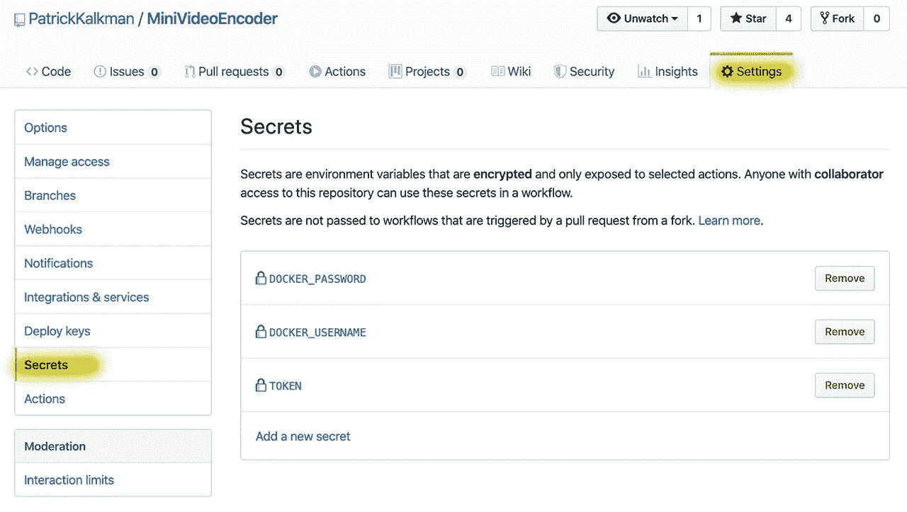
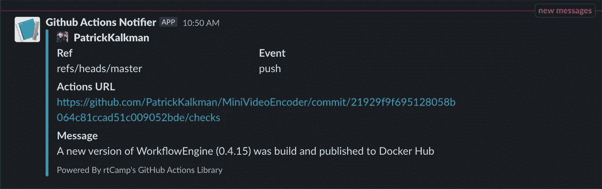

# 使用 GitHub 操作不断构建 Node.js Docker 映像

> 原文：<https://betterprogramming.pub/continuously-build-node-js-docker-images-using-github-actions-1e58df9c9faa>

## 向您的节点应用程序添加配置项

雅各布·欧文斯在 [Unsplash](https://unsplash.com/s/photos/action?utm_source=unsplash&utm_medium=referral&utm_content=creditCopyText) 上的照片

来自 GitHub 的伟大人们为他们的服务添加了新的东西——*GitHub Actions*。截至[2019 年 11 月 11 日](https://github.blog/changelog/2019-11-11-github-actions-is-generally-available)，GitHub Actions 面向所有人开放。当从公共库使用时，它是免费的。

您可以使用 GitHub 操作来自动化各种软件开发任务。作为开发人员，您创建了一个 YAML 工作流文件。GitHub 将文件存储在您的存储库中，并执行工作流。

为了编辑工作流文件，GitHub 创建了一个[工作流编辑器](https://github.blog/2019-10-01-new-workflow-editor-for-github-actions/)。相反，我更喜欢使用我的普通编辑器，Visual Studio 代码。我添加了一个[扩展](https://github.com/formulahendry/vscode-github-actions)来帮助编辑。

我开始使用 GitHub Actions 构建[迷你视频编码器](https://github.com/PatrickKalkman/MiniVideoEncoder)，这是我的副业。当我提交一个变更时，它首先构建并测试项目。如果成功，该操作将创建 Docker 映像并将其推送到 Docker Hub。

在本文中，我描述了如何创建 GitHub 动作来构建、测试和推送 Node.js 项目的 Docker 映像。如果您对最终的工作流文件感兴趣，可以随意查看我的 [GitHub 资源库](https://github.com/PatrickKalkman/MiniVideoEncoder/blob/master/.github/workflows/workflowengine.yml)中的文件。

# 构建、测试和推送 Docker 映像的步骤

要构建、测试和推送我的 Node.js 项目的 Docker 映像，GitHub 操作必须执行以下步骤:

1.  查看迷你视频编码器库。
2.  从版本文件中读取当前版本。
3.  使用[语义版本化](https://semver.org/)增加版本。
4.  将新版本号写入版本文件。
5.  构建、标记和发布 Docker 图像。
6.  提交版本文件。
7.  发送一条宽限消息，通知您新版本已经发布。

我将把每个步骤翻译成工作流 YAML 文件中的一个部分，并对其进行解释。

# 定义工作流文件

每个工作流文件都以操作的名称开头。GitHub 在动作概览中显示了这个名字。

GitHub 动作工作流文件定义的开始

第二行下面的语句定义了何时触发工作流。我用两种类型。第一个开始于我提交到存储库的时候。第二个让我在一个特定的时间`schedule`触发这个过程。

该计划使用与 Linux cron 作业相同的语法。我总是努力记住每个部分的意思。对我来说幸运的是， [Cronitor](https://cronitor.io/) 创造了一个叫做 [crontab.guru](https://crontab.guru/#0_1_*_*_*) 的工具来帮助我。字符串`'0 1 * * *'`表示我想在每晚 01:00 触发动作。

## 1.查看迷你视频编码器库

工作流程的第一步是在执行动作的机器上检出迷你视频编码器存储库。

从资源库中签出源代码

您必须使用`runs-on`标签来定义您希望动作在哪个平台上运行。我用的是 Ubuntu。如果你需要另一个平台，他们是可用的。您也可以使用 Windows Server 或 Mac OS。

在`steps:`下面，你要定义你工作流程的所有阶段。第一步是下载主分支的`action/checkout@master`。几乎总是，一个动作的第一步是检出存储库。

## 2.从版本文件中读取当前版本

我使用一个名为`VERSION`的文件来存储项目的版本。在第二步中，我从这个文件中读取版本。

使用 read_properties 操作读取版本文件

Christian Draeger 创造了一个伟大的 GitHub 动作，我一直在使用它。动作`christian-draeger/read-properties`读取在`VERSION`文件中定义的键值对的值。

该版本在变量`steps.read_property.outputs.value`中可用。在最后一行，我打印了变量，这样它在[构建日志](https://github.com/PatrickKalkman/MiniVideoEncoder/runs/433032036?check_suite_focus=true)中就可见了。

## 3.使用语义版本化增加版本

当我向存储库推送变更时，我想自动增加版本。根据[语义版本方案](https://semver.org/)增加版本号。

使用增量语义版本操作自动增加版本号

对我来说幸运的是，Christian Draeger 创建了另一个名为`[christian-draeger/increment-semantic-version](https://github.com/christian-draeger/increment-semantic-version)`的优秀动作，它根据语义版本规则更新版本号。

在第 5 行，我将变量`current-version`赋给变量`steps.read_property.output.value`。记住，在前面的步骤中，它在`steps.read_property.output.value`变量中读取并存储了版本号。

通过第 6 行的`version-fragment`,您向操作指出您想要更新版本号的哪一部分。我用`'bug'`增加版本号的[补丁](https://semver.org/)。其他选项参见动作的[文档](https://github.com/christian-draeger/increment-semantic-version)。

## 4.将新版本号写入版本文件

我使用`write-properties`动作将更新的版本号存储在`VERSION`文件中。

我无法获得`write-properties`动作来更新文件中的版本号。相反，我首先删除`VERSION`文件，并用包含新版本号的新文件替换它。

使用 write-properties 操作将更新的版本号写入版本文件

## 5.构建、标记和发布新的 Docker 图像

存储库中的`WorkflowEngine`文件夹包含用于构建工作流引擎的 Docker 映像的`Dockerfile`。

构建、标记 Docker 映像并将其发布到 Docker Hub

Lars Elgohr 创建了动作`[elgohr/Publish-Docker-Github-Action](https://github.com/elgohr/Publish-Docker-Github-Action)`,该动作构建、标记并向 Docker Hub 发布 Docker 图像。

您必须为动作提供 Docker Hub 存储库的名称，`pkalkman/mve-workflowengine`。在第 9 行，我使用带有更新版本号的变量来标记 Docker 图像。

为了能够将您的图像上传到 Docker Hub，您必须使用用户名和密码字段提供您的凭证。

如果需要使用敏感信息，就不得不使用 GitHub Secrets。GitHub 秘密是特定于存储库的。它们可以通过*设置*和*机密*选项卡创建。

创建后，您可以在工作流定义文件中使用它们。

通过 GitHub 在您的存储库中创建秘密

## 6.提交版本文件

在步骤 3 和 4 中，版本号被更新并保存在`VERSION`文件中。我们仍然需要提交这个变更并将其推送到存储库。

使用 git-commit 操作提交和推送 Git 更改

Matheus Albino 创造了一个动作来提交和推动你的改变。您必须指定一个`github-token`,以便动作可以与存储库交互。我再次使用一个秘密。

`message`字段允许您设置提交消息。我在消息中使用更新的版本号。有关更多选项，如指定执行提交的用户，请参见[操作](https://github.com/matheusalbino/git-commit)的文档。

## 7.发送一条宽限消息，通知新版本已发布

工作流文件的最后一步向松弛通道发送消息，通知有新版本可用。

使用 action-slack-notify 操作发送时差消息

我用的动作`[rtCamp/action-slack-notify@v2.0](https://github.com/marketplace/actions/slack-notify)`。RtCamp 创建了这个动作来发送一个关于 Slack 的消息。

您必须创建一个 [Slack webhook](https://api.slack.com/tutorials/slack-apps-hello-world) 来允许动作使用您的 Slack 通道。你必须在`SLACK_WEBHOOK`字段中设置它。我为此使用了一个秘密。

如果操作成功完成，它会在 Slack 通道中生成以下消息。

操作“时差-通知”生成的时差消息

# 结论和开源的力量

我很喜欢 GitHub 动作。我发现将现有的动作结合起来创建一个复杂的工作流非常容易。在撰写本文时，市场中已经有 [2118 个动作](https://github.com/marketplace?type=actions)。

如果你想看完整的工作流程，我邀请你看看我的 [GitHub 仓库中的文件。](https://github.com/PatrickKalkman/MiniVideoEncoder/blob/master/.github/workflows/workflowengine.yml)

我要感谢克里斯蒂安·德雷格尔、马修斯·阿尔比诺、拉尔斯·埃尔戈尔、杰西·塔拉贝拉-格林伯格和 rtCamp，感谢他们为我的工作流程提供了所有出色的操作。

感谢您的阅读。如果你已经使用或者计划使用 GitHub Actions，请告诉我。我很感兴趣。另外，如果你对这篇文章有任何问题或评论，请随时回复。