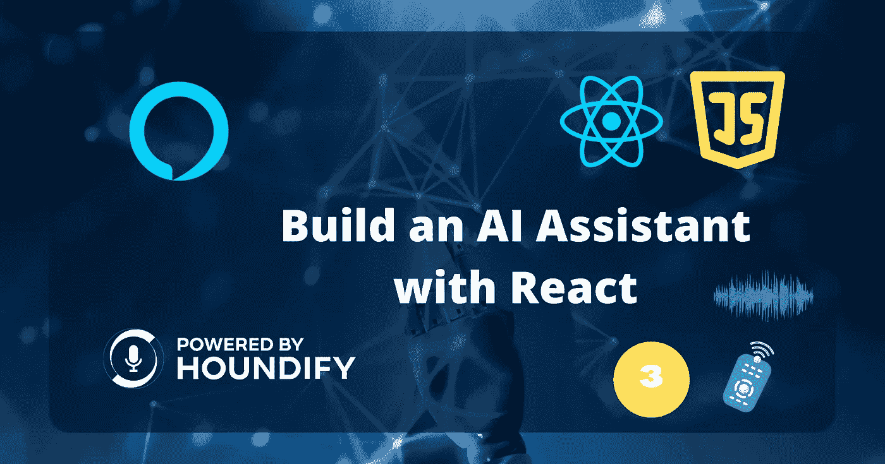
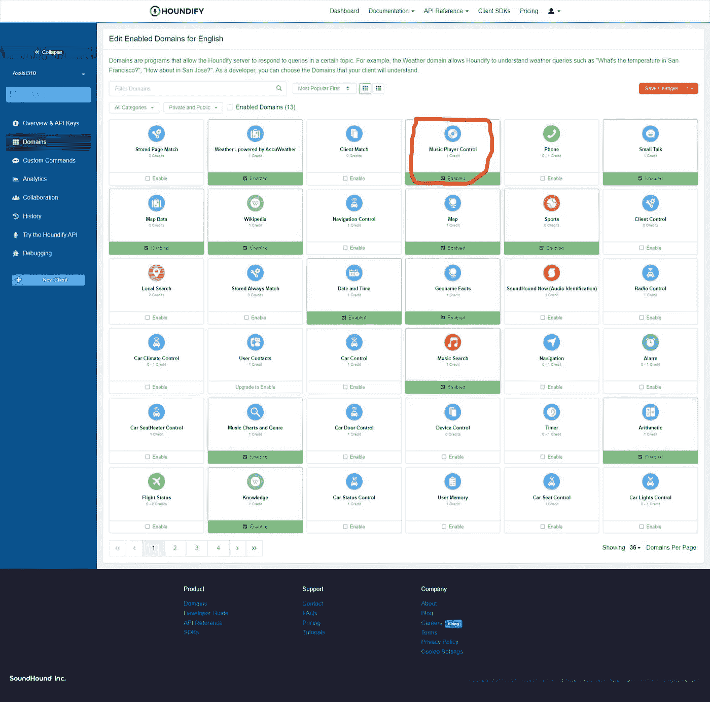

# 使用 Howler.js 来控制你的人工智能助手的音频播放

> 原文：<https://betterprogramming.pub/control-audio-playback-with-your-ai-powered-assistant-967dce72a582>

## 了解如何使用 Houndify API 按下“暂停”



作者图片

欢迎回到本系列的第三部分！首先，我们设置我们的初始应用程序。接下来，在上一篇文章中，我们让客户端播放音乐。

过了今天，我们就可以要求助理“暂停音乐”或“播放最后一首歌”

下面是我们将构建的演示:

# 安装

如果您没有阅读本系列的最后一篇文章，我建议您先阅读那篇文章。

[](/make-your-ai-powered-personal-assistant-play-music-featuring-web3-a1e7eec68f4a) [## 让你的人工智能个人助理播放音乐！(以 Web3 为特色)

### 整合 Houndify API，做一个类似 Alexa 或者 Siri 的个人助理

better 编程. pub](/make-your-ai-powered-personal-assistant-play-music-featuring-web3-a1e7eec68f4a) 

但是如果你喜欢直接跳过，你可以在这里找到启动代码。

为了实现这个特性，我们需要另一个域。



启用并单击右上角的保存更改。该域将启用回放控制命令。

# 处理音乐播放器命令

首先，在`src/handlers`文件夹中创建一个新文件。命名为`MusicPlayerCommand.ts`。这个文件将包含一个接收命令数据的函数。

将以下代码添加到文件的顶部:

`SUCCESS_RESULT`和`FAILED_RESULT`为包含适当跟进响应的新结果定义位置。

`VOLUME_DELTA`是我们需要时调高或调低的音量百分比。

现在在`handlePlayerCommand`函数中，我们使用来自`[Howler.js](https://github.com/goldfire/howler.js#methods)`的一个对象来控制音乐。但是首先，我们需要检查结果数据中的`CommandType`。

随意复制粘贴这个。

不要忘记将我们的新文件添加到`index.ts`中的 handlers 数组中。

```
const COMMANDS = ["MusicCommand", "MusicPlayerCommand"];
```

# 跟踪播放的歌曲

如果您阅读了上一篇文章，您应该知道在`playSound.ts`中没有名为`music`的导出。应该是对播放音频时创建的`Howl`对象的引用。

另外，我们应该只在播放的音频是歌曲时更新它，而不是任何反馈声音。

打开该文件，并用以下代码替换其内容:

但是，当我们用 play sound 播放一首歌曲时，我们需要将类型设置为“music”

我们还需要存储当前歌曲的 URL，以防用户想要再次播放它。为此，我们可以使用`localStorage`。

打开`MusicCommand.ts`,将我们播放歌曲的那一行替换为:

```
playSound(audioURL, { format: "webm" }, "music");
localStorage.setItem("lastSong", audioURL);
```

# 结论

这就是一切！我们用`Howler.js`来控制音乐，用`localStorage`来存储最后播放的歌曲。像以前一样，如果你愿意，你可以在这里找到这篇文章的源代码[。](https://hashnode.com/build-your-own-ai-powered-virtual-assistant-on-the-web-part3)

在这个系列的下一次，我们将执行音乐识别，这样我们就可以问，“那是什么歌？”。尽情享受吧！

*原发布于*[*https://cs 310 . hash node . dev*](https://cs310.hashnode.dev/build-your-own-ai-powered-virtual-assistant-on-the-web-part3)*。*