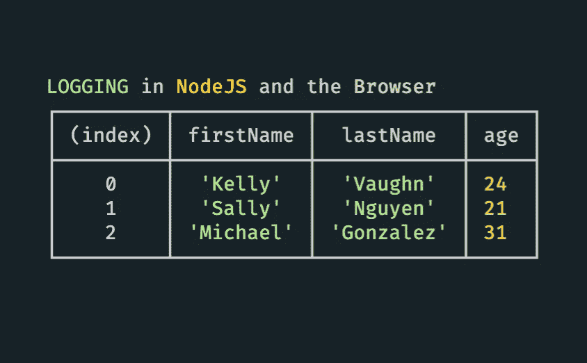
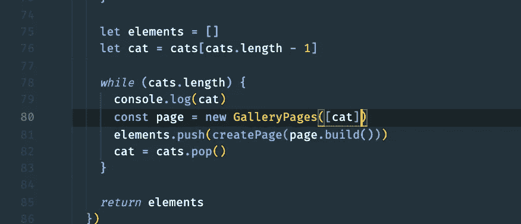
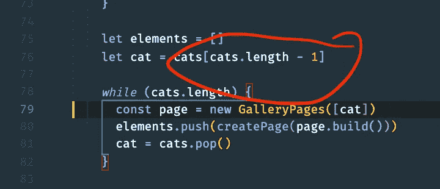
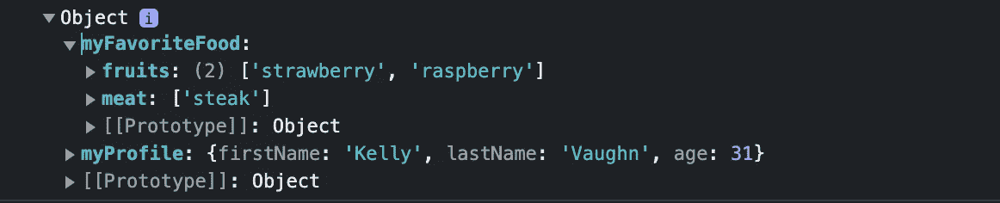
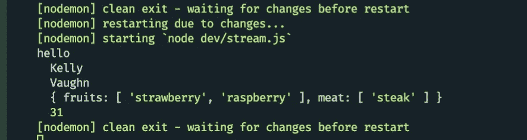
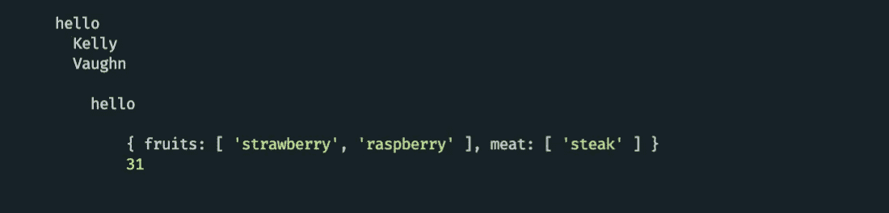
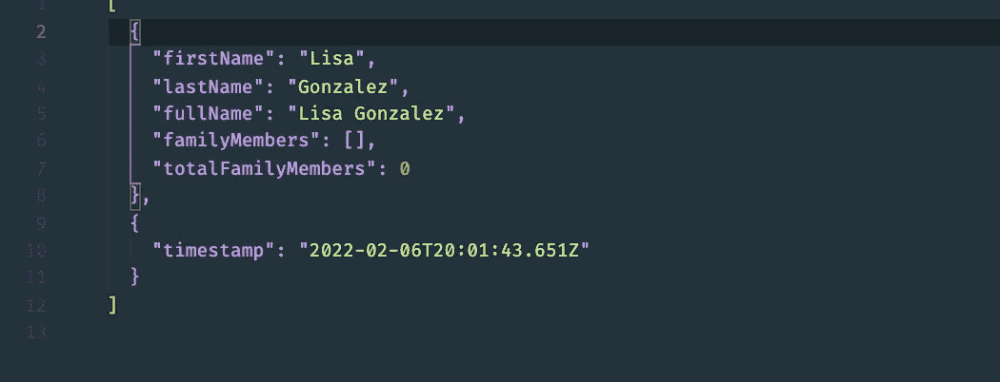

# 浏览器登录 NodeJS 和 JavaScript 的便捷策略

> 原文：<https://betterprogramming.pub/convenient-tactics-of-logging-in-nodejs-and-javascript-in-the-browser-9f97e9d550e4>

## 记录成功

图片来源于 [jsmanifest](https://medium.com/u/9204b4ca7056?source=post_page-----9f97e9d550e4--------------------------------)

作为开发人员，如果没有某种日志记录机制，在我们的应用程序中调试 bug 是极其困难的。

这是因为日志可以捕获我们代码中的任何时间点，并捕获堆栈跟踪或关于我们应用程序生命周期当前状态的有用信息，这些信息可用于及时追溯状态。

在这篇文章中，我们将介绍几种用 JavaScript 登录 nodejs 和浏览器环境的便捷策略。

# 跟踪/调试

随着时间的推移，我们的项目越来越大，建立日志来跟踪我们的代码变得越来越重要，因为我们的代码变得越来越复杂。代码复杂性的增加导致代码维护和可读性的难度增加。

当意外行为发生时，没有比日志记录更好的跟踪变化的方法了。

让我们看看下面的例子:

我们期望的行为是，对于每个获取的猫图像，我们创建一个包含单个`img`元素的新元素，该元素最终将被分组到一个“类似画廊”的视图中。在客户端显示时，每张图像在视觉上应该以相同的尺寸显示，并且每张图像应该不同:

图片来源于 [jsmanifest](https://medium.com/u/9204b4ca7056?source=post_page-----9f97e9d550e4--------------------------------)

然而，前两个图像是重复的。通过在我们的代码中放置简单的记录器，它提供了一个定位错误开始的捷径:

图片来源于 [jsmanifest](https://medium.com/u/9204b4ca7056?source=post_page-----9f97e9d550e4--------------------------------)

前两个对象是相同的，因此我们可以立即了解我们的 for 循环是如何开始的:

图片来源于 [jsmanifest](https://medium.com/u/9204b4ca7056?source=post_page-----9f97e9d550e4--------------------------------)

这个问题现在变得很明显。每个循环都希望从数组中的一个对象`pulled`开始。每个循环都认为数组已经发生了变异，因此我们需要对数组进行变异:

图片来源于 [jsmanifest](https://medium.com/u/9204b4ca7056?source=post_page-----9f97e9d550e4--------------------------------)

图片来源于 [jsmanifest](https://medium.com/u/9204b4ca7056?source=post_page-----9f97e9d550e4--------------------------------)

# 表演

在现代应用程序中，如果我们希望我们的应用程序保持竞争力，性能是首要考虑的问题。作为开发人员，让用户满意是我们的责任，一切从代码开始。通过利用`console`,我们可以记录代码不同部分的性能。

# 分析

日志比我们想象的要有用得多。甚至在我们的代码中放置随机日志也能给我们提供信息来改进我们的应用程序。

我们可以使用我们的日志记录信息来找出以下内容:

*   重复请求
*   内存泄漏
*   不必要的变量
*   打字稿
*   提醒我们重访托多斯
*   跟踪函数调用
*   意外行为

这样的例子不胜枚举。

# 重要的记录方法

如果断言失败或者是`false`，那么`console.assert`对于将错误消息写入控制台(通常用于验证我们函数中的输入或输出)是有用的。否则什么都不会发生。与通用的`console.log`相比，这提供了一种“惰性加载”的感觉，从而更容易避免更多的内存使用。

`console.clear`可以用来清除控制台。当您意识到有太多的日志，并希望将它放在正在调试的函数之前，以确保您在控制台中看到的第一条消息直接来自该函数时，这非常有用。这有助于避免不必要地上下滚动来大海捞针。

`console.error`也可以帮助将消息记录到控制台，但在浏览器控制台中，它实际上显示的消息看起来像错误，因为它们是红色背景。在大多数情况下，这就足够了。但是在某些情况下，我们仍然会选择一种更好的方式来显示错误信息，比如`console.log('%c"obj" is not an object', 'color:red;font-weight:400', obj)`。

`console.debug`以“详细”级别向控制台输出消息。库利用这种方法来记录更多的技术信息，以便开发人员能够更深入地了解他们正在使用的库中的技术细节。

`console.dir`除了能够向控制台显示*对象的所有*属性外，还可用于向控制台显示任何内容(可通过`depth`选项进行配置)。如果在浏览器中使用，我们在`console.dir`中使用的对象可以是*交互式的*，我们可以点击属性/方法，同时能够展开/折叠它们:

图片来源于 [jsmanifest](https://medium.com/u/9204b4ca7056?source=post_page-----9f97e9d550e4--------------------------------)

`console.group`和`console.groupEnd`可用于将多个日志包装在一个包装的“容器”中，其中每行可缩进，模拟控制台中的“分组”效果:

图片来源于 [jsmanifest](https://medium.com/u/9204b4ca7056?source=post_page-----9f97e9d550e4--------------------------------)

我发现`console.group`的有趣之处在于，如果需要，我们可以多次使用它来嵌套/缩进底层消息:

图片来源于 [jsmanifest](https://medium.com/u/9204b4ca7056?source=post_page-----9f97e9d550e4--------------------------------)

# 策略

有时，我们会过于激动，记录太多的信息。这会影响运行时性能，尤其是当我们在日志中包含大对象的时候。

日志在 NodeJS 中非常有用。但是有些时候它们是没有用的。然而，我们也有机会将这些对*无用的日志变成有用的*。

让我们看看下面这个例子:

当我们创建`Profile`的实例并将每个实例记录到控制台时，我们希望在输出中看到有用的信息，如`firstName`、`lastName`、`fullName`和所有的`familyMembers`。

但实际情况是，当他们在控制台中显示时，这是我们得到的信息:

图片来源于 [jsmanifest](https://medium.com/u/9204b4ca7056?source=post_page-----9f97e9d550e4--------------------------------)

那么如何才能让这个输出有用的信息呢？谢天谢地，NodeJS 为我们定制对象的输出提供了一个有用的方法。

# `Inspect`(建议:创建全局用户片段)

为了定制控制台中对象的输出，我们可以附加一个值为`"nodejs.util.inspect.custom"`的`Symbol`，如下所示:

将我们的`Profile`实例记录到控制台可以按照我们想要的方式显示信息:

我建议将它绑定到一个定制的用户片段，因为如果你像我一样，你每次都会使用它来获得更有效率的开发体验。

值得一提的是`[Symbol.for('nodejs.util.inspect.custom')]() {}`还带有 3 个参数:

`[Symbol.for('nodejs.util.inspect.custom')](depth, inspectOptions, inspect) {}`

你可以在这里找到更多关于这些论点的信息。

# 自动化

我们之前的例子很好，因为我们可以在开发应用程序的同时实时分析日志记录。

然而，有时我们希望在自动化脚本中看到日志(比如让脚本每 15 分钟获取一次数据)，而我们*不再在运行时分析这些日志。*

默认情况下，NodeJS 中的`Console`构造函数通过将其输出传送到`stdout`和`stderr`来登录到终端。实际上，我们可以配置这两个函数，将其输出传输到其他地方，比如一个文件:

图片来源于 [jsmanifest](https://medium.com/u/9204b4ca7056?source=post_page-----9f97e9d550e4--------------------------------)

结果:

图片来源于 [jsmanifest](https://medium.com/u/9204b4ca7056?source=post_page-----9f97e9d550e4--------------------------------)

# 实践中的伐木工人

[Pino-http](https://github.com/pinojs/pino-http)【Pino】提供了一个库来接入 [expressjs](https://expressjs.com) 请求管道，作为一个中间件来记录我们从 http 请求中想要的任何东西。

[file-stream-rotator](https://www.npmjs.com/package/file-stream-rotator) 可以与服务器应用程序中的日志中间件结合使用，将它们的日志保存在一个文件中。它旨在定期提供 Express 日志的自动轮换，需要根据日期、大小限制或组合进行轮换，并根据计数或已用天数删除旧日志文件。

[日志更新](https://github.com/sindresorhus/log-update)允许开发者利用节点的`stdout`和`stderr`(相同的 I/O `Console`用途)在终端中模拟进度条或定制动画

roarr 将信息记录为 JSON，它支持 nodejs 和浏览器环境

除了支持 markdown 语法之外，logdown.js 还为节点和浏览器环境提供了一种日志记录机制。

# 结论

本帖到此结束！我希望你发现这是有价值的，并期待在未来更多！