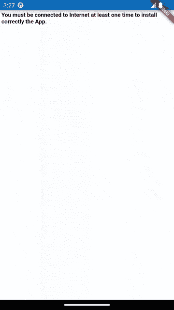
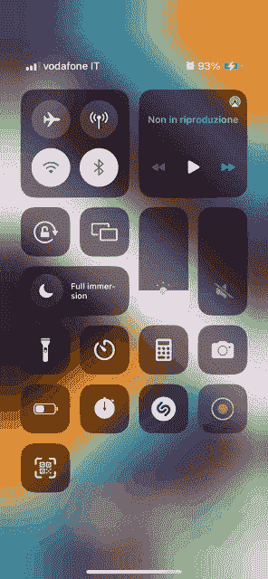

# 使用 WebViews 将 PWA 转换为 Flutter 应用程序

> 原文：<https://betterprogramming.pub/convert-a-pwa-into-a-flutter-app-using-webviews-387060548a37>

## 了解如何使用 Flutter 的 InAppWebView 6 插件将 PWA 转换为 Flutter 应用程序


[奥拉夫瓦尔](https://unsplash.com/@olafval?utm_source=medium&utm_medium=referral)在 [Unsplash](https://unsplash.com?utm_source=medium&utm_medium=referral) 上的照片

在本文中，我们将使用最新版本 6 的`[flutter_inappwebview](https://github.com/pichillilorenzo/flutter_inappwebview)`插件，将一个 [PWA (Progressive Web App)](https://web.dev/progressive-web-apps/) 转换为一个适用于 Android 和 iOS 的 Flutter 移动应用。

# 什么是渐进式网络应用？

渐进式 web 应用程序是一个术语，指的是像常规网页一样开发和加载的 Web 应用程序，但当在移动设备上使用时，其行为类似于本机应用程序。

它们是用现代 API 构建和增强的，以提供增强的功能、可靠性和可安装性，同时用单个代码库在任何地方、任何设备上访问任何人。渐进式 web 应用程序利用新 Web 的这种活力以及服务工作者和 manifest 等技术来提供类似本机应用程序的用户体验，即使用户离线也能工作。

开发人员可以在线发布 web 应用程序，确保它满足基线安装要求，并且用户可以将应用程序添加到他们的主屏幕上。将应用程序发布到苹果应用商店或 Google Play 等数字分发系统是可选的。

# 什么是混合应用？

混合应用程序是结合了本地应用程序和 web 应用程序功能的应用程序。它们在一个容器中运行，在这里是一个`WebView`。

它们可以通过应用商店获得，可以访问本机 API 和手机的硬件组件，并安装在您的设备上，就像本机应用程序一样。

我不会解释 pwa、本机应用程序和混合应用程序之间的优缺点，因为这超出了本文的范围。你已经可以在网上搜索了。

# 如何将 PWA 转换为 Flutter App

作为一个 pwa 的例子，我们将使用[https://mdn.github.io/pwa-examples/js13kpwa/](https://mdn.github.io/pwa-examples/js13kpwa/)(GitHub repo:[js13k PWA](https://github.com/mdn/pwa-examples/blob/master/js13kpwa))，这是一个全功能的 PWA，支持离线。

[js13kpwa](https://github.com/mdn/pwa-examples/blob/master/js13kpwa) 是提交给 js13kGames 2017 竞赛的 A 帧参赛作品列表，用作关于渐进式 Web 应用的 MDN 文章的示例。js13kPWA 具有应用程序外壳结构，与服务人员离线工作，由于清单文件和添加到主屏幕功能而可安装，并可通过使用通知和推送来重新参与。

此外，对于这个用例，我们将在 JavaScript 和 Flutter/Dart 之间添加一个简单的双向通信。

## 服务人员

服务人员是 PWA 的基本组成部分。它们支持快速加载(不考虑网络)、离线访问、推送通知和其他功能。

检查[https://caniuse.com/serviceworkers](https://caniuse.com/serviceworkers)基于 WebView/浏览器版本的 JavaScript Service Worker API 可用性。

从“Android 5–6 . x WebView:Chromium 107”开始在 Android 上提供服务人员，从 iOS 14.0+开始在 iOS 上提供服务人员。

在 iOS 上，启用服务工作者 API 需要使用应用程序绑定的域进行额外设置(阅读 [WebKit —应用程序绑定的域](https://webkit.org/blog/10882/app-bound-domains/)文章了解更多详细信息)。

应用程序绑定的域功能通过限制应用程序可以利用强大的 API 在应用程序内浏览期间跟踪用户的域来保护用户隐私。

您可以使用`Info.plist`键`WKAppBoundDomains`指定多达十个“应用绑定”域。

因此，我们需要将 PWA 的域添加到其中。否则，服务工作器 API 将无法工作。对于我们的用例，我们需要添加`mdn.github.io`域。下面是一个`ios/Runner/Info.plist`文件的例子:

```
<dict>
  <!-- ... -->
  <key>WKAppBoundDomains</key>
  <array>
    <string>mdn.github.io</string>
  </array>
  <!-- ... -->
</dict>
```

## 互联网网络检测

检测用户的手机是否连接到互联网对于`WebView`从缓存中加载 PWA 而不是在线请求资源是很重要的。

为了检查是否有有效的连接，即蜂窝网络或 Wi-Fi，我们将使用`[connectivity_plus](https://pub.dev/packages/connectivity_plus)`插件。相反，为了测试网络是否连接到互联网，我们可以尝试查找主机的地址，例如[https://example.com/](https://example.com/)。

下面是完整的代码检测:

```
Future<bool> isNetworkAvailable() async {
  // check if there is a valid network connection
  final connectivityResult = await Connectivity().checkConnectivity();
  if (connectivityResult != ConnectivityResult.mobile &&
      connectivityResult != ConnectivityResult.wifi) {
    return false;
  }

  // check if the network is really connected to Internet
  try {
    final result = await InternetAddress.lookup('example.com');
    if (result.isEmpty || result[0].rawAddress.isEmpty) {
      return false;
    }
  } on SocketException catch (_) {
    return false;
  }

  return true;
}
```

## InAppWebView 基本设置

为了使`InAppWebView`正常工作，我们需要设置一些基本设置:

```
InAppWebViewSettings(
    // enable opening windows support
    supportMultipleWindows: true,
    javaScriptCanOpenWindowsAutomatically: true,

    // useful for identifying traffic, e.g. in Google Analytics.
    applicationNameForUserAgent: 'My PWA App Name',
    // Override the User Agent, otherwise some external APIs, such as Google and Facebook logins, will not work
    // because they recognize the default WebView User Agent.
    userAgent:
        'Mozilla/5.0 (Linux; Android 13) AppleWebKit/537.36 (KHTML, like Gecko) Chrome/107.0.5304.105 Mobile Safari/537.36',

    disableDefaultErrorPage: true,

    // enable iOS service worker feature limited to defined App Bound Domains
    limitsNavigationsToAppBoundDomains: true
);
```

根据你的需要改变它。

在本例中，我们启用了对多个窗口的支持，以防我们想要打开弹出`WebView`窗口。

在某些情况下，您可能还需要将用户代理覆盖为不同于默认值的值，以便能够使用一些外部 API，例如 Google 和脸书登录。否则，它们将无法工作，因为它们识别并阻止默认的`WebView`用户代理。

此外，您必须将`limitsNavigationsToAppBoundDomains`设置设置为`true`在 iOS 上启用服务工作者 API。

## HTTP(非 HTTPS)支持

从 Android 9 (API 级别 28)开始，默认情况下禁用明文支持:

*   查看官方[网络安全配置—“选择退出明文流量”](https://developer.android.com/training/articles/security-config#CleartextTrafficPermitted)部分。
*   另外，请检查此 StackOverflow 问题答案:[明文 HTTP 流量是不允许的](https://stackoverflow.com/a/50834600/4637638)。

在 iOS 上，你需要禁用[苹果运输安全](https://developer.apple.com/documentation/security/preventing_insecure_network_connections) (ATS)功能。有两种选择:

*   仅禁用特定域的 ATS([官方维基](https://developer.apple.com/documentation/bundleresources/information_property_list/nsapptransportsecurity/nsexceptiondomains)):(将以下代码添加到您的`Info.plist`文件中)

```
<key>NSAppTransportSecurity</key>
<dict>
  <key>NSExceptionDomains</key>
  <dict>
    <key>www.yourserver.com</key>
    <dict>
      <!-- add this key to enable subdomains such as sub.yourserver.com -->
      <key>NSIncludesSubdomains</key>
      <true/>
      <!-- add this key to allow standard HTTP requests, thus negating the ATS -->
      <key>NSTemporaryExceptionAllowsInsecureHTTPLoads</key>
      <true/>
      <!-- add this key to specify the minimum TLS version to accept -->
      <key>NSTemporaryExceptionMinimumTLSVersion</key>
      <string>TLSv1.1</string>
    </dict>
  </dict>
</dict>
```

*   彻底禁用 ATS ( [官方维基](https://developer.apple.com/documentation/bundleresources/information_property_list/nsapptransportsecurity/nsallowsarbitraryloads))。将以下代码添加到您的`Info.plist`文件中:

```
<key>NSAppTransportSecurity</key>
<dict>
  <key>NSAllowsArbitraryLoads</key><true/>
</dict>
```

其他有用的`Info.plist`属性有:

*   `NSAllowsLocalNetworking`:布尔值，表示是否允许加载本地资源([官方 wiki](https://developer.apple.com/documentation/bundleresources/information_property_list/nsapptransportsecurity/nsallowslocalnetworking) )
*   `NSAllowsArbitraryLoadsInWebContent`:一个布尔值，指示是否对来自 web 视图的请求禁用所有应用传输安全限制([官方维基](https://developer.apple.com/documentation/bundleresources/information_property_list/nsapptransportsecurity/nsallowsarbitraryloadsinwebcontent))

# WidgetsBindingObserver

此外，我们将为 Android 使用`WidgetsBindingObserver`,这有助于了解系统何时将应用程序置于后台或将应用程序返回前台。

有了它，我们可以停止和恢复 JavaScript 执行以及任何可以安全暂停的处理，比如视频、音频和动画。

下面是`didChangeAppLifecycleState`的一个简单实现:

```
@override
void didChangeAppLifecycleState(AppLifecycleState state) {
  if (!kIsWeb) {
    if (webViewController != null &&
        defaultTargetPlatform == TargetPlatform.android) {
      if (state == AppLifecycleState.paused) {
        pauseAll();
      } else {
        resumeAll();
      }
    }
  }
}

void pauseAll() {
  if (defaultTargetPlatform == TargetPlatform.android) {
    webViewController?.pause();
  }
  webViewController?.pauseTimers();
}

void resumeAll() {
  if (defaultTargetPlatform == TargetPlatform.android) {
    webViewController?.resume();
  }
  webViewController?.resumeTimers();
}
```

# WillPopScope

为了检测 Android 后退按钮的点击，我们将主要的`Scaffold`窗口小部件应用程序包装到一个`WillPopScope`窗口小部件中，并实现`onWillPop`方法以返回到`WebView`的历史中。

下面是一个实现示例:

```
@override
Widget build(BuildContext context) {
  return WillPopScope(
    onWillPop: () async {
      // detect Android back button click
      final controller = webViewController;
      if (controller != null) {
        if (await controller.canGoBack()) {
          controller.goBack();
          return false;
        }
      }
      return true;
    },
    child: Scaffold(
        appBar: AppBar(
          // remove the toolbar
          toolbarHeight: 0,
        ),
        body: // ...
    ),
  );
}
```

# WebView PWA 包装

在将 PWA URL 加载到`InAppWebView`包装器之前，我们使用之前定义的实用程序检查互联网连接是否可用，并且，基于此，我们需要为 Android 和 iOS 设置缓存模式和策略，如下所示:

```
// Android-only
final cacheMode = networkAvailable
    ? CacheMode.LOAD_DEFAULT
    : CacheMode.LOAD_CACHE_ELSE_NETWORK;

// iOS-only
final cachePolicy = networkAvailable
    ? URLRequestCachePolicy.USE_PROTOCOL_CACHE_POLICY
    : URLRequestCachePolicy.RETURN_CACHE_DATA_ELSE_LOAD;
```

`cacheMode`将在`initialSettings`属性中使用，`cachePolicy`将在`initialUrlRequest`属性的`URLRequest`中使用。

如果互联网连接不可用，这个逻辑允许我们加载缓存的数据。

为了将导航仅限于 PWA 主机，我们实现了`shouldOverrideUrlLoading`方法来检查主框架的特定 HTTP 请求是否与 PWA 主机不匹配，因此我们将使用`[url_launcher](https://pub.dev/packages/url_launcher)`插件在第三方应用程序中打开该请求:

```
shouldOverrideUrlLoading:
    (controller, navigationAction) async {
  // restrict navigation to target host, open external links in 3rd party apps
  final uri = navigationAction.request.url;
  if (uri != null &&
      navigationAction.isForMainFrame &&
      uri.host != kPwaHost &&
      await canLaunchUrl(uri)) {
    launchUrl(uri);
    return NavigationActionPolicy.CANCEL;
  }
  return NavigationActionPolicy.ALLOW;
},
```

为了检测 PWA 第一次安装是否正确，我们实施了`onLoadStop` `WebView`方法来检查互联网连接的可用性以及 PWA 是否已经安装:

```
onLoadStop: (controller, url) async {
  if (await isNetworkAvailable() && !(await isPWAInstalled())) {
    // if network is available and this is the first time
    setPWAInstalled();
  }
},
```

使用`[shared_preferences](https://pub.dev/packages/shared_preferences)`插件获取并保存 PWA 安装状态，可以如下实现两个实用程序`isPWAInstalled`和`setPWAInstalled`:

```
Future<bool> isPWAInstalled() async {
  final prefs = await SharedPreferences.getInstance();
  return prefs.getBool('isInstalled') ?? false;
}

void setPWAInstalled({bool installed = true}) async {
  final prefs = await SharedPreferences.getInstance();
  await prefs.setBool('isInstalled', installed);
}
```

所有这些实用程序都允许我们检测 PWA 的网络可用性和安装状态，以便我们可以实现自定义错误页面，如下所示:

```
onReceivedError: (controller, request, error) async {
  final isForMainFrame = request.isForMainFrame ?? true;
  if (isForMainFrame && !(await isNetworkAvailable())) {
    if (!(await isPWAInstalled())) {
      await controller.loadData(
          data: kHTMLErrorPageNotInstalled);
    }
  }
},
```

其中`kHTMLErrorPageNotInstalled`是包含自定义 HTML 的字符串。

如果需要支持 [Web 通知 JavaScript API](https://developer.mozilla.org/en-US/docs/Web/API/Notifications_API) ，很遗憾，Android 原生的 WebView 和 iOS 原生的 WKWebView 都不支持那个特性，必须自己实现！对于示例实现，您可以查看 [Web 通知项目示例](https://github.com/pichillilorenzo/flutter_inappwebview_examples/tree/main/web_notification)。它使用一个`[UserScript](https://inappwebview.dev/docs/webview/javascript/user-scripts)`在网页启动时注入定制的 JavaScript 代码来实现 web 通知 API。

注入的 JavaScript 代码试图为`[Notification](https://developer.mozilla.org/en-US/docs/Web/API/Notification)`窗口对象创建一个“polyfill ”,并使用 [JavaScript 处理程序](https://inappwebview.dev/docs/webview/javascript/communication#JavaScript-Handlers)与 Flutter/Dart 端进行通信，以管理和实现相应的通知 UI，例如，当您向`[Notification.requestPermission()](https://developer.mozilla.org/en-US/docs/Web/API/Notification/requestPermission)`请求权限或想要显示通知时。

此外，如果你需要支持摄像头和麦克风的使用(例如，一个 WebRTC 应用程序)，你需要实现`onPermissionRequest`事件，并使用`[permission_handler](https://pub.dev/packages/permission_handler)`插件请求许可。更多详情，请访问[官方 WebRTC 指南](https://inappwebview.dev/docs/web-rtc)和 [WebRTC 项目示例](https://github.com/pichillilorenzo/flutter_inappwebview_examples/tree/main/webrtc)。

要管理使用 JavaScript ( `window.open()`)或通过链接中的目标属性(如`target="_blank"`)打开新窗口的请求，我们必须实现`onCreateWindow`事件并返回`true`以声明我们正在处理请求。这里有一个简单的例子:

```
onCreateWindow: (controller, createWindowAction) async {
  showDialog(
    context: context,
    builder: (context) {
      final popupWebViewSettings =
          sharedSettings.copy();
      popupWebViewSettings.supportMultipleWindows =
          false;
      popupWebViewSettings
              .javaScriptCanOpenWindowsAutomatically =
          false;

      return WebViewPopup(
          createWindowAction: createWindowAction,
          popupWebViewSettings: popupWebViewSettings);
    },
  );
  return true;
},
```

`WebViewPopup`是`AlertDialog`小部件中的另一个`InAppWebView`实例，它接受`createWindowAction`的输入以获得用于新`WebView`的`windowId`。`windowId`是一个在本机端使用的标识符，用来获得 Flutter 必须显示的正确的`WebView`引用。WebView 弹出窗口还将实现`onCloseWindow`来监听何时应该关闭弹出窗口并将其从窗口小部件树中删除:

```
onCloseWindow: (controller) {
  Navigator.pop(context);
},
```

查看[弹出窗口项目示例](https://github.com/pichillilorenzo/flutter_inappwebview_examples/tree/main/popup_window)中的示例实现。

为了实现 JavaScript 和 Flutter/Dart 端之间的双向通信，我们将使用 [JavaScript 处理程序](https://inappwebview.dev/docs/webview/javascript/communication#JavaScript-Handlers)特性。

对于我们的用例，我们希望监听 id 为`notifications`的“请求虚拟通知”按钮 HTML 元素上的点击，并显示一个由 JavaScript 生成的随机文本的`SnackBar`。

为此，我们创建一个简单的[用户脚本](https://inappwebview.dev/docs/webview/javascript/user-scripts)，并在页面加载后注入它:

```
initialUserScripts: UnmodifiableListView<UserScript>([
  UserScript(
      source: """
      document.getElementById('notifications').addEventListener('click', function(event) {
        var randomText = Math.random().toString(36).slice(2, 7);
        window.flutter_inappwebview.callHandler('requestDummyNotification', randomText);
      });
      """,
      injectionTime:
          UserScriptInjectionTime.AT_DOCUMENT_END)
]),
```

然后，我们在创建了`WebView`实例之后添加相应的 JavaScript 处理程序:

```
onWebViewCreated: (controller) {
  webViewController = controller;

  controller.addJavaScriptHandler(
    handlerName: 'requestDummyNotification',
    callback: (arguments) {
      final String randomText =
          arguments.isNotEmpty ? arguments[0] : '';
      ScaffoldMessenger.of(context).showSnackBar(
          SnackBar(content: Text(randomText)));
    },
  );
},
```

结果如下:



Android 示例结果。



iOS 示例结果。

完整的代码项目示例可从[https://github . com/pichillilorenzo/flutter _ inappwebview _ examples/tree/main/pwa _ to _ flutter _ app](https://github.com/pichillilorenzo/flutter_inappwebview_examples/tree/main/pwa_to_flutter_app)获得

今天就到这里吧！

你在用这个插件吗？通过[提交应用](https://inappwebview.dev/submit-app/)页面提交您的应用，并按照说明进行操作。查看 [Showcase](https://inappwebview.dev/showcase/) 页面，看看谁已经在使用它了！

*本项目遵循* [*全供稿*](https://github.com/all-contributors/all-contributors) *规范(* [*供稿*](https://github.com/pichillilorenzo/flutter_inappwebview#contributors-) *)。我想感谢所有以任何方式支持这个项目的人。非常感谢你们所有人！*💙