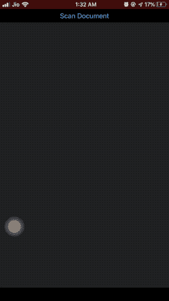

# 在 Swift 中将 UIImage 转换为 PDF

> 原文：<https://betterprogramming.pub/convert-a-uiimage-to-pdf-in-swift-bf9f22b127c5>

## 使用 VisionKit 和 PDFKit


安妮·斯普拉特在 [Unsplash](https://unsplash.com?utm_source=medium&utm_medium=referral) 上的照片

PDFKit 是在 iOS 11 中引入的，这给了开发人员很多喘息的机会，他们之前不得不在他们的应用程序中处理 C++的 PDF 渲染。

PDFKit 允许我们在应用程序中创建、修改和显示 pdf。
本文的目标是使用 Swift 将 UIImage 转换成 PDF。

我们将使用 iOS 13 VisionKit，它有一个文档相机扫描仪。我们已经在这里讨论了 VisionKit 的文档扫描仪[的实现。](https://www.iosdevie.com/p/ios13-vision-text-doc-scanner)

## 行动（或活动、袭击）计划

*   使用 VisionKit 的文档扫描仪扫描图像
*   将它们转换成 PDF 文档
*   使用文件管理器保存 PDF
*   在 PDF 视图中显示 PDF

## 我们将实现什么



最终结果:来自 iOS 设备的屏幕截图

# PDFKit:里面有什么？

PDFKit 包含以下类别:

1.  `PDFPage`:一个`PDFPage`负责渲染 PDF 的单个页面。通常一个`PDFPage`在其初始化方法中需要一个图像。
2.  `PDFDocument`:这个类的一个实例包含了完整的 PDF 数据，并托管每个`PDFPage`。
3.  `PDFView`:这负责在我们的应用程序的 UI 中显示 PDF。它具有以下可自定义的属性:

*   `PDFDisplayMode`:可以是`singlePage`、`singlePageContinuous`、`twoUp`或`twoUpContinuous`
*   `PDFDisplayDirection`:PDF 页面可以`horizontal`或`vertical`滚动

4.`PDFThumbnailView`:用于显示 PDF 页面的缩略图预览。

还有其他类，比如`PDFOutline`和`PDFSelection`(用于选择 PDF 中的文本)，我们不在这篇文章中讨论。

> 要获取 PDF 的完整内容，请使用 PDFDocument 上的`string`属性。要获得 PDFPage 的完整内容，请使用`attributedString`属性。

# UIImage 到 PDFPage 到 PDFDocument

```
let pdfDocument = PDFDocument()for i in 0 ..< scan.pageCount {
   if let image = scan.imageOfPage(at: i).resize(toWidth: 250){
      let pdfPage = PDFPage(image: image)
      pdfDocument.insert(pdfPage!, at: i)        
   }
}
```

这就创建了我们的 PDF。我们已经使用 resize 扩展功能(在本文末尾提供)调整了扫描图像的大小。

## 将 PDFDocument 保存到文档目录

为了保存`PDFDocument`，检索原始数据并将其写入文档目录 URL，如下所示:

```
let data = pdfDocument.dataRepresentation()

let documentDirectory = FileManager.default.urls(for: .documentDirectory, in: .userDomainMask).first!

let docURL = documentDirectory.appendingPathComponent("Scanned-Docs.pdf")

do{       
  try data?.write(to: docURL)       
}catch(let error){
   print("error is \(error.localizedDescription)")
}
```

## 在 PDFView 中显示

最后，我们可以在父视图中嵌入`PDFView`,并在其中显示保存的 PDF:

```
let pdfView = PDFView()pdfView.translatesAutoresizingMaskIntoConstraints = false
view.addSubview(pdfView)let docURL = documentDirectory.appendingPathComponent("Scanned-Docs.pdf")

if fileManager.fileExists(atPath: docURL.path){
    pdfView.document = PDFDocument(url: docURL)
}
```

就是这样。我们已经完成了将一批`UIImages`转换成 PDF 文件。
下面是完整的源代码。

 [## anupamchugh/iowncode

### 此时您不能执行该操作。您已使用另一个标签页或窗口登录。您已在另一个选项卡中注销，或者…

github.com](https://github.com/anupamchugh/iowncode/tree/master/iOSUIImageToPDF)