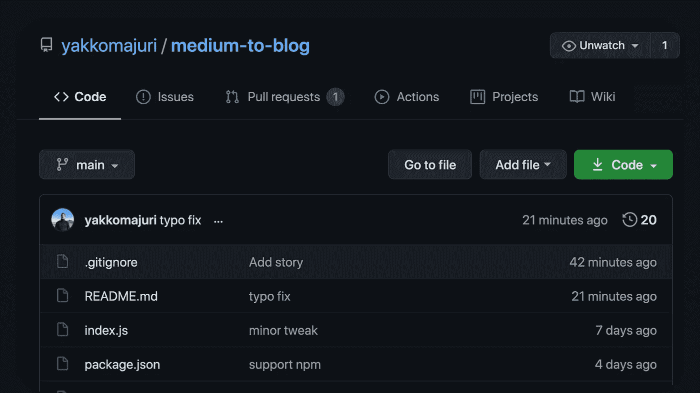
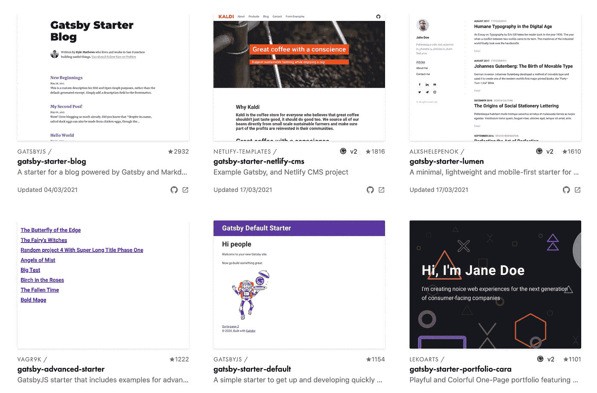
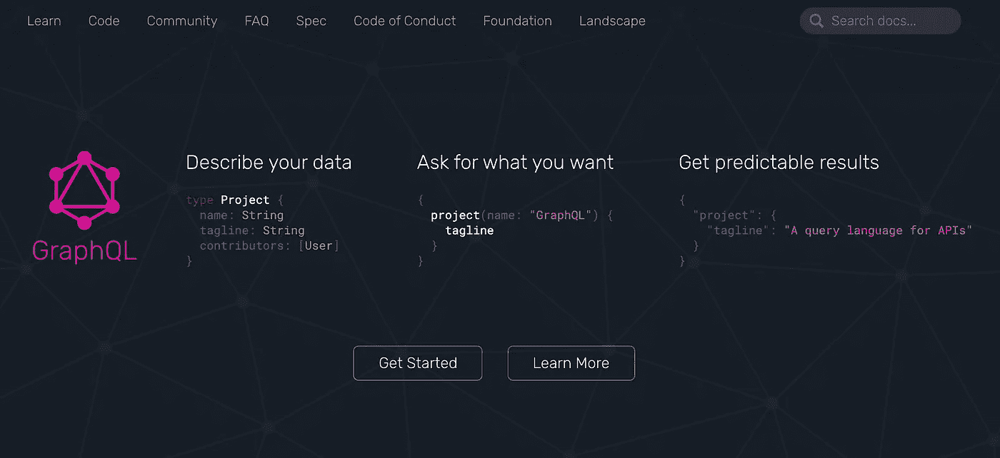
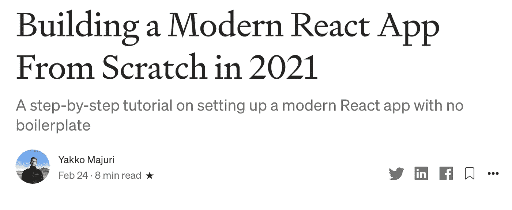

# 如何在 5 分钟内将你所有的媒体文章转换成盖茨比的博客

> 原文：<https://betterprogramming.pub/convert-all-your-medium-posts-to-a-gatsby-blog-in-5-minutes-6f45b38c132a>

## 我构建了一个工具，用一个命令就可以从你的中型博客中生成一个完整的博客



作者照片。

➡️你也可以在 GitHub 上阅读这篇文章。

# TL；速度三角形定位法(dead reckoning)

*   我做了一个工具，可以在五分钟内把你所有的中型帖子转换成盖茨比的博客。
*   你可以这样使用它:

# 演示

# 复制粘贴永远不是答案…

上周末，我发现自己想开一个个人博客，以便发布更多“意识流”风格的文章，这些文章不太适合我的 Medium 页面(不过，我仍然会在 Medium 上写作)。

然而，作为一个已经写作多年的人，我不一定想重新开始。我想把我现有的帖子带在身边，所以我开始考虑如何去做这件事。

最简单的选择是链接到博客中的文章，但这感觉不对。

另一种选择是复制粘贴内容，并手动以 Markdown 格式构建(这是我希望我的博客使用的格式)。这很好，如果不是因为我在 Medium 上有 40 个公共帖子，都包含图片，这将使这个过程漫长而乏味。

因此，我选择了第三种方法:尽可能多地将这个过程自动化——即使这比我完全用手动方式完成要花更长的时间。

然而，有一个警告:我决定在周日下午 2 点做这件事，我想在晚餐前完成。我知道在接下来的一周里我甚至没有时间去看它。

所以，这是我到目前为止。

# 决定做什么

我的第一个想法是建立一个工具，让中等职位进入 Markdown。如果我能做到这一点，我的博客已经成功了一半。

我曾短暂地考虑过构建我自己的“中型 HTML”→Markdown 工具，但后来我发现 [Turndown](https://github.com/domchristie/turndown) 很好地将我的中型帖子的 HTML 转换成 Markdown，所以我决定我不需要在那里重新发明轮子。

有一些警告，比如 Medium 只对代码块使用`pre` HTML 标签，Turndown 期望`pre`中的`code`标签实际创建一个代码块。我分叉拒绝的意图，使这一点和其他变化，但决定推迟到以后。它已经涵盖了我需要的大部分。

我也尝试过用 [Medium 来降价](https://chrome.google.com/webstore/detail/convert-medium-posts-to-m/aelnflnmpbjgipamcogpdoppjbebnjea)，但那对我不起作用，所以我很快就放弃了。

此时，如果我进入一个 Medium 帖子，使用“inspect element”复制 Medium 在文章页面上的一个`article`标签中的所有 HTML，并使用[在线下调工具](https://domchristie.github.io/turndown/)将其转换为 Markdown，我已经得到了一个相当好的结果。与复制-粘贴方法相比，在这里停下来已经节省了我很多时间。

然而，下午还很早，因为到目前为止很多工作已经为我做了，我变得更有雄心了。就在那时，我决定看看我是否能达到这样一种境界，只需将一个中等用户名传递给一个脚本，我就能从中生成一个完整的博客。

# 博客是由什么组成的？



截图自[盖茨比](https://www.gatsbyjs.com/starters/)。

现在有了更清晰的想法，有三个步骤:

1.  以编程方式获取我的所有中型职位。
2.  将职位转换为降价。
3.  从他们那里产生一个博客。

我从底层开始(双关语，非故意的)，因为我觉得这是最快的方法。

所以我打开了[盖茨比入门库](https://www.gatsbyjs.com/starters)页面，选择了最流行的主题。

然后我看了看模板是如何组织它的博客文章的(它们在哪里，前面的东西看起来像什么，等等)。)并很好地了解了如何处理我生成的降价文件:

*   在`content/blog`中为每个帖子创建一个目录。
*   在每个目录中，添加文章降价文件。
*   给每个包含`date`(ISO 格式)、`description`、`title`的帖子添加一个前置事项。

这似乎是我现在需要做的一切。

# 把我的文章给我！



来自 [GraphQL](https://graphql.org/) 的截图

第 3 步已经基本完成，第 2 步很大程度上依赖于现有工具(Turndown)，我转到了第 1 步。

我开始寻找一种方法来获得我的媒体文章列表，这只会让我走进死胡同。

首先，我了解到要使用 Medium API，[我必须给某人发电子邮件以获得访问权限](https://github.com/Medium/medium-api-docs#21-self-issued-access-tokens)。即使那样，我也可能无法从它那里获取文章。

然后我遇到了一些声称有解决方案的人，他们中的很多人说使用 RSS 提要是正确的方法。我查看了我的 RSS 订阅源，只找到了几篇我的最新帖子，所以我不确定 Medium 以前是否会在这里给出完整的列表，但不管怎样，这都是不够的。

我在寻找一种方法来获取我所有文章的 URL 列表或它们的原始内容。复制粘贴这些网址是不可行的。

我进入我的个人资料页面，开始检查网络请求的线索。唯一相关的是一个带有大量查询的对`_graphql`端点的请求。

我没有太多使用 GraphQL 的经验，所以我开始考虑是否可以更容易地以编程方式抓取页面，点击“加载更多”直到我的所有文章都被加载，然后从各自的`a`标签中抓取链接。

然而，在这种想法成为现实之前，我已经下载了 [GraphQL 开发工具](https://chrome.google.com/webstore/detail/graphql-developer-tools/hflnkihcpgldmkepajmpooacmmhglpff)扩展并检查了查询，我现在意识到[大约有 2000 行长](https://gist.github.com/yakkomajuri/d0c89a65b8469af978790518db7d98c3)。唷。

我将这个查询复制到一个 API 测试工具中，并开始试验和检查它的结果。很快，一切对我来说都变得有意义了，我想这是对 GraphQL 力量的一个证明。

我设法大大缩小查询范围，只提取我想要的数据(GraphQL 的全部意义)，当我把注意力转移到参数上时，已经减少到不到 50 行。

这些是`id`、`username`、`homepagePostsLimit`、`homepagePostsFrom`和`includeDistributedResponses`。

它们看起来很简单，但是我仍然需要回答几个问题。

## 如何以编程方式获取 ID？

我知道每个 Medium 用户名都有一个关联的惟一 ID，我记得在查看 RSS 提要时偶然发现了这个。果然，我访问了这个提要，发现了一个带有查询参数`source`的 URL，其中包含了我的作者 ID。

可能有更简单的方法得到这个，但是我甚至没有检查。这已经是我所需要的了。我仔细检查了使用这种方法可以找到其他用户名的 ID(也就是说，它将总是采用相同的格式)，然后继续前进。

## `homepagePostsLimit`的极限是多少？

如果 API 能立刻把我所有的文章还给我，那就太好了。所以我将这个值设置为`300`来调用它，并得到一个限制为 25 的响应。好的，所以我需要处理分页。不过这很简单，API 返回一个`next`对象来实现这个目的。

## `includeDistributedResponses`中的分布式响应是什么？

我发现这与对其他帖子的回复有关，我不需要这些，所以我将其设置为`false`。

# 该查询

玩了一会儿之后，我就满足于下面的查询，我认为这是我所需要的一切(结果比我真正需要的还要多一点):

# 把所有的放在一起

看起来所有的步骤都准备好了，我开始写一个脚本来把它们整合在一起。

我雄心勃勃地开始了这一步，我认为我应该用 TypeScript 写所有的东西，并使它成为一个全球可安装的包，然后可以用`npx`和所有这些东西运行。

但我忍住了，决定尽可能瘦下来。

首先，我编写了一个 JS 脚本来完成以下任务，对我自己的用户名和域使用硬编码值(现在 Medium 支持用户自定义子域，每个用户可以有一个不同的域，所以我需要处理这个问题):

1.  获取 RSS 提要，将其转换为 JSON，并提取用户 ID。
2.  用上面的查询调用 GraphQL 端点，直到我得到所有的帖子。
3.  获取每篇文章 URL 的原始 HTML。
4.  使用 Turndown 将 HTML 转换为 Markdown，只使用`article`标签中的 HTML。
5.  向 Markdown 输出中添加一个前置内容，并将所有输出文件转储到一个目录中。

这几乎是它。我只是遇到了一些问题:

*   我在 Markdown 中添加了一些我不需要的额外内容，比如标题和副标题，以及相当于我的个人资料卡的 Markdown，还有一个关注我的链接，等等。



我的博客里不需要这些。

*   图像似乎不起作用。嗯，我得到了`img`标签和 Markdown 图像语法(``)，Markdown 语法产生了一些微小的图像，而`img`标签似乎没有用。

在这里，在一个更健壮的实现中，我会在将 HTML 转换为 Markdown 之前加入一个相当于 [Beautiful Soup](https://www.crummy.com/software/BeautifulSoup/bs4/doc/) 的东西来清理 HTML，但是我没有心情阅读任何相当于 Beautiful Soup 的 JS 文档，所以我选择了 regex 途径。耶。

我花了一点时间拔掉一些胡须，最后用一些正则表达式清理了 HTML 阶段和 Markdown 阶段的无用东西。

对于图像问题，我花了一点时间测试了`img`标签中的 URL，但是没有任何进展。为了快速完成这项工作，我让一个正则表达式去掉了它们，并专注于如何让这个小图像变大。

一个更经得起未来考验的选择是，实际下载这些图像，而不是仅仅使用介质托管的图像。然而，我摆弄了一下图像 URL，发现我可以在路径中指定一个宽度，这个宽度通常设置得很小。我觉得这已经足够了。我对此也使用了正则表达式，并将默认值改为 600 像素。

这张图片分辨率很低，我相信它是作为某种缩略图使用的(我没有实际检查)，但也可以。

# 0 到 100

现在，脚本已经完成了它需要做的事情，我只需要一种方法将它们连接到一个命令中。

所以我决定使用 env vars 进行配置，并采用了以下方法:

```
yarn && \
gatsby new blog [https://github.com/gatsbyjs/gatsby-starter-blog](https://github.com/gatsbyjs/gatsby-starter-blog) && \
node index.js && \
cd blog && \
gatsby develop
```

如果这不是天生显而易见的，这:

1.  安装依赖项。
2.  创建一个新的盖茨比博客。
3.  运行脚本以获取中型文章，并将格式化的 Markdown 输出到 blog 目录中的正确位置。
4.  进入博客目录。
5.  启动本地服务器。

我后来在`yarn || npm install`中也添加了 npm 支持。你很少会有`package.json`脚本安装依赖，但我只是希望这是一个命令的事情。

# 结论

这就是我如何用一个下午的时间从中型文章中构建一个博客生成器。希望这对某人有用。

这肯定是粗糙的，有些东西需要改进，如图像，代码块，嵌入(如 gists)等。[请随意更新它以适应](https://github.com/yakkomajuri/medium-to-blog)你的需求，因为我不认为我会在它上面花太多时间。