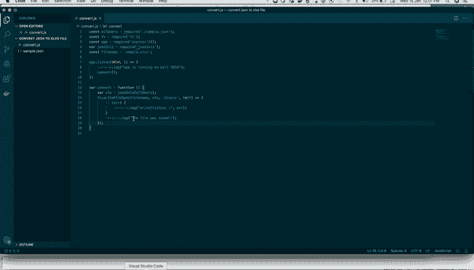
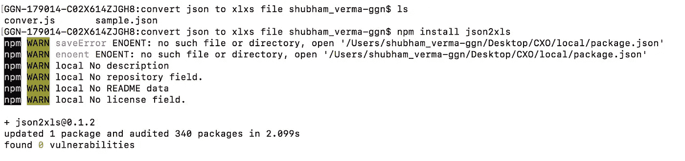
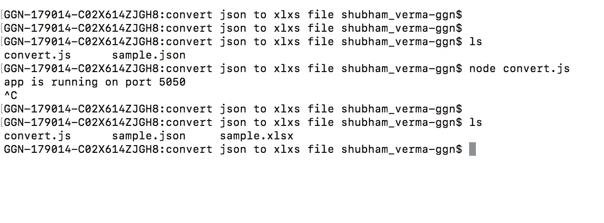

# 用 JavaScript 将 JSON 数据写入 XLSX/Excel 文件

> 原文：<https://betterprogramming.pub/convert-json-to-xlsx-file-in-javascript-e7611a975916>

## 将您的 JSON 转换成. xlsx 文件并保存它



将 JSON 转换为 XLSX 文件

有时候，我们需要下载一个 JSON 数据的`.xlsx`文件。

因此，在本文中，我将向您展示如何使用 JSON 创建一个`.xlsx`文件。为此，让我们首先创建我们的 JSON。我把我的 JSON 保存在一个`sample.json`文件中，需要的时候会导入它。

`sample.json`:

githum:sample . JSON

现在我们有了 JSON，我们将使用它在我们的项目目录中创建一个 XLSX 文件。现在，我们需要编写代码来创建相同的内容。

所以，要做到这一点，让我们创建一个文件`convert.js`，并粘贴以下代码:

`convert.js`

Github: convert.js

现在我们需要安装依赖项，为此，请转到文件位置并运行以下命令:

```
npm install json2xls
```



“npm 安装 json2xls”的快照

现在我们已经安装了我们的依赖项，是时候运行我们的应用程序并在同一个目录中创建`sample.xlsx`文件了。

为此，请运行以下命令:

```
node convert.js
```

这样做之后，您可以看到`sample.xlsx`文件将被创建在同一个目录中。



创建 sample.xlsx 的快照

您可以看到在下面的 GIF 中已经创建了`sample.xlsx`文件:


目录中创建的 sample.xlsx

感谢阅读。