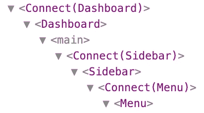

# 如何转换 Redux 来使用 React 钩子

> 原文：<https://betterprogramming.pub/convert-redux-to-hooks-d74d79b04f>

## 从传统 React 组件升级

在这篇文章中，我将尝试解释如何使用 [Redux](https://redux.js.org/) 和 [React Hooks](https://reactjs.org/docs/hooks-intro.html) 。

React Redux 在 2019 年 6 月 11 日发布的[7.1 版本](https://github.com/reduxjs/react-redux/releases/tag/v7.1.0)中给予了钩子的支持。这意味着你可以在你的功能组件中使用带有钩子的 Redux，而不是使用`connect` [高阶组件](https://reactjs.org/docs/higher-order-components.html) (HOC)。

# 什么是钩子？

只是为了刷新一下钩子，钩子是在 React 版本 16.8 中引入的，它们允许您访问功能组件中的状态和生命周期方法。

让我们看一个例子。

像这样的 React 类组件:

可以像这样用钩子写成一个函数组件:

如果你想更深入地了解钩子，我建议你浏览一下关于钩子的详细的[文档](https://reactjs.org/docs/hooks-intro.html)。

# 回到正题

这篇文章的最初目的是解释我们如何使用 Redux 和钩子。

React Redux 现在提供了`useSelector`和`useDispatch`挂钩，可以用来代替`connect`。

`useSelector`是`connect`的`mapStateToProps`的替代品。您传递给它一个函数，该函数接受 Redux 存储状态并返回您需要的状态。

`useDispatch`取代`connect`的`mapDispatchToProps`。它所做的只是返回你的商店的`dispatch`方法，这样你就可以手动分派动作。

够理论？好了，让我们看一个实时例子，在这个例子中，我们将把一个使用`connect`的 React 组件转换成一个使用钩子的组件。

使用`connect`:

现在，用新的 React Redux 钩子代替`connect`:

正如你所看到的，代码是精确的，更少的行意味着更好的性能，更容易阅读，更容易理解，当然，更容易测试。

不使用高阶组件的另一个好处是，您不再得到这种“虚拟 DOM 链”:

现在你已经有了钩子的基本知识以及如何在 Redux 中使用它们，是时候接触一下详细的[文档](https://react-redux.js.org/api/hooks)了。

你今天学到新东西了吗？评论和反馈总是让作者开心！