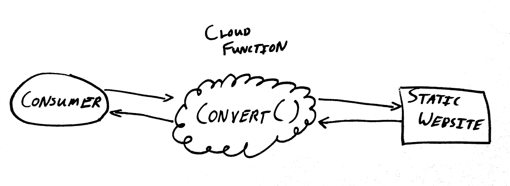
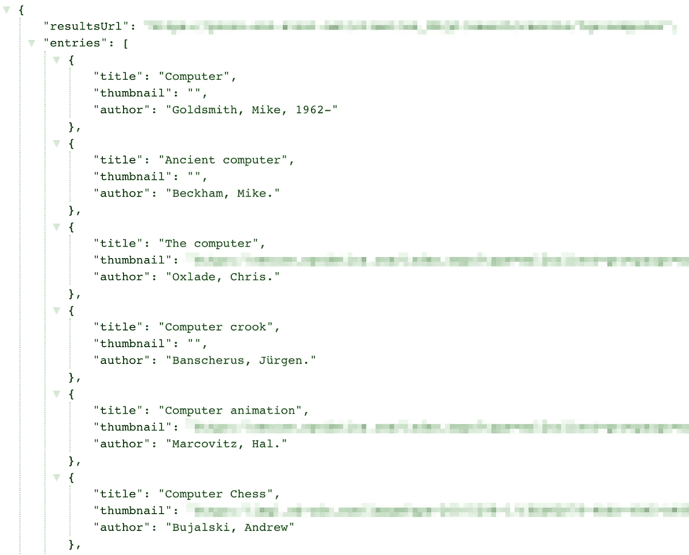
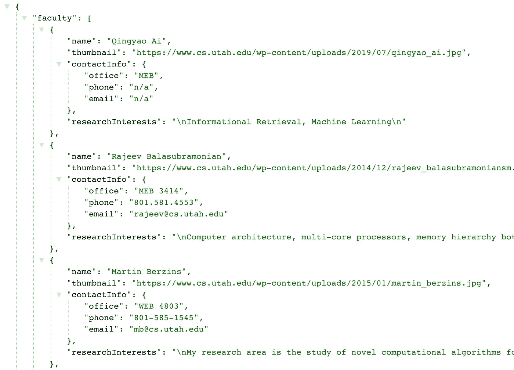
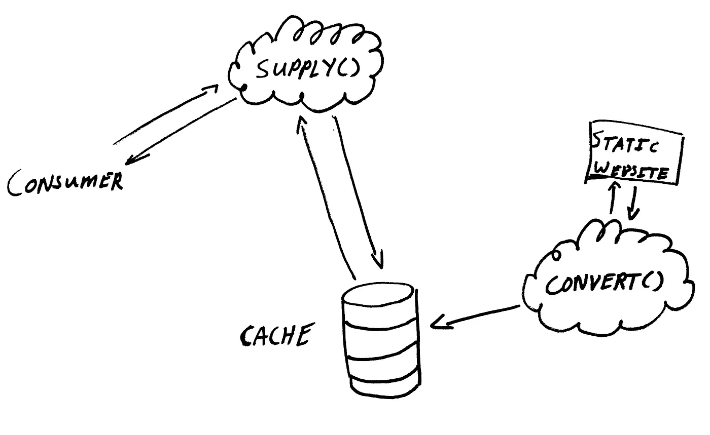

# 将静态网站转换为具有云功能的 REST APIs

> 原文：<https://betterprogramming.pub/convert-static-websites-to-rest-apis-with-cloud-functions-82f4dfd54b38>

## 按需以低成本执行复杂的转换

托拜厄斯·菲舍尔在 [Unsplash](https://unsplash.com/search/photos/data?utm_source=unsplash&utm_medium=referral&utm_content=creditCopyText) 上的照片

我经常遇到这样的情况，我的应用程序需要的数据是可用的，但不是以它可以随时使用的格式。

云功能等微服务在这里真的大放异彩。它们可以根据需要将数据从一种形式转换成另一种形式，而且通常非常便宜。因为它们是不同的执行上下文，所以它们不必与消费应用程序的技术栈相匹配。这使得他们可以使用最适合转换工作的语言和库。

它们还完全封装(隐藏)了通常不优雅的转换代码，使消费应用程序的逻辑简单而集中。

我经常需要的一个转换是从静态网站到 RESTful APIs。让我举几个例子来说明。

# 示例 1:库目录结果

以我当地的图书馆网站为例。我想创建一个浏览器插件，当在线购物者在图书馆找到他们要找的书时通知他们。

[Nicepik](https://www.nicepik.com/selective-focus-photography-of-pile-of-hardbound-books-old-vintage-chipped-table-wood-free-photo-30373) 供图

图书馆网站提供了一个可搜索的在线目录。然而，网站上的所有页面都是在服务器端呈现的。该库也没有公开公共的 web API。

目前，我唯一的选择是将我的搜索查询发送到库的服务器，并向我的扩展添加逻辑来解析返回的搜索结果 HTML。

但是，如果我们创建一个云函数，接受来自我的浏览器扩展的请求，对库的服务器进行网络调用，解析返回的 HTML，并发回一个格式良好的 JSON 响应，会怎么样呢？

转换 API 架构

我们将有效地将本地库的静态呈现网站转换成 RESTful JSON API。

这很酷。

这是我的云函数代码。(我使用带有 AWS Lambda 的[无服务器](https://serverless.com/)框架进行开发和部署)。

这是我的应用从新的 API 获得的 JSON 的图像。这列出了图书馆目录中单词 *computer* 的第一个条目。

希望您已经看到了这种微服务数据转换架构的强大之处。

# 示例 2:计算机科学系

比方说，我们正在开发一个应用程序，根据犹他大学潜在的研究生的研究兴趣，向他们推荐教师导师。

幸运的是，在学校的网站上可以找到一份教师名单，包括研究简介甚至联系方式。

让我们遵循相同的模式来创建一个 web API。代码如下:

犹他大学教师 API 函数代码

以下是来自新教员 API 的回应:

点击这里查看 API 工作直播[。](https://91iqp08xwg.execute-api.us-east-1.amazonaws.com/dev/faculty)

这与图书馆的例子有许多相似之处。但是你注意到不同了吗？

这里有一个重要的问题:教员很少变动*。*

在最后一个示例中，每次云功能收到消费者的搜索请求时，都需要轮询图书馆网站。然而，事实往往并非如此。

在这个教员的例子中，实际上很少需要检查静态网站的更新。这让我们可以缓存教师数据，并简单地偶尔在网站上查询更新。进行这种更改可以将数据源从消费应用程序中分离出来。我们已经从一个云功能转移到两个:

缓存转换架构

一方面，我喜欢这种分离，因为如果您不控制数据源(静态网站或其他)，未经宣布的更改可能需要更新转换代码。

如果没有这种分离，最终用户很可能会立即发现转换失败。

有了它，消费应用程序可能会继续正常运行一段时间。这给了你时间来更新转换代码。

当然，唯一的缺点是额外的复杂性，即确保缓存总是足够新，以适合您的消费应用程序。

# 结论

虽然这篇文章特别适合于从静态网站转换到 RESTful APIs，但是让我重申一下这种云函数转换模式的普遍适用性。

它提供了一个模块化、有针对性的独立环境，可以在其中执行现代应用经常需要的复杂转换操作。