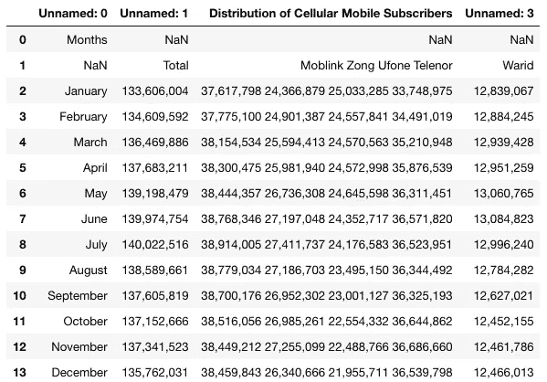
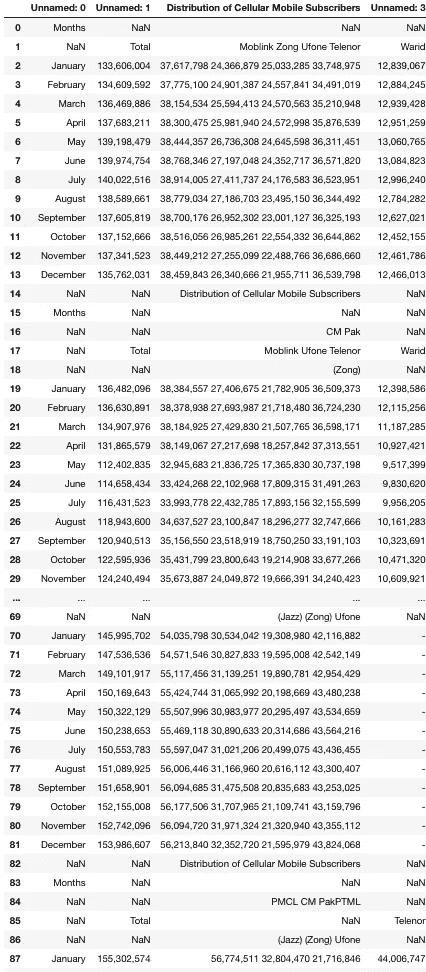

# 如何用 Python 将 pdf 中的表格提取为熊猫数据框

> 原文：<https://betterprogramming.pub/convert-tables-from-pdfs-to-pandas-with-python-d74f8ac31dc2>

## 数字化 pdf 中的数据集


照片由[杰森·库德里特](https://unsplash.com/@jcoudriet?utm_source=unsplash&utm_medium=referral&utm_content=creditCopyText)在 [Unsplash](https://unsplash.com/s/photos/chart?utm_source=unsplash&utm_medium=referral&utm_content=creditCopyText) 上拍摄

在[从 PDF 文件中提取关键词](https://medium.com/@rqaiserr/how-to-convert-pdfs-into-searchable-key-words-with-python-85aab86c544f)之后，初露头角的数据科学家/工程师的下一步自然是弄清楚如何从那些讨厌的 PDF 文件中获取表格。

亲爱的读者，今天是你的幸运日。在我的一个项目中，我数字化了以 PDF 文件形式发布的政府数据集，我想分享一下我是如何做到的。我们将用我们最喜欢的语言:Python 来做这件事。

下面，您将找到设置环境的步骤和如何使用 Python 从 PDF 文件中提取表格的教程，另外！现实世界的例子。

# 设置

对于本教程，我将使用 Python 3.7。你可以使用任何你喜欢的版本，但是，我不能保证如果你使用的是 3.7 以外的版本，任何东西都可以工作。

您将需要以下 Python 库来遵循本教程:

*   [Tabula](http://tabula.technology/) (一个用 Java 编写的 OCR 库，用于 PDF 到 DataFrame 的转换)。
*   [Pandas](https://pandas.pydata.org/)(Python 中的一个数据操作库)。
*   Java 8+(大多数操作系统默认应该有这个)。

上述库可以按如下方式安装在您的终端中(在 macOS 上):

```
pip install tabula-pypip install pandas
```

Java 8 可以使用[这个网站](https://www.oracle.com/technetwork/java/javase/downloads/jdk8-downloads-2133151.html)下载安装。

以上内容应该足以让您从 PDF 文件中提取表格，并将其转换为 pandas DataFrames 以供进一步处理。

启动您最喜欢的编辑器并跟随！

注意:所有以`#`开头的行都是注释。

# 步骤 1:导入所有库

```
import tabula#the pd is the standard shorthand for pandas
import pandas as pd
```

# 步骤 2:将 PDF 表格转换成数据框架

```
#declare the path of your file
file_path = "/path/to/pdf_file/data.pdf"#Convert your file
df = tabula.read_pdf(file_path)
```

就是*说*简单！至少理论上是这样。但是让我们试着用几个真实的例子来做上面的事情，这样你就可以看到 Tabula 在运行。

## 例如:巴基斯坦的电信

因为我是巴基斯坦裔加拿大人，我喜欢看关于我的祖国的统计数据，所以让我们从那里开始吧。

我将使用过去五年巴基斯坦电信用户的月度数据，你猜对了，是 PDF 格式的！你可以在这个网站上找到数据。

```
#file is in the same folder as your program
file_path = "./Telecommination_Sept_2019.pdf""#Convert your filedf = tabula.read_pdf(file_path)
```

输出:



尽管数据有点脏(在熊猫身上很容易清理——如果你对如何清理感到好奇，请留下评论), Tabula 能够如此轻松地阅读它还是很酷的。

但是有一个问题。这个特殊的文件有六页不同的数据。如果我们想阅读所有的页面呢？好了，你需要做的就是将`pages=’all’` 旗帜传递给 Tabula，如下:

```
#file is in the same folder as your program
file_path = "./Telecommination_Sept_2019.pdf""#Convert your filedf = tabula.read_pdf(file_path, pages='all')
```

输出:



很简单，对吧？实际上有很多不同的命令可以传递给 Tabula 来加速它，甚至提供特定的 X-Y 坐标来提取。

这是一个非常棒的图书馆！如果你对深入探索 Tabula 本身感兴趣，请联系我。

喜欢我的作品吗？雇用我进行升级工作！