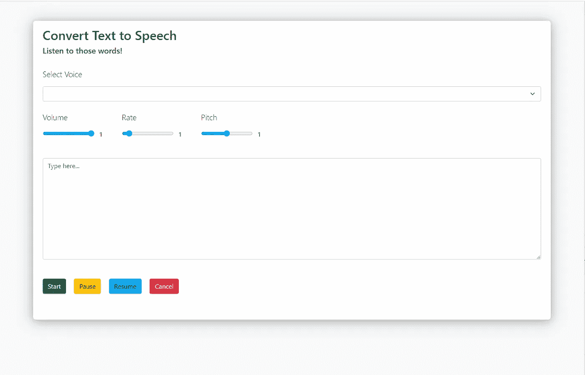
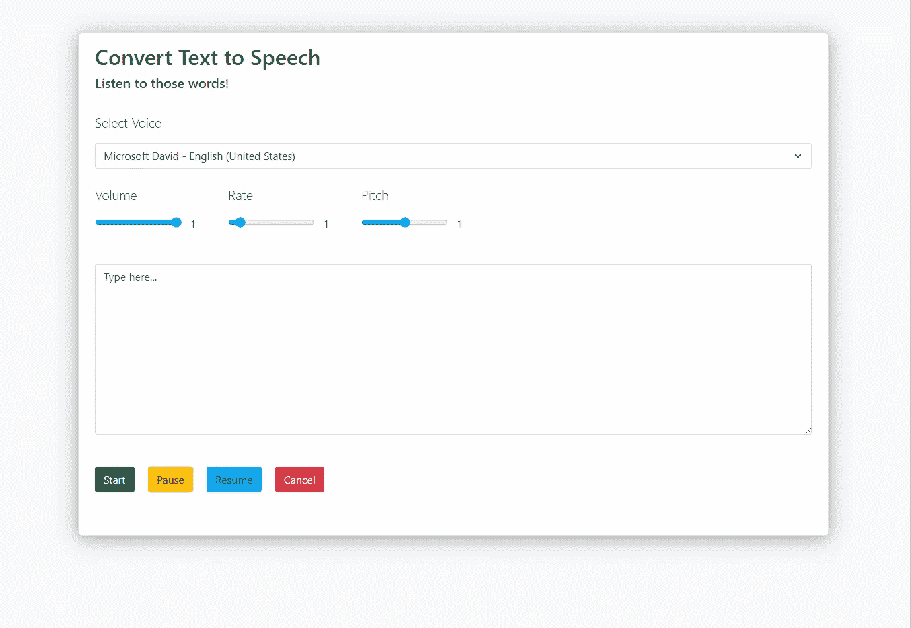

# 使用 JavaScript 中的 Web 语音 API 将文本转换为语音

> 原文：<https://betterprogramming.pub/convert-text-to-speech-using-web-speech-api-in-javascript-c9710bbb2d41>

## 让我们听听那些话！


由 [Daiga Ellaby](https://unsplash.com/@daiga_ellaby?utm_source=medium&utm_medium=referral) 在 [Unsplash](https://unsplash.com?utm_source=medium&utm_medium=referral) 上拍摄的照片

我花了很多时间在媒体上。有时写些东西，但主要是阅读。阅读其他开发人员愿意与社区分享的经验。

最近，我注意到媒体对每个故事都有一个播放按钮。最初，我以为这种特权只授予少数故事或作家。但在下一刻，我知道这是给所有读者的。这意味着我们甚至可以在媒体上听故事。厉害！


然后，就像一个典型的开发人员一样，我想，他们是怎么做到的？我知道在 JavaScript 领域，我们有一个名为 [Web Speech API](https://developer.mozilla.org/en-US/docs/Web/API/Web_Speech_API.) 的 web API，但我从未使用或了解过它。

所以今天，让我们一起来学习这个 web API，甚至创建一个工作示例。

使用[网络语音 API](https://developer.mozilla.org/en-US/docs/Web/API/Web_Speech_API.) 将语音数据整合到在线应用中。在本文中，我们将创建一个使用 [Web 语音 API](https://developer.mozilla.org/en-US/docs/Web/API/Web_Speech_API.) 实现文本到语音转换的简单网页。

为了这个演示，让我们创建一个新目录并创建两个新文件:`index.html`和`text-to-speech.js`

# HTML 文件

在 HTML 文件中，让我们设置以下元素:

*   一个没有选项的`select`菜单。使用 JavaScript，我们将用可能的声音列表填充空的`select`菜单
*   音量、音高和速率的范围滑块
*   键入一个`textarea`
*   演讲的控制按钮

在这个演示中，我们将使用 [Bootstrap 5](https://getbootstrap.com/docs/5.0/getting-started/introduction/) 进行造型。下面是一些代码:

这是它在浏览器中的外观:



输出

# **JavaScript 文件**

在 JavaScript 文件中，我们主要准备使用三个接口:`SpeechSynthesis`、`window.speechSynthesis`和`SpeechSynthesisUtterance`。所以，我们来简单了解一下他们。

## JavaScript `SpeechSynthesis`接口

这是语音合成服务的主要界面，它根据文本输入控制语音的合成或生成。此接口用于开始、停止、暂停和重新开始语音，以及访问设备支持的语音。

该接口中提供的方法如下:

*   `speak()`:将话语(`SpeechSynthesisUtterance`的对象)添加到队列中，当队列前面没有未决的话语时，将说出该话语，这是我们将使用的函数
*   `pause()`:暂停当前正在进行的演讲
*   `resume()`:恢复暂停的演讲
*   `cancel()`:取消所有尚未播放的未决话语或已创建的语音
*   `getVoices()`:获取设备支持的所有语音列表

## **JavaScript** `**window.speechSynthesis**` **属性**

在语音合成控制器接口上调用`speak()`方法，该接口由 JavaScript `window`对象的这个属性引用。

当我们跳到代码中时，我们会更加理解这一点。

## **JavaScript**T9**接口**

这是我们真正从提供的文本中产生语音或话语的界面，包括语言类型、音量、音调、语速等等。在为这个接口创建一个对象之后，我们将它提供给`SpeechSynthesis`对象的`speak()`方法来播放语音。

在`SpeechSynthesisUtterance`接口上有六个我们可以调整的属性。它们如下:

**语言:**

language 属性获取并设置发言的语言。如果未设置，将使用`<html lang=”en”>` lang 值，如果`<html lang=”en”>` lang 不可用，则使用用户代理默认值。

```
speech.lang = "en";
```

文本:

当说出话语时，`text`属性获取并设置将要合成的文本。文本可以以纯文本格式发送。在我们的示例中，当按下开始按钮时，必须设置`text`属性。

让我们给按钮一个`click`监听器。我们应该从`textarea`中检索文本值，并在单击按钮时将其设置为该属性。

```
document.querySelector("#start").addEventListener("click", () => {
  speech.text = document.querySelector("textarea").value;
});
```

音量:

属性获取并设置说话的音量。它是一个指示音量值的浮点数，范围从 0(最低)到 1(最高)。如果未设置此属性，默认值为 1。

向音量范围滑块添加一个`input`监听器，并在滑块值改变时改变音量属性。HTML 标记中已经指定了滑块的最小值、最大值和默认值。

在范围滑块旁边，我们将添加一个`<span>`,在网页上显示音量值。

```
document.querySelector("#volume").addEventListener("input", () => {
  // Get volume value from the input
  const volume = document.querySelector("#volume").value;

  // Set volume property of the SpeechSynthesisUtterance instance
  speech.volume = volume;

  // Update the volume label
  document.querySelector("#volume-label").innerHTML = volume;
});
```

费率:

`rate`属性返回并设置话语的速率。它是一个表示比率值的浮点数，范围从 0.1(最低)到 10(最高)。如果未设置此属性，默认值为 1。

让我们为`rate`做同样的事情，就像我们为`volume`做的一样。

```
document.querySelector("#rate").addEventListener("input", () => {
  // Get rate value from the input
  const rate = document.querySelector("#rate").value;

  // Set rate property of the SpeechSynthesisUtterance instance
  speech.rate = rate;

  // Update the rate label
  document.querySelector("#rate-label").innerHTML = rate;
});
```

间距:

属性返回并设置话语的音高。同样，它是一个浮点值，其中 0 表示最低，1 表示最高。

让我们对`pitch`做同样的事情，就像我们对`rate`和`volume`做的一样。

```
document.querySelector("#pitch").addEventListener("input", () => {
  // Get pitch Value from the input
  const pitch = document.querySelector("#pitch").value;

  // Set pitch property of the SpeechSynthesisUtterance instance
  speech.pitch = pitch;

  // Update the pitch label
  document.querySelector("#pitch-label").innerHTML = pitch;
});
```

声音:

voice 属性检索和修改将用于演讲的声音。应该使用其中一个`SpeechSynthesisVoice`对象。如果没有配置，将使用最适合话语语言设置的默认声音。

我们需要检索`window`对象中可用声音的列表，以设置说话的声音。当`window`对象加载时，声音不会立即可用。这是一个异步操作。当声音被加载时，一个事件将被触发。我们可以设置一个函数，当声音被加载时应该执行这个函数。

```
window.speechSynthesis.onvoiceschanged = () => {
  // On Voices Loaded
};
```

使用`window.speechSynthesis.getVoices()`，我们可以检索声音列表。它将返回一个可访问的`SpeechSynthesisVoice`对象数组。让我们将列表保存在一个全局数组中，并用它来用可用的声音更新 web 页面的选择菜单。

既然已经修改了语音菜单，我们可以向它添加一个`change`事件监听器来更新`SpeechSynthesisUtterance`实例的语音。我们将利用索引号(它被设置为每个选项的值)和声音的全局数组在用户更新声音时更新声音。

```
document.querySelector("#voices").addEventListener("change", () => {
  speech.voice = voices[document.querySelector("#voices").value];
});
```

## 控制

如果你还记得，在我们的 index.html 中，我们有几个控制按钮，比如开始、继续、暂停和取消。让我们通过使用`SpeechSynthesis`接口及其方法让它们工作。

开始:

当按下开始按钮时，`SpeechSynthesisUtterance`实例应该被传递给`window.speechSynthesis.speak()`。这将开始将文本转换成语音的过程。

在调用此函数之前，必须设置 text 属性。

*如果在一个文本到语音转换实例已经运行的情况下启动另一个文本到语音转换实例，新实例将排在当前实例之后。*

```
document.querySelector("#start").addEventListener("click", () => {
  speech.text = document.querySelector("textarea").value;
  window.speechSynthesis.speak(speech);
});
```

暂停:

要暂停当前运行的`SpeechSynthesisUtterance`实例，我们可以使用`window.speechSynthesis.pause()`。

```
document.querySelector("#pause").addEventListener("click", () => {
  window.speechSynthesis.pause();
});
```

简历:

要恢复当前暂停的`SpeechSynthesisUtterance`实例，我们可以使用`window.speechSynthesis.resume()`。

```
document.querySelector("#resume").addEventListener("click", () => {
  window.speechSynthesis.resume();
});
```

取消:

我们可以使用`window.speechSynthesis.cancel()`取消正在运行的`SpeechSynthesisUtterance`实例。

```
document.querySelector("#cancel").addEventListener("click", () => {
  window.speechSynthesis.cancel();
});
```

现在，我们完成了所有的控件，并且已经设置了所需的属性。所以，这里是 `text-to-speech.js`的最终版本:

这是浏览器屏幕上的最终输出。



最终输出

现在，只需在`textarea`中输入一些文本，然后点击开始按钮，听你刚刚写的单词。

```
**Want to Connect?**Connect with me on [LinkedIn](https://www.linkedin.com/in/gouravkajal/).
```

感谢阅读！