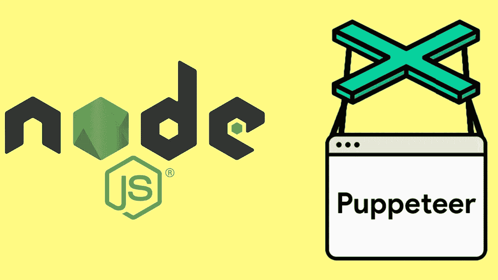
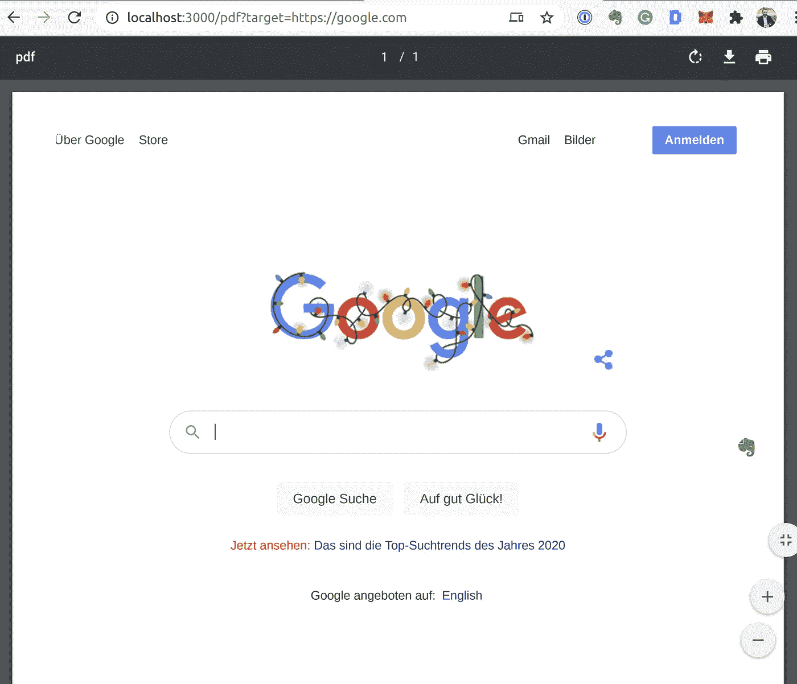

# 使用 Puppeteer 和 Node.js 将网页转换成 pdf

> 原文：<https://betterprogramming.pub/convert-web-pages-into-pdfs-with-puppeteer-and-node-js-8e72fb3d0bd2>

## 使用 Node、Puppeteer 和 Chromium 从任何网页生成 PDF 文档



作者照片。

作为 web 开发人员，您可能希望生成网页的 PDF 文件以与客户共享，在演示文稿中使用它，或者将其作为新功能添加到您的 web 应用程序中。不管你的理由是什么，[木偶师](https://developers.google.com/web/tools/puppeteer)——谷歌的无头浏览器和浏览器节点 API 让你的任务变得非常简单。

在本教程中，我们将看到如何使用 Puppeteer 和 Node.js 将网页转换为 PDF。让我们从快速介绍什么是 Puppeteer 开始这项工作。

# 什么是木偶戏，为什么它很棒？

用[谷歌自己的话说](https://github.com/puppeteer/puppeteer):

> “Puppeteer 是一个节点库，它提供了一个高级 API 来控制无头 Chrome 或 DevTools 协议上的 Chrome。”

# 什么是无头浏览器？

如果你不熟悉术语*无头浏览器*，它只是一个没有 GUI 的浏览器。从这个意义上来说，无头浏览器只是另一个理解如何呈现 HTML 网页和处理 JavaScript 的浏览器。由于缺少 GUI，与无头浏览器的交互通过命令行进行。

即使 Puppeteer 主要是一个无头浏览器，您也可以将其配置为使用非无头 Chrome 或 Chrome。

# 你能用木偶师做什么？

Puppeteer 强大的浏览器功能使其成为 web 应用测试和 web 抓取的完美候选。

举几个例子，Puppeteer 为 web 开发人员提供了完美的功能:

*   生成 pdf 和网页截图。
*   自动化表单提交。
*   抓取网页。
*   执行自动化 UI 测试，同时保持测试环境最新。
*   为单页应用程序(spa)生成预呈现内容。

# 设置项目环境

你可以在后端和前端使用木偶师来生成 pdf。在本教程中，我们将使用节点后端来完成任务。

初始化 NPM 并设置常用的 Express 服务器，开始学习本教程:

在开始之前，请确保使用以下命令安装木偶师 NPM 软件包:

```
npm install puppeteer
```

# 将网页转换为 PDF

现在我们进入教程中激动人心的部分。使用 Puppeteer，我们只需要几行代码就可以将网页转换成 PDF。

首先，使用 Puppeteer 的`launch`函数创建一个浏览器实例:

```
const browser = await puppeteer.launch();
```

然后，我们创建一个新的页面实例，并使用 Puppeteer 访问给定的页面 URL:

```
const webPage = await browser.newPage();const url = "https://livecodestream.dev/post";await webPage.goto(url, {
    waitUntil: "networkidle0"
});
```

我们已经将`waitUntil`选项设置为`networkidle0`。当我们使用`networkidle0`选项时，木偶师会一直等到最后 500 毫秒内没有新的网络连接。这是一种确定站点是否已经完成加载的方法。这并不准确，木偶师还提供了其他选择，但在大多数情况下是可靠的。

最后，我们从抓取的页面内容创建 PDF，并将其保存到我们的设备:

打印到 [PDF 功能](https://github.com/puppeteer/puppeteer/blob/v5.5.0/docs/api.md#pagepdfoptions)相当复杂，允许大量定制，这太棒了。以下是我们使用的一些选项:

*   `printBackground`:当此选项设置为`true`时，木偶师会将您在网页上使用的任何背景色或图像打印到 PDF 中。
*   `path`:指定保存生成的 PDF 文件的位置。您还可以将它存储到内存流中，以避免写入磁盘。
*   `format`:您可以将 PDF 格式设置为给定的选项之一:`Letter`、`A4`、`A3`、`A2`等。
*   `margin`:您可以使用此选项为生成的 PDF 指定边距。

PDF 创建完成后，用`browser.close()`关闭浏览器连接。

# 构建一个 API 来从 URL 生成并响应 pdf

根据我们目前收集的知识，我们现在可以创建一个新的端点，它将接收一个 URL 作为查询字符串，然后将生成的 PDF 流回客户端。

代码如下:

如果您启动服务器并使用包含我们想要转换的 URL 的`target`查询参数访问`/pdf`路径，服务器将直接提供生成的 PDF，而不会将其存储在磁盘上。

下面是一个 URL 的例子:`[http://localhost:3000/pdf?target=https://google.com](http://localhost:3000/pdf?target=https://google.com)`。

它将在图像上生成以下 PDF:



示例 PDF 捕获

就是这样！您已经完成了网页到 PDF 的转换。那不是很容易吗？

如前所述，木偶师提供了许多定制选项，所以请确保您有机会获得不同的结果。

接下来，我们可以改变视窗大小，以捕捉不同分辨率下的网站。

# 用不同的视口捕捉网站

在之前创建的 PDF 中，我们没有为木偶师访问的网页指定视窗大小。相反，我们使用默认的视窗尺寸:800×600 像素。

但是，我们可以在抓取页面之前精确设置页面的视窗大小:

```
await webPage.setViewport({ width: 1200, height: 800 }); await webPage.goto(url, {
    waitUntil: "networkidle0"
});
```

# 结论

在今天的教程中，我们使用了 puppet eer——一个用于 headless Chrome 的节点 API 来生成给定网页的 PDF。既然您现在已经熟悉了 Puppeteer 的基础知识，您可以在将来使用这些知识来创建 pdf，甚至用于其他目的，如 web 抓取和 UI 测试。

感谢阅读！