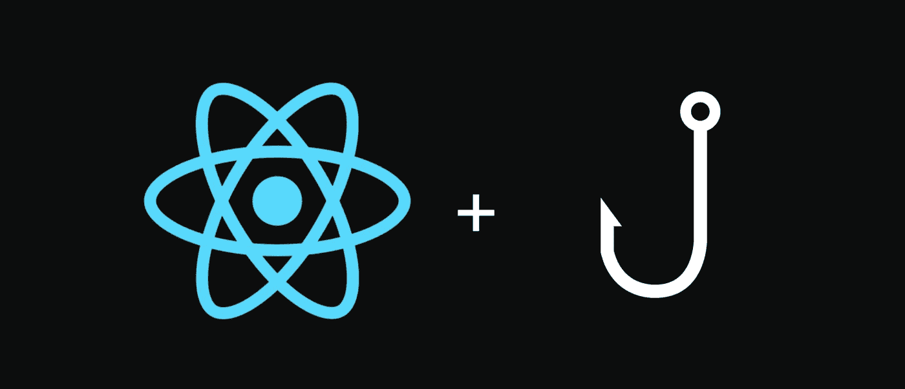
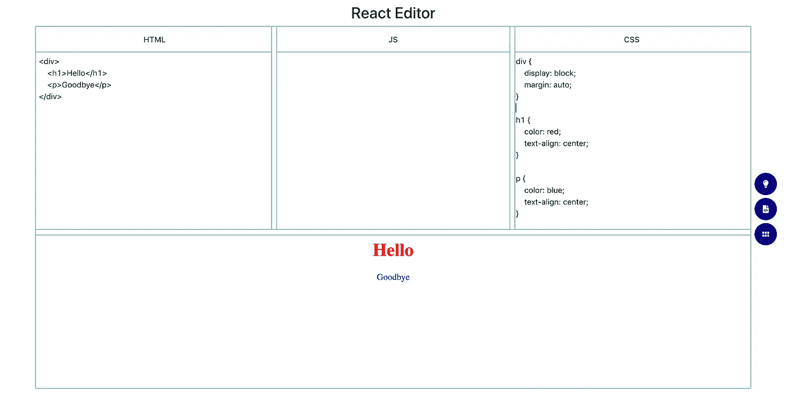

# 使用 React 挂钩将您的类组件转换为功能性组件

> 原文：<https://betterprogramming.pub/convert-your-class-component-to-a-functional-one-with-react-hooks-ab5f4d11f9bc>

## 构建精益、平均的组件



图片来自[免费代码营](https://cdn-media-1.freecodecamp.org/images/1*0MgGEfZfLO91g1Oa2h3ebQ@2x.png)

[React 钩子](https://reactjs.org/docs/hooks-intro.html)是 React 16.8 中一个有效的附加功能，允许你在功能组件中使用状态。这有助于保持组件的精简和更好的性能，同时仍然允许本地状态实现的灵活性。

在这篇文章中，我将带您经历一个无痛的过程，将我的一个类组件转换成一个功能组件，而不影响我的状态需求。

我们将转换我的`View`组件，它是我更大的 React 编辑器应用程序的一部分。如果你看过我的上一篇帖子， [*如何在你的 React App*](https://medium.com/better-programming/how-to-implement-dark-mode-in-your-react-app-63c1a0c5e337) 中实现黑暗模式，你就知道我指的是什么了。

如果您还没有(您应该这样做)，我的 React 编辑器是一个在线文本编辑器，它允许用户输入 HTML、CSS 和 JavaScript，然后编译所有代码并在`View`中生成渲染结果。

渲染结果如下。



视图组件是带有红色和蓝色文本的底部部分。

请注意，我的应用程序样式不会干扰`View`中的样式。

这是因为我使用 React 的`[Iframe](https://www.npmjs.com/package/react-iframe)`组件将用户提供的所有代码与我用于应用程序其余部分的代码隔离开来。下面是我的类组件，在切换到钩子之前。

如您所见，我有一个状态值，`compiled`，它是编译后的 HTML、CSS 和 JavaScript，将被插入到一个`Iframe`组件中。

我需要使用`componentDidUpdate`,因为每当`this.props.compiled`更新时，我都需要调用它:

```
x.contentDocument.open()         
x.contentDocument.close()
x.contentDocument.write(this.state.compiled)
```

以便`Iframe`反映最新的编译数据。我不一定需要将`compiled`添加到 state 中，但是出于演示的目的，我决定将它包含在内。

现在，让我们清理代码，将组件转换成使用钩子。

首先，我们来关注一下国家。

```
state = {        
   compiled: ''
}
```

上面的代码可以被重写来使用我们的第一个钩子，叫做`[useState](https://reactjs.org/docs/hooks-state.html)`。

## 使用状态

我们可以用`useState`重写上面的代码。见下文。

```
const [compiled, setCompiled] = useState('');
```

我们来分析一下。

你可以看到我们有自己的状态值，`compiled`。然后，你可以在数组中看到额外的`setCompiled`。这将是用于更新`compiled`的函数。

如果你想设置`compiled`为`'<h1>hello</h1>'`，你可以写`setCompiled('<h1>hello</h1>')`而不是调用`this.setState({compiled:'<h1>hello</h1>'})`。

我们传递给`useState`的参数表示我们希望我们的值具有的初始值。`compiled`应该是空字符串。

接下来，我们将重点关注替换生命周期方法，`componentDidMount`和`componentDidUpdate`。这些对于类组件来说是有用的方法，但是对于函数组件来说是不可用的…直到现在(某种程度上)。

## 使用效果

`[useEffect](https://reactjs.org/docs/hooks-effect.html)`挂钩允许您在功能组件中执行副作用。

这些副作用是由组件响应某种变化(如状态变化、API 请求等)而重新呈现所造成的影响。

例如，如果您有一个名为`time`的状态值，一个时钟组件的指针移动以反映该值的副作用，`this.state.time`可能是一个记录/发送时间数据的函数的执行。

这与我们的类组件有什么关系？

如果您查看我们以前的组件生命周期方法，您可能已经注意到代码有点多余。我们正在尝试执行`contentDocument`方法，以便在`componentDidMount`和`componentDidUpdate`中将`Iframe`内容设置为等于`this.props.compiled`或`this.state.compiled`。

我们可以抽象出`contentDocument`功能，然后在需要的时候在`componentDidMount`和`componentDidUpdate`中调用这个助手函数。

这可以减少代码的味道，但关键是我们仍然必须在两种生命周期方法中使用相同的功能。虽然我们希望这样做是有道理的，但是`useEffect`可以帮助我们用一个钩子完成这两项任务。

> "如果你熟悉 React 类生命周期方法，你可以把`useEffect`钩子看作是`componentDidMount`、`componentDidUpdate`和`componentWillUnmount`的组合."— [反应文件](https://reactjs.org/docs/hooks-effect.html)

`useEffect`的工作方式是在组件第一次挂载和重新渲染时执行功能。

传统上，从 render 设置状态是不明智的，可能会导致错误。

使用`useEffect`，当组件挂载/重新渲染时，我们可以执行更新状态值所需的功能，而不会产生任何问题。见下文。

我们运行`setCompiled`并传递它`props.compiled`，因为我们想将`compiled`的状态值设置为等于传递的`compiled`属性。然后，我们运行我们的`contentDocument`方法来重写`Iframe`内容，以反映新的`compiled`值。

如果您想知道如何控制`useEffect`何时执行，只需看看最后的参数`[props.compiled, compiled]`即可。通过传递这些参数，`useEffect`将把`props.compiled`的当前值与最近一次重新渲染前`compiled`的状态值进行比较。

如果相同，无需重新渲染。否则，重新渲染，然后再次比较这些值。你可以把它想成类似于`componentDidUpdate`里有的`prevProps`和`this.props`。

下面是我们的类到功能组件转换的最终结果。

通过实现 React 钩子，我们能够将我们的类组件转换成一个函数组件，这导致了更多可读的代码，更少的冗余，并且潜在地从我们的组件中获得更多的[最佳性能](https://medium.com/better-programming/rundown-of-the-most-important-react-hooks-5c9ec4cac5a2)。

在此 *将您的免费媒体会员升级为付费会员，每月只需 5 美元，您就可以收到来自各种出版物上数千名作家的无限量无广告故事。这是一个附属链接，你的会员资格的一部分帮助我为我创造的内容获得奖励。谢谢大家！*

# 参考

[](https://reactjs.org/docs/hooks-intro.html) [## 介绍钩子-反应

### 钩子是 React 16.8 中的新增功能。它们允许您使用状态和其他 React 特性，而无需编写类。这个…

reactjs.org](https://reactjs.org/docs/hooks-intro.html) [](https://medium.com/better-programming/how-to-implement-dark-mode-in-your-react-app-63c1a0c5e337) [## 如何在你的 React 应用中实现黑暗模式

### 让用户的眼睛休息一下

medium.com](https://medium.com/better-programming/how-to-implement-dark-mode-in-your-react-app-63c1a0c5e337) [](https://www.npmjs.com/package/react-iframe) [## react-iframe

### 包含 iframed 页面的简单 React 组件。该组件完全受 typescript 支持。所有其他属性…

www.npmjs.com](https://www.npmjs.com/package/react-iframe) [](https://reactjs.org/docs/hooks-state.html) [## 使用状态钩子-反应

### 钩子是 React 16.8 中的新增功能。它们允许您使用状态和其他 React 特性，而无需编写类。的…

reactjs.org](https://reactjs.org/docs/hooks-state.html) [](https://reactjs.org/docs/hooks-effect.html) [## 使用效果钩-反应

### 钩子是 React 16.8 中的新增功能。它们允许您使用状态和其他 React 特性，而无需编写类。的…

reactjs.org](https://reactjs.org/docs/hooks-effect.html) [](https://medium.com/better-programming/rundown-of-the-most-important-react-hooks-5c9ec4cac5a2) [## 最重要的反应挂钩的概述

### 比较功能组件和基于类的组件的速度和性能

medium.com](https://medium.com/better-programming/rundown-of-the-most-important-react-hooks-5c9ec4cac5a2)