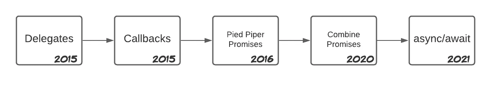

# 将 Swift Facades 转换为带有延续的异步/等待语法

> 原文：<https://betterprogramming.pub/convert-your-swift-facades-to-the-new-async-await-syntax-using-continuations-d4a7bda4611b>

## 在转换回调或基于委托的 API 时，利用延续的力量

来源: [Undraw](https://undraw.co/)

与 Swift 5.5 一起发布的新的`async/await` Swift concurrency API 终于在去年 6 月的 WWDC 21 上亮相。这一新架构满足了我们 iOS 开发者的所有期望，自 2014 年 Swift 首次发布以来，我们就一直在热切地等待这一天的到来，2017 年克里斯·拉特纳本人的 [Swift 并发宣言](https://gist.github.com/lattner/31ed37682ef1576b16bca1432ea9f782#part-1-asyncawait-beautiful-asynchronous-apis)更是提振了我们的希望。

在推出的所有新 API 和工具中，新的`async/await`语法、参与者和任务吸引了 Swift 社区的大部分注意力。确实如此，这些新增加的功能大大提高了异步代码的可读性，以及确保应用程序中线程安全的容易程度。

然而，当时引入了另一种机制，尽管它们在与 async/await: Continuations 一起工作时非常强大，但并没有引起太多的注意。

# 什么是延续？

根据[文档](https://developer.apple.com/documentation/swift/checkedcontinuation)，延续是同步和异步代码之间的接口机制，记录正确性违规。

更准确地说，延续是一个在给定点捕获程序状态的对象，能够在需要时继续它。

这听起来可能仍然很抽象，但是当我们考虑到苹果公司到目前为止是如何实现异步代码的，以及回调和委托模式时，我们可以更深入地理解它。

延续在使用这两种模式时大放异彩:它们通过帮助创建新的异步函数来支持旧的模式，从而充当旧世界(回调和委托)和新世界(`async/await`以获得更具可读性和结构化的代码)之间的桥梁。

这在 facade 包含这些模式的第三方库或 Apple APIs 时很有帮助，正如我们今天将看到的情况。

# 用延续来修饰基于委托的类

在我们的 iOS 团队中，我们喜欢将一些苹果或第三方开发者的组件与我们自己的组件一起展示。这种模式的目的是多方面的，但有三点非常突出:

*   我们用一个更简单的 API 来提高组件的可读性和可用性，这个 API 隐藏了一个更复杂的 API 的细节
*   我们让模仿变得更容易，从而提高了代码的可测试性
*   如果我们想使用一项新技术，更松散的耦合使得替换那个 facaded 组件变得容易

以我们的`LocationManager`班为例。如前所述，我们希望简化并隐藏苹果的`CLLocationManager`的复杂性，它是通过`CLLocationManagerDelegate`协议的委托模式实现的。

更简单地说，我们在给定时刻只获取一次用户位置，而不需要一直监听位置变化。

尽管如此，我们并不反对代表模式本身；我们把它作为我们工具集中的另一个强大的工具，可能对正确的情况非常有用。

回到我们的例子，重要的是要注意，因为我们只需要位置一次(启动并忘记)，我们可以将我们的 API 转换为`async/await`，就像我们之前使用承诺一样。

如果需要在用户位置发生变化时进行更新，我们仍然需要使用某种反应式编程范例，如 Combine 或 RxSwift，因为需要观察连续的流程。

# 快速并发进化

`LocationManager`文件的 git 历史是追踪 Swift 和我们团队并发性发展的一个非常有趣的来源。

在短暂地使用了原始的委托 Apple API 之后，我们开始使用回调对它进行 facading，通过闭包将新的位置传递给客户机。

在那之后，我们发现了承诺的力量，并创建了我们自己的 light Promises 开源库来实现它们。(同样，如果需要持续更新，我们会使用更具反应性的方法)。

然后 Combine 出现了，我们用 Combine 对应库替换了第三方 Promises 库。最后，时间到了，据说会停留很长时间，当返回的出版商可以被踢出去，并由`await`关键字取代。

Swift 异步代码在 WELT iOS 中针对位置管理器的演变

# 组合立面

如前所述，我们的 LocationManager 在`async/await`之前的最后一个版本是在 Combine 的出版商和承诺的帮助下实现的:

如您所见，在 promise 实例属性的帮助下，通过保留返回的发布者并在更新时做出反应，我们能够在获得位置时让该类成为客户端:

# 从合并到异步/等待继续

这种方法实现了我们在创建外观时的目标:它隐藏了苹果的`CoreLocation`实现细节，并提供了一个更容易处理的 API。

但是在我们对改进的贪得无厌的渴望中，我们意识到通过将 API 转换成`async/await`，它仍然可以更简单、更易读。我们如何将 CoreLocation 异步委托模式与它联系起来呢？在我们新朋友的帮助下，检查继续。

以类似于我们通过 promise 属性返回发布者的方式，我们现在将使用检查的延续来在调用`updateLocation`时保持程序状态，以便在检索到位置后继续:

在这里我们:

*   为我们的延续类型创建一个`typealias`,使它和我们的类一起更具可读性
*   在该类型的属性中保留位置延续
*   当位置被请求时，我们开始继续请求`CLLocationManager`更新位置。该延续引用保存在我们的属性中，因此当获得正确的值时，它可以被恢复。(或有错误)
*   以这种方式，当我们用更新的位置得到核心位置委托回调时，我们用那个值继续我们的继续。这将恢复原始函数的执行。相反，如果我们得到一个错误，我们继续抛出它。

这样，调用我们经理的代码就简单多了:

请注意，由于新的`async/await`语法，现在获取位置的调用是多么简单明了。

需要注意的是，continuation 应该只被调用一次来恢复。

如果我们不恢复它，函数客户端将永远等待，无限期地持有资源

如果我们这样做不止一次“ala 反应流”你的应用程序将崩溃。这里没有选择。

因此，我们必须特别小心，以避免这些灾难。在我们的案例中，我们通过以下方式避免它:

*   当`CoreLocation`返回错误时恢复继续。这样，我们确信它将至少恢复一次。
*   在继续后立即将继续设置为零。这样我们就可以确定它不会被调用多次。如果再次需要该位置，它将被重新创建。

# 检查过还是不安全？

Apple 提供了两种类型的延续可以使用:已检查的和不安全的。顾名思义，从[文档](https://developer.apple.com/documentation/swift/checkedcontinuation)来看:

> `CheckedContinuation`对缺失或多个恢复操作执行运行时检查。`UnsafeContinuation`避免在运行时强制执行这些不变量，因为它旨在成为一种低开销的机制，用于将 Swift 任务与事件循环、委托方法、回调和其他非`async`调度机制进行交互。然而，在开发过程中，验证测试中的不变量的能力是很重要的。因为这两种类型具有相同的接口，所以在大多数情况下，您可以用一种替换另一种，而无需进行其他更改。

因此，如果您想使用不安全的延续，您必须:

*   要确保你的延续会一直继续下去
*   分析你的应用程序，验证伴随检查延续而来的额外检查是否导致了一些性能下降

如果以上任何一点对你来说都不是真的，考虑到错过或多次恢复操作的代价，我建议留在安全的区域使用检查过的延续。

# **夺回**

在本文中，我们承认了延续在新的 Swift 并发模型中的作用，以及它与我们相关的原因。

在简要回顾了 Facade 如何对实现干净的代码和我们应用程序中并发性的历史至关重要之后，我们继续在 Continuations 的帮助下将我们的核心位置 Facade 从 Combine Promises 迁移到一个异步语法 API。

接下来，我们陈述了不继续我们的延续或者不止一次继续的后果，以及何时选择不安全的延续而不是检查过的延续。

我希望现在您的工具箱中有了延续作为另一个强大的工具，可以在从回调或委托模式迁移到 async/await 时使用。如果您有任何问题、意见或建议，请告诉我。

编码快乐！！