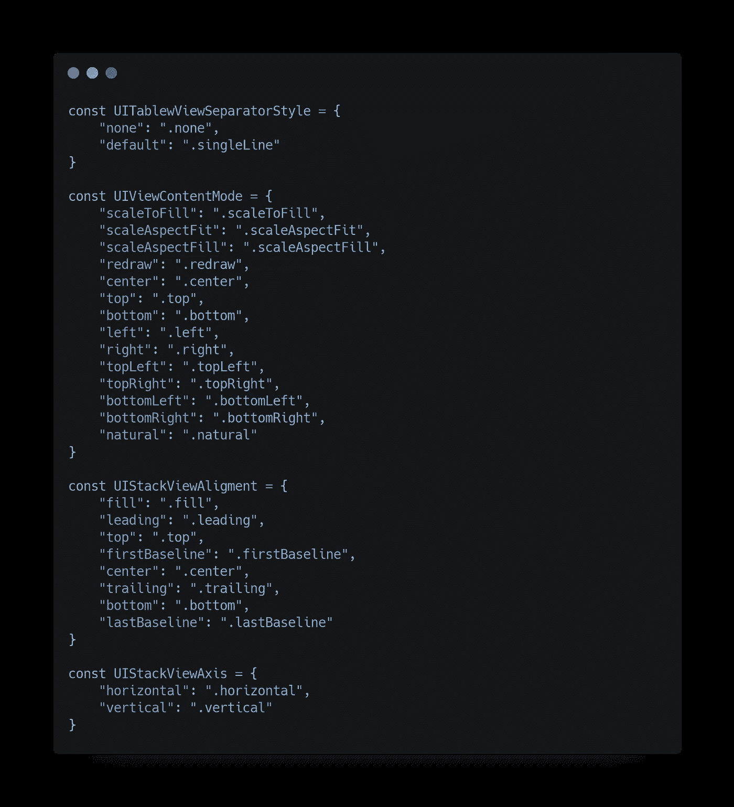
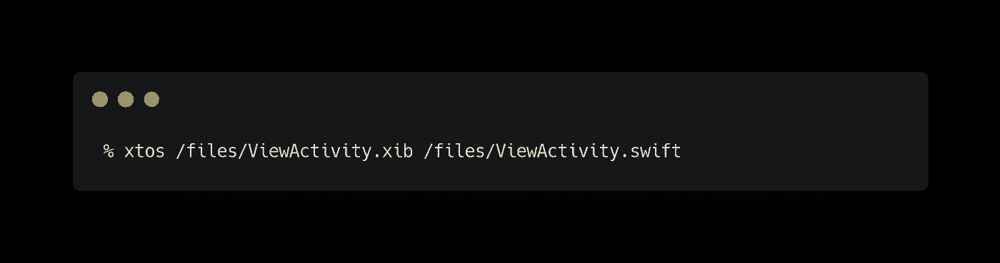
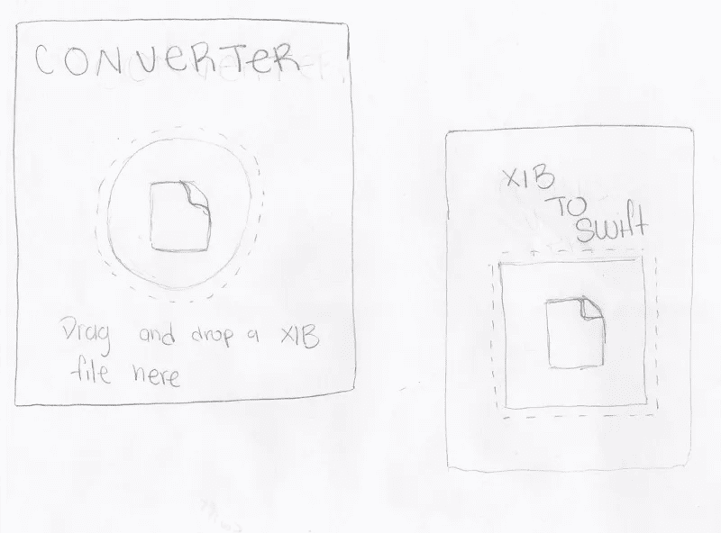
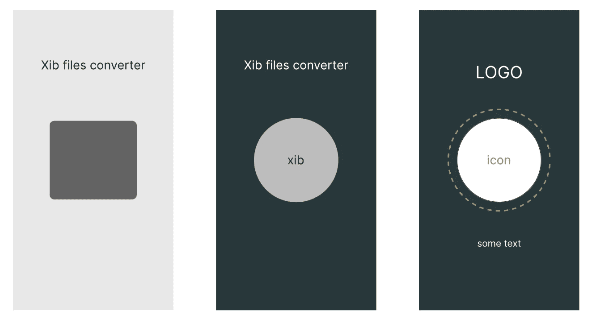
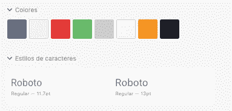
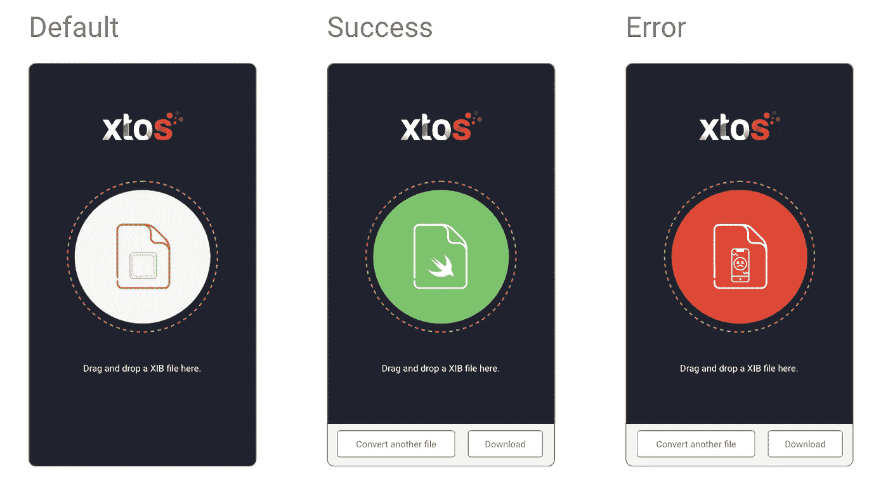
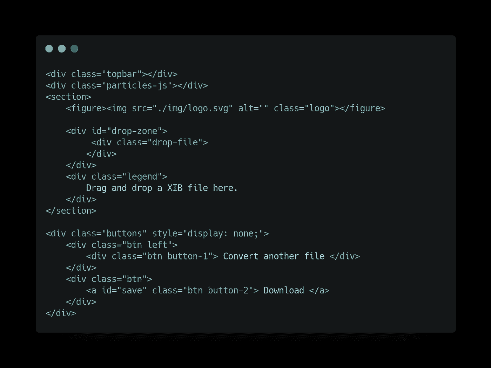

# 将 Node.js 脚本转换为桌面应用程序

> 原文：<https://betterprogramming.pub/converting-a-node-js-script-into-a-desktop-application-844c328e2858>

## 这是一个简单的脚本如何变成一个漂亮的桌面应用程序的故事

克里斯多夫·高尔在 [Unsplash](https://unsplash.com?utm_source=medium&utm_medium=referral) 上拍摄的照片。

这是我如何将一些基本的 UI 设计概念、Node.js、JavaScript、Swift、HTML 和 CSS 的知识放入一个电子容器中，以创建一个非常好看的应用程序，允许 iOS 开发者将那些旧的 XIB 文件转换为 Swift 代码。

为了解释这个工具是如何诞生的，我将使用克里斯托弗·诺兰的蝙蝠侠电影(我喜欢这个三部曲)。

# 开始

## 创造核心

不，这里没有涉及某人父母的悲惨事故。但是有一个关于伟大事物如何诞生的故事。

这一切都是从学习如何创建 XIB 文件开始的。当你打开故事板或 XIB 文件时，有时 Xcode 会神奇地改变一些属性，即使你还没有接触过它。我对此非常好奇，想知道这些 XIB 文件的内容以及它们为什么会改变。

## 核心

我做的第一件事是创建一个脚本，将XML 文件转换成 JSON 文件，并给对象一个更好、更直观的表示。我使用 Node 用 JavaScript 编写了这个脚本，因为我以前是一名全职的 Node 开发人员，仍然有一些技能。就像一个叫 ras al Ghul**的家伙把那些技能传给了我。**

**首先，我发现一般变化的值是 Xcode 用来标识那些元素的某种键。但是我的好奇心更进一步。**

**当我遍历转换后的 XML 文件的 JSON 对象时，我看到了一些模式，并开始编写一些函数来将这些对象组合在一起。然后我意识到我已经按类型对所有视图进行了分组。**

**那一刻，我想，“嘿，我可以用这个做很多事情。”我开始编写一个 map 类，它将接受对象数组，并将它们转换成 UIKit 元素。**

**这个工具的核心就是这样诞生的。**

****

**这是映射器的外观**

## **名字**

**创建这个脚本后，我开始在一些必须迁移到 Swift 代码的视图中使用它。为了在终端中使用这个工具，我必须给出一个名称，这样我就可以更容易地记住每次想要运行脚本时要执行的命令。我把它叫做 *xtos* ，是 Xib 到 Swift 的缩写。**

****

**在终端中使用 xtos**

# **黑暗骑士**

## **构建用户界面**

**很多人认为小丑只是一个戴着面具的恶棍。其他人认为他是其他事物的代表。一些开发者认为 UI 设计师是某种恶棍，但我真的认为他们是我们用户想要的代表。**

**在使用该脚本一段时间后，我认为如果它有一些接口就好了，这样就不必在终端中运行脚本和更改参数。**

**当我开始考虑我的应用程序应该是什么样子时，我首先开始寻找某种灵感。我发现了许多不同类型的转换工具。有些是全屏幕格式，有些是固定大小，占用最小的空间。我更喜欢固定的尺寸，因为我相信屏幕空间是所有桌面开发者都应该关心的事情。我们必须允许用户在同一个屏幕上同时打开多个工具。当我们的应用程序的初始输入是通过拖放文件时，这允许更好的可用性。**

**所以我首先画了一个视图，它只有必要的部分:一个拖动 XIB 文件的部分，一些用于某种品牌的部分，也许还有一些描述。这是初稿:**

****

**xtos 第一稿**

**画完我想要的东西后，我已经有了一些开始的东西，所以我创建了三个可能是我的工具的表面的线框:**

****

**xtos 线框**

**在我画了线框并有了一个更图形化的应用程序外观之后，我决定使用最后一个版本，因为我发现它完全符合我对应用程序的期望。**

## **身份**

**选择了线框之后，我需要创建 UI 并给我的应用程序赋予一些身份。**

**在这一步，我首先打开 Adobe XD 并开始构建组件库和界面，总是使用所选的线框作为参考。**

**首先，我选择了一个符合我正在做的事情的调色板，所以我考虑了像 Xcode 背景、XIB 文件的图标颜色和 Swift 标志颜色这样的东西。我已经有三种颜色了。为文本、成功屏幕、错误屏幕和按钮添加一些颜色。对于文本，我选择了 Roboto 字体。**

****

**为了这个标志，我请了一位设计师。logo 有一个带粒子效果的 S，但是为什么是粒子呢？在我的脑海中，一个转化最有代表性的事情之一就是我们在高中看到的那些化学转化过程。**

****

**xtos 徽标**

**现在有了徽标、线框和视觉库，是时候构建 UI 了，所以我为应用程序创建了三种状态:**

*   **默认:这是应用程序的初始状态(当我打开它并且还没有处理任何文件时)。**
*   **成功:此状态用于当您已经处理了一个文件并且一切都成功时。**
*   **错误:所有应用程序都必须有一个错误屏幕。这是错误处理的通用概念。**

****

# **黑暗骑士崛起**

## **更大事物的崛起**

**许多开发人员创建小脚本来帮助他们完成任务。我们今天使用的许多工具都来自那些将脚本从黑暗带到光明的开发人员。正如贝恩所说，“你以为黑暗是你的盟友？但你只是接受了黑暗。我出生在里面。被它塑造了。”**

**我开始用纯 HTML 和 CSS 制作应用程序。我知道，你在说“为什么？”嗯，我很想说这是用 React、Vue 或更专业的东西完成的，但事实是我只是在做一个供我个人使用的工具，所以我只是放了几个`divs`，添加了一些 JavaScript，就这样。用那可怕的普通 HTML 代码构建 UI 只花了一天时间，但它成功了。**

**当我在写 HTML 代码时，我意识到背景太单调了。这是我不能允许的。为了解决这个问题，我添加了一个包含一个名为`particle-js`的类的`div`,当它打开时，这个类给了应用一个粒子动画。**

****

**这是 xtos 用户界面所需的所有 HTML 代码。**

## **把所有的放在一起**

**一旦我有了界面的 HTML 代码，就该把所有的部分放在一起，准备像其他应用程序一样使用这个工具了。**

**但是怎么做呢？嗯，这就是[电子](https://www.electronjs.org)登场的地方。**

**把所有的代码放在一个电子容器里是非常容易的。我只需要启用一些允许我在 HTML 中运行节点的设置，但仅此而已。**

**首先，我将监听器添加到拖放区`div`，以允许所需的行为，让用户在这里留下一些文档。在这样做之后，我只是抓取文档并内部调用 xtos 内核来进行转换。把这些碎片拼在一起真的很容易。**

**为了导出文件，我使用了来自电子 API 的`[showOpenDialog](https://www.electronjs.org/docs/api/dialog)`函数，并使用 [fs lib](https://nodejs.org/api/fs.html) 编写了一些代码，将文件复制到用户选择的目标路径。**

**因此，在所有这些编程、身份创建、界面设计和编译过程之后，这位黑暗骑士崛起了。**

****

**xtos**

**最后一步是发布工具。**

**要发布到商店，我必须登录，然后上传。我用的[电子生成器](https://www.electron.build)包装类型 [MAS](https://www.electron.build/configuration/mas) 然后送到商店。**

**仅此而已。现在每个人都可以使用我的工具。**

**可以在 [App Store](https://apps.apple.com/us/app/xtos/id1543113295) 下载 xto。**

# **下一步是什么？**

**有许多工作要做。我需要添加约束支持，支持非 CocoaTouch XIB 文件，按钮，动作连接，和一些更多的东西。**

**另一件好事是启用 SwiftUI 转换选项。你能想象把你的 XIB 文件直接转换成 SwiftUI 类吗？嗯，我希望我能很快做到这一点。**

**目前，我不打算将这段代码开源，因为它有点乱。我正在将核心从 JavaScript 迁移到 TypeScript，并将 React 用于用户界面。然后我计划使用一个稍微更优化的[电子样板](https://github.com/electron-react-boilerplate/electron-react-boilerplate)。**

**如果你有任何改进工具的想法，请在评论中告诉我。**