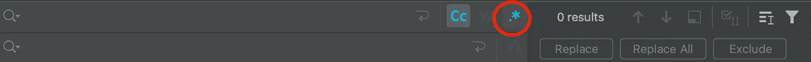
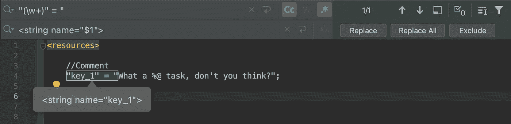

# 为 Android 项目转换本地化的 iOS 文件

> 原文：<https://betterprogramming.pub/converting-localized-ios-files-for-android-codebase-8f34ee8b34ba>

## 让您的 IDE 来完成繁重的工作


照片由[静止不动](https://unsplash.com/@stillnes_in_motion?utm_source=medium&utm_medium=referral)在 [Unsplash](https://unsplash.com?utm_source=medium&utm_medium=referral) 拍摄

*免责声明:*本文的目的不是给出自动转换此类文件的详尽规则，而是说明如何通过一些查找和替换技巧来节省时间。

今天从一个简单而又乏味的任务开始:我必须重用一组翻译的文本内容。从对应的 iOS 项目，我想迁移到 Android。

即使像[短语](https://phrase.com/)这样的工具可以帮你解决这个问题，你可能也不想为这样的 SaaS 付费。此外，如果你没有提前选择使用其中的一个，你仍然会花费大量的时间在那里导入你的内容——尽管似乎存在一些上传工具。

就本文而言，我们假设您不想使用外部工具来管理您的翻译内容。

作为一名开发人员，您会想知道在不同的 iOS 之间管理它们的不同之处:

```
Localizable.strings//Comment
“key_1” = “What a %@ task, don't you think?”;
```

和安卓系统:

```
strings.xml<!-- Comment -->
<string name="key_1">What a %s task, don\'t you think?</string>
```

如果我们忽略文件类型(iOS 的字符串，Android 的 XML)，我们很容易观察到一些差异。我有目的地使用了一个动态字符串参数——可以替换为*乏味的*或*令人兴奋的*，你告诉我！

让我们看看我们需要改变什么，以及如何进行。

# 使您的本地化文件符合 Android 标准

将这个 iOS 文件翻译到您的 Android 项目中会产生:

*   更改键及其关联值的语法
*   调整动态参数
*   转义某些特殊字符(如`‘`)
*   使注释 XML 可读

同样，这是你需要适应的一个例子。

我们首先需要更改前缀和后缀，以便在 XML 文件中包含键及其值。

对于前缀，`“key_1” = “`变成了`<string name=”key_1">`

对于后缀，`”;`变成了`</string>`

动态参数从`%@`变为`%s`。请注意，大多数其他动态类型(如整数、小数)共享相同的语法。另外，我简化了这个例子，只使用了一个动态参数。稍后会详细介绍。

Android Studio 会抱怨`‘`等未转义的角色。IDE 会告诉你用反斜杠`\`对其进行转义。

最后，如果您的 iOS 文件包含注释，您也需要转换它们，因为 XML 不处理它们的语法。于是`//Comment`变成了`<!-- Comment -->`。

一切都很好，但是我们只转换了文件中的一行……因为你可能有成千上万行要迁移，事情很快就会变得棘手。更不用说您的应用程序可能支持多种语言，因此您的迁移负载很容易失控。

您可能已经意识到我们可以通过一些脚本来实现自动化。你这么想是对的。但是，如果我告诉您，您需要的所有东西都已经打包在您用来开发应用程序的同一个 IDE 中，那会怎么样呢？

我说的是任何 IDE 最常用的功能之一:查找和替换。但是我们需要使用正则表达式来引导它。

# 使用正则表达式自动转换

我们已经描述了转换文件所需的所有步骤。我们只需要合适的工具来为所有文件内容应用这些更改。

写一个脚本(例如使用 Python)会更有效率。但是，让我们假设您不熟悉脚本，并且您很高兴您的 IDE 完成这项工作。

上面的一些操作不需要使用正则表达式:

*   后缀
*   特殊人物`‘`
*   参数语法

一个简单的查找和替换将处理所有这些事件。

其余的包括动态内容，阻止我们简单地使用基本的查找和替换操作。我们需要正则表达式。您可以在 Android Studio 中的以下位置启用它们:



使用 Android Studio 启用正则表达式

到目前为止，我们需要找到正确的正则表达式来提取我们想要的内容，并了解 IDE 如何保存提取的输入的副本。

对于前缀，我们希望提取键名并用正确的语法影响它。一个键通常是一个单词，所以正则表达式可以像`“(\w+)” = “`一样简单。然后，我们用预期的语法`<string name=”$1">`替换它，其中`$1`包含在前面的正则表达式中找到的匹配参数。Android Studio 会提示您替换后的前缀将会是什么样子



我们的第一个带有 Android Studio 的正则表达式使前缀兼容

您可以安全地将其应用于所有前缀。

最后，如果你碰巧有注释，用同样的逻辑转换它们。因为注释可能包含几个单词，所以您可能希望使用更灵活的正则表达式，比如`//(.*)`


使用另一个正则表达式转换注释

你都准备好了！与通常的转换一样，它并没有涵盖所有的内容，而且您可能需要执行一些手动操作。

例如，如果你有几个相同值的参数，Android 需要你给它们一个索引，而 iOS 不需要。

```
Localizable.strings“key_2” = “%@ gave %d claps for this article”;
```

会变成:

```
strings.xml<string name=“key_2”>%1$@ gave %2$d claps for this article</string>
```

虽然我将这种转换作为本文的一条红线，但我强烈建议您在执行像这样令人畏惧的任务时考虑这种强大的工具。你将节省大量的时间，更不用说你的理智了！