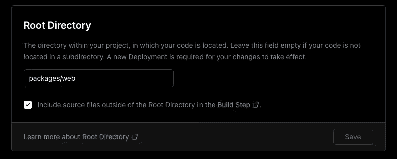

# 将我们的 NextJS 项目转换为带有 Yarn 工作空间的 Monorepo

> 原文：<https://betterprogramming.pub/converting-next-into-a-monorepo-with-yarn-workspaces-bf4007fdfa87>

## 让我们在代码库中添加一个 Solidity 开发栈


照片由 [Remy_Loz](https://unsplash.com/@remyloz?utm_source=medium&utm_medium=referral) 在 [Unsplash](https://unsplash.com?utm_source=medium&utm_medium=referral) 上拍摄

如果你还没有看到我最近的三篇建立我们项目的文章，看看[第一部分](https://wk0.medium.com/create-a-typescript-nextjs-project-with-jest-cypress-adbbcf237747)、[第二部分](https://wk0.medium.com/adding-tailwind-to-a-nextjs-typescript-project-d1eba5699c4d)和[第三部分](https://wk0.medium.com/adding-web3-to-our-nextjs-typescript-project-861e9ed5feaf\)。

我们在第一部分建立了一个 NextJS 样板，在第二部分添加了 Tailwind，然后在第三部分添加了 Web3 功能。

接下来，我们将添加一个 Solidity 开发栈到我们的项目中。在此之前，让我们使用 [yarn workspaces](https://classic.yarnpkg.com/lang/en/docs/workspaces/) 将我们的项目转换成 monorepo。

为了利用工作空间，让我们升级 yarn:

```
yarn set version berry
yarn -v
```

它应该至少解析到 3.2.0 纱。您还应该看到一个`.yarn`文件夹和一个`.yarnrc.yml`配置文件。

接下来，让我们创建一个`packages`文件夹，并开始将我们现有的项目移动到`web`工作区文件夹中。

`mkdir packages && mkdir packages/web`

然后继续将我们下一个项目中的所有内容移到`packages/web`中，除了`LICENSE` `README.md` `.husky` `.github` `.yarn`和`.yarnrc.yml`

复制你的`.gitignore`并将其中一个副本移动到根目录。可以添加`/.yarn/` & `.yarnrc.yml`

另外，暂时删除你的`yarn.lock`和`node_modules`。

然后将`packages/web/package.json`中的`package.json`“名称”重命名为`"name”: “web”`

现在我们准备初始化我们的 monorepo，所以在根目录中运行`yarn init`。你可以从你的内部`package.json`复制大部分信息，比如版本、作者、仓库等等。

为了让 yarn 识别我们的工作区，将工作区行添加到根 package.json 中。我们还必须将其设为私有，因为工作区不应该被发布:

```
"private": true,
"workspaces": [
    "packages/*"
]
```

这将让 yarn 索引`packages/`内的任何文件夹作为工作空间。

然后运行`yarn`让它重新配置。

现在，您应该能够利用工作区了。

运行`yarn workspaces list`进行双重检查，您应该会看到`.`和`packages/web`

此外，运行`yarn workspace web dev`以确保下一个 web 应用程序正常运行。

如果一切看起来都很好，在基础`package.json`中公开我们的`web`脚本

```
"scripts": {
    "web": "yarn workspace web dev",
    "web:build": "yarn workspace web build",
    "web:start": "yarn workspace web start",
    "web:lint": "yarn workspace web lint",
    "web:test": "yarn workspace web test",
    "web:test:ci": "yarn workspace web test:ci",
    "web:cypress": "yarn workspace web cypress"
}
```

在这一点上，本地开发工作流应该是关于奇偶校验的。我们现在需要做的就是用工具更新一些小东西。我们已经通过基础包脚本进行了测试和 cypress 工作，所以让我们修复 husky 和 Github 操作。

用以下内容更新 husky:

```
#!/bin/sh
. "$(dirname "$0")/_/husky.sh"cd packages/web
yarn lint-staged
```

我们仍然使用第一篇文章中的预提交钩子和 lint-staged 脚本。它可能不适用于我们的其他工作区，所以包含这一点很好。将来我们总是可以添加另一个脚本。

Github actions 工作流程也是一个非常快速的变化。我曾试图看看 Yarn 3 和 workspaces 是否可以使用，但最终只是改变了工作目录。如果你愿意，你可以使用第三方动作的 Yarn 2:[https://github.com/Borales/actions-yarn](https://github.com/Borales/actions-yarn)但是因为我们使用 Yarn 3，我们可以很容易地改变目录，我选择绕过它。

下面是更新后的 Github 动作文件:

```
...jobs:
  test:
    name: Setup
    runs-on: ubuntu-latest
    timeout-minutes: 5
    defaults:
      run:
        working-directory: ./packages/web
    steps:
        - uses: actions/checkout@v2
        - uses: actions/setup-node@v2-beta
          with:
            node-version: '16.8.0'
            check-latest: true

        - name: Install Npm Dependencies
          run: yarn install - name: Build App
          run: yarn build - name: Run tests with jest
          run: yarn test:ci - name: Cypress.io
          uses: cypress-io/github-action@v2
          with:
            working-directory: ./packages/web
            start: yarn start
            wait-on: 'http://localhost:3000'
```

最后，我们需要做的就是在项目设置中将 Vercel config 的根目录编辑到`package/web`，我们应该已经成功部署了我们的项目。



可选地，您可以编辑`next.config.js`以允许 Next 使用来自`web`工作区(我们将在下一篇文章中使用)之外的代码，方法是添加:

```
const nextConfig = {
  ...
  experimental: { 
    externalDir: true,
  }
}
```

感谢阅读。你可以点击查看回购[。](https://github.com/wk0/boilerplate-next/tree/as-workspace)