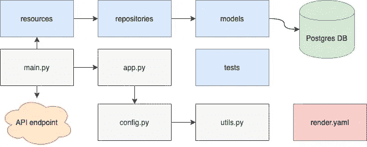
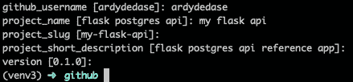

# 用 Postgres 数据库构建和部署您的 Flask API

> 原文：<https://betterprogramming.pub/cookiecutter-template-to-build-and-deploy-your-flask-api-with-postgres-database-20ad99b8dae4>

## 一个有用的模板，帮助您启动下一个项目并开始构建


照片由 [Neven Krcmarek](https://unsplash.com/@nevenkrcmarek?utm_source=unsplash&utm_medium=referral&utm_content=creditCopyText) 在 [Unsplash](https://unsplash.com/s/photos/cookie-cutters?utm_source=unsplash&utm_medium=referral&utm_content=creditCopyText) 上拍摄

在编写 Flask web 服务时，我们经常发现自己在重写相同的样板代码——比如配置、结构以及构建和部署设置。这篇文章的目标是帮助你在下一个 Flask API 项目中尽量减少重复吃同样的东西。您还将学习如何在[Render.com](https://render.com/)上部署带有数据库的 Flask web 服务。如果你不使用 Render，没问题——这个 [cookiecutter](https://cookiecutter.readthedocs.io/en/1.7.2/) 也使用 Docker 来帮助在其他平台上构建和部署。

# **模板中包含哪些内容**

*   使用 GitHub 和 Render 的基础设施作为代码，通过持续部署管道投入使用。在此见示例 [IaC 文件。](https://github.com/ardydedase/flask-postgres-api/blob/master/render.yaml)
*   现成的 SQLAlchemy/Postgres 数据库。
*   使用`mypy`进行静态类型检查。

# 高层结构

下面是我们的 Flask API 的结构。我们将在下一节中讨论每个文件或组件。



cookiecutter 模板的高级结构。

# 结构的分解

让我们剖析并了解一下我们的 *cookiecutter* 模板的结构。

## T21——一切开始的地方

这是 API 请求的入口点。

*   它包含 API 端点和 CLI 声明。它使用`Flask-Restful`作为它的 API。
*   创建 Flask 应用程序实例。
*   使用`Flask-Migrate`运行 SQLAlchemy 迁移。
*   导入 API 资源。

src/main.py。

当文件变大时，我们可能需要移动 CLI 函数。

## *app . py*—create _ app 所在的位置

这包含了返回 Flask 应用实例的`create_app()` 。`create_app()` 也接受一个`env`参数，该参数决定应用程序运行的环境。

src/app.py。

## config.py —典型的 Python 配置文件

这是我们支持多种环境的配置文件。

数据库凭证是从环境变量中传递的。通过避免将凭证写在配置文件中，这使得我们可以方便地安全传递凭证。Render 提供了一种将数据库凭证传递给环境变量的便捷方式，而无需显式设置这些凭证。我们将在后面关于代码形式的`render.yaml` 基础设施的章节中讨论这一点。

src/config.py

## utils.py —静态和无状态函数

这是我们可以添加实用函数的地方。它目前包含了`get_env_variable()`函数。

src/utils.py

## 资源——为 API 保存 Restful 资源

这包含 API 资源实现。

在下面的文件中，您将看到它导入了一个 repository 类来创建或获取存储在数据库中的用户记录。

它使用`Flask-Restful`对 API 资源进行抽象:

src/resources/user.py

## 存储库—数据的抽象

这是调用`Flask-SQLAlchemy`方法的地方:

src/repositories/user.py

## 模型—代表我们的表格

在这个目录中，我们声明我们的数据是如何存储和结构化的。该模板包括一个简单的用户模型，带有字段`username`、`avatar_url`和`date_created`。

src/models/user.py

## render.yaml 的 render . YAML-IaC

这是基础设施代码(IaC)文件，用于提供资源并设置我们在 Render.com 的服务的部署管道。

下面是一个可以在 [Flask Postgres 参考 API](https://github.com/ardydedase/flask-postgres-api) 中找到的实现示例。它指示 Render 创建一个 web 服务资源、一个 Postgres 数据库和一个环境变量组:

我们在前面的`config.py`部分提到了如何在配置中使用环境变量。注意`envVars`，它可以方便地将来自 Postgres 数据库的凭证传递给环境变量。您还会注意到`envVargroups`——这是我们可以设置自己的环境变量值的地方。

# 本地运行

现在我们已经熟悉了 cookiecutter 模板的结构，让我们在本地运行一个。

## 先决条件

在我们开始之前，请确保您已经安装了 cookiecutter。关于[安装的细节可以在这里找到](https://cookiecutter.readthedocs.io/en/1.7.2/installation.html)。

```
pip install cookiecutter
```

## Cookie-cut 模板

一旦安装了 cookiecutter，您需要“cookie-cut”模板:

```
cookiecutter [git@github.com](mailto:git@github.com):ardydedase/cookiecutter-flask-postgres-api.git
```

运行上面的命令后，会要求您输入项目的详细信息，如下图所示。相应地输入值，注意项目 slug 值将被用作您的 GitHub 存储库名称和项目文件夹名称。



Cookicutter 模板项目详细信息。

这将为您生成项目。将目录更改为由 cookiecutter 创建的项目文件夹。

```
cd <project_slug>
```

在项目的根文件夹中运行`docker-compose`:

```
docker-compose up
```

用`docker-compose`成功运行后，可以在[http://localhost:5000/health check](http://localhost:5000/healthcheck)查看你的 Flask app 本地运行情况。

你也可以查看 GitHub 上的[自述文件](https://github.com/ardydedase/cookiecutter-flask-postgres-api/blob/master/README.md)，了解本地运行应用程序的其他方式。

# 与 Render.com 一起部署

请注意，这将在您的渲染账单中产生一些费用——更多关于它们的[定价，请点击](https://render.com/pricing)。

使用 Render 非常简单。登录渲染后，点击菜单中的“YAML”链接，在这个页面:[https://dashboard.render.com/iacs](https://dashboard.render.com/iacs)。

单击“YAML 新建”并从 cookiecutter 生成的项目的根文件夹中选择 render.yaml 文件。上传 YAML 文件后，渲染会要求您批准 IaC 将创建的资源。更多关于使用[渲染的 IaC 在这里](https://render.com/docs/infrastructure-as-code)。

关于在他们的文档中管理 Render 的资源[的更多信息。](https://render.com/docs)

在 Render 中成功部署后，将在 Render dashboard 中提供服务的 URL。

# 后续步骤

希望您现在能够使用 Postgres 数据库快速创建和部署自己的 Flask API！

在 GitHub 上查看带有 Postgres Cookiecutter 模板的 [Flask API。它还附带了一个](https://github.com/ardydedase/cookiecutter-flask-postgres-api)[参考库](https://github.com/ardydedase/flask-postgres-api)——一个从我们的 cookiecutter 构建的样例项目。

[](https://github.com/ardydedase/cookiecutter-flask-postgres-api) [## ardydedase/cookiecutter-flask-postgres-API

### Flask API 的项目模板。使用 GitHub 和 Render 的基础设施实现持续部署管道…

github.com](https://github.com/ardydedase/cookiecutter-flask-postgres-api) 

点击这里查看我的另一篇关于构建 NPM 包的 Cookiecutter 模板的文章。