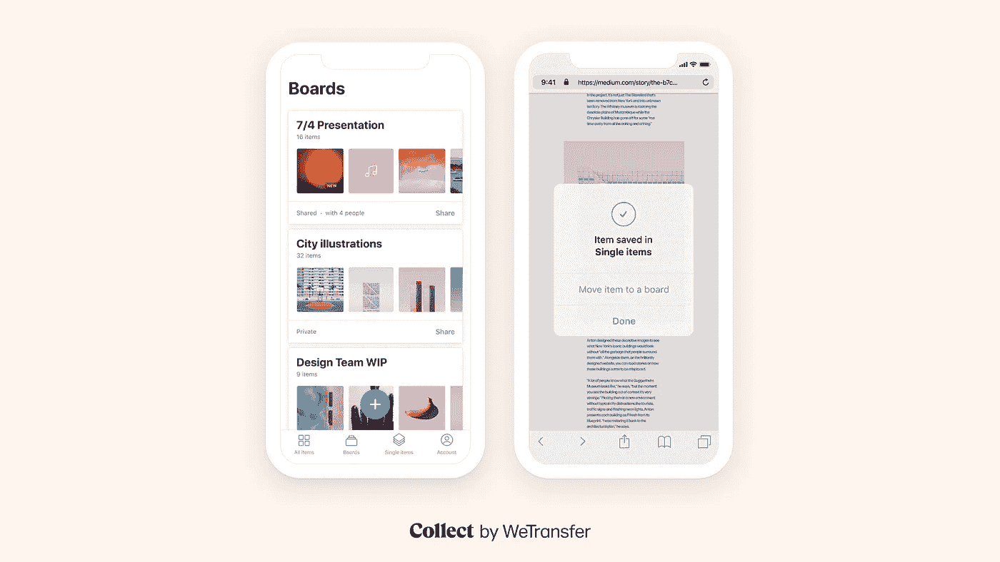
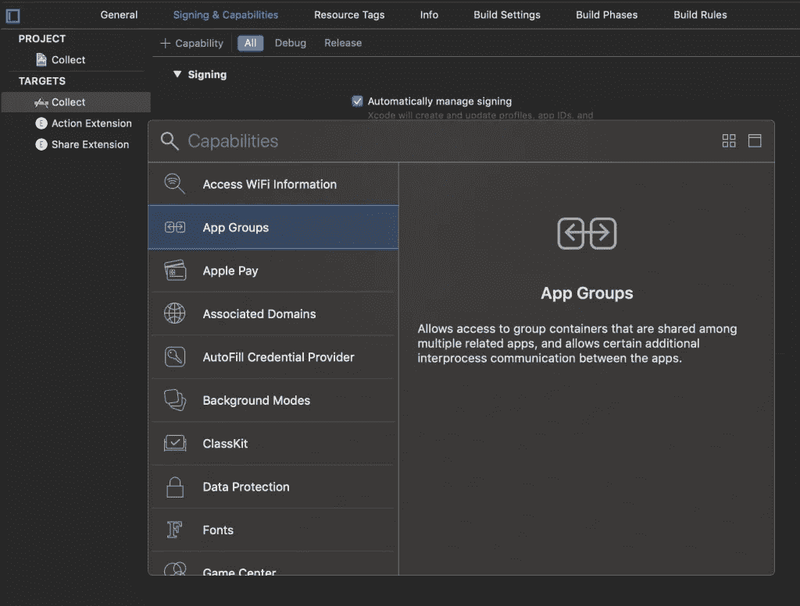
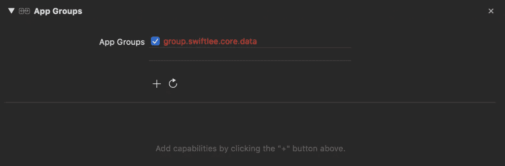
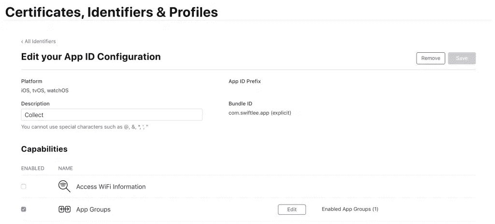

# 核心数据和应用程序扩展:共享单个数据库

> 原文：<https://betterprogramming.pub/core-data-and-app-extensions-sharing-a-single-database-24f8cac35faa>

## 改善核心数据实现的技巧



随着 API 的改进，核心数据变得越来越好，更容易使用。Apple framework 允许您保存应用程序的永久数据以供离线使用，提供撤销功能，或者只是缓存数据以获得更好的性能。

在将基础实现到你的应用程序中之后，[也许通过使用](https://www.avanderlee.com/swift/nsbatchdeleterequest-core-data/) `[NSBatchDeleteRequest](https://www.avanderlee.com/swift/nsbatchdeleterequest-core-data/)` [来删除批处理](https://www.avanderlee.com/swift/nsbatchdeleterequest-core-data/)，你可能需要更高级的解决方案来引入复杂的 bug。同样的事情也发生在我在日常工作中开发的 [Collect by WeTransfer](https://collect.bywetransfer.com) 应用程序上，所以让我们分享一些经验。

# 与应用程序扩展共享相同的核心数据持久容器

如果您使用核心数据作为数据库解决方案，那么与 Today 扩展、Action 扩展或 Share 扩展共享核心数据数据库是很常见的事情。在 Collect 应用程序中，我们有一个 Share 扩展和一个 Action 扩展，这两个扩展都需要使用相同的底层持久容器。

应用程序扩展和包含应用程序不能直接访问彼此的容器，即使应用程序扩展捆绑包嵌套在其包含应用程序的捆绑包中。幸运的是，苹果使得与你的扩展共享一个持久容器变得很容易。

## 为数据共享设置持久容器

为了共享数据，我们需要在主应用程序及其扩展之间创建一个共享容器。我们可以通过在项目的“签名和功能”部分添加应用程序组功能来实现这一点:



将应用程序组添加到您的项目以共享核心数据

这将最终导致您的项目的应用程序组的以下概述:



项目的应用程序组概述

请注意，当您尚未将其添加到您的应用程序标识符时，应用程序组会变成红色。您可以通过在此登录您的账户[来完成此操作。](https://developer.apple.com/account/resources/identifiers)



将应用组添加到你的应用标识符

之后，您可以更新您的持久性存储描述。基本上，您将数据库保存到共享应用程序容器中。

```
let persistentContainer = NSPersistentContainer(name: "Collect")
let storeURL = URL.storeURL(for: "group.swiftlee.core.data", databaseName: "Coyote")
let storeDescription = NSPersistentStoreDescription(url: storeURL)
persistentContainer.persistentStoreDescriptions = [storeDescription]
```

为此，我们利用一个方便的 URL 扩展来获取使用安全应用程序组标识符的共享容器的路径。

```
public extension URL {

    /// Returns a URL for the given app group and database pointing to the sqlite database.
    static func storeURL(for appGroup: String, databaseName: String) -> URL {
        guard let fileContainer = FileManager.default.containerURL(forSecurityApplicationGroupIdentifier: appGroup) else {
            fatalError("Shared file container could not be created.")
        }

        return fileContainer.appendingPathComponent("\(databaseName).sqlite")
    }
}
```

这将足以与您的应用程序扩展共享您的持久容器。请务必将您的核心数据模型添加到您的应用程序扩展目标中。

# 通知主应用程序扩展中的核心数据更改

下一个重要的步骤是，当数据从你的一个扩展中改变时，通知你的主应用程序。这听起来很容易，但这是一个相当大的挑战，因为你不能简单地发布通知。一个应用程序扩展正在不同的进程中运行，因此您的主应用程序不会收到来自它的任何通知。

当你的应用程序激活时，你可以简单地刷新你的数据库，但是如果什么都没有改变，这将导致很多不必要的刷新。一个更好的解决方案是从你的应用程序扩展发送一个达尔文通知来触发你的主应用程序的刷新。

## 使用达尔文通知进行扩展和主应用程序之间的通信

达尔文通知能够在应用程序扩展和主应用程序之间发送和接收。他们不太出名，但是一旦建立起来就很容易合作。

让您开始的最好方法是将下面的[darwinnotificationcenter . swift](https://gist.github.com/AvdLee/07de0b0fe7dbc351541ab817b9eb6c1c)文件添加到您的项目中。这为您提供了处理 Darwin 通知所需的所有代码。

之后，您需要定义两个通知名称来区分您的主应用程序和应用程序扩展。请注意，我们根据我们是否在应用程序扩展上下文中返回这个。这是为了确保我们发布和收听正确的通知。

```
extension DarwinNotification.Name {
    private static let appIsExtension = Bundle.main.bundlePath.hasSuffix(".appex")

    /// The relevant DarwinNotification name to observe when the managed object context has been saved in an external process.
    static var didSaveManagedObjectContextExternally: DarwinNotification.Name {
        if appIsExtension {
            return appDidSaveManagedObjectContext
        } else {
            return extensionDidSaveManagedObjectContext
        }
    }

    /// The notification to post when a managed object context has been saved and stored to the persistent store.
    static var didSaveManagedObjectContextLocally: DarwinNotification.Name {
        if appIsExtension {
            return extensionDidSaveManagedObjectContext
        } else {
            return appDidSaveManagedObjectContext
        }
    }

    /// Notification to be posted when the shared Core Data database has been saved to disk from an extension. Posting this notification between processes can help us fetching new changes when needed.
    private static var extensionDidSaveManagedObjectContext: DarwinNotification.Name {
        return DarwinNotification.Name("com.wetransfer.app.extension-did-save")
    }

    /// Notification to be posted when the shared Core Data database has been saved to disk from the app. Posting this notification between processes can help us fetching new changes when needed.
    private static var appDidSaveManagedObjectContext: DarwinNotification.Name {
        return DarwinNotification.Name("com.wetransfer.app.app-did-save")
    }
}
```

之后，我们可以开始观察应用扩展的变化:

```
extension NSPersistentContainer {
    // Configure change event handling from external processes.
    func observeAppExtensionDataChanges() {
        DarwinNotificationCenter.shared.addObserver(self, for: .didSaveManagedObjectContextExternally, using: { [weak self] (_) in
            // Since the viewContext is our root context that's directly connected to the persistent store, we need to update our viewContext.
            self?.viewContext.perform {
                self?.viewContextDidSaveExternally()
            }
        })
    }
}
```

重要的是要知道，只有当你的应用程序实际上在后台活动时，才会收到这些通知。当你的应用程序刚刚打开时，它显然会获取数据，而这整个通知甚至是不需要的。

最后一个必需的步骤是实际刷新数据。这带来了一些你需要考虑的副作用。

# 保持数据同步

在 WeTransfer，我们首先简单地调用视图上下文中的[refreshalobjects()](https://developer.apple.com/documentation/coredata/nsmanagedobjectcontext/1506217-refreshallobjects)来刷新所有注册的对象。这通常足以更新您的数据，但有一个轻微的副作用需要考虑。

[失效间隔](https://developer.apple.com/documentation/coredata/nsmanagedobjectcontext/1506875-stalenessinterval)用于确定一个对象是否真的需要刷新，或者是否可以重用任何可用的缓存数据。该到期值基于每个对象应用，默认情况下设置为-1。这意味着默认情况下，注册的对象根本不会被刷新。

最后，我们采用了以下刷新方法:

```
extension NSPersistentContainer {

    /// Called when a certain managed object context has been saved from an external process. It should also be called on the context's queue.
    func viewContextDidSaveExternally() {
        // `refreshAllObjects` only refreshes objects from which the cache is invalid. With a staleness intervall of -1 the cache never invalidates.
        // We set the `stalenessInterval` to 0 to make sure that changes in the app extension get processed correctly.
        viewContext.stalenessInterval = 0
        viewContext.refreshAllObjects()
        viewContext.stalenessInterval = -1
    }
}
```

请注意，我们会在之后立即重置陈旧时间间隔，以确保我们能够从之后的缓存中受益。这就是我们保持我们的应用和它的扩展之间的数据最新所需要的。

# 结论

如今使用核心数据比以前容易多了。希望有了这些提示，您也能设法让您的数据与您的扩展同步。

如果您需要调试任何核心数据问题，您可能想要查看我的博客文章[“使用启动参数在 Xcode 中调试核心数据”](https://www.avanderlee.com/debugging/core-data-debugging-xcode/)。