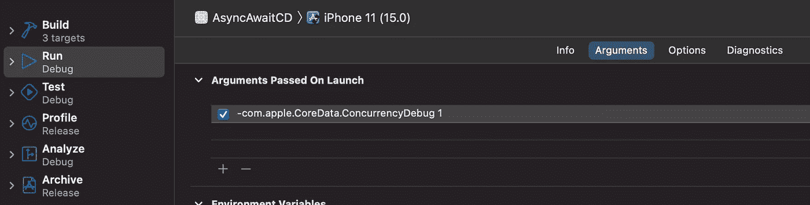

# 核心数据和异步等待—线程安全

> 原文：<https://betterprogramming.pub/core-data-and-async-await-thread-safe-f96b6dbbb7c4>

## 如何使用核心数据，使用异步/等待线程安全


随着 Async/Await 的引入，iOS 开发人员使用后台队列工作变得更加容易。在后台获取数据可以极大地提高应用程序的性能。

在后台执行所有核心数据获取是一个好主意，这样可以让主线程空闲下来执行 UI 任务。一个类似下面的`async` `get` 函数将是理想的:

```
func get(request: NSFetchRequest<NSManagedObject>) async -> [NSManagedObject]
```

GCD 将为我们做所有的工作，并在后台线程中获取数据。不幸的是，核心数据不是线程安全的。

我不想说核心数据不好，事实恰恰相反。核心数据速度极快，维护良好，从 iOS 3.0 开始就一直伴随着我们。

问题是 CoreData 需要小心处理，尤其是现在使用并发变得更加容易。

为了确保我们在`NSManagedObject`上进行的每个访问都是线程安全的，我们需要在对象的`NSManagedObjectContext`中进行。建议的方法是使用上下文的`[perform](https://developer.apple.com/documentation/coredata/nsmanagedobjectcontext/1506578-perform)`方法。

```
func perform(_ block: @escaping () -> [Void](https://developer.apple.com/documentation/swift/void))
```

每次在不同于其上下文线程的线程中访问`NSManagedObject`时，都可能导致崩溃。要检查这种情况，只需添加以下启动参数。

```
-com.apple.CoreData.ConcurrencyDebug 1
```



我们在 [UXMA 德国](https://medium.com/u/ce30a039c112?source=post_page-----f96b6dbbb7c4--------------------------------)如何避免这样的问题？我们使用 NSManagedObjects 只是为了存储和检索数据，而不是在代码中的其他地方。一旦执行了`FetchRequest`，我们就将核心数据实体转换成一个不可变的、线程安全的对象。

# 例子

我们有一个名为`Item`的`NSManagedObject`，与`Item` 一起，我们定义了一个不可变的对象——在本例中，是一个具有相同结构的线程安全结构——名为`SItem`。

现在我们定义协议`*ToSafeObject*` *。*项目*符合这个协议，我们使用它的`safeObject()`方法将不安全的`Item`对象转换成安全的`SItem`结构。*

# 获取数据

在`NSManagedObjectContext`类上的一个简单的扩展函数，它接受一个`NSFetchRequest<E>`，其中 E 是一个符合`ToSafeObject`协议的`NSManagedObject`。这个 get 函数是异步的，为给定的`NSFetchRequest`的`NSManagedObject`返回一个`SafeObjects`数组。

使用这种技术，我们总是线程安全的，我们实际上可以使用后台上下文来检索后台线程中的所有核心数据实体。

新的 get 函数是异步的，所以我们需要使用 await 来测试它。

如果在这个单元测试中，我们添加了`-com.apple.CoreData.ConcurrencyDebug 1` launch 参数并注释掉第 26 行，我们会注意到应用程序崩溃了。正是因为我们在错误的线程上获取数据。

这样的小技巧帮助我们，在 UXMA，为我们的客户提供更高质量的应用，当然也减少了崩溃报告。

一如既往，编码快乐！


[阿波斯托洛斯·乔卡斯](https://medium.com/u/c35708a6758c?source=post_page-----f96b6dbbb7c4--------------------------------)，开发者 [UXMA 德国](https://medium.com/u/ce30a039c112?source=post_page-----f96b6dbbb7c4--------------------------------)

克里斯蒂安·K 的荣誉