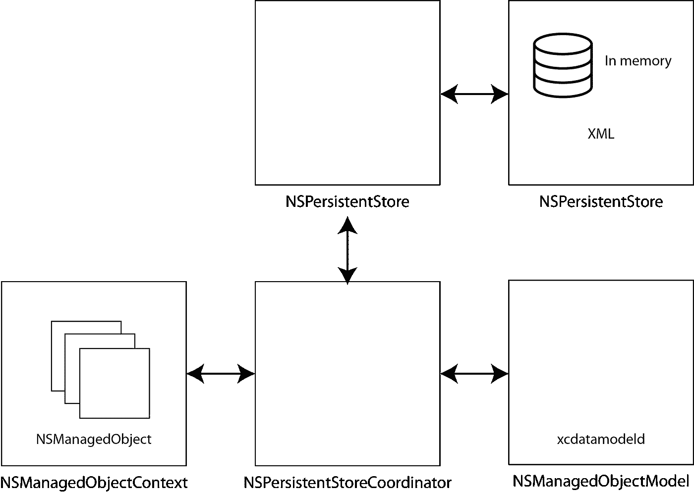
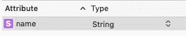
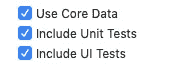
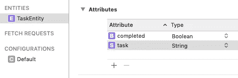

# 学习核心数据的基础知识

> 原文：<https://betterprogramming.pub/core-data-basics-swift-persistent-storage-ba3185fe7061>

## 快速持久存储



# 入门指南

核心数据是 Swift 中持久数据的一个很好的选择，但一些人发现在他们的应用程序中使用它的障碍太高了。在这一部分中，我们将研究核心数据栈的主要组成部分，将它们分解开来，并努力使它们的使用对第一次使用的用户来说是容易理解的。

## **关键词**

*   核心数据:允许您管理应用程序中的模型层对象的框架。核心数据通过作为对象图管理和持久性框架来实现这一点。
*   过滤:读取数据并删除不需要的数据的系统。
*   对象图:对象系统在任何特定时间点的视图。
*   对象图管理:核心数据处理已定义的对象，核心数据跟踪这些对象以及它们之间的关系。
*   持久性:在这种情况下，可以从设备或网络位置检索数据。
*   SQLite:核心数据可以使用的潜在数据存储之一。

## **深入核心数据术语**

*   属性:类似于数据库中表的列。这些存储核心数据记录的值。这些属性包括字符串、日期、整数、浮点数和布尔值。下骆驼案。
*   NSEntityDescription (Entity):类似于数据库中的表，但是允许我们访问关于实体的所有可用信息。NSEntityDescription 的实例，提供对属性的访问，如名称、定义实体的数据模型以及定义实体的类名。上骆驼案。
*   NSFetchRequest:表示从持久性存储中检索数据的搜索条件的描述。要使用 NSFetchRequest，您需要创建一个请求，该请求需要一个实体名称，以便知道要搜索哪个实体(或实体描述/或 NSEntityDescription 的实例)。
*   NSPersistentContainer:从 iOS10 开始，这使得设置核心数据变得更加容易，隐藏了持久性存储如何配置的实现细节。充当托管对象模型和持久性存储之间的桥梁。通过隐藏实现细节，NSManagedObjectContext 不需要知道正在使用哪种持久性存储类型，并且可以通过单个统一接口管理多个持久性存储。只需初始化一个 NSPersistentContainer，加载持久性存储，就可以开始了！
*   NSPersistantStore:读取数据并将其写入后备存储。核心数据允许后备存储是 SQLite、二进制、XML 和内存中。(虽然 iOS 上没有 XML)。
*   NSPersistentStoreCoordinator:协调器用于将对象图保存到持久存储中，并检索模型信息。上下文访问模型的唯一方式是通过协调器，提供对底层对象存储的访问。这允许您从应用商店保存和获取应用类型的实例。
*   NSManagedObject:ns object 的子类，实现核心数据模型对象所需的行为。它并不总是需要子类 NSManagedObject，它们可以直接使用。
*   NSManagedObjectContext(托管对象上下文):我们可以在内存中创建、读取、更新和删除(CRUD)核心数据对象，然后再将它们写回数据库。实际上，它跟踪应用程序类型实例的变化，并作为托管对象的内存版本工作，直到在上下文中调用 save。对象上下文还管理其对象的生命周期，并且每个对象必须存在于一个上下文中，并且在其生命周期的持续时间内保持关联，尽管应用程序可以使用多个上下文，并且实际上相同的代码数据对象可以同时加载到两个不同的上下文中。通过设置多个管理对象上下文，可以运行并发操作，并使长时间运行的操作远离主线程**。**上下文不是线程安全的，托管对象也不是，这意味着您只能在创建上下文和托管对象的同一线程上与它们进行交互。
*   NSManagedObjectModel:通常使用数据建模工具创建模型。描述应用程序的类型，包括属性和关系。这意味着如果核心数据栈在幕后使用 SQLite，这个模型将代表数据库的模式。
*   Relationship:这些属性存储对核心数据记录的引用。每种关系都有目的地，许多是相反的关系(一个老师有许多学生，每个学生有那个老师)。下骆驼案。
*   xcdatamodel 文件:由 Xcode 中的可视化编辑器编辑。将模型编译成 momd 文件夹中的一组文件。核心数据使用 momd 文件夹的编译内容在运行时初始化 NSManagedObjectModel。

## **快速笔记**

您保存的是上下文，而不是对象本身。这是有意义的，因为这是保存托管对象的环境。

## **为什么要使用核心数据？**

*   可以通过将 NSPredicate 对象与 fetch 请求相关联来形成复杂的查询，而不是编写 SQL
*   更改跟踪
*   对象的延迟加载
*   预建的特性不需要在你的应用中测试

## **xcdatamodeld**

使用 coredata 时，会创建一个 xcdatamodeld 文件，这是核心数据模型的源文件。

在其中，您可以添加属性、关系和获取的属性。



核心数据模型的简单属性

# **存储模型对象**

## **NSManagedObject 上下文**

在使用核心数据存储之前，需要确定上下文。每个托管对象实例都存在于特定的上下文中，使其对于特定的上下文是唯一的。您可以使用多个托管对象上下文来简化新项目的添加，并避免阻塞 UI。

## **NSManagedObject**

NSManagedObject 是一个实现代码数据模型对象行为的类。您可以只在对象图中使用 NSManagedObjects，也可以创建 NSManagedObjects 的子类。我们可以把 NSManagedObjects 想象成一本字典。

您可以使用`value(forKeyPath keyPath: String) -> Any?`返回给定关键路径的值。

NSManagedObject 不能直接访问属性，所以这种键值编码的方法允许我们访问属性。

## **断层**

有时，托管对象尚未从数据存储中加载。在这种情况下，将触发故障并检索数据。

# 创建一个简单的待办应用

1.  **创建实体**

很明显，您需要创建一个单视图应用程序。但是，重要的是，您勾选了设置为核心数据的框，以创建必要的文件(但是，在本例中，我们不会使用 App delegate 中添加的代码)。



这允许我们在 xcdatamodelId 文件中设置一个简单的任务实体:



如果任务完成，`Where completed`为布尔值，`task`为任务的名称。

**2。设置对象上下文和实体**

在哪里

`appDelegate = UIApplication.shared.delegate **as**? AppDelegate`

和

`Constants.entityName = “TaskEntity”`

**3。设置表格视图**

核心数据允许我们使用 NSManagedObject 的数组，而不是使用字符串或结构和类的数组:

`var tasks: [NSManagedObject] = []`

然后可以将其用作 UITableView 的数据源，这样:

虽然 NSManagedObject 实际上很像一个字典，意味着我们必须返回。单元格文本标签的值(forKeyPath:):

**4。保存**

这个不太棘手，简单的取对象调用。之前的 setValue。save()当然记得将项目添加到 tableview:

保存核心数据

**5。正在加载**

这涉及到创建一个在 viewWillAppear 中调用的 NSFetchRequest，以允许在显示视图时发出请求。

NSFetchRequests 访问现有数据并描述想要返回的数据。

这是通过创建一个获取请求，然后添加一个可选的排序和可选的谓词来实现的:

然后使用托管对象上下文获取:

```
try managedContext.fetch(fetchRequest)
```

6。删除

这是一个相当简单的，删除一个特定的任务是可能执行的:

```
objectContext.delete(task)
```

# **卷下**

核心数据当然有很多优点，也有自己的实现挑战。然而，它并不一定是它所声称的那种大野兽——而且肯定可以通过一些努力被驯服！

当然，这里的大问题是核心数据的实现与视图控制器捆绑在一起，这使得几乎不可能进行测试。

猜猜未来的媒体文章是关于什么的…

**想看完整的 GitHub 链接吗？**

[](https://github.com/stevencurtis/CoreDataToDo) [## stevencurtis/CoreDataToDo

### 与中级职位测试相关的核心数据。通过创建帐户为 stevencurtis/CoreDataToDo 开发做贡献…

github.com](https://github.com/stevencurtis/CoreDataToDo) 

**想取得联系？在 Twitter 上取得联系:**

[](https://twitter.com/stevenpcurtis) [## 史蒂文·柯蒂斯(@stevenpcurtis) |推特

### 史蒂文·柯蒂斯的最新推文(@stevenpcurtis)。一边学习计算硕士，一边开发 iOS 应用程序…

twitter.com](https://twitter.com/stevenpcurtis)