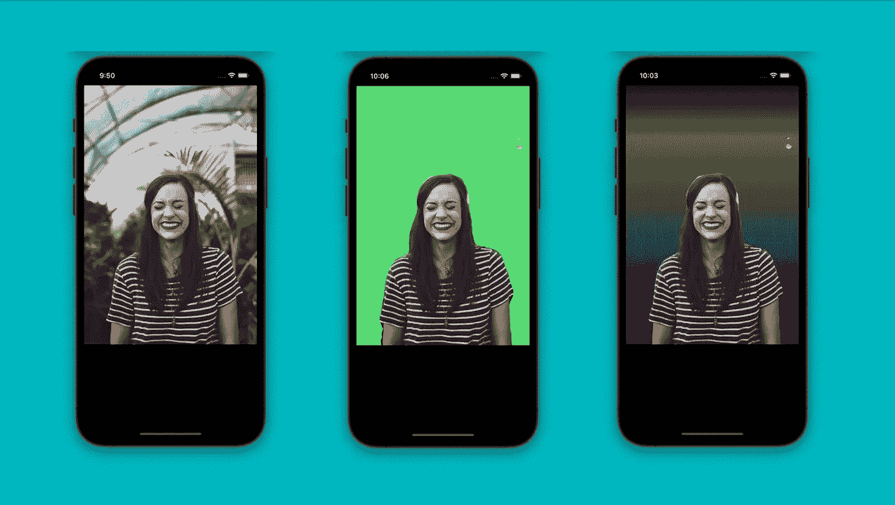
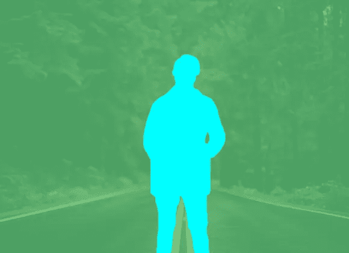
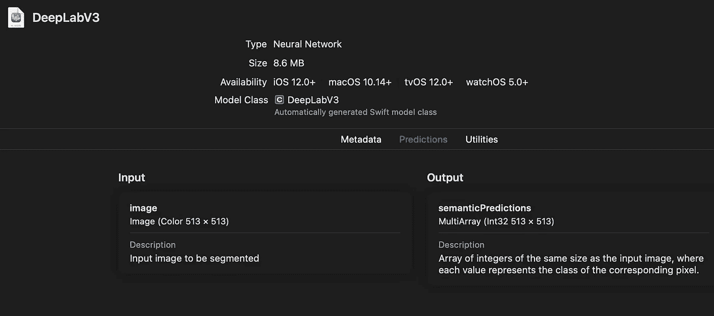
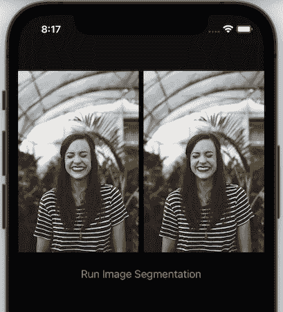
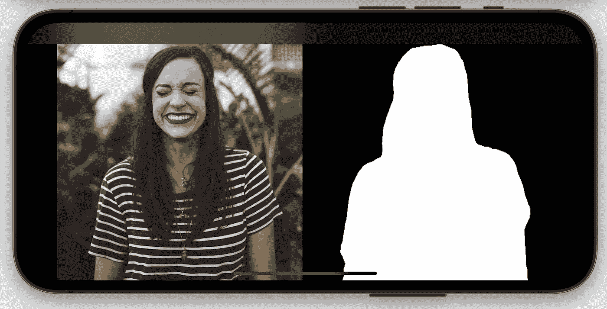
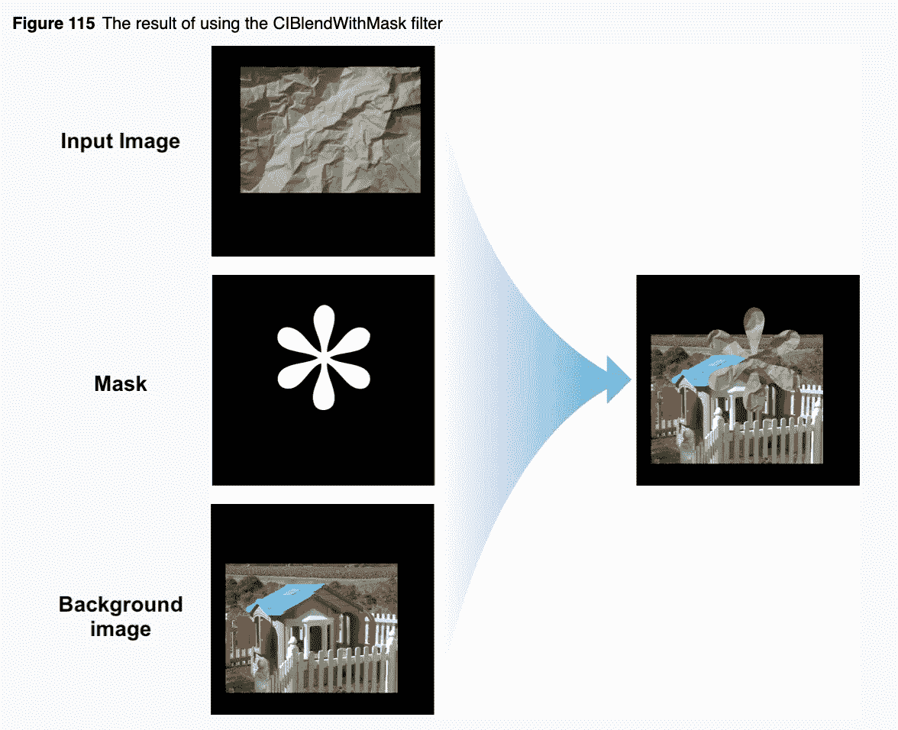
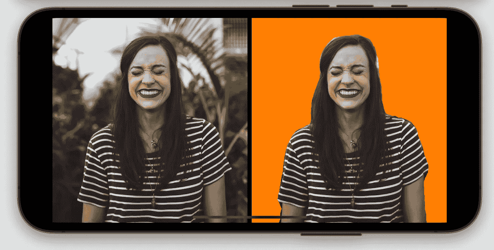
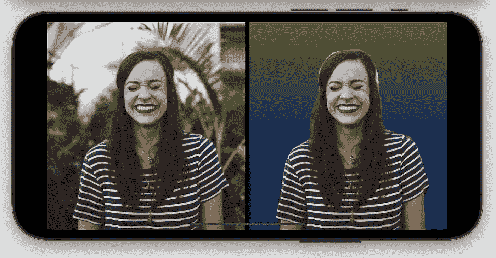
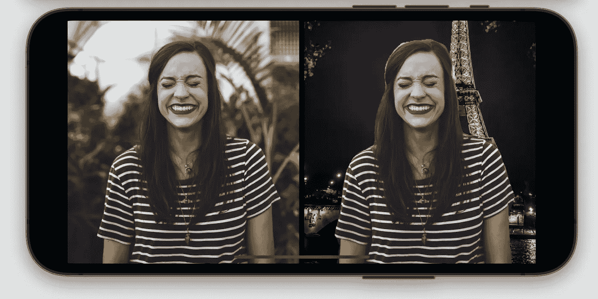
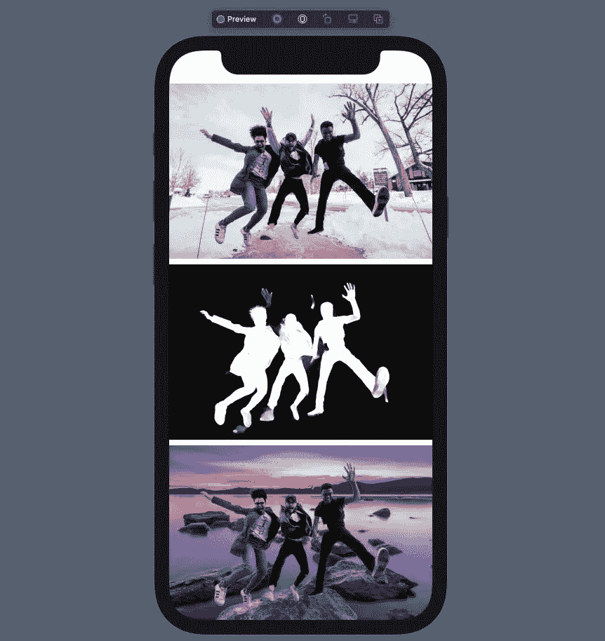

# SwiftUI 中的核心 ML 背景移除

> 原文：<https://betterprogramming.pub/coreml-image-segmentation-background-remove-ca11e6f6a083>

## 使用 DeepLabV3 图像分割模型在 iOS 应用程序中添加、移除和修改图像背景



由[布鲁克·卡吉尔](https://unsplash.com/photos/HRZUzoX1e6w)在 [Unsplash](https://unsplash.com/) 上拍摄的原始照片。作者的最终结果。

[Core ML](https://developer.apple.com/documentation/coreml) 是苹果的移动机器学习框架，可以让你在设备上部署、运行和重新训练模型。

从文本和声音到图像识别，使用 Core ML 可以实现的事情是无限的。除此之外，还有 Vision，这是苹果自己的计算机视觉框架，提供了六种以上的内置模型。更重要的是，它充当了 Core ML 的容器，使预处理和推断变得更加容易。

在本教程中，我们将实现移动设备上最流行的机器学习用例之一:iOS 应用程序中的图像分割。

图像分割是一种深度学习机制，让我们能够分离图像中的不同对象。这是自动驾驶汽车中常用的计算机视觉技术，用于在图像的特定部分绘制边界框。



来源:[苹果开发者](https://developer.apple.com/machine-learning/models/)

在接下来的几节中，我们将使用 DeepLabV3 模型在 SwiftUI 应用程序中分割图像的前景和背景部分。通过这样做，您将能够添加、删除和修改照片的背景。毕竟，谁不想用漂亮的虚拟背景来翻转他们无聊的背景风景呢？

别再浪费时间了，让我们开始吧。

# 获取 DeepLab 核心 ML 模型

以前，你必须从 Pytorch 和 Tensorflow 等其他格式转换它，但现在苹果为我们提供了一个可下载的核心 ML 文件，可以直接在 Xcode 中使用。可以从[苹果的机器学习页面](https://developer.apple.com/machine-learning/models/)获取 DeepLabV3 CoreML 模型。

使用 SwiftUI 作为我们的用户界面启动一个新的 Xcode 项目，并拖放上面的核心 ML 文件。您应该会看到如下所示的核心 ML 模型描述:



Xcode 核心 ML 浏览器。作者截图。

输入类型是一个尺寸为 513 x 513 的`Image`，而输出是一个尺寸相同的`MLMultiArray`。我们很快就会看到如何将输出类型转换成我们想要的图像格式。

但是首先，让我们设置一下 SwiftUI 视图。

# 设置我们的 SwiftUI 视图

下面的代码在屏幕上显示两个等距的图像。左边的是输入图像，右边的将最终显示分割结果。

注意:SwiftUI 按钮`action` 中调用的`runVisionRequest`函数是我们实现核心 ML 图像分割的地方。

以下是当前 SwiftUI 视图的屏幕截图:



iOS 模拟器。作者截图。

# 使用视觉请求运行图像分割

接下来，让我们设置视觉请求以运行 DeepLabV3 图像分割模型:

我们可以从上面的代码中得到一些启示:

*   核心 ML 在 iOS 14 中弃用了默认的 init 方法(`DeepLabV3()`)，所以我们使用了新的`init(configuration:)`。
*   `VNCoreMLModel`是核心 ML 模型的容器。我们需要这种格式来使用`VNCoreMLRequest`执行视觉处理。
*   一旦`VNCoreMLRequest`完成，它触发完成处理函数。在我们的例子中，我们在一个`visionRequestDidComplete`函数中定义了它。
*   `VNImageRequestHandler`功能是触发我们视觉请求的地方。我们在这里传递输入图像(Vision 对其进行预处理以匹配模型输入大小),并在`handler.perform`函数中设置`VNCoreMLRequest`。

# 从输出中检索分段掩码

一旦`VNImageRequest`完成，我们可以在下面定义的`visionRequestDidComplete`完成处理器中处理结果:

从上面的代码中可以得出一些推论:

*   视觉图像分析返回的输出是一个字典:`[VNCoreMLFeatureValueObservation](https://developer.apple.com/documentation/vision/vncoremlfeaturevalueobservation)`。
*   包含我们的分割图的`MLMultiArray`位于字典的第一个键中。
*   我们需要将 2D 阵列分割图转换成一个`UIImage`。为了做到这一点，我使用了 Matthijs Hollemans 的 CoreMLHelper 工具来减少我们编写的样板代码。您可以在本教程的末尾找到该代码。
*   `segmentationmap.image(min: 0, max: 1)`辅助函数将`MLMultiArray`转换为`UIImage`，然后我们可以调整其大小以匹配初始图像的大小。
*   `resizedImage`是我写的一个`UIImage` Swift 扩展。在这个要点中有[可用。](https://gist.github.com/anupamchugh/75fed37246f77ed68b3061f242847c51)
*   `maskInputImage()`功能是我们用分割结果屏蔽我们的初始图像，以产生新的背景。

现在我们的分割蒙版已经准备好了，让我们来看看它:



iOS 模拟器。作者截图。

太好了！我们的分割遮罩通过对每组像素使用不同的颜色来将前景图像从背景中分离出来。

现在，是时候复习一下我们的`CoreImage`技巧了，在图像上混合蒙版。

# 使用分段遮罩修改背景

[核心图像](https://developer.apple.com/documentation/coreimage)是苹果的图像处理库。它提供了各种各样的图像过滤器可供选择。

在我们的例子中，我们需要混合原始图像上的分割蒙版，以便隐藏背景。此外，我们想添加一个新的背景。

核心图像的`CIBlendWithMask`滤镜非常适合我们的情况。下面来看看它是如何运作的:



来源:[苹果开发者](https://developer.apple.com/library/archive/documentation/GraphicsImaging/Reference/CoreImageFilterReference/index.html#//apple_ref/doc/filter/ci/CIBlendWithMask)。作者添加的文本。

让我们来看看`maskInputImage`函数，我们的`CIBlendWithMask`过滤器运行于此:

以下是对这段代码的一些重要观察:

*   `imageFromColor`是一个[快速扩展](https://gist.github.com/anupamchugh/6aefb0fc8043fa7fe584e99e7e8f2e2c)，将纯色转换成 UIImage。我们传递颜色、输入图像大小和`scale`。设置相同的比例对于确保`CGImage`尺寸与我们的原始图像相匹配非常重要。否则，核心图像`CIBlendWithMask`滤镜会产生失真的结果。
*   `CIBlendWithMask`滤波器需要三个参数键:`kCIInputImageKey`、`kCIInputBackgroundImageKey`和`kCIInputMaskImageKey`。
*   从过滤器返回的`outputImage`是一个 CIImage。要将其转换为 UIImage，我们首先使用`createCGImage`将其转换为 CGImage。

背景发生变化的图像的最终输出如下所示:



iOS 模拟器。作者截图。

# 在图像中混合渐变背景

除了纯色，你可以添加任何图像作为你的主题的背景。让我们设置渐变颜色。

我已经使用[这个堆栈溢出](https://stackoverflow.com/a/44866438/3849039)答案来实现渐变的 UIImage 扩展。结果如下:



iOS 模拟器。作者截图。

# 更有趣

我们看到了如何通过 SwiftUI 实现使用 Core ML 和 Vision 来删除和修改图像中的背景。你可以做更多的事情，比如模糊背景或者只隐藏背景图像的一部分。

只是为了好玩，我把背景换成了埃菲尔铁塔:



Lucas Albuquerque 在 [Unsplash](https://unsplash.com/s/photos/eiffel-tower?utm_source=unsplash&utm_medium=referral&utm_content=creditCopyText) 上拍摄的照片。与核心 ML 模型一起改变。

```
let bgImage = UIImage(named: "tower")!.resized(to: self.inputImage.size, scale: self.inputImage.**scale**)
```

我不能强调对背景图像使用相同的`scale`来确保它适合视图是多么重要。

这个项目的完整源代码可以在这个 [GitHub 库](https://github.com/anupamchugh/iowncode/tree/master/CoreMLBackgroundChangeSwiftUI)中找到。

这一次到此为止。尝试对一群人使用一张图片，看看效果如何。这里有一个例子:

