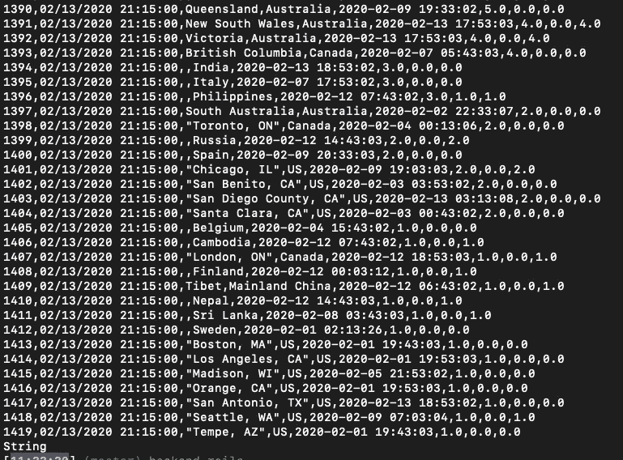
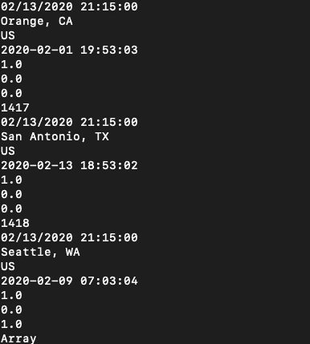
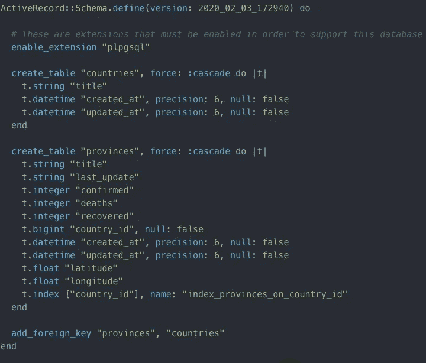
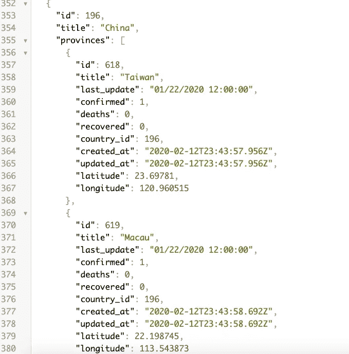

# 我构建了一个电晕病毒应用程序来可视化真实世界的病毒数据

> 原文：<https://betterprogramming.pub/coronavirus-app-working-with-real-world-data-175794f7f594>

## 虽然潜在的疫情的可能性很可怕，但我还是查看了数据，以了解实际情况


来源:[https://en . m . Wikipedia . org/wiki/File:3D _ medical _ animation _ corona _ virus . jpg](https://en.m.wikipedia.org/wiki/File:3D_medical_animation_corona_virus.jpg)

世界被新的疫情威胁的可能性吓坏了。每一个主要的媒体都在集中报道情况有多糟糕。我决定看看数据，看看实际情况是怎样的。

所以，我用 Ruby on Rails 为后端构建了一个应用程序，React 为前端构建了一个应用程序来查看数据并与世界共享。该应用程序已经在 [Heroku](https://www.heroku.com/) 和 [Netlify](https://www.netlify.com/) 上运行；你可以通过这个链接查看[。](https://ecstatic-euler-32ae42.netlify.com)

以下是我构建应用程序的步骤。

# 数据源

对于数据源，我使用了 [Kaggle 数据集](https://www.kaggle.com/sudalairajkumar/novel-corona-virus-2019-dataset)。该数据集定期更新，因此我们可以看到最新的数据。

Kaggle 在。csv 格式。最初，我下载了这个文件，并从中植入了数据库。我使用 Rails“CSV”gem 的内置功能来解析文件中的数据。

解析之后，我得到了一个数组的数组，其中每个数组都代表。csv 文件:

```
parsed_data = CSV.parse(data_source)
```

在这个过程中，我意识到手动下载东西不是英雄之路，我开始直接和 Kaggle API 沟通。唯一的问题是 Kaggle 的所有 API 文档都是针对 Python 的。

因此，我别无选择，只能用 Ruby 编写一个自定义方法来授权用户并从 API 获取数据。

# 清理和分类数据

我用[down](https://rubygems.org/gems/down/versions/1.1.0)gem 下载数据。它返回给你一个大字符串，然后你可以使用上面描述的“CSV”gem 把它解析成数组的数组。

清理前的数据:



清理后的数据:



下一步是按照最后更新日期对数据进行排序，并提取最新的数据。

我的第一种方法是按照“最后更新”列对数据进行排序。但是后来我意识到按“序列号”列排序要简单得多，因为每次向表中添加更新时，都会创建一个具有唯一编号的新行。

我发现按“序列号”列排序，然后反转数组是一种将新鲜数据放在数组开头的方法。

下面是一种排序方法:

# **数据库**

当数据被清理并准备好时，就该填充数据库了。

我的数据库中的关系非常简单，比如“国家`has_many`省份”每个省都有地理编码栏和确诊病例、死亡病例和恢复病例的数字。

该模式如下所示:



在插入数据的同时，我们还需要做一些清理工作。

在数据集中，中国既代表中国，也代表 Mainland China。因此，我们需要将每个 Mainland China 转换为中国，以确保我们包括中国所有可能的位置，并将其合并在一个实例中。

我们知道指数 3 是国家的名称。要替换名字，我们需要这个条件:

```
if n[3] == 'Mainland China'
   n[3] = 'China'
end
```

此外，我们需要忽略 0.0 值和第一行的列描述:

```
if n[3] == 'Country' || n[5] == '0.0'
        nil
else
//continue iterationend
```

2020 年 2 月 10 日上午，数据有了新的进展:载有受感染乘客的钻石公主号邮轮首次被加入数据集。

我将其添加到国家列表中，并将国名“其他”替换为船名:

```
if n[2] == 'Cruise Ship' || n[2] == 'Diamond Princess cruise ship'
   n[3] = n[2]
end
```

(由于某种原因，数据集中有两条关于同一艘船的不同名称的条目。我的应用程序使用了最近更新的号码。)

## **在数据库中创建相关实例**

首先，应用程序检查数据库中是否有国家。如果有，应用程序会检查数据库中是否有省份。如果有省份，app 就进入下一次迭代。如果没有，应用程序会向 Google Maps API 发送一个搜索请求。

作为响应，应用程序接收一个 JSON 对象。它解析 JSON 对象以提取位置的经度和纬度。之后，应用程序创建一个省的实例。

如果数据库中有一个国家，我们会检查所选的省份是否与该国家的相关省份相匹配。如果是，应用程序将进入下一个迭代。如果不存在匹配，应用程序会以与第一种情况相同的方式创建一个新实例。

下面是完整的播种代码:

2020 年 2 月 10 日上午，我不得不再加一个条件，过滤掉游轮，手动在地图上为它设置坐标:

```
elsif n[2] == 'Cruise Ship' || n[2] == 'Diamond Princess cruise ship'country.provinces.create(title: n[2], last_update: n[4], confirmed: n[5], deaths: n[6], recovered: n[7], latitude: 35.456817, longitude: 139.679733)
```

这是一个由 Rails 呈现的 JSON 示例:



# 前方 E **和第二**

为了呈现种子数据，我在前端使用 React 库。为了简化 React 中的状态管理，我使用了 [Redux](https://redux.js.org/) 和钩子。

让我们看看它在其中一个组件中是如何工作的。

## **获取数据**

首先，我向后端发送一个 GET 请求，获取所有国家和相关省份的数据。

在第二个`.then`里面，在 promise 已经解析并且 JSON 对象可用之后，我调用`filterData()` 函数。此函数汇总了已确认、致命和已恢复病例的总数。

此外，它还根据确诊病例的数量对各国进行了排序。

该函数完成工作后，应用程序会调度一个 redux 操作，并将排序后的数据插入 Redux 存储:

## **挂钩**

关于使用钩子的例子，让我们看看功能组件`RegionsByRecovered`。在这个组件中，我们应该有一个按已恢复案例降序排列的国家列表。

首先，让我们使用钩子函数`useSelector()`从商店中提取数据:

```
const data = useSelector(state => state.countryByRecovered)
```

该函数将排序后的对象数组保存在名为`data`的变量中。现在，应用程序遍历这个数组来动态呈现 DOM。为此，我们使用`map`功能:

```
const renderDom = sortCountriesRecovered(data).map((country) => {
    return <div>{country.country}: {country.recovered}</div>
  })
```

最后，我们在 DOM 上呈现迭代的结果:

```
return (
    <div>
      <div><p><b>By country</b></p></div>
      <div><p>{renderDom}</p></div>
    </div>
  )
```

# 地图

为了渲染地图，我使用了“[Google-maps-react](https://www.npmjs.com/package/google-map-react)”NPM 包，它很容易使用。

为了渲染地图，我使用了类组件，因为我需要这里的状态用于`InfoWindow`组件数据。我想在地图上呈现标记，并且我希望用户能够单击标记并查看特定位置的详细信息。

首先，让我们在一个导出语句中连接到商店:

```
export default connect(mapStateToProps) (MapContainer)
```

因为地图将在类组件中呈现，我们将使用`mapStateToProps` 函数从存储中提取数据:

```
const mapStateToProps = state => {
  return {
    countries: state.countries,
  }
}
```

Google-maps-react 提供了一些组件来轻松呈现地图:

现在我们有一张以中国为中心的空地图。下一步是渲染标记。因为我们有很多标记，所以让我们使用`map`来遍历数据:

之后，我们在`Map`组件中调用这个函数。对于每次迭代，我们发送关于每个位置细节的数据。此外，我们为每个标记附加了一个事件监听器(`onClick={this.onMarkerClick}`)。

当用户点击标记时，点击触发功能`onMarkerClick`。

该函数获取关于位置的数据，并将其设置为状态。

最后，在`Map`中，我们呈现了`InfoWindow`组件。该组件连接到状态。最初，我们的州是一个空对象，但是当我们填充它时，`InfoWindow`出现在地图上。


查看这些数据，该应用程序的任何用户现在都可以看到冠状病毒疫情的规模。数据也显示了世界是如何相互联系的。我们住在一个大村子里，没有“其他”人！

查看 [GitHub](https://github.com/pavel-ilin/coronavirus-map) 上的源代码，查看 [live app](https://ecstatic-euler-32ae42.netlify.com) 。感谢阅读！