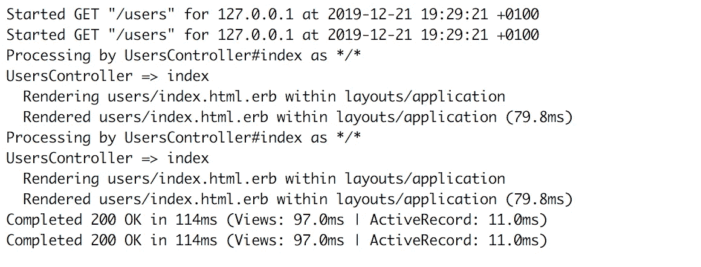
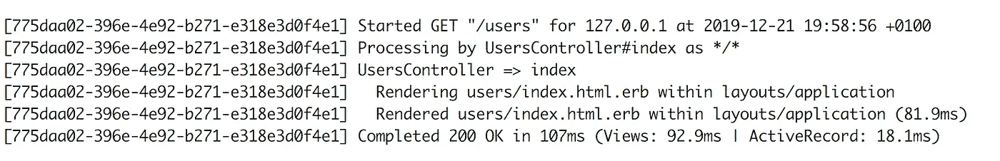
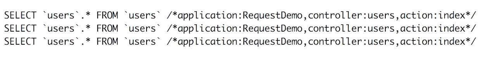
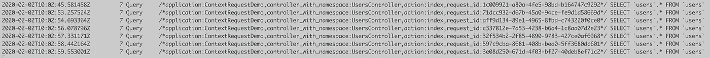

# 如何将 Rails 请求关联到数据库日志

> 原文：<https://betterprogramming.pub/correlate-rails-requests-to-database-logs-1e998228fa43>

## 通过使用唯一的请求 ID 将应用程序日志连接到数据库日志，提高日志的质量


由[卡斯帕·卡米尔·鲁宾](https://unsplash.com/@casparrubin?utm_source=medium&utm_medium=referral)在 [Unsplash](https://unsplash.com?utm_source=medium&utm_medium=referral) 上拍摄的照片。

使用软件应用程序日志的用户动作的可追溯性是每个软件应用程序都应该支持的关键特性。这是一个非常重要的功能，使运行软件应用程序的工程师(如站点可靠性工程师、开发人员或基础设施工程师)能够跟踪用户操作并调查生产事故。

虽然对于大多数 Rails 应用程序来说，实现可跟踪性或审计日志特性被认为是一项简单的任务，但是一旦涉及到在相互通信的多个 Rails 应用程序或底层数据库应用程序之间关联日志，就可以认为是一项挑战。

在本文中，我将介绍一个关联和链接多个 Rails 应用程序日志的解决方案。这篇文章将包括以下几点:

*   使用 X-Request-Id 关联 Rails 日志。
*   在多个 Rails 应用程序之间共享 X-Request-Id。
*   与数据库应用程序共享 X-Request-Id。

# 关联属于同一请求的 Rails 日志

默认情况下，Rails 应用程序日志看起来像下面的代码片段。这仅属于一个应用请求，即`GET /users`请求:


虽然日志看起来是有序的，并且属于请求的所有行都是相互关联的，但当应用程序运行在具有多线程/多进程 web 服务器(如`puma`或`unicorn`)的生产环境中时，情况并非如此。在这种情况下，多个进程/线程将写入日志，并且不能保证每个请求日志看起来都是绑定在一起的。实际上，来自不同请求的日志会相互重叠，生产系统上的日志可能看起来像下面的代码片段:



从上面的片段来看，很难(如果不是不可能的话)区分哪个日志行属于哪个请求。幸运的是，可以使用`[ActionDispatch:RequestId](https://api.rubyonrails.org/classes/ActionDispatch/RequestId.html)`中间件轻松地配置 Rails 来关联属于相同请求的日志行。这个中间件生成一个随机的唯一请求 id，或者使用请求头中传递的请求 id。我们可以使用这个 id 来标记 Rails 日志，以关联 Rails 日志行。这项任务可以通过对 Rails 应用程序的源代码执行以下更改来完成:

*   将下面一行添加到`config/environments/${env}.rb`以将更改应用到特定环境(如`production`)或添加到`config/application.rb`以将更改应用到所有支持的环境:

```
config.log_tags = [ :uuid ]
```

在实现了上面的更改之后，Rails 日志将看起来像下面的日志片段。属于同一请求的所有行都将由相同的请求 id 值标记。



这是一个简单的改变，但是如果我们想要关联属于不同应用程序的日志呢？我们可以使用相同的请求 id 吗？

# 在两个彼此同步通信的 Rails 应用程序之间关联日志

不幸的是，没有实现这个任务的内置特性。不过，在`[RequestHeaderMiddleware](https://github.com/fidor/request_headers_middleware)`的帮助下，通过对应用的源代码进行一些修改，这个任务是可以实现的。

`[RequestHeaderMiddleware](https://github.com/fidor/request_headers_middleware)`是一个请求存储库，它存储所有列入白名单的消息头(默认情况下只有 X-Request-Id ),并使其在所有阶段都可用于 Rails 请求。因为该存储对 Rails 源代码是全局可用的，并且它包含 request-id，所以可以使用该存储从存储中检索 request-id，并将其作为请求头传递给所有传出的请求。目的地服务中的`[ActionDispatch:RequestId](https://api.rubyonrails.org/classes/ActionDispatch/RequestId.html)`将使用传递的头值，并且不会为该请求生成新的请求 id。

`[RequestHeaderMiddleware](https://github.com/fidor/request_headers_middleware)`提供使用`[ActiveResource](https://github.com/rails/activeresource)`、`[Faraday](https://github.com/lostisland/faraday)`和`[JsonApiClient](https://github.com/JsonApiClient/json_api_client)`将请求 id 传递给其他服务的指令。然而，中间件可以与任何执行 HTTP 请求的 gem 或库集成/使用，并提供添加 HTTP 请求头的方法。下面是利用中间件所需的更改:

*   `[ActiveResource](https://github.com/rails/activeresource)`:下面的类可以用作应用程序中实现的所有`[ActiveResource](https://github.com/rails/activeresource)`类的基类。因此，报头转发将在没有任何进一步操作的情况下完成。

*   `[Faraday](https://github.com/lostisland/faraday)`:以同样的方式，我们可以创建一个全局的 singleton faraday 对象，它为每个传出的请求传递来自`[RequestHeaderMiddleware](https://github.com/fidor/request_headers_middleware)`的消息头。

*   `[JsonApiClient](https://github.com/JsonApiClient/json_api_client)`:根据中间件的文档，传递从`JsonApiClient`扩展的类的头可以使用下面的语法。

下一步是找到将 Rails 日志与数据库日志关联起来的方法。如果我们也可以将请求 id 传递给数据库日志，那就太好了。

# 将数据库日志与 Rails 应用程序日志相关联

由于诸如`MySQL`、`MongoDB`和`SqlServer`之类的数据库应用程序不是 Rails 应用程序，并且不利用`[ActionDispatch:RequestId](https://api.rubyonrails.org/classes/ActionDispatch/RequestId.html)`(实际上，它们不接受 HTTP 请求)，所以不可能只将头转发给这些服务。

但是，大多数数据库应用程序记录服务器执行的 SQL 语句，包括注释(在一些数据库应用程序中，默认情况下禁用此功能)。例如，数据库`MySQL`的日志消息可能如下所示:

```
2019-12-19T20:54:50.325378Z   2 Query SELECT `users`.* FROM `users`
2019-12-19T20:54:50.548397Z   2 Query SELECT `users`.* FROM `users`
2019-12-19T20:54:50.842785Z   2 Query SELECT `users`.* FROM `users`
```

幸运的是，可以配置 Rails 应用程序在将 SQL 查询发送到数据库服务器之前附加注释。可以在下面显示的数据库服务器日志中看到附加的注释:



上述变化可以通过将[旁注](https://github.com/basecamp/marginalia) gem 与 Rails 应用程序集成来实现。旁注将负责添加这些评论。作为这种集成的结果，我们将能够将`SQL`查询关联到 Rails 应用程序控制器和负责`SQL`查询的动作。

旁注 gem 还允许开发者定制和扩展评论属性。gem 提供了一些内置属性，比如 line 属性可以返回生成`SQL`查询的代码行。

这里可以做的另一步是将 request-id 包含在由旁注 gem 生成的`SQL`注释中。这个任务可以通过利用`[RequestHeaderMiddleware](https://github.com/fidor/request_headers_middleware)`来扩展旁注来实现。将下面的初始化器添加到 Rails 应用程序将负责将 request-id 属性添加到包含在`SQL`注释中的属性列表中。

使用上面的配置，MySQL 访问日志将在注释中包含 request-id，看起来像下面的代码片段:



# **结论**

在微服务架构中关联日志是一个至关重要的热门话题。它可以让工程师从客户端到数据库端跟踪生产环境中的问题。对于 Rails 应用程序来说，这个任务可以通过使用一些内置特性以及一些第三方的 gem 来完成，比如[旁注](https://github.com/basecamp/marginalia)。