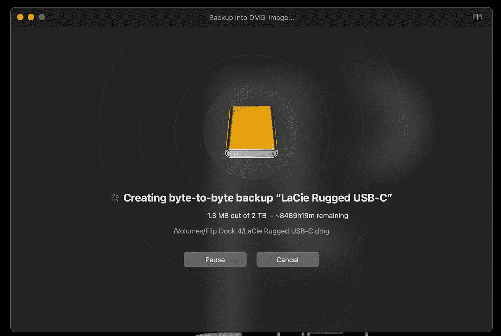

# 损坏的硬盘？巨蟒来救援了！

> 原文：<https://betterprogramming.pub/corrupted-hard-drive-python-to-the-rescue-6feb2a9e0422>

## *当其他方法都失败时，我如何用一个简单的 Python 脚本保存了一年的工作成果的故事*

https://www.pexels.com/@george-milton/[乔治·米尔顿摄](https://www.pexels.com/@george-milton/)

在当今的云世界和无尽的高级备份解决方案中，将您最珍贵的项目存储在简单的外置硬盘上听起来可能有点过时，但正如我最近了解到的那样(违背我的意愿)，这似乎仍然是音乐家的首选。

## 我的(非常具体的)问题

因此，当我丈夫的一个外置硬盘决定发出嘎嘎声时，我正在过一个*有趣的*周末。这也是他存储所有最新音乐项目的地方，他的音乐流的声音效果和我所知道的能让他获得音乐版权的叫做“茎”的东西。*不好玩。*

所以为了省下几天时间去安慰他失去了整整一年的工作，我决定先潜水，试着尽可能多地保存他的数据——使用我在互联网上搜索的传统方法，就像我是一个聪明的技术人员一样。

这很快被证明是徒劳的:磁盘似乎布满了随机不可读的扇区，不仅毫无理由地减慢了任何扫描可怜的磁盘钻或等效应用程序试图做的事情，而且任何自动或手动备份的尝试最终都被随机卸载的磁盘中断，每当程序遇到障碍时就重新安装。

使用磁盘钻取对剩余备份时间的实际估计。就上下文而言，8489 小时是 354 天，或者说不到一年。

唯一可取的是，磁盘仍然是可检测的，并且(无论多慢)可读的。我很有耐心地发现，复制单个文件实际上是可行的，如果它们没有被破坏，它会以相对正常的速度发生。

因此，为了保存尽可能多的数据，必须检查每个文件并尝试复制它，然后等待看它是否工作，或者文件是否引发 I/O 错误。哈！但是我们在这里讨论的是 500GB 的数据，这些数据分布在不同的目录、子目录和子目录中……是时候放弃了，对吗？**不会，因为我们可以自动完成这项工作！**

# Python 解决方案

由于问题的特殊性，我不得不为文件备份编写一个非常特殊的脚本，但是当所有其他方法都失败时，这个解决方案的一部分可能对同病相怜的人有用。

以下是我的脚本的路线图:

## **1。在备份 iCloud 目录中复制目录树**

*   选择要备份的文件夹子集
*   对于每个找到的文件夹，在备份位置创建一个同级文件夹
*   保留每个找到的文件夹中包含完整路径的单个文件的列表(将在步骤 2 中复制)
*   保存文件列表以备将来检索

这一步的代码是:

根据目录和子目录的数量，这本身可能需要一段时间，但在它的末尾，我们有一个所有单个文件的列表，以及它们在硬盘驱动器中的完整路径。

我之所以选择这个选项，而不是在遍历目录时复制每个文件，只是因为备份需要很长时间，而且经常会被不可预见的错误中断。这样我只整理一次清单，以后可以参考。

如果您怀疑脚本会在某个时候崩溃，不要忘记将列表保存到文件中！我对`numpy`很着迷，所以我是这样做的:

一个更聪明的选择可能是将每个路径写到循环本身的一个文件中，所以这是任何不幸的人必须重现这一点的家庭作业。

## **2。将每个文件拷贝到 iCloud 上它的兄弟位置**

*   加载文件列表
*   初始化一个标志数组来跟踪进程——如果您仍然不知道您试图捕获哪些错误以及未捕获的错误会中断循环，这很有帮助。对于将来分析节省了多少磁盘空间和丢失了多少磁盘空间也非常有用。
*   尝试/except 复制每个文件，并根据成功或捕获的异常更新标志数组

我很快注意到并不是所有的子目录都是在`os.walk()`循环中创建的，所以我首先必须根据文件列表对其进行处理:

我还决定编写一些逻辑来处理复制时间过长的文件——有时它们不会抛出错误，但会减慢整个过程，这是我想要避免的:

然后，实际的备份循环:

你会注意到我记录了几个不同的错误，原因如下:

*   `**FileNotFoundError**` —当磁盘随机卸载并重新装载或者根本找不到文件时引发。为了跟踪这两种情况，我添加了`time.sleep(120)`来允许磁盘重新挂载，以及一个计数器( *j* )来记录文件被尝试的次数。如果它连续失败两次，我会跳过它，并将其标记为未找到(flag -1)
*   `**IOError**`
*   我给每个文件最多 5 分钟的复制时间。如果超过了这个时间限制，就会引发超时异常并进行标记(-3)。如果这些文件太大或太重要而不能跳过，那么可以重新访问其中的一些文件。
*   所有其他异常都标有-999，表示它们不属于上述情况(如果我们想更详细地检查它们，还可以再次查看)。

就是这样！

当高级应用程序甚至无法恢复一个字节时，这种简单的基于 Python 的方法设法在这个损坏的外部驱动器上保存了 78%的重要数据。就时间而言，编写脚本用了不到半个小时，排除故障用了一个小时左右，而备份本身用了大约两天时间(如果这听起来太长，请记住估计需要 8000 多个小时的磁盘演练！).根据备份的大小和您的耐心，这甚至可以通过多处理进一步优化。

最棒的是，它是免费的！

所选“重要”目录中恢复的部件与丢失的部件的可视化对比。

我现在要去给蟒蛇神献祭。